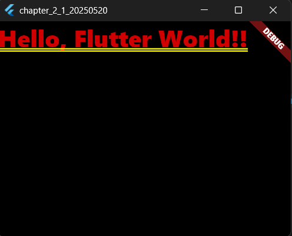

# 2-1: プロジェクトの構成

2025年5月20日
### 今日のキーワード： 「やきにく」➡やきにくのルーツは、戦後に在日韓国人によって広められたとも言われています。彼らが韓国の「プルコギ」などの焼き料理をベースに、日本のスタイルにアレンジしたものが今日のやきにく文化の始まりとも言われています。
---

- プロジェクトファイルの構成
  - 「lib」フォルダ…普段の作業でさわる対象フォルダはここだけ。Dartのスクリプトが保存されている。
  

`main.dartのソースコード(StatelessWidgetクラスとMaterialApp)`
```dart
// Flutterライブラリをインポート。これによりFlutterのウィジェットや機能が使えるようになります。
import 'package:flutter/material.dart';

// アプリのエントリーポイント（プログラムが最初に実行される場所）です。
void main() {
  // runApp関数で、Flutterアプリを開始します。MyAppウィジェットがアプリ全体を表します。
  runApp(MyApp());
}

// アプリ全体を構成するクラスです。
// StatelessWidgetは、状態を持たない（内容が固定的な）ウィジェットを表します。
class MyApp extends StatelessWidget {
  // コンストラクタ。Keyをオプションとして受け取れるようにしています。
  const MyApp({Key? key}) : super(key: key);

  // アプリのUIを定義するメインの部分です。
  @override
  Widget build(BuildContext context) {
    return MaterialApp(
      // アプリケーションのタイトル。デバイスの一部の画面に表示されることがあります。
      title: 'Flutter Demo',

      // アプリのホーム画面（最初に表示される画面）を定義します。
      // ここでは単純なテキストを画面に表示しています。
      home: Text(
        'Hello, Flutter World!!', // 表示する文字列。
        style: TextStyle(fontSize: 32.0), // テキストのスタイルを定義。文字サイズを32に設定しています。
      ),
    );
  }
}
```

【 実行画面 】



> マテリアルデザインについて
- デフォルトで生成されるスクリプトは、「material.dart（android）」が表示される。
- 明示的に、「cupertino.dart(ios)」を読み込まない限り適用はされない。