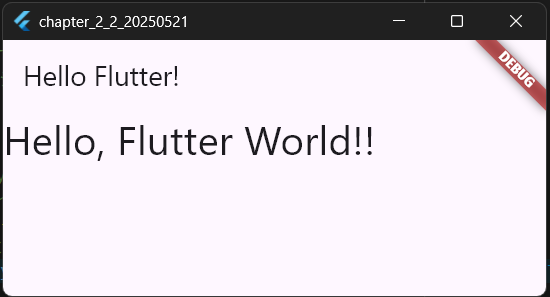

# 2-1: プロジェクトの構成

2025年5月21日
### 今日のキーワード： 「あさづけ」➡浅漬け自体の歴史は江戸時代まで遡ると言われています。当時は保存技術が発達していなかったため、漬物全般が貴重な保存食として愛されていました。浅漬けには多少の乳酸菌が含まれることがあり、腸内環境を整える効果が期待できます。特にキャベツや白菜を使った浅漬けでは、発酵が進むとお腹にも優しい一品に！
---

  

`main.dartのソースコード(ScaffoldとAppBar)`
```dart
// Flutterの基本ライブラリをインポートします。
// これにより、Flutterのウィジェットや機能を利用できます。
import 'package:flutter/material.dart';

// アプリケーションのエントリーポイント（プログラムのスタート地点）です。
void main() {
  // Flutterアプリを開始するための関数です。
  // runApp() に、アプリ全体を表すウィジェットを渡します。
  runApp(MyApp());
}

// StatelessWidget を継承したクラス MyApp を作成します。
// StatelessWidget は状態を持たないウィジェットを作るための基本クラスです。
class MyApp extends StatelessWidget {
  // コンストラクタ。Key をオプションとして受け取れるようになっています。
  const MyApp({Key? key}) : super(key: key);

  // アプリのUI（ユーザーインターフェース）を定義するための build メソッドです。
  @override
  Widget build(BuildContext context) {
    // MaterialApp は、Flutterアプリの基本設定を行うためのウィジェットです。
    return MaterialApp(
      // アプリケーションのタイトルを設定します。
      title: 'Flutter Demo',

      // アプリのホーム画面を設定します。
      // Scaffold は、画面の基本構造（アプリバーやボディなど）を提供するウィジェットです。
      home: Scaffold(
        // アプリバーを表示します。タイトルには「Hello Flutter!」を設定します。
        appBar: AppBar(title: Text('Hello Flutter!')),

        // 画面の本体部分（body）です。ここに文字列を表示します。
        body: Text(
          'Hello, Flutter World!!', // 表示する文字列。
          style: TextStyle(fontSize: 32.0), // フォントサイズを32に設定しています。
        ),
      ),
    );
  }
}
  
```

【 実行画面 】



> Scaffoldについて
- スキャホールドというのは、建築でいうと「足場」のことを指す。つまり、アプリの土台である。ここに、必要なウィジェットを追加していくことで、アプリが生成されていく。
> appBarとAppBarクラス
- アプリ上部に表示されるバーのこと。表示するTextインスタンスとして指定すれば、アプリケーションバーのタイトルとして表示される。
> bodyについて
- アプリケーションバーの空白エリア全体を表示する。実際のアプリの表示はここに組み込んで表示させていく。