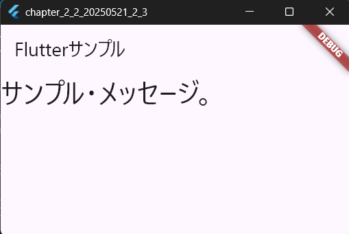
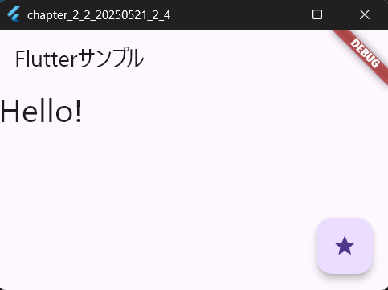
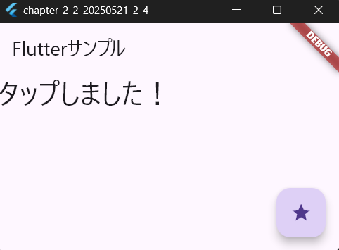
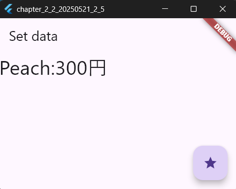
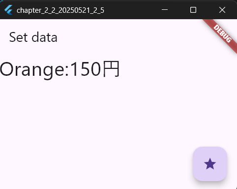
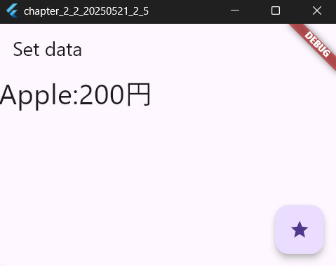
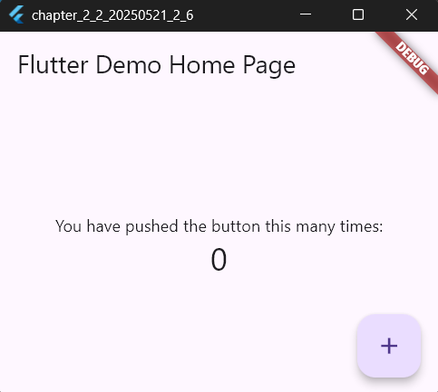
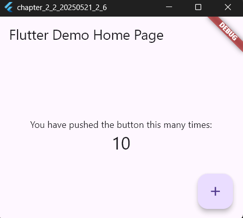

# 2-2: Stateクラスの利用

  

`main.dartのソースコード(StatefulWidgetとState)`
```dart
import 'package:flutter/material.dart';

void main() {
  // アプリのエントリーポイント
  runApp(const MyApp());
}

// StatelessWidget を継承した MyApp クラス
class MyApp extends StatelessWidget {
  const MyApp({Key? key}) : super(key: key);

  // タイトルとメッセージの定義
  final String title = 'Flutterサンプル';
  final String message = 'サンプル・メッセージ。';

  @override
  Widget build(BuildContext context) {
    return MaterialApp(
      title: 'Flutter Demo',
      // MyHomePage ウィジェットをホーム画面に設定
      home: MyHomePage(title: this.title, message: this.message),
    );
  }
}

// StatefulWidget を継承した MyHomePage クラス
class MyHomePage extends StatefulWidget {
  final String title; // アプリのタイトル
  final String message; // 表示するメッセージ

  const MyHomePage({Key? key, required this.title, required this.message})
    : super(key: key);

  @override
  _MyHomePageState createState() => _MyHomePageState();
}

// MyHomePage の状態を管理する _MyHomePageState クラス
class _MyHomePageState extends State<MyHomePage> {
  @override
  Widget build(BuildContext context) {
    return Scaffold(
      // アプリバーにタイトルを設定
      appBar: AppBar(title: Text(widget.title)),
      // メッセージを画面中央に表示
      body: Center(
        child: Text(
          widget.message, 
          style: TextStyle(fontSize: 32.0), // テキストサイズを設定
        ),
      ),
    );
  }
}
  
```

【 実行画面 】



`main.dartのソースコード(FloatingActionButtonをクリックする)`
```dart

import 'package:flutter/material.dart';

// アプリのエントリーポイント
void main() {
  // MyApp ウィジェットを起動する
  runApp(const MyApp());
}

// MyApp クラス（StatelessWidget：不変のウィジェット）
class MyApp extends StatelessWidget {
  const MyApp({Key? key}) : super(key: key);

  // アプリのタイトル（画面に表示される）
  final String title = 'Flutterサンプル';

  @override
  Widget build(BuildContext context) {
    return MaterialApp(
      title: 'Flutter Demo',
      // メイン画面（MyHomePage）を設定
      home: MyHomePage(title: this.title),
    );
  }
}

// MyHomePage クラス（StatefulWidget：状態を持つウィジェット）
class MyHomePage extends StatefulWidget {
  const MyHomePage({required this.title}) : super();

  // 画面のタイトル（AppBar に表示）
  final String title;

  @override
  _MyHomePageState createState() => _MyHomePageState();
}

// _MyHomePageState クラス（画面の状態を管理）
class _MyHomePageState extends State<MyHomePage> {
  // 画面に表示するメッセージ（初期値 "Hello!"）
  String _message = 'Hello!';

  // ボタンが押されたときにメッセージを変更する関数
  void _setMessage() {
    setState(() {
      _message = 'タップしました！'; // メッセージを更新
    });
  }

  @override
  Widget build(BuildContext context) {
    return Scaffold(
      // アプリバー（上部のタイトルバー）にタイトルを表示
      appBar: AppBar(title: Text(widget.title)),
      
      // 画面中央にメッセージを表示
      body: Center(
        child: Text(
          _message,
          style: TextStyle(fontSize: 32.0), // 文字のサイズを設定
        ),
      ),

      // 右下にボタンを配置（FloatingActionButton）
      floatingActionButton: FloatingActionButton(
        onPressed: _setMessage, // ボタンが押されたら _setMessage() を実行
        tooltip: 'set message.', // ボタンの説明（長押しで表示）
        child: Icon(Icons.star), // 星のアイコンを表示
      ),
    );
  }
}
```
【 実行画面 】




`main.dartのソースコード(複雑な値の利用)`
```dart
import 'package:flutter/material.dart';

// アプリのエントリーポイント（メイン関数）
void main() {
  // MyApp ウィジェットをアプリとして起動する
  runApp(const MyApp());
}

// MyApp クラス（StatelessWidget を継承：不変のウィジェット）
class MyApp extends StatelessWidget {
  const MyApp({Key? key}) : super(key: key);

  // アプリのタイトル（メイン画面のタイトル）
  final String title = 'Flutterサンプル';

  @override
  Widget build(BuildContext context) {
    return MaterialApp(
      title: 'Flutter Demo',
      // MyHomePage ウィジェットをホーム画面として設定
      home: MyHomePage(title: this.title),
    );
  }
}

// MyHomePage クラス（StatefulWidget を継承：状態を持つウィジェット）
class MyHomePage extends StatefulWidget {
  final String title; // 画面タイトル

  const MyHomePage({Key? key, required this.title}) : super(key: key);

  @override
  _MyHomePageState createState() => _MyHomePageState();
}

// 商品データを管理するクラス
class Data {
  int _price;  // 商品の価格
  String _name; // 商品の名前

  // コンストラクタ（商品名と価格を初期化）
  Data(this._name, this._price) : super();

  // Data オブジェクトを文字列に変換するメソッド
  @override
  String toString() {
    return _name + ':' + _price.toString() + '円';
  }
}

// MyHomePage の状態を管理するクラス
class _MyHomePageState extends State<MyHomePage> {
  // 商品データのリスト（サンプルデータ）
  static final _data = [
    Data('Apple', 200),
    Data('Orange', 150),
    Data('Peach', 300),
  ];

  // 現在表示されるアイテム（初期値は Apple）
  Data _item = _data[0];

  // ボタンが押されたとき、ランダムで商品データを変更する関数
  void _setData() {
    setState(() {
      // データをシャッフルし、先頭のアイテムを選択
      _item = (_data..shuffle()).first;
    });
  }

  @override
  Widget build(BuildContext context) {
    return Scaffold(
      // 上部のタイトルバー（アプリバー）
      appBar: AppBar(title: Text('Set data')),

      // 商品データを画面中央に表示
      body: Center(
        child: Text(
          _item.toString(),
          style: TextStyle(fontSize: 32.0), // 文字のサイズを指定
        ),
      ),

      // 画面右下にフローティングボタンを追加
      floatingActionButton: FloatingActionButton(
        onPressed: _setData, // ボタンが押されたときに _setData() を実行
        tooltip: 'set message.', // ボタンの説明（長押しで表示）
        child: Icon(Icons.star), // ボタンに星のアイコンを設定
      ),
    );
  }
}
```

【 実行画面 】





`main.dartのソースコード(デフォルトのmain.dart)`
```dart

import 'package:flutter/material.dart';

// アプリのエントリーポイント（メイン関数）
void main() {
  // MyAppウィジェットをアプリとして起動する
  runApp(const MyApp());
}

// MyApp クラス（StatelessWidget：状態を持たないウィジェット）
class MyApp extends StatelessWidget {
  const MyApp({Key? key}) : super(key: key);

  @override
  Widget build(BuildContext context) {
    return MaterialApp(
      title: 'Flutter Demo', // アプリのタイトル（内部識別用）
      
      // アプリのテーマ設定（青系のカラースキーム）
      theme: ThemeData(primarySwatch: Colors.blue),

      // ホーム画面として MyHomePage を表示
      home: const MyHomePage(title: 'Flutter Demo Home Page'),
    );
  }
}

// MyHomePage クラス（StatefulWidget：状態を持つウィジェット）
class MyHomePage extends StatefulWidget {
  const MyHomePage({Key? key, required this.title}) : super(key: key);

  final String title; // 画面のタイトル

  @override
  State<MyHomePage> createState() => _MyHomePageState();
}

// _MyHomePageState クラス（状態を管理するクラス）
class _MyHomePageState extends State<MyHomePage> {
  int _counter = 0; // カウンター変数（ボタンが押されるたびに増加）

  // ボタンが押されたときにカウンターを1増やす関数
  void _incrementCounter() {
    setState(() {
      _counter++; // カウンター値を更新
    });
  }

  @override
  Widget build(BuildContext context) {
    return Scaffold(
      // 上部のタイトルバー（AppBar）を設定
      appBar: AppBar(title: Text(widget.title)),

      // 画面中央にカウンターの状態を表示
      body: Center(
        child: Column(
          mainAxisAlignment: MainAxisAlignment.center, // 中央に配置
          children: <Widget>[
            const Text('You have pushed the button this many times:'), // 説明文
            Text(
              '$_counter', // カウンターの値を表示
              style: Theme.of(context).textTheme.headlineMedium, // テーマに基づいたスタイルを適用
            ),
          ],
        ),
      ),

      // 右下にフローティングボタンを配置
      floatingActionButton: FloatingActionButton(
        onPressed: _incrementCounter, // ボタンが押されたときにカウンター増加
        tooltip: 'Increment', // ボタンの説明（長押しで表示）
        child: const Icon(Icons.add), // ボタンのアイコン（＋）
      ),
    );
  }
}
```

【 実行画面 】




> StatefulWidgetについて
- 動的に表示が得られるもの。statelessWidget（静的表示）では作成不可能
> FloatingActionButtonクラスについて
- スマホアプリでよく見られる丸いアイコンを表示したボタンのこと。「onPressed」にてボタンをクリックしたときの処理を指定できる。
> Dartクラスについて
- 複雑の値で構成されたデータを扱うクラス。