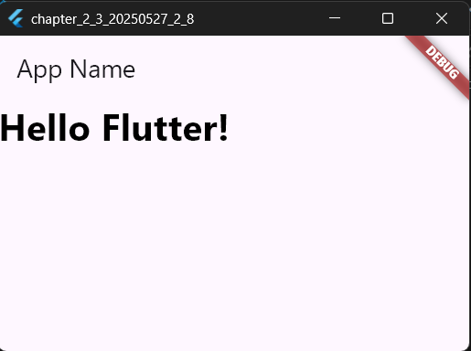

# 2-3: ウィジェットの基本レイアウト

2025年5月27日
### 今日のキーワード： 「牛タン」➡仙台牛タンの誕生と歴史発祥: 牛タン焼きは、戦後の食糧難が続く昭和23年（1948年）頃、仙台市で焼き鳥屋を経営していた和食料理人の佐野啓四郎氏によって考案されました。彼は洋食で使われていた牛タンに目をつけ、日本人好みの味になるよう試行錯誤を重ね、「牛タンしお味」を完成させました。定食の原型: 佐野氏は、牛タン焼きにテールスープと麦飯を組み合わせた「牛タン定食」を考案しました。麦飯を合わせたのは、食料が十分ではなかった時代に、白米よりも安価な麦飯で「お腹いっぱい食べられるように」という心遣いだったと言われています（諸説あり）。全国区へ: 昭和40年代から50年代にかけて牛タン専門店が増え、特に味の「牛たん喜助」が「仙台名物」として謳い始めました。さらに、昭和57年（1982年）の東北新幹線開業によって、首都圏などからの観光客やビジネス客が増え、仙台と言えば「牛タン」というように全国的な知名度を獲得しました。
---


【 FlutterStudioの画面 】

画面レイアウトの構成を考えるのには、FlutterStudioを活用するのが一番手っ取り早い。仮にこちらで画面構成して、ソースコードをコピーして活用していくイメージ！
コピー＆ペーストでエラーが発生する場合もあるが、その際は、地道にバグの修正をしていく。


  

`main.dartのソースコード(レイアウトのソースコード)`
```dart

import 'package:flutter/material.dart';

// アプリのエントリーポイント（メイン関数）
void main() {
  // MyAppウィジェットをアプリとして起動する
  runApp(MyApp());
}

// MyApp クラス（StatelessWidget：状態を持たないウィジェット）
class MyApp extends StatelessWidget {
  @override
  Widget build(BuildContext context) {
    return MaterialApp(
      title: 'Generated App', // アプリのタイトル（内部識別用）
      
      // アプリのテーマ設定（色やデザインを統一）
      theme: ThemeData(
        primarySwatch: Colors.blue, // アプリ全体の基本カラー（青）
        primaryColor: const Color(0xff2196f3), // プライマリーカラーを指定
        canvasColor: const Color(0xffafafa), // 画面の背景色を指定
      ),

      // ホーム画面として MyHomePage を表示
      home: MyHomePage(),
    );
  }
}

// MyHomePage クラス（StatefulWidget：状態を持つウィジェット）
class MyHomePage extends StatefulWidget {
  MyHomePage({Key? key}) : super(key: key);

  @override
  _MyHomePageState createState() => _MyHomePageState();
}

// _MyHomePageState クラス（画面の状態を管理するクラス）
class _MyHomePageState extends State<MyHomePage> {
  @override
  Widget build(BuildContext context) {
    return Scaffold(
      // 上部のタイトルバー（AppBar）
      appBar: AppBar(title: Text('App Name')),

      // 画面中央にテキストを表示
      body: Text(
        "Hello Flutter!", // 表示するテキスト
        style: TextStyle(
          fontSize: 32.0, // 文字サイズを32pxに設定
          color: const Color(0xff000000), // テキストカラーを黒に設定
          fontWeight: FontWeight.w700, // 文字を太字に設定
          fontFamily: "Roboto", // フォントに "Roboto" を指定
        ),
      ),
    );
  }
}
```

【 実行画面 】


`main.dartのソースコード(テーマ指定のソースコード)`
```dart

import 'package:flutter/material.dart';

// アプリのエントリーポイント（メイン関数）
void main() {
  // MyAppウィジェットをアプリとして起動する
  runApp(MyApp());
}

// MyApp クラス（StatelessWidget：状態を持たないウィジェット）
class MyApp extends StatelessWidget {
  @override
  Widget build(BuildContext context) {
    return MaterialApp(
      title: 'Generated App', // アプリのタイトル（内部識別用）
      
      // アプリのテーマ設定（色やデザインの統一）
      theme: ThemeData(
        primarySwatch: Colors.pink, // アプリ全体の基本カラー（ピンク）
        primaryColor: const Color(0xffe91e63), // プライマリーカラーを指定
        canvasColor: const Color(0xfffafafa), // 画面の背景色を指定
      ),

      // ホーム画面として MyHomePage を表示
      home: MyHomePage(),
    );
  }
}

// MyHomePage クラス（StatefulWidget：状態を持つウィジェット）
class MyHomePage extends StatefulWidget {
  MyHomePage({Key? key}) : super(key: key);

  @override
  _MyHomePageState createState() => _MyHomePageState();
}

// _MyHomePageState クラス（画面の状態を管理するクラス）
class _MyHomePageState extends State<MyHomePage> {
  @override
  Widget build(BuildContext context) {
    return Scaffold(
      // 上部のタイトルバー（AppBar）
      appBar: AppBar(title: Text('App Name')),

      // 画面中央にテキストを表示
      body: Center(
        child: Text(
          "Hello Flutter!", // 表示するテキスト
          style: TextStyle(
            fontSize: 32.0, // 文字サイズを32pxに設定
            color: const Color(0xff000000), // テキストカラーを黒に設定
            fontWeight: FontWeight.w700, // 文字を太字に設定
            fontFamily: "Roboto", // フォントに "Roboto" を指定
          ),
        ),
      ),
    );
  }
}
```

【 実行画面 】



`main.dartのソースコード(Centerによる中央揃え)`
```dart
import 'package:flutter/material.dart';

// アプリのエントリーポイント（プログラムの開始地点）
void main() {
  // MyApp ウィジェットを起動してアプリを構築
  runApp(MyApp());
}

// MyApp クラス（StatelessWidget：状態を持たないウィジェット）
class MyApp extends StatelessWidget {
  @override
  Widget build(BuildContext context) {
    return MaterialApp(
      title: 'Generated App', // アプリのタイトル（内部識別用）
      
      // アプリのテーマ設定（色やデザインの統一）
      theme: ThemeData(
        primarySwatch: Colors.blue, // アプリ全体の基本カラー（青）
        primaryColor: const Color(0xff2196f3), // アプリのメインカラー
        canvasColor: const Color(0xffafafa), // 画面の背景色
      ),

      // ホーム画面として MyHomePage を設定
      home: MyHomePage(),
    );
  }
}

// MyHomePage クラス（StatefulWidget：状態を持つウィジェット）
class MyHomePage extends StatefulWidget {
  MyHomePage({Key? key}) : super(key: key);

  @override
  _MyHomePageState createState() => _MyHomePageState();
}

// _MyHomePageState クラス（画面の状態を管理するクラス）
class _MyHomePageState extends State<MyHomePage> {
  @override
  Widget build(BuildContext context) {
    return Scaffold(
      // 上部のタイトルバー（AppBar）を設定
      appBar: AppBar(title: Text('App Name')),

      // 画面中央にテキストを表示
      body: Center(
        child: Text(
          "Hello Flutter!", // 表示するテキスト
          style: TextStyle(
            fontSize: 32.0, // 文字サイズを32pxに設定
            color: const Color(0xff000000), // テキストカラーを黒に設定
            fontWeight: FontWeight.w700, // 太字を設定
            fontFamily: "Roboto", // フォントに "Roboto" を指定
          ),
        ),
      ),
    );
  }
}
```
【 実行画面 】


`main.dartのソースコード(Containerクラスについて)`
```dart
import 'package:flutter/material.dart';

// アプリのエントリーポイント（プログラムの開始地点）
void main() {
  // MyApp ウィジェットを起動してアプリを構築
  runApp(MyApp());
}

// MyApp クラス（StatelessWidget：状態を持たないウィジェット）
class MyApp extends StatelessWidget {
  @override
  Widget build(BuildContext context) {
    return MaterialApp(
      title: 'Generated App', // アプリのタイトル（内部識別用）

      // アプリのテーマ設定（デザインや色を統一する）
      theme: ThemeData(
        primarySwatch: Colors.blue, // アプリ全体の基本カラー（青）
        primaryColor: const Color(0xff2196f3), // アプリのメインカラー
        canvasColor: const Color(0xffafafa), // 画面の背景色
      ),

      // ホーム画面として MyHomePage を設定
      home: MyHomePage(),
    );
  }
}

// MyHomePage クラス（StatefulWidget：状態を持つウィジェット）
class MyHomePage extends StatefulWidget {
  MyHomePage({Key? key}) : super(key: key);

  @override
  _MyHomePageState createState() => _MyHomePageState();
}

// _MyHomePageState クラス（画面の状態を管理するクラス）
class _MyHomePageState extends State<MyHomePage> {
  @override
  Widget build(BuildContext context) {
    return Scaffold(
      // 上部のタイトルバー（AppBar）を設定
      appBar: AppBar(title: Text('App Name')),

      // 画面中央にテキストを表示するためのコンテナ
      body: Container(
        child: Text(
          "Hello Flutter!", // 表示するテキスト
          style: TextStyle(
            fontSize: 32.0, // 文字サイズを32pxに設定
            color: const Color(0xff000000), // テキストカラーを黒に設定
            fontWeight: FontWeight.w700, // 太字を設定
            fontFamily: "Roboto", // フォントを "Roboto" に指定
          ),
        ),
        padding: const EdgeInsets.all(10.0), // 内側の余白を10px設定
        alignment: Alignment.bottomCenter, // 画面下中央に配置
      ),
    );
  }
}
```

【 実行画面 】


`main.dartのソースコード(Alignmentクラスについて)`
```dart

import 'package:flutter/material.dart';

// アプリのエントリーポイント（プログラムの開始地点）
void main() {
  // MyApp ウィジェットを起動してアプリを構築
  runApp(MyApp());
}

// MyApp クラス（StatelessWidget：状態を持たないウィジェット）
class MyApp extends StatelessWidget {
  @override
  Widget build(BuildContext context) {
    return MaterialApp(
      title: 'Generated App', // アプリのタイトル（内部識別用）

      // アプリのテーマ設定（デザインや色を統一する）
      theme: ThemeData(
        primarySwatch: Colors.blue, // アプリ全体の基本カラー（青）
        primaryColor: const Color(0xff2196f3), // アプリのメインカラー
        canvasColor: const Color(0xffafafa), // 画面の背景色
      ),

      // ホーム画面として MyHomePage を設定
      home: MyHomePage(),
    );
  }
}

// MyHomePage クラス（StatefulWidget：状態を持つウィジェット）
class MyHomePage extends StatefulWidget {
  MyHomePage({Key? key}) : super(key: key);

  @override
  _MyHomePageState createState() => _MyHomePageState();
}

// _MyHomePageState クラス（画面の状態を管理するクラス）
class _MyHomePageState extends State<MyHomePage> {
  @override
  Widget build(BuildContext context) {
    return Scaffold(
      // 上部のタイトルバー（AppBar）を設定
      appBar: AppBar(title: Text('App Name')),

      // 画面中央にテキストを表示するためのコンテナ
      body: Container(
        child: Text(
          "Hello Flutter!", // 表示するテキスト
          style: TextStyle(
            fontSize: 32.0, // 文字サイズを32pxに設定
            color: const Color(0xff000000), // テキストカラーを黒に設定
            fontWeight: FontWeight.w700, // 太字を設定
            fontFamily: "Roboto", // フォントを "Roboto" に指定
          ),
        ),
        padding: const EdgeInsets.all(10.0), // 内側の余白を10px設定
        alignment: const Alignment(0.5, -0.5), // テキストの配置位置（右上寄り）
      ),
    );
  }
}
```

【 実行画面 】

