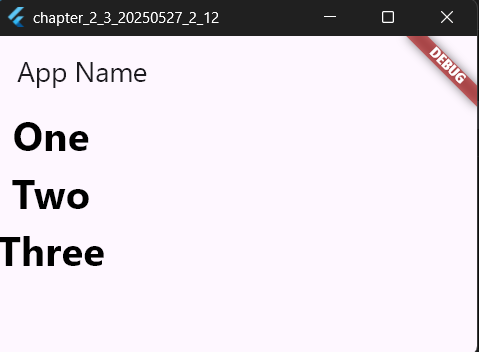
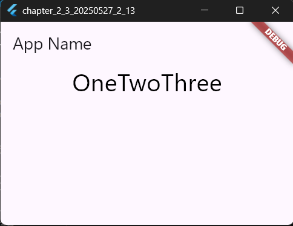

# 2-4: 複数ウィジェットの配置

`main.dartのソースコード(Columnの利用について)`
```dart

import 'package:flutter/material.dart';

// アプリのエントリーポイント（プログラムの開始地点）
void main() {
  // MyApp ウィジェットをアプリとして起動する
  runApp(MyApp());
}

// MyApp クラス（StatelessWidget：状態を持たないウィジェット）
class MyApp extends StatelessWidget {
  @override
  Widget build(BuildContext context) {
    return MaterialApp(
      title: 'Generated App', // アプリのタイトル（内部識別用）

      // アプリのテーマ設定（色やデザインの統一）
      theme: ThemeData(
        primarySwatch: Colors.blue, // アプリ全体の基本カラー（青）
        primaryColor: const Color(0xff2196f3), // アプリのメインカラー
        canvasColor: const Color(0xffafafa), // 画面の背景色
      ),

      // ホーム画面として MyHomePage を設定
      home: MyHomePage(),
    );
  }
}

// MyHomePage クラス（StatefulWidget：状態を持つウィジェット）
class MyHomePage extends StatefulWidget {
  MyHomePage({Key? key}) : super(key: key);

  @override
  _MyHomePageState createState() => _MyHomePageState();
}

// _MyHomePageState クラス（画面の状態を管理するクラス）
class _MyHomePageState extends State<MyHomePage> {
  @override
  Widget build(BuildContext context) {
    return Scaffold(
      // 上部のタイトルバー（AppBar）を設定
      appBar: AppBar(title: Text('App Name')),

      // 縦方向のレイアウトを作成（Column）
      body: Column(
        mainAxisAlignment: MainAxisAlignment.start, // 子ウィジェットを上部に配置
        mainAxisSize: MainAxisSize.max, // Columnの高さを画面いっぱいに設定
        crossAxisAlignment: CrossAxisAlignment.center, // 子ウィジェットを中央に揃える
        children: <Widget>[
          // "One" というテキストを表示
          Text(
            "One",
            style: TextStyle(
              fontSize: 32.0, // 文字サイズを32pxに設定
              color: const Color(0xff000000), // テキストカラーを黒に設定
              fontWeight: FontWeight.w700, // 太字を設定
              fontFamily: "Roboto", // フォントを "Roboto" に指定
            ),
          ),
          // "Two" というテキストを表示
          Text(
            "Two",
            style: TextStyle(
              fontSize: 32.0,
              color: const Color(0xff000000),
              fontWeight: FontWeight.w700,
              fontFamily: "Roboto",
            ),
          ),
          // "Three" というテキストを表示
          Text(
            "Three",
            style: TextStyle(
              fontSize: 32.0,
              color: const Color(0xff000000),
              fontWeight: FontWeight.w700,
              fontFamily: "Roboto",
            ),
          ),
        ],
      ),
    );
  }
}
```

【 実行画面 】



`main.dartのソースコード(Rowの利用について)`
```dart

import 'package:flutter/material.dart';

// アプリのエントリーポイント（プログラムの開始地点）
void main() {
  // MyApp ウィジェットをアプリとして起動する
  runApp(MyApp());
}

// MyApp クラス（StatelessWidget：状態を持たないウィジェット）
class MyApp extends StatelessWidget {
  @override
  Widget build(BuildContext context) {
    return MaterialApp(
      title: 'Generated App', // アプリのタイトル（内部識別用）

      // アプリのテーマ設定（デザインや色を統一）
      theme: ThemeData(
        primarySwatch: Colors.blue, // アプリ全体の基本カラー（青）
        primaryColor: const Color(0xff2196f3), // アプリのメインカラー
        canvasColor: const Color(0xffafafa), // 画面の背景色
      ),

      // ホーム画面として MyHomePage を設定
      home: MyHomePage(),
    );
  }
}

// MyHomePage クラス（StatefulWidget：状態を持つウィジェット）
class MyHomePage extends StatefulWidget {
  MyHomePage({Key? key}) : super(key: key);

  @override
  _MyHomePageState createState() => _MyHomePageState();
}

// _MyHomePageState クラス（画面の状態を管理するクラス）
class _MyHomePageState extends State<MyHomePage> {
  @override
  Widget build(BuildContext context) {
    return Scaffold(
      // 上部のタイトルバー（AppBar）を設定
      appBar: AppBar(title: Text('App Name')),

      // 横方向のレイアウトを作成（Row）
      body: Row(
        mainAxisAlignment: MainAxisAlignment.center, // 子ウィジェットを中央に配置
        mainAxisSize: MainAxisSize.max, // Rowの幅を画面いっぱいに設定
        crossAxisAlignment: CrossAxisAlignment.center, // 子ウィジェットを縦方向の中央に揃える
        children: <Widget>[
          // "One" というテキストを表示
          Text(
            "One",
            style: TextStyle(
              fontSize: 32.0, // 文字サイズを32pxに設定
              color: const Color(0xff000000), // テキストカラーを黒に設定
              fontWeight: FontWeight.w400, // 文字の太さを通常に設定
              fontFamily: "Roboto", // フォントを "Roboto" に指定
            ),
          ),
          // "Two" というテキストを表示
          Text(
            "Two",
            style: TextStyle(
              fontSize: 32.0,
              color: const Color(0xff000000),
              fontWeight: FontWeight.w400,
              fontFamily: "Roboto",
            ),
          ),
          // "Three" というテキストを表示
          Text(
            "Three",
            style: TextStyle(
              fontSize: 32.0,
              color: const Color(0xff000000),
              fontWeight: FontWeight.w400,
              fontFamily: "Roboto",
            ),
          ),
        ],
      ),
    );
  }

  // 空の関数（現在は使われていない）
  void fabPressed() {}
}
```

【 実行画面 】



> EdgeInsetsについて
- 周辺余白はpaddingという値を使う。これには、EdgeInsetsクラスを利用して設定する。
> Alignmentについて
- 配置場所の指定ができるもの。
> ColumnとRowについて
- Colum(縦)とRow(横)にウィジェットを並び変えられるもの。