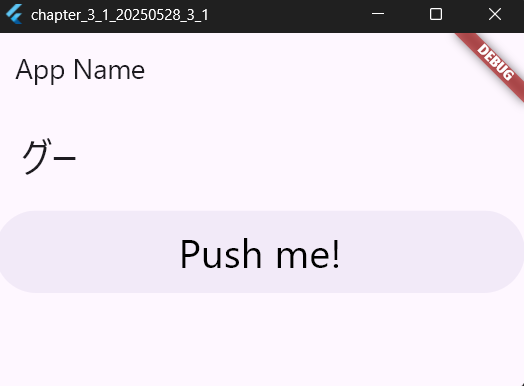
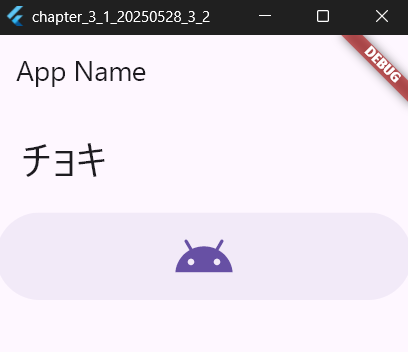
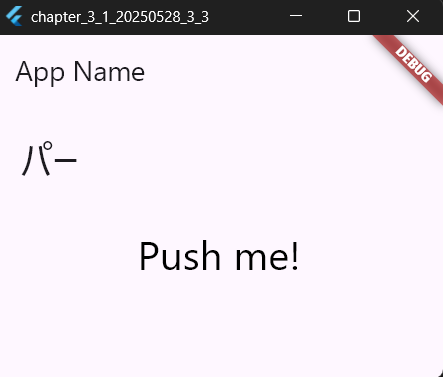
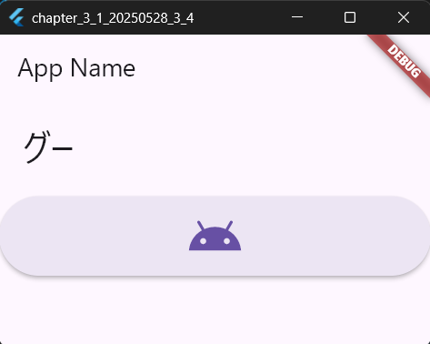
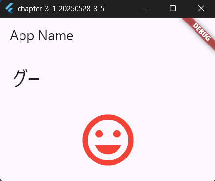
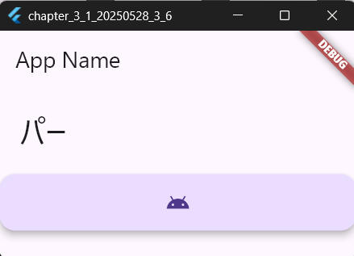
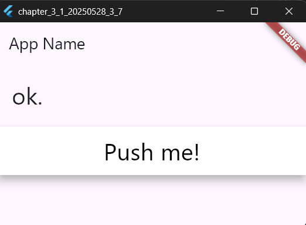

# 3-1: ボタン・ウィジェット

2025年5月28日
### 今日のキーワード： 「パン」➡パンの起源は、パンの歴史は約6000年前にさかのぼります。最古のパンは、古代エジプトで小麦粉と水を混ぜたものを偶然焼いたことが始まりだと言われています。その後、発酵の技術が加わり、ふんわりしたパンが誕生しました。日本のパン文化は、日本でパンが本格的に広まったのは明治時代ですが、「アンパン」や「メロンパン」など、日本独自のパンが数多く誕生しました。特に「カレーパン」は日本ならではの発明で、揚げることで香ばしく仕上がるのが特徴です。
---
  

`main.dartのソースコード(TextButtonについて)`
```dart
import 'package:flutter/material.dart';

// アプリのエントリーポイント (Flutterアプリの実行開始)
void main() {
  runApp(MaterialApp(home: MyHomePage())); // アプリのUIを構築するMyHomePageを表示
}

// StatefulWidgetを作成 (状態を持つウィジェット)
class MyHomePage extends StatefulWidget {
  @override
  _MyHomePageState createState() => _MyHomePageState(); // 状態管理用のクラスを生成
}

// 状態を管理するクラス
class _MyHomePageState extends State<MyHomePage> {
  static var _message = 'ok.'; // 画面に表示するメッセージ（初期値: "ok."）
  static var _janken = <String>['グー', 'チョキ', 'パー']; // じゃんけんの選択肢

  @override
  Widget build(BuildContext context) {
    return Scaffold(
      appBar: AppBar(title: Text('App Name')), // 画面の上部にタイトルバーを表示
      body: Center(
        child: Column(
          mainAxisAlignment: MainAxisAlignment.start, // 要素を縦方向の先頭から配置
          mainAxisSize: MainAxisSize.max, // 可能な限りのサイズを使用
          crossAxisAlignment: CrossAxisAlignment.stretch, // 子要素を幅いっぱいに伸ばす
          children: <Widget>[
            Padding(
              padding: EdgeInsets.all(20.0), // 余白を設定
              child: Text(
                _message, // メッセージを表示
                style: TextStyle(
                  fontSize: 32.0, // 文字サイズ
                  fontWeight: FontWeight.w400, // 文字の太さ
                  fontFamily: "Roboto", // フォントの種類
                ),
              ),
            ),
            TextButton(
              onPressed: buttonPressed, // ボタンが押されたら関数を実行
              child: Padding(
                padding: EdgeInsets.all(10.0), // ボタン内の余白
                child: Text(
                  "Push me!", // ボタンのテキスト
                  style: TextStyle(
                    fontSize: 32.0, // 文字サイズ
                    color: const Color(0xff000000), // 文字の色
                    fontWeight: FontWeight.w400, // 文字の太さ
                    fontFamily: "Roboto", // フォントの種類
                  ),
                ),
              ),
            ),
          ],
        ),
      ),
    );
  }

  // ボタンが押されたときに実行する処理
  void buttonPressed() {
    setState(() {
      _message = (_janken..shuffle()).first; // じゃんけんの選択肢をランダムに選んで表示
    });
  }
}
```

【 実行画面 】



> FlatButtonについて
- FlutterStudioで使われている古いウィジェット名である。TextButtonと使い方は同じであるため、IDE上で利用する際はTextButtonに置き換える


`main.dartのソースコード(アイコンについて)`
```dart
import 'package:flutter/material.dart';

// アプリのエントリーポイント (Flutterアプリの実行開始)
void main() {
  runApp(MaterialApp(home: MyHomePage())); // アプリのUIを構築するMyHomePageを表示
}

// StatefulWidgetを作成 (状態を持つウィジェット)
class MyHomePage extends StatefulWidget {
  @override
  _MyHomePageState createState() => _MyHomePageState(); // 状態管理用のクラスを生成
}

// 状態を管理するクラス
class _MyHomePageState extends State<MyHomePage> {
  static var _message = 'ok.'; // 画面に表示するメッセージ（初期値: "ok."）
  static var _janken = <String>['グー', 'チョキ', 'パー']; // じゃんけんの選択肢

  @override
  Widget build(BuildContext context) {
    return Scaffold(
      appBar: AppBar(title: Text('App Name')), // 画面の上部にタイトルバーを表示
      body: Center(
        child: Column(
          mainAxisAlignment: MainAxisAlignment.start, // 要素を縦方向の先頭から配置
          mainAxisSize: MainAxisSize.max, // 可能な限りのサイズを使用
          crossAxisAlignment: CrossAxisAlignment.stretch, // 子要素を幅いっぱいに伸ばす
          children: <Widget>[
            Padding(
              padding: EdgeInsets.all(20.0), // 余白を設定
              child: Text(
                _message, // メッセージを表示
                style: TextStyle(
                  fontSize: 32.0, // 文字サイズ
                  fontWeight: FontWeight.w400, // 文字の太さ
                  fontFamily: "Roboto", // フォントの種類
                ),
              ),
            ),
            TextButton(
              onPressed: buttonPressed, // ボタンが押されたら関数を実行
              child: Padding(
                padding: EdgeInsets.all(10.0), // ボタン内の余白
                child: Icon(
                  Icons.android, // ボタンに表示するアイコン
                  size: 50.0, // アイコンのサイズ                  ),
                ),
              ),
            ),
          ],
        ),
      ),
    );
  }

  // ボタンが押されたときに実行する処理
  void buttonPressed() {
    setState(() {
      _message = (_janken..shuffle()).first; // じゃんけんの選択肢をランダムに選んで表示
    });
  }
}
```

【 実行画面 】



> Iconインスタンスについて
- TextButton内にIconなどの別のウィジェットも組み込むことが可能である。
> Paddingについて
- 余白を表示させるためのコンテナでウィジェットに組み込むと周囲に余白を作成できる。


`main.dartのソースコード(buttonPressedメソッドについて)`
```dart
import 'package:flutter/material.dart';

// アプリのエントリーポイント (Flutterアプリの実行開始)
void main() {
  runApp(MaterialApp(home: MyHomePage())); // アプリのUIを構築するMyHomePageを表示
}

// StatefulWidgetを作成 (状態を持つウィジェット)
class MyHomePage extends StatefulWidget {
  @override
  _MyHomePageState createState() => _MyHomePageState(); // 状態管理用のクラスを生成
}

// 状態を管理するクラス
class _MyHomePageState extends State<MyHomePage> {
  static var _message = 'ok.'; // 画面に表示するメッセージ（初期値: "ok."）
  static var _janken = <String>['グー', 'チョキ', 'パー']; // じゃんけんの選択肢

  @override
  Widget build(BuildContext context) {
    return Scaffold(
      appBar: AppBar(title: Text('App Name')), // 画面の上部にタイトルバーを表示
      body: Center(
        child: Column(
          mainAxisAlignment: MainAxisAlignment.start, // 要素を縦方向の先頭から配置
          mainAxisSize: MainAxisSize.max, // 可能な限りのサイズを使用
          crossAxisAlignment: CrossAxisAlignment.stretch, // 子要素を幅いっぱいに伸ばす
          children: <Widget>[
            Padding(
              padding: EdgeInsets.all(20.0), // 余白を設定
              child: Text(
                _message, // メッセージを表示
                style: TextStyle(
                  fontSize: 32.0, // 文字サイズ
                  fontWeight: FontWeight.w400, // 文字の太さ
                  fontFamily: "Roboto", // フォントの種類
                ),
              ),
            ),
            TextButton(
              onPressed: buttonPressed, // ボタンが押されたら関数を実行
              child: Padding(
                padding: EdgeInsets.all(10.0), // ボタン内の余白
                child: Text(
                  "Push me!", // ボタンのテキスト
                  style: TextStyle(
                    fontSize: 32.0, // 文字サイズ
                    color: const Color(0xff000000), // 文字の色
                    fontWeight: FontWeight.w400, // 文字の太さ
                    fontFamily: "Roboto", // フォントの種類
                  ),
                ),
              ),
            ),
          ],
        ),
      ),
    );
  }

  // ボタンが押されたときに実行する処理
  void buttonPressed() {
    setState(() {
      _message = (_janken..shuffle()).first; // じゃんけんの選択肢をランダムに選んで表示
    });
  }
}
```

【 実行画面 】



> buttonPressedについて
- FloatingActionButtonでアクションボタンをクリックしたときの処理とほぼ同じ処理の書き方である。

`main.dartのソースコード(ElevatedButtonについて)`

```dart
import 'package:flutter/material.dart';

// アプリのエントリーポイント (Flutterアプリの実行開始)
void main() {
  runApp(MaterialApp(home: MyHomePage())); // アプリのUIを構築するMyHomePageを表示
}

// StatefulWidgetを作成 (状態を持つウィジェット)
class MyHomePage extends StatefulWidget {
  @override
  _MyHomePageState createState() => _MyHomePageState(); // 状態管理用のクラスを生成
}

// 状態を管理するクラス
class _MyHomePageState extends State<MyHomePage> {
  static var _message = 'ok.'; // 画面に表示するメッセージ（初期値: "ok."）
  static var _janken = <String>['グー', 'チョキ', 'パー']; // じゃんけんの選択肢

  @override
  Widget build(BuildContext context) {
    return Scaffold(
      appBar: AppBar(title: Text('App Name')), // 画面の上部にタイトルバーを表示
      body: Center(
        child: Column(
          mainAxisAlignment: MainAxisAlignment.start, // 要素を縦方向の先頭から配置
          mainAxisSize: MainAxisSize.max, // 可能な限りのサイズを使用
          crossAxisAlignment: CrossAxisAlignment.stretch, // 子要素を幅いっぱいに伸ばす
          children: <Widget>[
            Padding(
              padding: EdgeInsets.all(20.0), // 余白を設定
              child: Text(
                _message, // メッセージを表示
                style: TextStyle(
                  fontSize: 32.0, // 文字サイズ
                  fontWeight: FontWeight.w400, // 文字の太さ
                  fontFamily: "Roboto", // フォントの種類
                ),
              ),
            ),
            ElevatedButton(
              onPressed: buttonPressed, // ボタンが押されたら関数を実行
              child: Padding(
                padding: EdgeInsets.all(10.0), // ボタン内の余白
                child: Icon(
                  Icons.android,
                  size: 50.0, // アイコンのサイズ
                ),
              ),
            ),
          ],
        ),
      ),
    );
  }

  // ボタンが押されたときに実行する処理
  void buttonPressed() {
    setState(() {
      _message = (_janken..shuffle()).first; // じゃんけんの選択肢をランダムに選んで表示
    });
  }
}
```

【 実行画面 】



> ElevatedButtonについて
- TextButtonと同じ動きをするものだが、見た目が少しだけ立体になっている。ちなみに、FlutterStudio上ではRaisedButtonとして配置されている。


`main.dartのソースコード(IconButtonについて)`
```dart
import 'package:flutter/material.dart';

// アプリのエントリーポイント (Flutterアプリの実行開始)
void main() {
  runApp(MaterialApp(home: MyHomePage())); // アプリのUIを構築するMyHomePageを表示
}

// StatefulWidgetを作成 (状態を持つウィジェット)
class MyHomePage extends StatefulWidget {
  @override
  _MyHomePageState createState() => _MyHomePageState(); // 状態管理用のクラスを生成
}

// 状態を管理するクラス
class _MyHomePageState extends State<MyHomePage> {
  static var _message = 'ok.'; // 画面に表示するメッセージ（初期値: "ok."）
  static var _janken = <String>['グー', 'チョキ', 'パー']; // じゃんけんの選択肢

  @override
  Widget build(BuildContext context) {
    return Scaffold(
      appBar: AppBar(title: Text('App Name')), // 画面の上部にタイトルバーを表示
      body: Center(
        child: Column(
          mainAxisAlignment: MainAxisAlignment.start, // 要素を縦方向の先頭から配置
          mainAxisSize: MainAxisSize.max, // 可能な限りのサイズを使用
          crossAxisAlignment: CrossAxisAlignment.stretch, // 子要素を幅いっぱいに伸ばす
          children: <Widget>[
            Padding(
              padding: EdgeInsets.all(20.0), // 余白を設定
              child: Text(
                _message, // メッセージを表示
                style: TextStyle(
                  fontSize: 32.0, // 文字サイズ
                  fontWeight: FontWeight.w400, // 文字の太さ
                  fontFamily: "Roboto", // フォントの種類
                ),
              ),
            ),
            IconButton(
              icon: const Icon(
                Icons.insert_emoticon,
              ), // アイコンを表示（ウィジェットは組み込めない！）
              iconSize: 100.0, // アイコンのサイズ
              color: Colors.red, // アイコンの色
              onPressed: buttonPressed, // アイコンが押されたときの処理を指定
            ),
          ],
        ),
      ),
    );
  }

  // ボタンが押されたときに実行する処理
  void buttonPressed() {
    setState(() {
      _message = (_janken..shuffle()).first; // じゃんけんの選択肢をランダムに選んで表示
    });
  }
}
```

【 実行画面 】



> IconButtonについて
- 他のボタン類と違ってコンテナではないため、中にウィジェットは組み込めない点については留意すること。
> Material2について
- FlutterStudio上では、Material2に格納されている。IDE上では、IconButtonと同じ役割である。


`main.dartのソースコード(FloatingActionButtonについて)`
```dart

import 'package:flutter/material.dart';

// アプリのエントリーポイント (Flutterアプリの実行開始)
void main() {
  runApp(MaterialApp(home: MyHomePage())); // アプリのUIを構築するMyHomePageを表示
}

// StatefulWidgetを作成 (状態を持つウィジェット)
class MyHomePage extends StatefulWidget {
  const MyHomePage({super.key});

  @override
  // ignore: library_private_types_in_public_api
  _MyHomePageState createState() => _MyHomePageState(); // 状態管理用のクラスを生成
}

// 状態を管理するクラス
class _MyHomePageState extends State<MyHomePage> {
  static var _message = 'ok.'; // 画面に表示するメッセージ（初期値: "ok."）
  static final _janken = <String>['グー', 'チョキ', 'パー']; // じゃんけんの選択肢

  @override
  Widget build(BuildContext context) {
    return Scaffold(
      appBar: AppBar(title: Text('App Name')), // 画面の上部にタイトルバーを表示
      body: Center(
        child: Column(
          mainAxisAlignment: MainAxisAlignment.start, // 要素を縦方向の先頭から配置
          mainAxisSize: MainAxisSize.max, // 可能な限りのサイズを使用
          crossAxisAlignment: CrossAxisAlignment.stretch, // 子要素を幅いっぱいに伸ばす
          children: <Widget>[
            Padding(
              padding: EdgeInsets.all(20.0), // 余白を設定
              child: Text(
                _message, // メッセージを表示
                style: TextStyle(
                  fontSize: 32.0, // 文字サイズ
                  fontWeight: FontWeight.w400, // 文字の太さ
                  fontFamily: "Roboto", // フォントの種類
                ),
              ),
            ),
            FloatingActionButton(
              onPressed: buttonPressed, // ボタンが押されたときにbuttonPressedメソッドを呼び出
              child: Icon(Icons.android), // ボタンのアイコンをAndroidのロゴに設定
            ),
          ],
        ),
      ),
    );
  }

  // ボタンが押されたときに実行する処理
  void buttonPressed() {
    setState(() {
      _message = (_janken..shuffle()).first; // じゃんけんの選択肢をランダムに選んで表示
    });
  }
}
```

【 実行画面 】



> FloatingActionButtonについて
- インスタンスを設定することで画面の右下に自動的に追加表示される。機能的には、ボタンとしての機能は果たせるが、UI上に同じボタンがあるとユーザが誤解を招くため使い方には注意すること。


`main.dartのソースコード(RawMaterialButtonについて)`
```dart
import 'package:flutter/material.dart';

// アプリのエントリーポイント (Flutterアプリの実行開始)
void main() {
  runApp(MaterialApp(home: MyHomePage())); // アプリのUIを構築するMyHomePageを表示
}

// StatefulWidgetを作成 (状態を持つウィジェット)
class MyHomePage extends StatefulWidget {
  @override
  _MyHomePageState createState() => _MyHomePageState(); // 状態管理用のクラスを生成
}

// 状態を管理するクラス
class _MyHomePageState extends State<MyHomePage> {
  static var _message = 'ok.'; // 画面に表示するメッセージ（初期値: "ok."）
  static var _janken = <String>['グー', 'チョキ', 'パー']; // じゃんけんの選択肢

  @override
  Widget build(BuildContext context) {
    return Scaffold(
      appBar: AppBar(title: Text('App Name')), // 画面の上部にタイトルバーを表示
      body: Center(
        child: Column(
          mainAxisAlignment: MainAxisAlignment.start, // 要素を縦方向の先頭から配置
          mainAxisSize: MainAxisSize.max, // 可能な限りのサイズを使用
          crossAxisAlignment: CrossAxisAlignment.stretch, // 子要素を幅いっぱいに伸ばす
          children: <Widget>[
            Padding(
              padding: EdgeInsets.all(20.0), // 余白を設定
              child: Text(
                _message, // メッセージを表示
                style: TextStyle(
                  fontSize: 32.0, // 文字サイズ
                  fontWeight: FontWeight.w400, // 文字の太さ
                  fontFamily: "Roboto", // フォントの種類
                ),
              ),
            ),
            RawMaterialButton(
              fillColor: Colors.white, // ボタンの背景色
              elevation: 10.0, // ボタンの影の深さ
              padding: EdgeInsets.all(10.0),
              onPressed: buttonPressed, // ボタンの内側の余白
              child: Text(
                "Push me!",
                style: TextStyle(
                  fontSize: 32.0,
                  color: const Color(0xff000000),
                  fontWeight: FontWeight.w400,
                  fontFamily: "Roboto",
                ),
              ), // ボタンが押されたときの処理を指定
            ),
          ],
        ),
      ),
    );
  }

  // ボタンが押されたときに実行する処理
  void buttonPressed() {
    setState(() {
      _message = (_janken..shuffle()).first; // じゃんけんの選択肢をランダムに選んで表示
    });
  }
}
```

【 実行画面 】



> RawMaterialButtonについて
- マテリアルデザイン用のUIは、色などの設定が自動調整されるが、RawMaterialButtonは個別に設定が可能である。