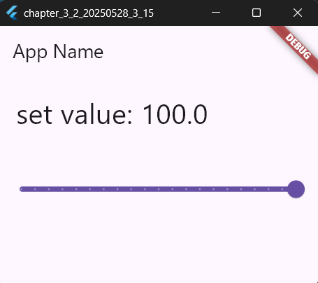

# 3-2: 入力のためのUI


`main.dartのソースコード(TextFieldについて)`
```dart
import 'package:flutter/material.dart';

// アプリのエントリーポイント
void main() {
  // アプリを実行し、`MyHomePage` ウィジェットを初期表示
  runApp(MaterialApp(home: MyHomePage()));
}

// `MyHomePage` クラス: 状態管理が可能なウィジェットを定義
class MyHomePage extends StatefulWidget {
  // コンストラクタでユニークキーを指定
  const MyHomePage({super.key});

  @override
  // 状態管理を行うクラス `_MyHomePageState` を作成
  // ignore: library_private_types_in_public_api
  _MyHomePageState createState() => _MyHomePageState();
}

// `_MyHomePageState` クラス: 実際の状態管理を担当
class _MyHomePageState extends State<MyHomePage> {
  // テキスト表示用のメッセージ (初期値は "ok.")
  static var _message = 'ok.';

  // テキスト入力フィールドのコントローラーを作成
  static final _controller = TextEditingController();

  @override
  Widget build(BuildContext context) {
    // UIの構築 (スキャフォールドを使用)
    return Scaffold(
      // アプリバー: 上部に表示するバー
      appBar: AppBar(title: Text('App Name')),
      // 中央にコンテンツを配置
      body: Center(
        child: Column(
          // UIコンポーネントの縦方向配置を設定
          mainAxisAlignment: MainAxisAlignment.start,
          mainAxisSize: MainAxisSize.max,
          crossAxisAlignment: CrossAxisAlignment.stretch,
          children: <Widget>[
            // メッセージ表示用のテキスト
            Padding(
              padding: EdgeInsets.all(20.0), // 余白を設定
              child: Text(
                _message, // 現在のメッセージを表示
                style: TextStyle(
                  fontSize: 32.0, // フォントサイズ
                  fontWeight: FontWeight.w400, // フォントの太さ
                  fontFamily: "Roboto", // フォントファミリー
                ),
              ),
            ),
            // テキスト入力フィールド
            Padding(
              padding: EdgeInsets.all(10.0), // 余白を設定
              child: TextField(
                controller: _controller, // コントローラーを設定
                style: TextStyle(
                  fontSize: 28.0, // フォントサイズ
                  color: const Color(0xffFF0000), // テキストの色 (赤色)
                  fontWeight: FontWeight.w400, // フォントの太さ
                  fontFamily: "Roboto", // フォントファミリー
                ),
              ),
            ),
            // ボタン: 押した時にイベント発生
            ElevatedButton(
              onPressed: buttonPressed, // ボタンが押された時の処理
              child: Text(
                "Push me!", // ボタンの表示テキスト
                style: TextStyle(
                  fontSize: 32.0, // フォントサイズ
                  color: const Color(0xff000000), // テキストの色 (黒色)
                  fontWeight: FontWeight.w400, // フォントの太さ
                  fontFamily: "Roboto", // フォントファミリー
                ),
              ),
            ),
          ],
        ),
      ),
    );
  }

  // ボタン押下時の処理
  void buttonPressed() {
    setState(() {
      // 入力されたテキストをメッセージに反映
      _message = 'you said: ${_controller.text}';
    });
  }
}
```

【 実行画面 】


> TextFieldについて
- テキストを入力するUIウィジェットである。FlutterStudioでは、Inputジャンルのところにある。
> Controllerについて
- 値を保管するクラスである。TextFieldと組み合わせることで、ウィジェットに入力されたテキストを扱うことが可能である。

`main.dartのソースコード(onChangedイベントの利用)`
```dart
import 'package:flutter/material.dart';

// アプリのエントリーポイント
void main() {
  // `MyHomePage` ウィジェットを表示してアプリを開始
  runApp(MaterialApp(home: MyHomePage()));
}

// 状態管理が可能なウィジェットを定義するクラス
class MyHomePage extends StatefulWidget {
  // コンストラクタ: `super.key` にキーを渡すことでユニークにする
  const MyHomePage({super.key});

  @override
  // `_MyHomePageState` クラスを作成して返す
  _MyHomePageState createState() => _MyHomePageState();
}

// 状態管理の実際のロジックを担当するクラス
class _MyHomePageState extends State<MyHomePage> {
  // テキストを表示するメッセージ変数 (初期値は "ok.")
  static var _message = 'ok.';

  // テキスト入力フィールドの内容を管理するコントローラー
  static final _controller = TextEditingController();

  @override
  Widget build(BuildContext context) {
    // UIを構築するための主要なコンテナ (Scaffold) を返す
    return Scaffold(
      // 上部のバー: アプリのタイトルを表示
      appBar: AppBar(title: Text('App Name')),
      // アプリの中央にコンテンツを配置
      body: Center(
        // UI部品を縦方向に配置するためのコンテナ (Column)
        child: Column(
          // 部品の配置方法を指定
          mainAxisAlignment: MainAxisAlignment.start, // 上から順に配置
          mainAxisSize: MainAxisSize.max, // 利用可能な最大サイズ
          crossAxisAlignment: CrossAxisAlignment.stretch, // 子部品を横幅いっぱいにする
          children: <Widget>[
            // メッセージ表示部分
            Padding(
              padding: EdgeInsets.all(20.0), // 各辺に20ピクセルの余白
              child: Text(
                _message, // 表示するテキスト
                style: TextStyle(
                  fontSize: 32.0, // フォントサイズ
                  fontWeight: FontWeight.w400, // フォントの太さ (通常)
                  fontFamily: "Roboto", // 使用するフォント
                ),
              ),
            ),
            // ユーザーが入力できるテキストフィールド
            Padding(
              padding: EdgeInsets.all(10.0), // 各辺に10ピクセルの余白
              child: TextField(
                // テキストが変更された際に呼び出される処理
                onChanged: textChanged,
                // コントローラーを設定して入力内容を管理
                controller: _controller,
                style: TextStyle(
                  fontSize: 28.0, // フォントサイズ
                  color: const Color(0xffFF0000), // テキストの色 (赤)
                  fontWeight: FontWeight.w400, // フォントの太さ
                  fontFamily: "Roboto", // 使用するフォント
                ),
              ),
            ),
          ],
        ),
      ),
    );
  }

  // ユーザーがテキストフィールドに入力した際に呼び出される処理
  void textChanged(String val) {
    // UIを更新して入力内容を大文字に変換して表示
    setState(() {
      _message = val.toUpperCase();
    });
  }
}
```

【 実行画面 】


> onChangedについて
- リアルタイムに入力した値に何らかの処理を行わせることが可能である。TextFieldウィジェットだと、テキストを修正するとイベントが発生する。

`main.dartのソースコード(checkboxについて)`
```dart
import 'package:flutter/material.dart';

// アプリのエントリーポイント: 実行時に最初に呼び出される関数
void main() {
  // アプリを起動して画面に `MyHomePage` ウィジェットを表示
  runApp(MaterialApp(home: MyHomePage()));
}

// 状態管理が可能なウィジェットを定義するクラス
class MyHomePage extends StatefulWidget {
  // コンストラクタ: ウィジェットの一意のキーを指定
  const MyHomePage({super.key});

  @override
  // 状態管理を担当する `_MyHomePageState` クラスを作成して返す
  // ignore: library_private_types_in_public_api
  _MyHomePageState createState() => _MyHomePageState();
}

// 実際の状態管理を行うクラス
class _MyHomePageState extends State<MyHomePage> {
  // チェックボックスの状態に応じて表示するメッセージ (初期値は "ok.")
  static var _message = 'ok.';

  // チェックボックスの選択状態を管理する変数 (初期値は false)
  static var _checked = false;

  @override
  Widget build(BuildContext context) {
    // UIを構築するための主要なコンテナ (Scaffold) を作成
    return Scaffold(
      // 上部のバー: アプリのタイトルを表示
      appBar: AppBar(title: Text('App Name')),
      // アプリの中央にコンテンツを配置
      body: Center(
        // UIコンポーネントを縦方向に配置するコンテナ (Column)
        child: Column(
          // 部品の配置方法を指定
          mainAxisAlignment: MainAxisAlignment.start, // 上から順に配置
          mainAxisSize: MainAxisSize.max, // 利用可能な最大サイズを使用
          crossAxisAlignment: CrossAxisAlignment.stretch, // 子部品を横幅いっぱいにする
          children: <Widget>[
            // メッセージを表示するテキスト
            Padding(
              // テキストの周囲に20ピクセルの余白を設定
              padding: EdgeInsets.all(20.0),
              // メッセージのテキストを表示
              child: Text(
                _message,
                // テキストのスタイルを設定
                style: TextStyle(
                  fontSize: 32.0, // フォントサイズ
                  fontWeight: FontWeight.w400, // フォントの太さ (通常)
                  fontFamily: "Roboto", // 使用するフォント
                ),
              ),
            ),
            // チェックボックスとそのラベルを横方向に並べるコンテナ (Row)
            Padding(
              // チェックボックス周囲に10ピクセルの余白を設定
              padding: EdgeInsets.all(10.0),
              child: Row(
                // 部品の横方向の配置を指定
                mainAxisAlignment: MainAxisAlignment.start, // 左揃え
                mainAxisSize: MainAxisSize.max, // 横方向の最大サイズを使用
                crossAxisAlignment: CrossAxisAlignment.end, // 子部品を下揃え
                children: <Widget>[
                  // チェックボックス (値を切り替えるとイベントが発生)
                  Checkbox(
                    value: _checked, // 現在の選択状態
                    // 状態が変更されたときに呼び出される関数
                    onChanged: checkChanged,
                  ),
                  // チェックボックスのラベルを表示
                  Text(
                    "Checkbox",
                    // テキストのスタイルを設定
                    style: TextStyle(
                      fontSize: 28.0, // フォントサイズ
                      fontWeight: FontWeight.w400, // フォントの太さ (通常)
                      fontFamily: "Roboto", // 使用するフォント
                    ),
                  ),
                ],
              ),
            ),
          ],
        ),
      ),
    );
  }

  // チェックボックスの状態が変更されたときに呼び出される関数
  void checkChanged(bool? value) {
    // 状態を更新 (UIにも反映)
    setState(() {
      // チェックボックスの選択状態を更新
      _checked = value!;
      // メッセージをチェック状態に応じて更新
      _message = value ? 'checked!' : 'not checked...';
    });
  }
}
```

【 実行画面 】


> checkboxについて
- FlutterStudioの中のInputジャンルの中にあるモノと同じで、オンとオフの２択入力で用いられる。

`main.dartのソースコード(Switchについて)`
```dart
import 'package:flutter/material.dart';

// アプリのエントリーポイント: 実行時に最初に呼び出される関数
void main() {
  // アプリを起動して画面に `MyHomePage` ウィジェットを表示
  runApp(MaterialApp(home: MyHomePage()));
}

// 状態管理が可能なウィジェットを定義するクラス
class MyHomePage extends StatefulWidget {
  // コンストラクタ: ウィジェットの一意のキーを指定
  const MyHomePage({super.key});

  @override
  // 状態管理を担当する `_MyHomePageState` クラスを作成して返す
  // ignore: library_private_types_in_public_api
  _MyHomePageState createState() => _MyHomePageState();
}

// 実際の状態管理を行うクラス
class _MyHomePageState extends State<MyHomePage> {
  // チェックボックスの状態に応じて表示するメッセージ (初期値は "ok.")
  static var _message = 'ok.';

  // チェックボックスの選択状態を管理する変数 (初期値は false)
  static var _checked = false;

  @override
  Widget build(BuildContext context) {
    // UIを構築するための主要なコンテナ (Scaffold) を作成
    return Scaffold(
      // 上部のバー: アプリのタイトルを表示
      appBar: AppBar(title: Text('App Name')),
      // アプリの中央にコンテンツを配置
      body: Center(
        // UIコンポーネントを縦方向に配置するコンテナ (Column)
        child: Column(
          // 部品の配置方法を指定
          mainAxisAlignment: MainAxisAlignment.start, // 上から順に配置
          mainAxisSize: MainAxisSize.max, // 利用可能な最大サイズを使用
          crossAxisAlignment: CrossAxisAlignment.stretch, // 子部品を横幅いっぱいにする
          children: <Widget>[
            // メッセージを表示するテキスト
            Padding(
              // テキストの周囲に20ピクセルの余白を設定
              padding: EdgeInsets.all(20.0),
              // メッセージのテキストを表示
              child: Text(
                _message,
                // テキストのスタイルを設定
                style: TextStyle(
                  fontSize: 32.0, // フォントサイズ
                  fontWeight: FontWeight.w400, // フォントの太さ (通常)
                  fontFamily: "Roboto", // 使用するフォント
                ),
              ),
            ),
            // チェックボックスとそのラベルを横方向に並べるコンテナ (Row)
            Padding(
              // チェックボックス周囲に10ピクセルの余白を設定
              padding: EdgeInsets.all(10.0),
              child: Row(
                // 部品の横方向の配置を指定
                mainAxisAlignment: MainAxisAlignment.start, // 左揃え
                mainAxisSize: MainAxisSize.max, // 横方向の最大サイズを使用
                crossAxisAlignment: CrossAxisAlignment.end, // 子部品を下揃え
                children: <Widget>[
                  // スイッチ (値を切り替えるとイベントが発生、チェックボックスと見た目が少し違う)
                  Switch(
                    value: _checked, // 現在の選択状態
                    // 状態が変更されたときに呼び出される関数
                    onChanged: checkChanged,
                  ),
                  // チェックボックスのラベルを表示
                  Text(
                    "Checkbox",
                    // テキストのスタイルを設定
                    style: TextStyle(
                      fontSize: 28.0, // フォントサイズ
                      fontWeight: FontWeight.w400, // フォントの太さ (通常)
                      fontFamily: "Roboto", // 使用するフォント
                    ),
                  ),
                ],
              ),
            ),
          ],
        ),
      ),
    );
  }

  // チェックボックスの状態が変更されたときに呼び出される関数
  void checkChanged(bool? value) {
    // 状態を更新 (UIにも反映)
    setState(() {
      // チェックボックスの選択状態を更新
      _checked = value!;
      // メッセージをチェック状態に応じて更新
      _message = value ? 'checked!' : 'not checked...';
    });
  }
}
```

【 実行画面 】


> Switchについて
- Checkboxと外観が違うだけで処理はほぼ同じである。

`main.dartのソースコード(Radioについて)`
```dart
import 'package:flutter/material.dart';

// アプリのエントリーポイント: 実行時に最初に呼び出される関数
void main() {
  // アプリを起動して `MyHomePage` 画面を表示する
  runApp(MaterialApp(home: MyHomePage()));
}

// 状態管理が可能なウィジェットを定義するクラス
class MyHomePage extends StatefulWidget {
  // コンストラクタ: ウィジェットに一意のキーを設定
  const MyHomePage({super.key});

  @override
  // 状態管理を行うクラス `_MyHomePageState` を作成して返す
  // ignore: library_private_types_in_public_api
  _MyHomePageState createState() => _MyHomePageState();
}

// 実際の状態管理を行うクラス
class _MyHomePageState extends State<MyHomePage> {
  // テキスト表示用のメッセージ (初期値は 'ok.')
  static var _message = 'ok.';

  // ラジオボタンの選択状態を管理する変数 (初期値は 'A')
  static var _selected = 'A';

  @override
  Widget build(BuildContext context) {
    // UIを構築する主要なコンテナ (Scaffold) を作成
    return Scaffold(
      // 上部のバー: アプリのタイトルを表示
      appBar: AppBar(title: Text('App Name')),
      // 中央にコンテンツを配置
      body: Center(
        // UIコンポーネントを縦方向に配置するためのコンテナ (Column)
        child: Column(
          // 部品の配置方法を指定
          mainAxisAlignment: MainAxisAlignment.start, // 上から順に配置
          mainAxisSize: MainAxisSize.max, // 利用可能な最大サイズを使用
          crossAxisAlignment: CrossAxisAlignment.stretch, // 子部品を横幅いっぱいに広げる
          children: <Widget>[
            // メッセージ表示部分
            Padding(
              // 上下左右に余白を設定 (20ピクセル)
              padding: EdgeInsets.all(20.0),
              child: Text(
                _message, // メッセージを表示
                style: TextStyle(
                  fontSize: 32.0, // フォントサイズ
                  fontWeight: FontWeight.w400, // フォントの太さ (通常)
                  fontFamily: "Roboto", // 使用するフォント
                ),
              ),
            ),

            // 区切りの余白 (10ピクセル)
            Padding(padding: EdgeInsets.all(10.0)),

            // ラジオボタンAを含む横方向のコンテナ (Row)
            Row(
              // 横方向の部品の配置方法を指定
              mainAxisAlignment: MainAxisAlignment.start, // 左揃え
              mainAxisSize: MainAxisSize.max, // 横幅を最大に広げる
              crossAxisAlignment: CrossAxisAlignment.center, // 子部品を中央揃え
              children: <Widget>[
                // ラジオボタンA: 選択状態を反映
                Radio<String>(
                  value: 'A', // ラジオボタンの値
                  groupValue: _selected, // 現在選択されているグループ値
                  onChanged: checkChanged, // 状態変更時に呼び出される関数
                ),
                // ラベル (radio A) を表示
                Text(
                  "radio A",
                  style: TextStyle(
                    fontSize: 28.0, // フォントサイズ
                    fontWeight: FontWeight.w400, // フォントの太さ (通常)
                    fontFamily: "Roboto", // 使用するフォント
                  ),
                ),
              ],
            ),

            // ラジオボタンBを含む横方向のコンテナ (Row)
            Row(
              mainAxisAlignment: MainAxisAlignment.start, // 左揃え
              mainAxisSize: MainAxisSize.max, // 横幅を最大に広げる
              crossAxisAlignment: CrossAxisAlignment.center, // 子部品を中央揃え
              children: <Widget>[
                // ラジオボタンB: 選択状態を反映
                Radio<String>(
                  value: 'B', // ラジオボタンの値
                  groupValue: _selected, // 現在選択されているグループ値
                  onChanged: checkChanged, // 状態変更時に呼び出される関数
                ),
                // ラベル (radio B) を表示
                Text(
                  "radio B",
                  style: TextStyle(
                    fontSize: 28.0, // フォントサイズ
                    fontWeight: FontWeight.w400, // フォントの太さ (通常)
                    fontFamily: "Roboto", // 使用するフォント
                  ),
                ),
              ],
            ),
          ],
        ),
      ),
    );
  }

  // ラジオボタンの状態が変更された時に呼び出される関数
  void checkChanged(String? value) {
    // UIを更新するために状態を変更
    setState(() {
      // 選択状態を更新
      _selected = value ?? 'nodata';
      // メッセージを更新して選択された値を表示
      _message = 'select: $_selected';
    });
  }
}
```

【 実行画面 】


`main.dartのソースコード(DropdownButtonについて)`
```dart
import 'package:flutter/material.dart';

// アプリのエントリーポイント: 実行時に最初に呼び出される関数
void main() {
  // アプリを起動して `MyHomePage` 画面を表示する
  runApp(MaterialApp(home: MyHomePage()));
}

// 状態管理が可能なウィジェットを定義するクラス
class MyHomePage extends StatefulWidget {
  // コンストラクタ: ウィジェットに一意のキーを設定
  const MyHomePage({super.key});

  @override
  // 状態管理を行うクラス `_MyHomePageState` を作成して返す
  _MyHomePageState createState() => _MyHomePageState();
}

// 状態管理のロジックを記述するクラス
class _MyHomePageState extends State<MyHomePage> {
  // テキスト表示用のメッセージ (初期値は 'ok.')
  static var _message = 'ok.';

  // ドロップダウンメニューで選択された値を保持する変数 (初期値は 'One')
  static var _selected = 'One';

  @override
  Widget build(BuildContext context) {
    // 画面全体のUIを構築するウィジェット
    return Scaffold(
      // 上部バーにアプリのタイトルを表示
      appBar: AppBar(title: Text('App Name')),
      // 中央に配置されるメインコンテンツ
      body: Center(
        // UIコンポーネントを縦方向に配置するためのコンテナ
        child: Column(
          // 縦方向の配置方法を指定 (上から順に配置)
          mainAxisAlignment: MainAxisAlignment.start,
          mainAxisSize: MainAxisSize.max, // 利用可能な最大サイズを使用
          crossAxisAlignment: CrossAxisAlignment.stretch, // 子要素を横幅いっぱいに広げる
          children: <Widget>[
            // メッセージを表示するテキスト
            Padding(
              // 上下左右に20ピクセルの余白を設定
              padding: EdgeInsets.all(20.0),
              // 現在のメッセージをテキストとして表示
              child: Text(
                _message,
                style: TextStyle(
                  fontSize: 32.0, // フォントサイズ
                  fontWeight: FontWeight.w400, // フォントの太さ (通常)
                  fontFamily: "Roboto", // 使用するフォント
                ),
              ),
            ),

            // 区切りとして10ピクセルの余白を挿入
            Padding(padding: EdgeInsets.all(10.0)),

            // ドロップダウンメニュー (選択肢をリスト形式で表示)
            DropdownButton<String>(
              // メニューが選択されたときに呼び出される処理
              onChanged: popupSelected,
              // 現在選択されている値を設定
              value: _selected,
              // メニューのスタイルを設定
              style: TextStyle(
                color: Colors.black, // テキストの色 (黒)
                fontSize: 28.0, // フォントサイズ
                fontWeight: FontWeight.w400, // フォントの太さ (通常)
                fontFamily: 'Roboto', // 使用するフォント
              ),
              // ドロップダウンメニューの選択肢を定義
              items: <DropdownMenuItem<String>>[
                // 'One' の選択肢
                const DropdownMenuItem<String>(
                  value: 'One',
                  child: Text('One'),
                ),
                // 'Two' の選択肢
                const DropdownMenuItem<String>(
                  value: 'Two',
                  child: Text('Two'),
                ),
                // 'Three' の選択肢
                const DropdownMenuItem<String>(
                  value: 'Three',
                  child: Text('Three'),
                ),
              ],
            ),
          ],
        ),
      ),
    );
  }

  // ドロップダウンメニューで選択された値を処理する関数
  void popupSelected(String? value) {
    // UIの状態を更新 (新しい選択値とそれに基づくメッセージを設定)
    setState(() {
      _selected = value ?? 'not selected...'; // 選択値が null の場合、デフォルトメッセージを設定
      _message = 'select: $_selected'; // 選択された値を表示するメッセージを更新
    });
  }
}
```

【 実行画面 】


`main.dartのソースコード(PopupMenuButtonについて)`
```dart
import 'package:flutter/material.dart';

// アプリのエントリーポイント: 実行時に最初に呼び出される関数
void main() {
  // アプリを起動して `MyHomePage` 画面を表示する
  runApp(MaterialApp(home: MyHomePage()));
}

// 状態管理が可能なウィジェットを定義するクラス
class MyHomePage extends StatefulWidget {
  // コンストラクタ: ウィジェットに一意のキーを設定
  const MyHomePage({super.key});

  @override
  // 状態管理を担当する `_MyHomePageState` クラスを作成して返す
  _MyHomePageState createState() => _MyHomePageState();
}

// 状態管理のロジックを記述するクラス
class _MyHomePageState extends State<MyHomePage> {
  // メッセージを表示する変数 (初期値は 'ok.')
  static var _message = 'ok.';

  // ドロップダウンメニューの選択された値を保持する変数 (初期値は 'One')
  static var _selected = 'One';

  @override
  Widget build(BuildContext context) {
    // 画面全体のレイアウトとUIを構築するウィジェット
    return Scaffold(
      // 上部に表示されるアプリのバー (タイトルを含む)
      appBar: AppBar(
        title: Text('App Name'), // タイトルとして 'App Name' を表示
      ),
      // 主なコンテンツを中央に配置
      body: Center(
        // UIコンポーネントを縦方向に配置するコンテナ
        child: Column(
          // コンポーネントを縦方向に上から順に配置
          mainAxisAlignment: MainAxisAlignment.start,
          mainAxisSize: MainAxisSize.max, // コンテナの最大サイズを使用
          crossAxisAlignment: CrossAxisAlignment.stretch, // 子要素を横幅いっぱいに広げる
          children: <Widget>[
            // 表示メッセージ用のテキスト
            Padding(
              // メッセージ周囲に20ピクセルの余白を設定
              padding: EdgeInsets.all(20.0),
              // メッセージを表示
              child: Text(
                _message, // 現在のメッセージを表示
                style: TextStyle(
                  fontSize: 32.0, // フォントサイズを設定
                  fontWeight: FontWeight.w400, // フォントの太さ (通常)
                  fontFamily: "Roboto", // 使用するフォント
                ),
              ),
            ),

            // 区切りとして10ピクセルの余白を挿入
            Padding(padding: EdgeInsets.all(10.0)),

            // ポップアップメニューを右側に表示するコンテナ
            Align(
              alignment: Alignment.centerRight, // メニューを右寄せに配置
              child: PopupMenuButton(
                // メニュー項目が選択されたときに呼び出される処理
                onSelected: (String value) => popupSelected(value),
                // メニューの項目を構築
                itemBuilder:
                    (BuildContext context) => <PopupMenuEntry<String>>[
                      // 選択肢 'One'
                      const PopupMenuItem(
                        child: const Text("One"), // 表示テキスト
                        value: "One", // 選択されたときの値
                      ),
                      // 選択肢 'Two'
                      const PopupMenuItem(
                        child: const Text("Two"), // 表示テキスト
                        value: "Two", // 選択されたときの値
                      ),
                      // 選択肢 'Three'
                      const PopupMenuItem(
                        child: const Text("Three"), // 表示テキスト
                        value: "Three", // 選択されたときの値
                      ),
                    ],
              ),
            ),
          ],
        ),
      ),
    );
  }

  // ポップアップメニューで選択された値を処理する関数
  void popupSelected(String? value) {
    // UIを更新して新しい選択値を反映
    setState(() {
      _selected = value ?? 'not selected...'; // 選択値が null の場合、デフォルト値を設定
      _message = 'select: $_selected'; // メッセージを選択された値に更新
    });
  }
}
```

【 実行画面 】


> Alignについて
- PopupMenuButtonは、Alignウィジェットの中に組み込んでいる。これは、ウィジェットの位置揃えを調整するコンテナである。


`main.dartのソースコード(Sliderについて)`
```dart
import 'package:flutter/material.dart';

// アプリのエントリーポイント: 実行時に最初に呼び出される関数
void main() {
  // アプリを起動して `MyHomePage` ウィジェットを画面に表示
  runApp(MaterialApp(home: MyHomePage()));
}

// 状態管理が可能なウィジェットを定義するクラス
class MyHomePage extends StatefulWidget {
  // コンストラクタ: ウィジェットに一意のキーを設定
  const MyHomePage({super.key});

  @override
  // 状態管理を担当する `_MyHomePageState` クラスを作成して返す
  // ignore: library_private_types_in_public_api
  _MyHomePageState createState() => _MyHomePageState();
}

// 状態管理のロジックを記述するクラス
class _MyHomePageState extends State<MyHomePage> {
  // メッセージを表示するための変数 (初期値は 'ok.')
  static var _message = 'ok.';

  // スライダーの現在の値を保持する変数 (初期値は 0.0)
  static var _value = 0.0;

  @override
  Widget build(BuildContext context) {
    // 画面の基本レイアウトを構築するウィジェット (Scaffold)
    return Scaffold(
      // 上部に表示されるアプリのバー (タイトルを含む)
      appBar: AppBar(
        title: Text('App Name'), // アプリバーに表示するタイトル
      ),
      // 主なコンテンツを中央に配置
      body: Center(
        // UI部品を縦方向に配置するためのコンテナ
        child: Column(
          // 縦方向の配置方法を指定 (上から順に配置)
          mainAxisAlignment: MainAxisAlignment.start, // 順番に配置
          mainAxisSize: MainAxisSize.max, // 利用可能な最大サイズを使用
          crossAxisAlignment: CrossAxisAlignment.stretch, // 子要素を横幅いっぱいに広げる
          children: <Widget>[
            // メッセージを表示するテキスト
            Padding(
              // テキストの周囲に20ピクセルの余白を設定
              padding: EdgeInsets.all(20.0),
              // 現在のメッセージを表示
              child: Text(
                _message,
                style: TextStyle(
                  fontSize: 32.0, // フォントサイズを設定
                  fontWeight: FontWeight.w400, // フォントの太さ (通常)
                  fontFamily: "Roboto", // 使用するフォント
                ),
              ),
            ),

            // 区切りとして10ピクセルの余白を挿入
            Padding(padding: EdgeInsets.all(10.0)),

            // ユーザーが値を変更できるスライダー
            Slider(
              // スライダーの値が変更されたときに呼び出される処理
              onChanged: sliderChanged,
              min: 0.0, // スライダーの最小値
              max: 100.0, // スライダーの最大値
              divisions: 20, // スライダーの分割数 (20段階)
              value: _value, // スライダーの現在の値
            ),
          ],
        ),
      ),
    );
  }

  // スライダーの値が変更されたときに呼び出される関数
  void sliderChanged(double value) {
    // UIを更新して新しい値を反映
    setState(() {
      _value = value.floorToDouble(); // 値を整数に変換して更新
      _message = 'set value: $_value'; // メッセージを更新して現在の値を表示
    });
  }
}
```

【 実行画面 】



