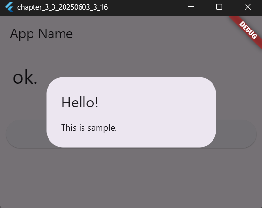
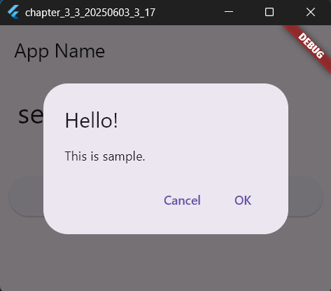
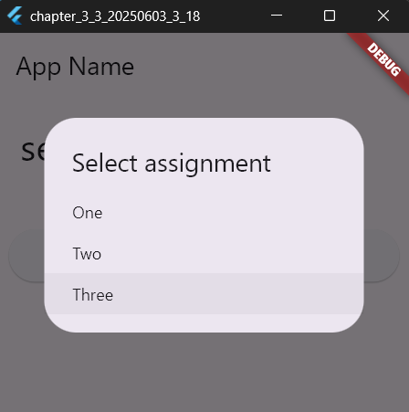

# 3-3: アラートとダイアログ

2025年6月3日
### 今日のキーワード： 「クロワッサン」➡形が特徴的で、三日月（フランス語でcroissant）の形状に由来します。しかし、実はフランスの食べ物じゃなくてオーストリアのウィーンがそのルーツで、オスマン帝国がウィーンを包囲した17世紀の戦争の際に、パン職人たちが敵の旗印である三日月を模したパンを作ったのが始まりだそうです。その後、フランスに渡り、バターたっぷりのリッチな層を持つクロワッサンが生まれて、世界中に普及しました。

---
> Flutterプロジェクトのビルドフォルダをクリーンアップするためのコマンド
フラッタークリーン（flutter clean）とは、Flutterプロジェクトのビルドフォルダをクリーンアップするためのコマンドです。 このコマンドを実行すると、build/フォルダ内のすべてのファイルが削除され、以前のビルドプロセスから残された古いデータやキャッシュがクリアされます。これにより、プロジェクトがクリーンな状態からビルドされるようになり、ビルド関連の問題を解決するのに役立ちます!

- **ターミナルで実施する方法 ➡ flutter clean プロジェクト名**

---
  

`main.dartのソースコード(showDialog関数について)`
```dart
import 'package:flutter/material.dart';

// アプリのエントリーポイント: 実行時に最初に呼び出される関数
void main() {
  // Flutterアプリを起動して、`MyHomePage` ウィジェットを画面に表示する
  runApp(MaterialApp(home: MyHomePage()));
}

// アプリのホーム画面を定義するためのクラス。このクラスはStatefulWidgetを継承している。
class MyHomePage extends StatefulWidget {
  // コンストラクタ: ウィジェットに一意のキーを設定（今回は設定なし）
  const MyHomePage({super.key});

  @override
  // 状態を管理するクラス（`_MyHomePageState`）を作成して返す。
  // ignore: library_private_types_in_public_api
  _MyHomePageState createState() => _MyHomePageState();
}

// アプリのホーム画面の状態（State）を定義するクラス。
class _MyHomePageState extends State<MyHomePage> {
  // 定数として表示するメッセージを定義
  static final _message = 'ok.';

  @override
  Widget build(BuildContext context) {
    // アプリのレイアウトや構造を作成
    return Scaffold(
      // アプリの上部にバー（AppBar）を設定
      appBar: AppBar(title: Text('App Name')),
      // 中央部分のコンテンツを配置
      body: Center(
        child: Column(
          // 縦方向にウィジェットを配置
          mainAxisAlignment: MainAxisAlignment.start,
          mainAxisSize: MainAxisSize.max,
          crossAxisAlignment: CrossAxisAlignment.stretch,
          children: <Widget>[
            // メッセージを表示するためのウィジェット
            Padding(
              padding: EdgeInsets.all(20.0), // パディングを追加
              child: Text(
                _message, // 表示するメッセージ
                style: TextStyle(
                  fontSize: 32.0, // フォントサイズ
                  fontWeight: FontWeight.w400, // フォントの太さ
                  fontFamily: "Roboto", // フォントファミリー
                ),
              ),
            ),

            Padding(padding: EdgeInsets.all(10.0)), // 隙間を作るためのパディング
            // ボタンを作成し、押されたときに処理を実行
            Padding(
              padding: EdgeInsets.all(10.0),
              child: ElevatedButton(
                onPressed: buttonPressed, // ボタンが押された時の処理
                child: Text(
                  "tap me!", // ボタンに表示するテキスト
                  style: TextStyle(
                    fontSize: 32.0, // フォントサイズ
                    color: const Color(0xff000000), // テキストカラー
                    fontWeight: FontWeight.w400, // フォントの太さ
                    fontFamily: "Roboto", // フォントファミリー
                  ),
                ),
              ),
            ),
          ],
        ),
      ),
    );
  }

  // ボタンが押されたときに呼び出される関数
  void buttonPressed() {
    // ダイアログを画面に表示
    showDialog(
      context: context, // 現在のコンテキストを指定
      builder:
          (BuildContext context) => AlertDialog(
            title: Text("Hello!"), // ダイアログのタイトル
            content: Text("This is sample."), // ダイアログの内容
          ),
    );
  }
}
```

【 実行画面 】




`main.dartのソースコード(アラートにボタンを追加する)`
```dart
import 'package:flutter/material.dart';

// アプリのエントリーポイント: 実行時に最初に呼び出される関数
void main() {
  // Flutterアプリを起動する。MaterialAppウィジェットをルートとして使用。
  // `home:` には最初に表示する画面を指定（今回はMyHomePage）。
  runApp(MaterialApp(home: MyHomePage()));
}

// StatefulWidgetは、状態（State）が変化するウィジェットを作成するときに使用。
class MyHomePage extends StatefulWidget {
  // コンストラクタ: 特定のキーを設定するため。今回はデフォルトキーを使うため設定は空。
  const MyHomePage({super.key});

  @override
  // ウィジェットの状態を管理するクラス（_MyHomePageState）を定義して返す。
  _MyHomePageState createState() => _MyHomePageState();
}

// ウィジェットの実際の状態や振る舞いを定義するクラス。
class _MyHomePageState extends State<MyHomePage> {
  // メッセージ用の変数を定義。
  // ボタン操作などでこのメッセージが変化する。
  static var _message = 'ok.';

  @override
  Widget build(BuildContext context) {
    // UI全体の構造を定義するメソッド。
    return Scaffold(
      // 上部に配置されるタイトルバー（AppBar）を設定
      appBar: AppBar(title: Text('App Name')),
      // アプリの中心部分に配置するウィジェットを定義
      body: Center(
        // 縦にアイテムを並べるColumnウィジェットを使用
        child: Column(
          // 子ウィジェットをどのように配置するかの設定
          mainAxisAlignment: MainAxisAlignment.start, // 上から並べる
          mainAxisSize: MainAxisSize.max, // Column全体が最大限の高さを使用
          crossAxisAlignment: CrossAxisAlignment.stretch, // 横幅をいっぱいに広げる
          children: <Widget>[
            // メッセージを表示するテキストウィジェット
            Padding(
              padding: EdgeInsets.all(20.0), // テキストの周囲に余白を設定
              child: Text(
                _message, // 表示するメッセージ内容
                style: TextStyle(
                  fontSize: 32.0, // フォントサイズ
                  fontWeight: FontWeight.w400, // 文字の太さ
                  fontFamily: "Roboto", // 使用するフォント
                ),
              ),
            ),
            // テキストとボタンの間に余白を作成
            Padding(padding: EdgeInsets.all(10.0)),

            // ボタンウィジェットを配置
            Padding(
              padding: EdgeInsets.all(10.0), // ボタン周りに余白を設定
              child: ElevatedButton(
                onPressed: buttonPressed, // ボタンが押された時の処理（下記関数参照）
                child: Text(
                  "tap me!", // ボタンに表示するテキスト
                  style: TextStyle(
                    fontSize: 32.0, // フォントサイズ
                    color: const Color(0xff000000), // テキストカラー
                    fontWeight: FontWeight.w400, // フォントの太さ
                    fontFamily: "Roboto", // 使用するフォント
                  ),
                ),
              ),
            ),
          ],
        ),
      ),
    );
  }

  // ボタンが押されたときに呼び出されるメソッド
  void buttonPressed() {
    // ダイアログを表示するメソッド
    showDialog(
      context: context, // ダイアログを表示する文脈情報を指定
      builder: (BuildContext context) => AlertDialog(
        title: Text("Hello!"), // ダイアログのタイトル部分
        content: const Text("This is sample."), // ダイアログ内のメッセージ
        actions: <Widget>[
          // キャンセルボタン
          TextButton(
            child: const Text('Cancel'), // ボタンテキスト
            onPressed: () => Navigator.pop<String>(context, 'Cancel'), // ダイアログを閉じる
          ),
          // OKボタン
          TextButton(
            child: const Text('OK'),
            onPressed: () => Navigator.pop<String>(context, 'OK'), // ダイアログを閉じる
          ),
        ],
      ),
    ).then<void>((value) => resultAlert(value)); // ダイアログで選択された値を処理
  }

  // ダイアログで選択した値に基づいてメッセージを更新するメソッド
  void resultAlert(String value) {
    setState(() {
      _message = 'selected: $value'; // 新しいメッセージを設定
    });
  }
}
```

【 実行画面 】




`main.dartのソースコード(SimpleDialogについて)`
```dart

import 'package:flutter/material.dart';

// アプリのエントリーポイント: 実行時に最初に呼び出される関数
void main() {
  // アプリを起動し、最初に表示する画面をMyHomePageに設定
  runApp(MaterialApp(home: MyHomePage()));
}

// アプリのホーム画面を表すクラス。このクラスはStatefulWidgetを継承しており、状態管理が可能
class MyHomePage extends StatefulWidget {
  // コンストラクタ: ウィジェットに一意のキーを設定（今回はデフォルト）
  const MyHomePage({super.key});

  @override
  // 状態管理用のクラスを作成し返す
  _MyHomePageState createState() => _MyHomePageState();
}

// 状態管理を行うクラス
class _MyHomePageState extends State<MyHomePage> {
  // ウィジェットに表示するメッセージ。ボタン操作で更新される
  static var _message = 'ok.';

  @override
  Widget build(BuildContext context) {
    // 画面全体の構造と見た目を定義
    return Scaffold(
      // 上部にタイトルバーを追加
      appBar: AppBar(title: Text('App Name')),
      // コンテンツ部分の設定（中央に配置）
      body: Center(
        // 縦に並べるためのColumnウィジェットを使用
        child: Column(
          // 各ウィジェットの配置設定
          mainAxisAlignment: MainAxisAlignment.start, // 上から配置
          mainAxisSize: MainAxisSize.max, // 最大サイズでColumnを利用
          crossAxisAlignment: CrossAxisAlignment.stretch, // 横幅をいっぱいに伸ばす
          children: <Widget>[
            // メッセージを表示するウィジェット
            Padding(
              padding: EdgeInsets.all(20.0), // ウィジェットの周囲に余白を追加
              child: Text(
                _message, // 表示するテキスト
                style: TextStyle(
                  fontSize: 32.0, // フォントサイズを設定
                  fontWeight: FontWeight.w400, // フォントの太さを設定
                  fontFamily: "Roboto", // 使用するフォントを指定
                ),
              ),
            ),
            // テキストとボタンの間にスペースを追加
            Padding(padding: EdgeInsets.all(10.0)),

            // ボタンを作成し、押された時に動作する機能を設定
            Padding(
              padding: EdgeInsets.all(10.0), // ボタン周囲に余白を設定
              child: ElevatedButton(
                onPressed: buttonPressed, // ボタンが押された時の処理（後述）
                child: Text(
                  "tap me!", // ボタンに表示されるテキスト
                  style: TextStyle(
                    fontSize: 32.0, // フォントサイズを設定
                    color: const Color(0xff000000), // 文字色を設定
                    fontWeight: FontWeight.w400, // フォントの太さを設定
                    fontFamily: "Roboto", // 使用するフォントを指定
                  ),
                ),
              ),
            ),
          ],
        ),
      ),
    );
  }

  // ボタンが押された時に呼び出される関数
  void buttonPressed() {
    // ダイアログを表示する関数
    showDialog(
      context: context, // 現在の文脈を渡す
      builder:
          (BuildContext context) => SimpleDialog(
            title: const Text('Select assignment'), // ダイアログのタイトルを設定
            children: <Widget>[
              // ダイアログに表示するオプションを設定
              SimpleDialogOption(
                onPressed:
                    () =>
                        Navigator.pop<String>(context, 'One'), // オプション選択時に閉じる処理
                child: const Text('One'), // 表示するテキスト
              ),
              SimpleDialogOption(
                onPressed: () => Navigator.pop<String>(context, 'Two'),
                child: const Text('Two'),
              ),
              SimpleDialogOption(
                onPressed: () => Navigator.pop<String>(context, 'Three'),
                child: const Text('Three'),
              ),
            ],
          ),
    ).then<void>((value) => resultAlert(value)); // 選択結果を次の処理へ渡す
  }

  // ダイアログで選択した結果を画面に表示する関数
  void resultAlert(String value) {
    setState(() {
      _message = 'selected: $value'; // ボタン上に選択された値を表示
    });
  }
}
```

【 実行画面 】




