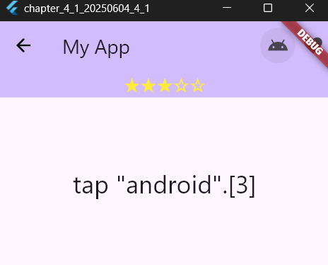
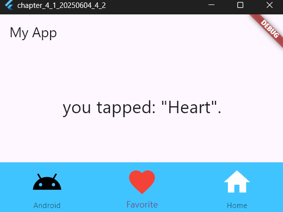
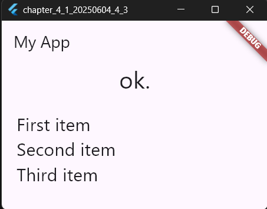
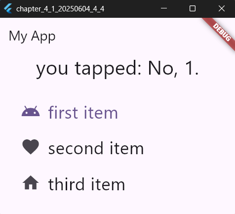
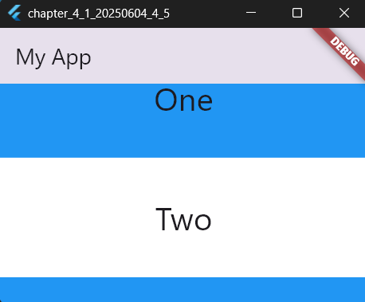

# 4-1: 複雑な構造のウィジェット

2025年6月4日
### 今日のキーワード： 「とりにく」➡鶏肉は古代から人々にとって大切な食料でしたが、日本では仏教の影響で長い間、食べることが禁じられていました。明治時代に入り、西洋文化の影響で再び広まったと言われています。

---
  

`main.dartのソースコード(AppBarについて)`
```dart
import 'package:flutter/material.dart';

// アプリのエントリーポイント
void main() {
  runApp(const MyApp()); // MyAppウィジェットを起動
}

// メインアプリケーションウィジェット
class MyApp extends StatelessWidget {
  const MyApp({super.key});

  @override
  Widget build(BuildContext context) {
    return MaterialApp(
      title: 'Flutter Demo', // アプリのタイトル
      theme: ThemeData(
        // テーマカラーを設定
        colorScheme: ColorScheme.fromSeed(seedColor: Colors.deepPurple),
      ),
      home: const MyHomePage(title: 'Flutter Demo Home Page'), // メインページを表示
    );
  }
}

// ホーム画面のステートフルウィジェット
class MyHomePage extends StatefulWidget {
  const MyHomePage({super.key, required this.title});
  final String title; // ホーム画面のタイトル

  @override
  State<MyHomePage> createState() => _MyHomePageState(); // ステートを管理
}

// ホーム画面のステート
class _MyHomePageState extends State<MyHomePage> {
  static var _message = 'ok'; // 表示メッセージ
  static var _stars = '☆☆☆☆☆'; // スターの表示
  static var _star = 0; // スターの数

  @override
  Widget build(BuildContext context) {
    return Scaffold(
      appBar: AppBar(
        title: Text('My App'), // アプリの名前
        backgroundColor: Theme.of(context).colorScheme.inversePrimary, // テーマカラー
        leading: BackButton(color: Colors.black), // 戻るボタン

        // アクションボタン（アイコン）
        actions: <Widget>[
          IconButton(
            icon: Icon(Icons.android), // Androidアイコン
            tooltip: 'add star...', // ツールチップ（説明）
            onPressed: iconPressedA, // ボタン押下時の処理
          ),
          IconButton(
            icon: Icon(Icons.favorite), // ハートアイコン
            tooltip: 'subtract star...', // ツールチップ（説明）
            onPressed: iconPressedB, // ボタン押下時の処理
          ),
        ],

        // AppBarの下部にスターの表示を追加
        bottom: PreferredSize(
          preferredSize: const Size.fromHeight(30.0),
          child: Center(
            child: Text(
              _stars, // スターの表示内容
              style: TextStyle(fontSize: 22.0, color: Colors.yellow), // テキストスタイル
            ),
          ),
        ),
      ),

      // 中央にメッセージを表示
      body: Center(
        child: Text(_message, style: const TextStyle(fontSize: 28.0)),
      ),
    );
  }

  // Androidアイコンボタンが押されたときの処理
  void iconPressedA() {
    _message = 'tap "android".'; // メッセージを変更
    _star++; // スターを1増やす
    update(); // 表示を更新
  }

  // ハートアイコンボタンが押されたときの処理
  void iconPressedB() {
    _message = 'tap "favorite".'; // メッセージを変更
    _star--; // スターを1減らす
    update(); // 表示を更新
  }

  // スターの数と表示を更新する処理
  void update() {
    _star =
        _star < 0 // スターが負数になるのを防ぐ
            ? 0
            : _star > 5 // スターが5以上になるのを防ぐ
            ? 5
            : _star;
    setState(() {
      _stars = '★★★★★☆☆☆☆☆'.substring(5 - _star, 5 - _star + 5); // スター表示を更新
      _message = _message + '[$_star]'; // メッセージにスター数を追加
    });
  }
}
```

【 実行画面 】



> BackButtonについて
- 前に戻るための専用ボタン。一般的にleadingに配置されるウィジェットである。
> actionsアイコンについて
- タイトルの右側の限られたエリアに表示し、一目で内容がわかるアイコンなどが適している


`main.dartのソースコード(BottomNavigationBarについて)`
```dart

// Flutterの基本的なパッケージをインポート
import 'package:flutter/material.dart';

// アプリを起動するエントリーポイント
void main() {
  runApp(const MyApp()); // MyAppウィジェットを作成して表示
}

// アプリの本体となるステートレスウィジェット（動かない部品）
class MyApp extends StatelessWidget {
  const MyApp({super.key}); // コンストラクタでキーを渡す

  @override
  Widget build(BuildContext context) {
    // アプリの外観や内容を定義
    return MaterialApp(
      title: 'Flutter Demo', // アプリのタイトル
      theme: ThemeData(
        // 見た目のテーマを定義（色など）
        colorScheme: ColorScheme.fromSeed(seedColor: Colors.deepPurple),
      ),
      home: const MyHomePage(title: 'Flutter Demo Home Page'), // 初期表示ページを設定
    );
  }
}

// ステートを持つホーム画面ウィジェット
class MyHomePage extends StatefulWidget {
  const MyHomePage({super.key, required this.title}); // ホームページのタイトルを保持
  final String title; // タイトルのプロパティ

  @override
  State<MyHomePage> createState() => _MyHomePageState(); // 状態管理用のクラスを作成
}

// ホーム画面のステート（動きを管理する部分）
class _MyHomePageState extends State<MyHomePage> {
  static var _message = 'ok'; // 表示するメッセージ
  static var _index = 0; // 現在選択されているボタンのインデックス

  @override
  Widget build(BuildContext context) {
    // UIの構築を行うメインメソッド
    return Scaffold(
      appBar: AppBar(title: Text('My App')), // 上部のバーにタイトルを表示
      body: Center(
        child: Text(_message, style: const TextStyle(fontSize: 28.0)), // 画面中央にメッセージを表示
      ),
      bottomNavigationBar: BottomNavigationBar(
        currentIndex: _index, // 現在の選択状態
        backgroundColor: Colors.lightBlueAccent, // ナビゲーションバーの背景色
        items: <BottomNavigationBarItem>[
          // ボタン「Android」の設定
          BottomNavigationBarItem(
            label: 'Android', // ラベルを定義
            icon: Icon(Icons.android, color: Colors.black, size: 50), // アイコン
          ),
          // ボタン「Favorite」の設定
          BottomNavigationBarItem(
            label: 'Favorite',
            icon: Icon(Icons.favorite, color: Colors.red, size: 50),
          ),
          // ボタン「Home」の設定
          BottomNavigationBarItem(
            label: 'Home',
            icon: Icon(Icons.home, color: Colors.white, size: 50),
          ),
        ],
        // ボタンが押されたときの処理を定義
        onTap: tapBottomIcon,
      ),
    );
  }

  // ナビゲーションボタンを押したときの処理
  void tapBottomIcon(int value) {
    // ボタンに対応するメッセージを定義
    var items = ['Android', 'Heart', 'Home'];
    setState(() {
      _index = value; // 選択されたボタンのインデックスを更新
      _message = 'you tapped: "' + items[_index] + '".'; // メッセージを更新
    });
  }
}
```

【 実行画面 】



> BottomNavigationBarについて
- 画面の下部あたりにバーを表示できるもの。BottomNavigationBarItemウィジェットを組み込むことでアイコンを表示しクリックして操作できるようになる。
FlutterStudioにも、Materialにアイコンが準備されている。

`main.dartのソースコード(ListViewについて)`
```dart

// Flutterの基本パッケージをインポート
import 'package:flutter/material.dart';

// アプリのエントリーポイント（起動部分）
void main() {
  runApp(const MyApp()); // MyAppウィジェットをアプリとして実行
}

// アプリケーション全体の構成を定義するクラス
class MyApp extends StatelessWidget {
  const MyApp({super.key}); // コンストラクタでキーを設定

  @override
  Widget build(BuildContext context) {
    // MaterialAppはアプリの基本設定を提供
    return MaterialApp(
      title: 'Flutter Demo', // アプリのタイトルを設定
      theme: ThemeData(
        // テーマのカラースキームを設定
        colorScheme: ColorScheme.fromSeed(seedColor: Colors.deepPurple),
      ),
      home: const MyHomePage(title: 'Flutter Demo Home Page'), // 初期画面を指定
    );
  }
}

// ホーム画面の構造を定義するステートフルウィジェット
class MyHomePage extends StatefulWidget {
  const MyHomePage({super.key, required this.title}); // タイトルを受け取る
  final String title; // タイトルプロパティ

  @override
  State<MyHomePage> createState() => _MyHomePageState(); // 状態を管理するクラスを生成
}

// ホーム画面の動作（状態）を管理するクラス
class _MyHomePageState extends State<MyHomePage> {
  static final _message = 'ok.'; // 画面に表示されるメッセージ

  @override
  Widget build(BuildContext context) {
    // UIを構築するメインメソッド
    return Scaffold(
      appBar: AppBar(title: Text('My App')), // アプリのタイトルバーを設定

      // 画面の主要なコンテンツを配置
      body: Column(
        children: <Widget>[
          // メインメッセージを画面上部に表示
          Text(_message, style: TextStyle(fontSize: 32.0)),

          // リストビュー（複数のテキストアイテムを表示）
          ListView(
            shrinkWrap: true, // リストのサイズを親要素に合わせる
            padding: const EdgeInsets.all(20.0), // 内側の余白を設定

            // リスト内の要素を定義
            children: <Widget>[
              Text('First item', style: TextStyle(fontSize: 24.0)), // 最初のアイテム
              Text('Second item', style: TextStyle(fontSize: 24.0)), // 2番目のアイテム
              Text('Third item', style: TextStyle(fontSize: 24.0)), // 3番目のアイテム
            ],
          ),
        ],
      ),
    );
  }
}
```

【 実行画面 】



> ListViewについて
- リストを表示させるためのウィジェット。スマホのシステム設定などの多数の項目を表示するインターフェース。FlutterStudioでは、Scrollingというジャンルにある。
> shrinkWrapについて
- 追加された項目に応じて大きさを自動調整できる。trueにすると表示項目に応じて自動調整される。

`main.dartのソースコード(ListTile)`
```dart

// Flutterの基本的なパッケージをインポート
import 'package:flutter/material.dart';

// アプリのエントリーポイント（最初に実行される関数）
void main() {
  runApp(const MyApp()); // MyAppウィジェットを起動
}

// アプリ全体の設定を行うクラス
class MyApp extends StatelessWidget {
  const MyApp({super.key}); // コンストラクタでキーを設定

  @override
  Widget build(BuildContext context) {
    // MaterialAppはアプリの基本設定（テーマやタイトル）を提供
    return MaterialApp(
      title: 'Flutter Demo', // アプリのタイトル
      theme: ThemeData(
        // 色のテーマを設定
        colorScheme: ColorScheme.fromSeed(seedColor: Colors.deepPurple),
      ),
      home: const MyHomePage(title: 'Flutter Demo Home Page'), // 初期表示する画面を設定
    );
  }
}

// ホーム画面のウィジェット（状態を持つ）
class MyHomePage extends StatefulWidget {
  const MyHomePage({super.key, required this.title}); // ホーム画面のタイトルを受け取る
  final String title; // タイトルを保存するプロパティ

  @override
  State<MyHomePage> createState() => _MyHomePageState(); // 状態管理クラスを生成
}

// ホーム画面の状態管理クラス
class _MyHomePageState extends State<MyHomePage> {
  static var _message = 'ok.'; // 表示されるメッセージ
  static var _index = 0; // 現在選択されているアイテムのインデックス

  @override
  Widget build(BuildContext context) {
    // UIを構築するメソッド
    return Scaffold(
      appBar: AppBar(title: Text('My App')), // アプリ上部のバーにタイトルを表示

      // 主なコンテンツエリア
      body: Column(
        children: <Widget>[
          // 現在のメッセージを表示
          Text(_message, style: TextStyle(fontSize: 32.0)),
          // リストビュー（縦にリスト表示）
          ListView(
            shrinkWrap: true, // リストのサイズを親要素に合わせる
            padding: const EdgeInsets.all(20.0), // コンテンツの余白を設定

            // リスト内の項目を定義
            children: <Widget>[
              // 最初のアイテム
              ListTile(
                leading: const Icon(Icons.android, size: 32), // アイコンを設定
                title: const Text('first item', style: TextStyle(fontSize: 28)), // アイテム名
                selected: _index == 1, // 選択状態を管理
                onTap: () {
                  _index = 1; // インデックスを更新
                  tapTile(); // タップ時の処理を呼び出し
                },
              ),

              // 2番目のアイテム
              ListTile(
                leading: const Icon(Icons.favorite, size: 32), // ハートアイコン
                title: const Text(
                  'second item',
                  style: TextStyle(fontSize: 28),
                ),
                selected: _index == 2, // 選択状態を管理
                onTap: () {
                  _index = 2; // インデックスを更新
                  tapTile(); // タップ時の処理を呼び出し
                },
              ),

              // 3番目のアイテム
              ListTile(
                leading: const Icon(Icons.home, size: 32), // ホームアイコン
                title: const Text('third item', style: TextStyle(fontSize: 28)), // アイテム名
                selected: _index == 3, // 選択状態を管理
                onTap: () {
                  _index = 3; // インデックスを更新
                  tapTile(); // タップ時の処理を呼び出し
                },
              ),
            ],
          ),
        ],
      ),
    );
  }

  // ListTileをタップしたときの処理
  void tapTile() {
    setState(() {
      // メッセージを更新
      _message = 'you tapped: No, $_index.';
    });
  }
}
```

【 実行画面 】



> ListTileについて
- ListViewに専用で用意されている表示された項目を操作できるウィジェットである。

`main.dartのソースコード(SingleChildScrollViewについて)`
```dart
// Flutterの基本パッケージをインポート
import 'package:flutter/material.dart';

// アプリのエントリーポイント（アプリの最初の処理）
void main() {
  runApp(const MyApp()); // MyAppウィジェットをアプリとして実行
}

// アプリ全体の設定を行うクラス
class MyApp extends StatelessWidget {
  const MyApp({super.key}); // コンストラクタでキーを初期化

  @override
  Widget build(BuildContext context) {
    // MaterialAppはアプリの基本設定（タイトルやテーマなど）を提供
    return MaterialApp(
      title: 'Flutter Demo', // アプリのタイトル
      theme: ThemeData(
        // テーマカラーの設定
        colorScheme: ColorScheme.fromSeed(seedColor: Colors.deepPurple),
      ),
      home: const MyHomePage(title: 'Flutter Demo Home Page'), // メインページを指定
    );
  }
}

// ホーム画面用のステートフルウィジェット
class MyHomePage extends StatefulWidget {
  const MyHomePage({super.key, required this.title}); // 必要なタイトルを受け取る
  final String title; // タイトルのプロパティ

  @override
  State<MyHomePage> createState() => _MyHomePageState(); // 状態管理用のクラスを作成
}

// ホーム画面の状態を管理するクラス
class _MyHomePageState extends State<MyHomePage> {
  @override
  Widget build(BuildContext context) {
    // UIの構築を行うメソッド
    return Scaffold(
      appBar: AppBar(title: Text('My App')), // アプリの上部にタイトルを表示

      // 画面のメインコンテンツ部分
      body: SingleChildScrollView(
        // スクロール可能なビューを作成
        child: Column(
          mainAxisSize: MainAxisSize.min, // 子ウィジェットの高さに合わせてサイズを縮小
          mainAxisAlignment: MainAxisAlignment.spaceAround, // 子要素を間隔を取って配置
          children: <Widget>[
            // 青色の背景を持つコンテナ
            Container(
              color: Colors.blue, // 背景色を青に設定
              height: 120.0, // 高さを120に設定
              child: const Center(
                // 中央にテキストを配置
                child: Text('One', style: TextStyle(fontSize: 32.0)),
              ),
            ),
            // 白色の背景を持つコンテナ
            Container(
              color: Colors.white, // 背景色を白に設定
              height: 120.0,
              child: const Center(
                child: Text('Two', style: TextStyle(fontSize: 32.0)),
              ),
            ),
            Container(
              color: Colors.blue,
              height: 120.0,
              child: const Center(
                child: Text('Three', style: TextStyle(fontSize: 32.0)),
              ),
            ),
            Container(
              color: Colors.white,
              height: 120.0,
              child: const Center(
                child: Text('Four', style: TextStyle(fontSize: 32.0)),
              ),
            ),
            Container(
              color: Colors.blue,
              height: 120.0,
              child: const Center(
                child: Text('Five', style: TextStyle(fontSize: 32.0)),
              ),
            ),
          ],
        ),
      ),
    );
  }
}
```

【 実行画面 】



> SingleChildScrollViewについて
- ウィジェットをスクロールするコンテナで項目が増えて表示出来なくなったときに活用できる。特別な設定などはいらず、ウィジェット内に組み込めば、そのサイズに応じて自動的にスクロール表示できる。FlutterStudioでは、Scrollingジャンルに用意されている