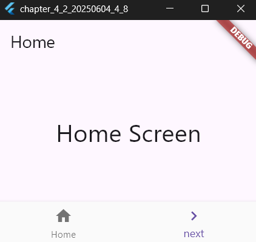

# 4-2: ナビゲーションとルーティング


`main.dartのソースコード(Navigatorで移動する)`
```dart
// Flutterの基本パッケージをインポート
import 'package:flutter/material.dart';

// アプリのエントリーポイント（アプリを実行する関数）
void main() {
  runApp(MyApp()); // MyAppウィジェットを実行してアプリを開始
}

// アプリ全体を定義するステートレスウィジェット
class MyApp extends StatelessWidget {
  const MyApp({super.key}); // コンストラクタでキーを初期化

  @override
  Widget build(BuildContext context) {
    // MaterialAppはアプリの基本設定（タイトルやテーマ）を提供
    return MaterialApp(
      title: 'Generated App', // アプリのタイトルを設定
      theme: ThemeData(
        primarySwatch: Colors.blue, // アプリ全体のテーマカラー
        primaryColor: const Color(0xff2196f3), // プライマリカラー
        canvasColor: const Color(0xfffafafa), // 画面の背景色
      ),
      home: FirstScreen(), // 最初に表示する画面を指定
    );
  }
}

// 最初の画面（ホーム画面）を定義
class FirstScreen extends StatelessWidget {
  const FirstScreen({super.key}); // コンストラクタでキーを初期化

  @override
  Widget build(BuildContext context) {
    return Scaffold(
      appBar: AppBar(title: const Text('Home')), // 上部に「Home」と表示
      body: Center(
        // 画面中央にテキストを表示
        child: const Text('Home Screen', style: TextStyle(fontSize: 32.0)),
      ),
      bottomNavigationBar: BottomNavigationBar(
        currentIndex: 1, // 最初に選択されているアイテム（インデックス）
        items: <BottomNavigationBarItem>[
          // ナビゲーションバーの「Home」アイテム
          const BottomNavigationBarItem(
            label: 'Home', // アイテムラベル
            icon: Icon(Icons.home, size: 32), // アイコンとサイズを指定
          ),
          // ナビゲーションバーの「next」アイテム
          const BottomNavigationBarItem(
            label: 'next', // アイテムラベル
            icon: Icon(Icons.navigate_next, size: 32), // アイコンとサイズを指定
          ),
        ],
        // アイテムがタップされたときの処理
        onTap: (int value) {
          if (value == 1) {
            // 2つ目の画面（SecondScreen）に遷移
            Navigator.push(
              context,
              MaterialPageRoute(builder: (context) => SecondScreen()),
            );
          }
        },
      ),
    );
  }
}

// 2つ目の画面（次の画面）を定義
class SecondScreen extends StatelessWidget {
  const SecondScreen({super.key}); // コンストラクタでキーを初期化

  @override
  Widget build(BuildContext context) {
    return Scaffold(
      appBar: AppBar(title: const Text("Next")), // 上部に「Next」と表示
      body: Center(
        // 画面中央にテキストを表示
        child: const Text('Next Screen', style: TextStyle(fontSize: 32.0)),
      ),
      bottomNavigationBar: BottomNavigationBar(
        currentIndex: 0, // 最初に選択されているアイテム（インデックス）
        items: <BottomNavigationBarItem>[
          // ナビゲーションバーの「prev」アイテム
          const BottomNavigationBarItem(
            label: 'prev', // アイテムラベル
            icon: Icon(Icons.navigate_before, size: 32), // アイコンとサイズを指定
          ),
          // ナビゲーションバーの「?」アイテム
          const BottomNavigationBarItem(
            label: '?', // アイテムラベル
            icon: Icon(Icons.android, size: 32), // アイコンとサイズを指定
          ),
        ],
        // アイテムがタップされたときの処理
        onTap: (int value) {
          if (value == 0) {
            // 前の画面（FirstScreen）に戻る
            Navigator.pop(context);
          }
        },
      ),
    );
  }
}
```

【 実行画面 】


> Navigatorクラスについて
- 移動先のウィジェットを追加　➡　ウィジェットの表示切替
- 保管したウィジェットの取出　➡　ウィジェットに表示戻し
- Last In First Out または、First In Last Out の方式を利用している

`main.dartのソースコード(MaterialPageRouteについて)`
```dart
// Flutterの基本パッケージをインポート
import 'package:flutter/material.dart';

// アプリのエントリーポイント（最初に実行される関数）
void main() {
  runApp(MyApp()); // MyAppウィジェットをアプリとして実行
}

// アプリ全体を定義するステートレスウィジェット
class MyApp extends StatelessWidget {
  const MyApp({super.key}); // コンストラクタでキーを初期化

  @override
  Widget build(BuildContext context) {
    // MaterialAppはアプリの基本設定（タイトルやテーマ）を提供
    return MaterialApp(
      title: 'Generated App', // アプリのタイトルを設定
      theme: ThemeData(
        primarySwatch: Colors.blue, // アプリ全体のテーマカラー
        primaryColor: const Color(0xff2196f3), // プライマリカラー
        canvasColor: const Color(0xfffafafa), // 画面の背景色
      ),
      home: FirstScreen(), // 最初に表示する画面を指定
    );
  }
}

// 最初の画面（ホーム画面）を定義
class FirstScreen extends StatefulWidget {
  const FirstScreen({super.key}); // コンストラクタ

  @override
  // 状態管理のためのクラスを生成
  _FirstScreenState createState() => _FirstScreenState();
}

// ホーム画面の状態を管理するクラス
class _FirstScreenState extends State<FirstScreen> {
  static final _controller = TextEditingController(); // テキストフィールドのコントローラー
  static var _input = ''; // 入力された文字列を保持

  @override
  Widget build(BuildContext context) {
    return Scaffold(
      appBar: AppBar(title: Text('Home')), // 上部のバーにタイトルを表示
      body: Column(
        children: <Widget>[
          // ホーム画面のタイトルテキストを表示
          const Text('Home Screen', style: TextStyle(fontSize: 32.0)),
          Padding(
            padding: const EdgeInsets.all(20.0), // テキストフィールド周りの余白を設定
            child: TextField(
              controller: _controller, // 入力データを保持するコントローラーを指定
              style: const TextStyle(fontSize: 28.0), // テキストの見た目を設定
              onChanged: changeField, // 入力が変更された時に処理を呼び出す
            ),
          ),
        ],
      ),
      bottomNavigationBar: BottomNavigationBar(
        currentIndex: 1, // 現在選択されているアイテム（インデックス）
        items: <BottomNavigationBarItem>[
          // ナビゲーションバーの「Home」アイテム
          const BottomNavigationBarItem(label: 'Home', icon: Icon(Icons.home)),
          // ナビゲーションバーの「next」アイテム
          const BottomNavigationBarItem(
            label: 'next',
            icon: Icon(Icons.navigate_next),
          ),
        ],
        // アイテムがタップされた時の処理を設定
        onTap: (int value) {
          if (value == 1) {
            // 入力値を次の画面に渡して遷移
            Navigator.push(
              context,
              MaterialPageRoute(builder: (context) => SecondScreen(_input)),
            );
          }
        },
      ),
    );
  }

  // テキストフィールドの内容を更新する関数
  void changeField(String val) => _input = val; // 入力された文字列を保存
}

// 次の画面（2つ目の画面）を定義
class SecondScreen extends StatelessWidget {
  final String _value; // 前の画面から受け取った値を保持

  const SecondScreen(this._value, {super.key}); // コンストラクタで値を初期化

  @override
  Widget build(BuildContext context) {
    return Scaffold(
      appBar: AppBar(title: const Text("Next")), // 上部に「Next」と表示
      body: Center(
        // 中央に渡された値を表示
        child: Text(
          'you typed: "$_value".',
          style: const TextStyle(fontSize: 32.0),
        ),
      ),
      bottomNavigationBar: BottomNavigationBar(
        currentIndex: 0, // 現在選択されているアイテム（インデックス）
        items: <BottomNavigationBarItem>[
          // ナビゲーションバーの「prev」アイテム
          BottomNavigationBarItem(
            label: 'prev',
            icon: const Icon(Icons.navigate_before),
          ),
          // ナビゲーションバーの「?」アイテム
          BottomNavigationBarItem(label: '?', icon: const Icon(Icons.android)),
        ],
        // アイテムがタップされた時の処理を設定
        onTap: (int value) {
          if (value == 0) Navigator.pop(context); // 前の画面に戻る処理
        },
      ),
    );
  }
}
```

【 実行画面 】


`main.dartのソースコード(routesについて)`
```dart
// Flutterの基本パッケージをインポート
import 'package:flutter/material.dart';

// アプリのエントリーポイント（最初に実行される関数）
void main() {
  runApp(MyApp()); // MyAppウィジェットを実行してアプリを起動
}

// アプリ全体を定義するステートレスウィジェット
class MyApp extends StatelessWidget {
  const MyApp({super.key}); // コンストラクタでキーを初期化

  @override
  Widget build(BuildContext context) {
    // MaterialAppを使ってアプリの基本設定を提供
    return MaterialApp(
      title: 'Generated App', // アプリのタイトルを設定
      theme: ThemeData(
        primarySwatch: Colors.blue, // プライマリカラーの設定
        primaryColor: const Color(0xff2196f3), // メインカラー
        canvasColor: const Color(0xfffafafa), // 背景色
      ),
      initialRoute: '/', // 初期表示のルートを指定
      routes: {
        '/': (context) => FirstScreen(), // 最初の画面（ホーム画面）を設定
        '/second': (context) => SecondScreen('Second'), // 2つ目の画面を設定
        '/third': (context) => SecondScreen('Third'), // 3つ目の画面を設定
      },
    );
  }
}

// 最初の画面（ホーム画面）を定義
class FirstScreen extends StatelessWidget {
  const FirstScreen({super.key}); // コンストラクタでキーを初期化

  @override
  Widget build(BuildContext context) {
    // 画面の構造を定義
    return Scaffold(
      appBar: AppBar(title: Text('Home')), // 上部バーに「Home」と表示
      body: Center(
        // 中央にテキストを表示
        child: const Text('Home Screen', style: TextStyle(fontSize: 32.0)),
      ),
      // 下部にナビゲーションバーを追加
      bottomNavigationBar: BottomNavigationBar(
        currentIndex: 1, // 現在選択されているアイテムのインデックス
        items: <BottomNavigationBarItem>[
          // ナビゲーションバーの「Home」アイテム
          BottomNavigationBarItem(
            label: 'Home',
            icon: const Icon(Icons.home),
          ),
          // ナビゲーションバーの「next」アイテム
          BottomNavigationBarItem(
            label: 'next',
            icon: const Icon(Icons.navigate_next),
          ),
        ],
        // アイテムがタップされた時の処理
        onTap: (int value) {
          if (value == 1) Navigator.pushNamed(context, '/second'); // 「next」を押すと2つ目の画面へ
        },
      ),
    );
  }
}

// 2つ目の画面（動的なコンテンツを受け取る）
class SecondScreen extends StatelessWidget {
  final String _value; // 前の画面から受け取った値
  const SecondScreen(this._value, {super.key}); // コンストラクタで値を初期化

  @override
  Widget build(BuildContext context) {
    return Scaffold(
      appBar: AppBar(title: Text("Next")), // 上部バーに「Next」と表示
      body: Center(
        // 中央に受け取った値を表示
        child: Text('$_value Screen', style: const TextStyle(fontSize: 32.0)),
      ),
      // 下部にナビゲーションバーを追加
      bottomNavigationBar: BottomNavigationBar(
        currentIndex: 0, // 現在選択されているアイテムのインデックス
        items: <BottomNavigationBarItem>[
          // ナビゲーションバーの「prev」アイテム
          BottomNavigationBarItem(
            label: 'prev',
            icon: const Icon(Icons.navigate_before),
          ),
          // ナビゲーションバーの「?」アイテム
          BottomNavigationBarItem(
            label: '?',
            icon: const Icon(Icons.android),
          ),
        ],
        // アイテムがタップされた時の処理
        onTap: (int value) {
          if (value == 0) Navigator.pop(context); // 「prev」を押すと前の画面に戻る
          if (value == 1) Navigator.pushNamed(context, '/third'); // 「?」を押すと3つ目の画面へ
        },
      ),
    );
  }
}
```

【 実行画面 】




> routesの定義について
- 起動時に「'/'」を指定することで最初に表示されるウィジェットが表示される
> pushNamedについて
- routesを利用する場合、ページ移動にNavigatorのpushは利用せずに、pushNamedメソッドを使用する。
