# 4-3: タブビューとドロワー

2025年6月10日
### 今日のキーワード： 「しゃけ（音楽は１曲ずつ選んで聞くタイプです！）」➡しゃけ（鮭）は、川で生まれ、海へ旅立つ冒険者で、川で生まれたあとに海へ出て成長し、再び自分が生まれた川に戻って産卵する特性がある。この行動は「母川回帰」と呼ばれていて、驚くべきナビゲーション能力。ピンクの身の秘密として、実は鮭は「白身魚」なんだ。でも、食べるエサ（特に甲殻類に含まれるアスタキサンチンという色素）のおかげで、その身がピンク色になります。「さけ」と「しゃけ」の違いは、日本語では「さけ」も「しゃけ」も使われるが、「しゃけ」は特に調理済みや食卓に出される状態を指すことが多い。サケ科には「サケ」だけでなく「マス」も含まれる。海で生活するものを「サケ」、淡水だけで育つものを「マス」と呼ぶことが多い。

---
　

`main.dartのソースコード(タブを利用する)`
```dart
import 'package:flutter/material.dart'; // FlutterのUIを作成するためのパッケージ

// アプリのエントリーポイント
void main() {
  runApp(MyApp()); // MyAppというウィジェットをルートとしてアプリを起動
}

// アプリ全体を構築するためのStatelessWidget
class MyApp extends StatelessWidget {
  const MyApp({super.key}); // 必要なら一意のキーを渡すコンストラクタ

  @override
  Widget build(BuildContext context) {
    return MaterialApp(
      title: 'Generated App', // アプリのタイトル（例: ヘッダーやタスクマネージャーに表示）
      theme: ThemeData(
        primarySwatch: Colors.blue, // メインテーマカラー（青）
        primaryColor: const Color(0xff2196f3), // プライマリカラーのカスタム設定
        canvasColor: const Color(0xfffafafa), // 背景色の設定
      ),
      home: MyHomePage(), // アプリのメイン画面にMyHomePageウィジェットを指定
    );
  }
}

// メイン画面を構築するためのStatefulWidget
class MyHomePage extends StatefulWidget {
  const MyHomePage({super.key}); // 必要なら一意のキーを渡すコンストラクタ

  @override
  // StatefulWidgetに必要な状態管理クラスを生成
  // ignore: library_private_types_in_public_api
  _MyHomePageState createState() => _MyHomePageState();
}

// StatefulWidgetの状態を管理するクラス
class _MyHomePageState extends State<MyHomePage>
    with SingleTickerProviderStateMixin {
  // タブに表示する項目のリストを定義
  static const List<Tab> tabs = <Tab>[
    Tab(text: 'One'), // 最初のタブの名前
    Tab(text: 'Two'), // 二つ目のタブの名前
    Tab(text: 'Three'), // 三つ目のタブの名前
  ];

  late TabController _tabController; // タブを管理するためのコントローラー

  @override
  void initState() {
    super.initState();
    // TabControllerを初期化（vsyncはアニメーション管理のために必須）
    _tabController = TabController(vsync: this, length: tabs.length);
  }

  @override
  Widget build(BuildContext context) {
    return Scaffold(
      appBar: AppBar(
        title: Text('My App'), // アプリのヘッダー部分に表示されるタイトル
        bottom: TabBar(controller: _tabController, tabs: tabs), // タブバーを追加
      ),
      // タブごとのコンテンツを表示
      body: TabBarView(
        controller: _tabController, // タブの切り替えを管理
        children:
            tabs.map((Tab tab) {
              return createTab(tab); // 各タブの内容を作成
            }).toList(),
      ),
    );
  }

  // 各タブの内容を生成するための関数
  Widget createTab(Tab tab) {
    return Center(
      child: Text(
        'This is "${tab.text}" Tab.', // タブの名前を表示
        style: const TextStyle(fontSize: 32.0, color: Colors.blue), // テキストのスタイル
      ),
    );
  }
}
```

【 実行画面 】

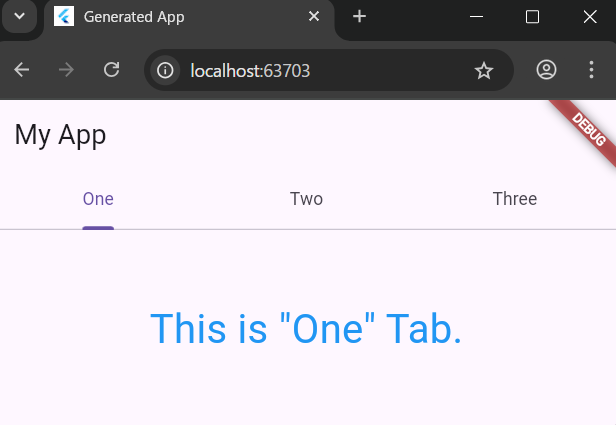
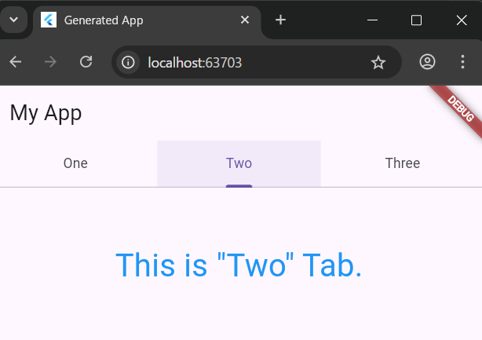
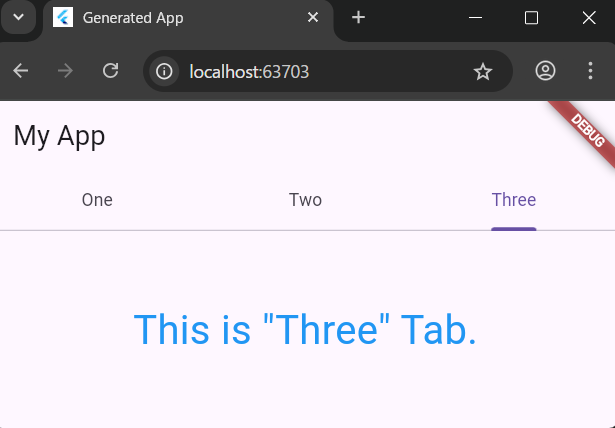

> TabBarとTabBarViewについて
- FlutterStudioのMaterialに用意されている。TabControllerというクラスをTabBarとTabcontrollerの両方に設定すると両者の操作が連動する。


`main.dartのソースコード(画面下部にタブバーを表示する)`
```dart
import 'package:flutter/material.dart'; // FlutterのUIを構築するためのパッケージをインポート

// アプリケーションのエントリーポイント
void main() {
  runApp(MyApp()); // MyAppウィジェットをアプリとして実行
}

// StatelessWidgetを使ってアプリの基本構造を定義
class MyApp extends StatelessWidget {
  const MyApp({super.key}); // コンストラクタ（オブジェクト生成時にキーを渡す）

  @override
  Widget build(BuildContext context) {
    return MaterialApp(
      title: 'Generated App', // アプリのタイトル
      theme: ThemeData(
        primarySwatch: Colors.blue, // メインの色テーマ（青系のカラーパレット）
        primaryColor: const Color(0xff2196f3), // プライマリカラーを明示的に指定
        canvasColor: const Color(0xfffafafa), // 背景色を設定
      ),
      home: MyHomePage(), // 初期画面としてMyHomePageを指定
    );
  }
}

// StatefulWidgetを使って動的な画面を作成
class MyHomePage extends StatefulWidget {
  const MyHomePage({super.key}); // コンストラクタ（オブジェクト生成時にキーを渡す）

  @override
  // ignore: library_private_types_in_public_api
  _MyHomePageState createState() => _MyHomePageState(); // 状態管理用クラスを生成
}

// 動的な状態管理を行うクラス
class _MyHomePageState extends State<MyHomePage>
    with SingleTickerProviderStateMixin {
  // タブバーで使うタブのリスト
  static const List<Tab> tabs = <Tab>[
    Tab(text: 'One', icon: Icon(Icons.star)), // タブ1: 星アイコン
    Tab(text: 'Two', icon: Icon(Icons.info)), // タブ2: 情報アイコン
    Tab(text: 'Three', icon: Icon(Icons.home)), // タブ3: 家アイコン
  ];

  late TabController _tabController; // タブの動作を管理するコントローラー

  @override
  void initState() {
    super.initState();
    // タブコントローラーを初期化（vsyncを提供することでアニメーションを有効化）
    _tabController = TabController(vsync: this, length: tabs.length);
  }

  @override
  Widget build(BuildContext context) {
    return Scaffold(
      appBar: AppBar(
        title: Text('My App'), // アプリのタイトルを表示
        bottom: TabBar(controller: _tabController, tabs: tabs), // タブバーをアプリバーに追加
      ),
      // タブごとのビューを表示するためのエリア
      body: TabBarView(
        controller: _tabController, // タブのビュー管理用コントローラーを指定
        children:
            tabs.map((Tab tab) {
              return createTab(tab); // 各タブのビューを生成
            }).toList(),
      ),
    );
  }

  // タブごとの内容を表示するウィジェット
  Widget createTab(Tab tab) {
    return Center(
      child: Text(
        'This is "${tab.text}" Tab.', // タブの名前を画面中央に表示
        style: const TextStyle(fontSize: 32.0, color: Colors.blue), // テキストスタイル
      ),
    );
  }
}
```

【 実行画面 】

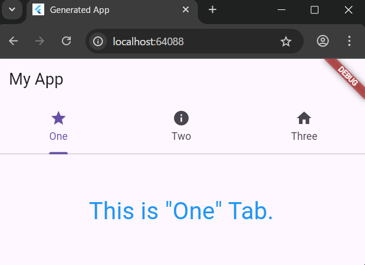
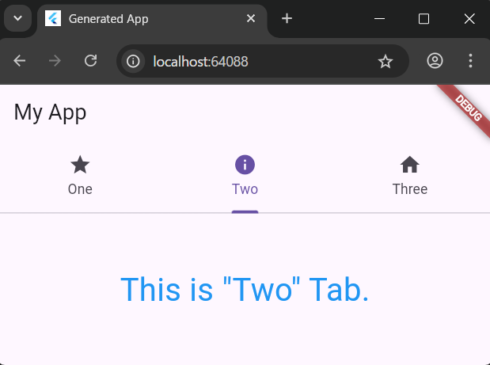
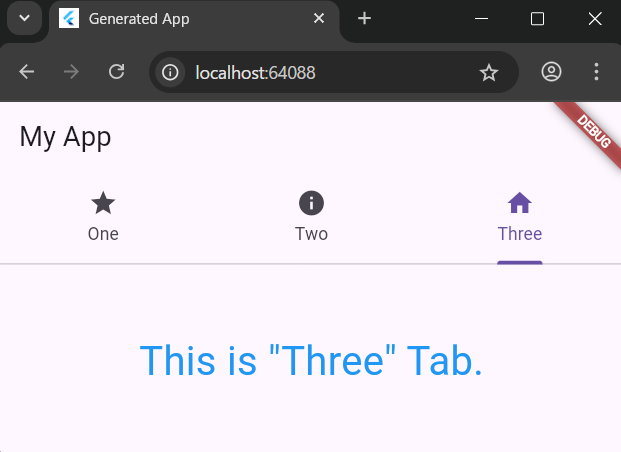


`main.dartのソースコード(タブバーの表示変更)`
```dart
import 'package:flutter/material.dart'; // FlutterのUIを構築するためのパッケージをインポート

// アプリのエントリーポイント
void main() {
  runApp(MyApp()); // MyAppウィジェットをアプリとして起動
}

// アプリ全体を管理するStatelessWidget
class MyApp extends StatelessWidget {
  const MyApp({super.key}); // コンストラクタ

  @override
  Widget build(BuildContext context) {
    return MaterialApp(
      title: 'Generated App', // アプリのタイトル（例: ウィンドウタイトルに使われる）
      theme: ThemeData(
        primarySwatch: Colors.blue, // メインのカラーテーマとして青色を設定
        primaryColor: const Color(0xff2196f3), // プライマリカラーを明示的に指定
        canvasColor: const Color(0xfffafafa), // 背景色を指定
      ),
      home: MyHomePage(), // 初期画面としてMyHomePageを設定
    );
  }
}

// StatefulWidgetで動的な画面を構築する
class MyHomePage extends StatefulWidget {
  const MyHomePage({super.key}); // コンストラクタ

  @override
  // ignore: library_private_types_in_public_api
  _MyHomePageState createState() => _MyHomePageState(); // 状態管理用クラスを生成
}

// _MyHomePageStateがMyHomePageの動的なロジックを管理
class _MyHomePageState extends State<MyHomePage>
    with SingleTickerProviderStateMixin {
  // タブの定義
  static const List<Tab> tabs = <Tab>[
    Tab(text: 'One', icon: Icon(Icons.star)), // タブ1: 星アイコン付き
    Tab(text: 'Two', icon: Icon(Icons.info)), // タブ2: 情報アイコン付き
    Tab(text: 'Three', icon: Icon(Icons.home)), // タブ3: 家アイコン付き
  ];

  late TabController _tabController; // タブを操作するコントローラー

  @override
  void initState() {
    super.initState();
    _tabController = TabController(
      vsync: this,
      length: tabs.length,
    ); // タブコントローラーを初期化
  }

  @override
  Widget build(BuildContext context) {
    return Scaffold(
      appBar: AppBar(title: Text('My App')), // 上部に表示されるアプリバー
      bottomNavigationBar: Container(
        color: Colors.blue, // ナビゲーションバーの背景色
        child: TabBar(controller: _tabController, tabs: tabs), // タブを表示する
      ),
      body: TabBarView(
        controller: _tabController, // タブのビューを管理するコントローラー
        children:
            tabs.map((Tab tab) {
              return createTab(tab); // 各タブのビューを生成
            }).toList(),
      ),
    );
  }

  // タブの内容を生成
  Widget createTab(Tab tab) {
    return Center(
      child: Text(
        'This is "${tab.text}" Tab.', // タブの内容を表示
        style: const TextStyle(fontSize: 32.0, color: Colors.blue), // テキストのスタイル
      ),
    );
  }
}
```

【 実行画面 】

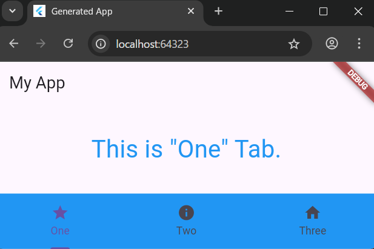
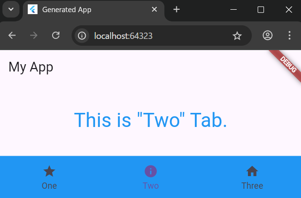
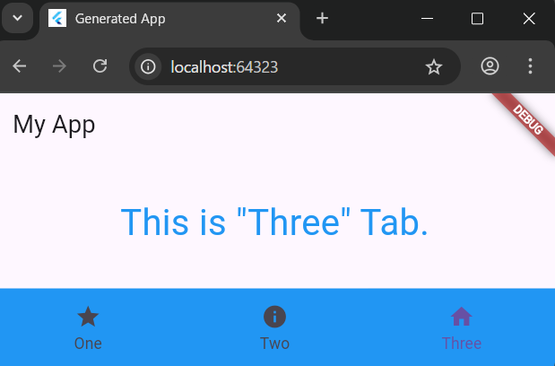

> Containerを使わずに直接TabBarを追加する
- 白い背景になってしまうので注意すること。


`main.dartのソースコード(Drawerについて)`
```dart
import 'package:flutter/material.dart';

// アプリのエントリーポイント
void main() {
  runApp(MyApp()); // MyAppウィジェットをルートとしてアプリを起動
}

// アプリ全体の構造を定義するStatelessWidget
class MyApp extends StatelessWidget {
  const MyApp({super.key}); // コンストラクタ

  @override
  Widget build(BuildContext context) {
    return MaterialApp(
      title: 'Generated App', // アプリ名
      theme: ThemeData(
        primarySwatch: Colors.blue, // メインの色テーマ
        primaryColor: const Color(0xff2196f3), // プライマリカラーを明示的に設定
        canvasColor: const Color(0xfffafafa), // 背景色
      ),
      home: MyHomePage(), // メイン画面としてMyHomePageを指定
    );
  }
}

// メイン画面としてのステートフルウィジェット
class MyHomePage extends StatefulWidget {
  const MyHomePage({super.key}); // コンストラクタ

  @override
  // ウィジェットの状態を管理するためのクラスを生成
  _MyHomePageState createState() => _MyHomePageState();
}

class _MyHomePageState extends State<MyHomePage> {
  // ドロワーに表示するリストのアイテム
  static var _items = <Widget>[];
  // 中央に表示するメッセージ
  static var _message = 'ok.';
  // タップされたアイテムの番号
  static var _tapped = 0;

  @override
  void initState() {
    super.initState();
    // リストアイテムを初期化
    for (var i = 0; i < 5; i++) {
      var item = ListTile(
        leading: const Icon(Icons.android), // アイコンを表示
        title: Text('No, $i'), // 各リストアイテムのタイトル
        onTap: () {
          _tapped = i; // タップされたアイテム番号を保存
          tapItem(); // アイテムタップ時の処理を実行
        },
      );
      _items.add(item); // アイテムをリストに追加
    }
  }

  @override
  Widget build(BuildContext context) {
    return Scaffold(
      appBar: AppBar(title: const Text('Flutter App')), // 上部のアプリバー
      body: Center(
        child: Text(
          _message, // 中央に表示するメッセージ
          style: const TextStyle(fontSize: 32.0), // テキストのスタイル
        ),
      ),
      drawer: Drawer(
        child: ListView(
          shrinkWrap: true, // ドロワー全体を縮小して表示
          padding: const EdgeInsets.all(20.0), // パディングを設定
          children: _items, // アイテムリストを表示
        ),
      ),
    );
  }

  // アイテムがタップされたときの処理
  void tapItem() {
    Navigator.pop(context); // ドロワーを閉じる
    setState(() {
      _message = 'tapped:[$_tapped]'; // 新しいメッセージを設定
    });
  }
}
```

【 実行画面 】

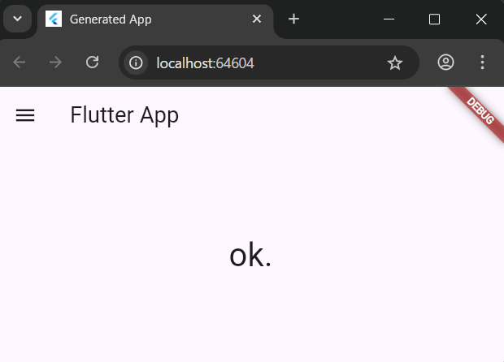
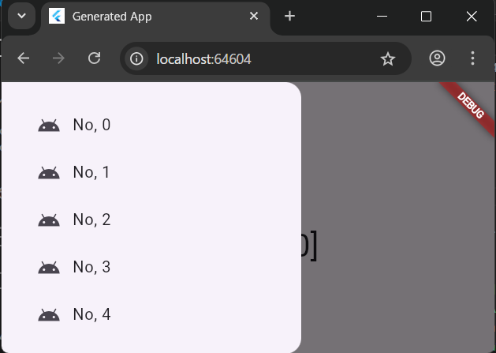
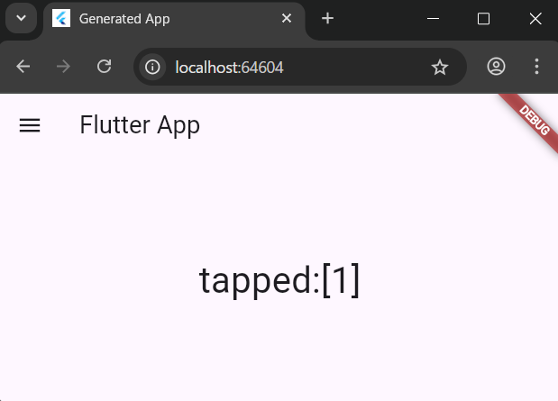

> drawerについて
- 「三」このようなリストを表示するアイコンのこと。ScaffoldのdrawerにDrawerというウィジェットを組み込んで作成する。その中にListViewを組み込んで作成する。