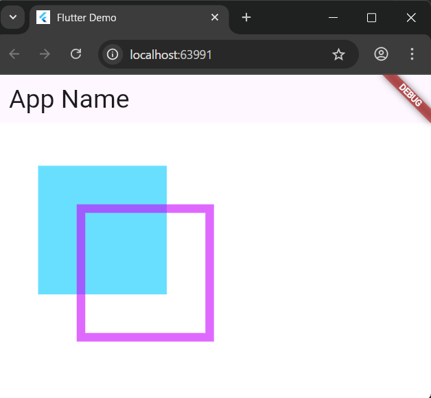
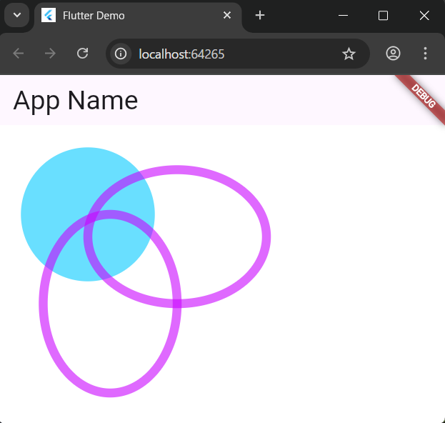
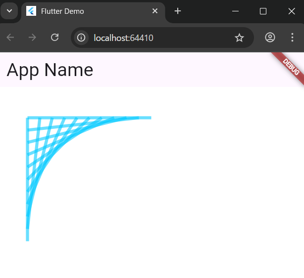
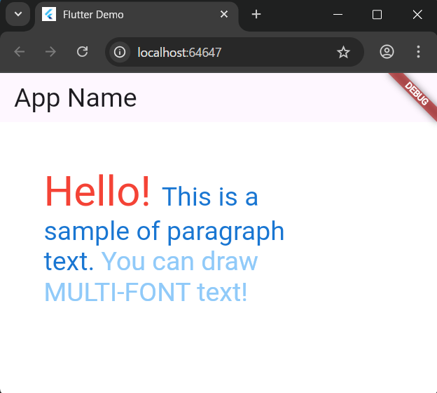

# 5-1: グラフィック描画の基本

2025年7月15日
### 今日のキーワード： 「たこやき」➡たこ焼きは1935年ごろに大阪の会津屋で生まれたと言われている。当時は「ラジオ焼き」という名前で、タコの代わりにコンニャクや牛肉が入っていた。タコを使い始めてから、今の「たこ焼き」の形が完成しました。

---
  
`main.dartのソースコード(custompainterを作成する)`
```dart
import 'package:flutter/material.dart';

// エントリーポイント（アプリの実行を開始する場所）
void main() {
  runApp(const MyApp());
}

// アプリケーション全体を表すクラス
class MyApp extends StatelessWidget {
  const MyApp({super.key});

  // アプリの最初に表示される部分を構築
  @override
  Widget build(BuildContext context) {
    return MaterialApp(
      title: 'Flutter Demo', // アプリのタイトル
      theme: ThemeData(
        colorScheme: ColorScheme.fromSeed(seedColor: Colors.deepPurple), // テーマカラーの設定
      ),
      home: const MyHomePage(title: 'Flutter Demo Home Page'), // ホーム画面を設定
    );
  }
}

// アプリのホーム画面を定義するウィジェット
class MyHomePage extends StatefulWidget {
  const MyHomePage({super.key, required this.title});

  final String title;

  @override
  State<MyHomePage> createState() => _MyHomePageState();
}

// ホーム画面の状態管理をするクラス
class _MyHomePageState extends State<MyHomePage> {
  @override
  Widget build(BuildContext context) {
    return Scaffold(
      backgroundColor: Color.fromARGB(255, 255, 255, 255), // 背景色を白に設定
      appBar: AppBar(
        title: Text('App Name', style: TextStyle(fontSize: 30.0)), // アプリのタイトルバー
      ),
      body: Container(
        child: CustomPaint(painter: MyPainter()), // 描画エリアを定義（CustomPainterを使う）
      ),
    );
  }
}

// 描画のためのクラス（カスタムペイント）
class MyPainter extends CustomPainter {
  @override
  void paint(Canvas canvas, Size size) {
    Paint p = Paint(); // 描画に使うペイントツールを作成

    // 1つ目の四角形を描画
    p.style = PaintingStyle.fill; // 塗りつぶしのスタイルを設定
    p.color = Color.fromARGB(150, 0, 200, 255); // 塗りつぶしの色を設定（半透明の青）
    Rect r = Rect.fromLTWH(50.0, 50.0, 150.0, 150.0); // 四角形の座標と大きさを指定
    canvas.drawRect(r, p); // 四角形をキャンバスに描画

    // 2つ目の四角形を描画
    p.style = PaintingStyle.stroke; // 枠線のスタイルを設定
    p.color = Color.fromARGB(150, 200, 0, 255); // 枠線の色を設定（半透明の紫）
    p.strokeWidth = 10.0; // 枠線の太さを設定
    r = Rect.fromLTWH(100.0, 100.0, 150.0, 150.0); // 四角形の新しい位置と大きさを指定
    canvas.drawRect(r, p); // 四角形をキャンバスに描画
  }

  @override
  bool shouldRepaint(CustomPainter oldDelegate) => true; // 再描画するかどうかを指定
}
```

【 実行画面 】


---

`main.dartのソースコード(drawClircle/drawOval)`
```dart
import 'package:flutter/material.dart';

// アプリのエントリーポイント
void main() {
  runApp(const MyApp());
}

// アプリ全体を定義するクラス
class MyApp extends StatelessWidget {
  const MyApp({super.key});

  // アプリの初期画面を設定
  @override
  Widget build(BuildContext context) {
    return MaterialApp(
      title: 'Flutter Demo', // アプリのタイトル
      theme: ThemeData(
        colorScheme: ColorScheme.fromSeed(seedColor: Colors.deepPurple), // アプリのテーマカラー
      ),
      home: const MyHomePage(title: 'Flutter Demo Home Page'), // メインの画面を表示
    );
  }
}

// メイン画面のウィジェットクラス
class MyHomePage extends StatefulWidget {
  const MyHomePage({super.key, required this.title});

  final String title;

  @override
  State<MyHomePage> createState() => _MyHomePageState();
}

// メイン画面の状態を管理するクラス
class _MyHomePageState extends State<MyHomePage> {
  @override
  Widget build(BuildContext context) {
    return Scaffold(
      backgroundColor: Color.fromARGB(255, 255, 255, 255), // 背景色を白に設定
      appBar: AppBar(
        title: Text('App Name', style: TextStyle(fontSize: 30.0)), // 上部バーのタイトル設定
      ),
      body: Container(
        child: CustomPaint(
          painter: MyPainter(), // カスタムペイントを使用して描画
        ),
      ),
    );
  }
}

// 描画用のカスタムクラス
class MyPainter extends CustomPainter {
  @override
  void paint(Canvas canvas, Size size) {
    Paint p = Paint(); // 描画に使う「筆」を作成

    // 1. 正円の描画
    p.style = PaintingStyle.fill; // 塗りつぶしスタイルを設定
    p.color = Color.fromARGB(150, 0, 200, 255); // 塗りつぶしの色を設定（透明な青）
    Offset ctr = Offset(100.0, 100.0); // 円の中心座標を指定
    canvas.drawCircle(ctr, 75.0, p); // 円を描画（半径は75.0）

    // 2. 最初の楕円の描画
    p.style = PaintingStyle.stroke; // 枠線スタイルを設定
    p.color = Color.fromARGB(150, 200, 0, 255); // 枠線の色を設定（透明な紫）
    p.strokeWidth = 10.0; // 枠線の太さを設定
    Rect r = Rect.fromLTWH(100.0, 50.0, 200.0, 150.0); // 楕円の範囲を矩形で指定
    canvas.drawOval(r, p); // 楕円を描画

    // 3. もう一つの楕円を描画
    r = Rect.fromLTWH(50.0, 100.0, 150.0, 200.0); // 新しい矩形を指定
    canvas.drawOval(r, p); // 楕円を描画
  }

  @override
  bool shouldRepaint(CustomPainter oldDelegate) => true; // 再描画を許可する設定
}
```

【 実行画面 】


---

`main.dartのソースコード(custompainterを作成する)`
```dart
import 'package:flutter/material.dart';

// アプリケーションのエントリーポイント
void main() {
  runApp(const MyApp());
}

// アプリ全体を構築するクラス
class MyApp extends StatelessWidget {
  const MyApp({super.key});

  // アプリのメインウィジェットを返す
  @override
  Widget build(BuildContext context) {
    return MaterialApp(
      title: 'Flutter Demo', // アプリのタイトル
      theme: ThemeData(
        colorScheme: ColorScheme.fromSeed(seedColor: Colors.deepPurple), // テーマカラーを設定
      ),
      home: const MyHomePage(title: 'Flutter Demo Home Page'), // 初期画面を設定
    );
  }
}

// ホーム画面ウィジェット
class MyHomePage extends StatefulWidget {
  const MyHomePage({super.key, required this.title});

  final String title;

  @override
  State<MyHomePage> createState() => _MyHomePageState();
}

// ホーム画面の状態管理クラス
class _MyHomePageState extends State<MyHomePage> {
  @override
  Widget build(BuildContext context) {
    return Scaffold(
      backgroundColor: Color.fromARGB(255, 255, 255, 255), // 背景を白に設定
      appBar: AppBar(
        title: Text('App Name', style: TextStyle(fontSize: 30.0)), // ヘッダーに表示するタイトル
      ),
      body: Container(
        child: CustomPaint(
          painter: MyPainter(), // カスタムペイントを使用して描画
        ),
      ),
    );
  }
}

// 描画処理を行うカスタムペインタクラス
class MyPainter extends CustomPainter {
  @override
  void paint(Canvas canvas, Size size) {
    Paint p = Paint(); // 描画するためのペイント（ツール）を作成

    p.style = PaintingStyle.stroke; // 線描画のスタイルを設定
    p.strokeWidth = 5.0; // 線の太さを設定
    p.color = Color.fromARGB(150, 0, 200, 255); // 線の色を設定（半透明の青）

    // 複数の線を描画するループ
    for (var i = 0; i <= 10; i++) { 
      // 矩形を定義し、それを基に線を描く
      Rect r = Rect.fromLTRB(
        50.0 + 20 * i, // 左上のX座標（右にずらしていく）
        50.0,          // 左上のY座標（固定）
        50.0,          // 右下のX座標（固定）
        250.0 - 20 * i // 右下のY座標（上にずらしていく）
      );

      // 矩形の左上（topLeft）から右下（bottomRight）への線を描画
      canvas.drawLine(r.topLeft, r.bottomRight, p);
    }
  }

  @override
  bool shouldRepaint(CustomPainter oldDelegate) => true; // 再描画を許可する
}
```

【 実行画面 】


---

`main.dartのソースコード(custompainterを作成する)`
```dart
import 'package:flutter/material.dart';
import 'dart:ui' as ui; // Flutterの低レベルなグラフィックAPIを使用

// アプリのエントリーポイント
void main() {
  runApp(const MyApp());
}

// アプリ全体を構築するクラス
class MyApp extends StatelessWidget {
  const MyApp({super.key});

  // アプリのメインウィジェットを返す
  @override
  Widget build(BuildContext context) {
    return MaterialApp(
      title: 'Flutter Demo', // アプリのタイトル
      theme: ThemeData(
        colorScheme: ColorScheme.fromSeed(seedColor: Colors.deepPurple), // アプリのテーマカラー
      ),
      home: const MyHomePage(title: 'Flutter Demo Home Page'), // 初期画面を設定
    );
  }
}

// ホーム画面ウィジェット
class MyHomePage extends StatefulWidget {
  const MyHomePage({super.key, required this.title});

  final String title;

  @override
  State<MyHomePage> createState() => _MyHomePageState();
}

// ホーム画面の状態管理クラス
class _MyHomePageState extends State<MyHomePage> {
  @override
  Widget build(BuildContext context) {
    return Scaffold(
      backgroundColor: Color.fromARGB(255, 255, 255, 255), // 背景色を白に設定
      appBar: AppBar(
        title: Text('App Name', style: TextStyle(fontSize: 30.0)), // アプリのタイトル
      ),
      body: Container(
        child: CustomPaint(
          painter: MyPainter(), // 描画処理を担当するクラスを呼び出す
        ),
      ),
    );
  }
}

// 描画処理を行うカスタムペインタクラス
class MyPainter extends CustomPainter {
  @override
  void paint(Canvas canvas, Size size) {
    Paint p = Paint(); // 描画するためのツールを作成

    // 段落のビルダーを作成
    ui.ParagraphBuilder builder = ui.ParagraphBuilder(
        ui.ParagraphStyle(textDirection: TextDirection.ltr)) // テキストの方向を設定
      ..pushStyle(ui.TextStyle(color: Colors.red, fontSize: 48.0)) // スタイルを設定（赤色、大きな文字）
      ..addText('Hello! ') // テキスト「Hello!」を追加
      ..pushStyle(ui.TextStyle(color: Colors.blue[700], fontSize: 30.0)) // 次の部分のスタイルを設定（濃い青）
      ..addText('This is a sample of paragraph text. ') // テキストを追加
      ..pushStyle(ui.TextStyle(color: Colors.blue[200], fontSize: 30.0)) // 次の部分のスタイルを設定（薄い青）
      ..addText('You can draw MULTI-FONT text!'); // テキストを追加

    // 段落を構築し、描画するためのレイアウトを設定
    ui.Paragraph paragraph = builder.build()
      ..layout(ui.ParagraphConstraints(width: 300.0)); // 段落の幅を指定

    // 描画開始位置を指定
    Offset off = Offset(50.0, 50.0);
    canvas.drawParagraph(paragraph, off); // 段落をキャンバスに描画
  }

  @override
  bool shouldRepaint(CustomPainter oldDelegate) => true; // 再描画を許可
}
```

【 実行画面 】


---
