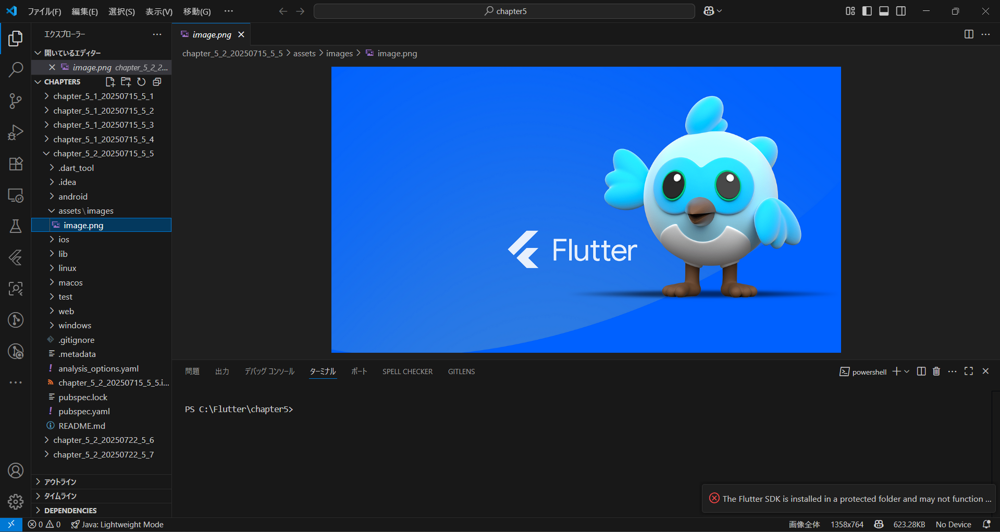
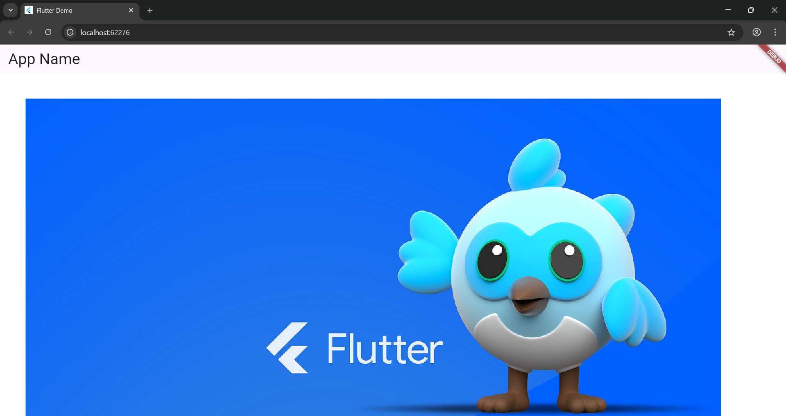
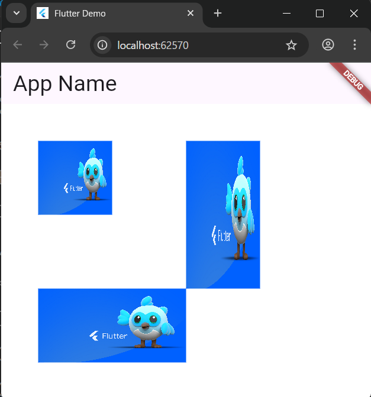

# 5-2: イメージの描画

2025年7月22日
### 今日のキーワード： 「そば」➡二八そば: そば粉が80%、つなぎの小麦粉が20%の割合で作られることからその名前が付けられました。「二八（にはち）」という響きが、職人の世界で親しまれています。そばの栄養価: そばには「ルチン」という成分が含まれていて、血管を丈夫にする効果があるとされています。健康食としても注目されている。そば切りの歴史: 昔はそばの実をそのまま食べることが多かったのですが、「そば切り」として細長い麺の形にしたのは16世紀以降のこと。この形状が広まり、今のようなそば文化が生まれたのです。わんこそばの由来: 岩手県のわんこそばは、もともとお祝い事で少量ずつ提供されたのが始まりで、どんどんおかわりする独特のスタイルが生まれました。さらに、そばを食べた後に出されるそば湯は、茹でた時に溶け出した栄養を摂れるので、最後まで楽しむべき一品です。

---
`pubspec.yamlのソースコード(イメージファイルの利用)`
```yaml
name: chapter_5_2_20250715_5_5  // Flutterプロジェクト名。プロジェクトを識別するために使用されます。
description: "A new Flutter project."  // プロジェクトの目的を簡単に説明しています。
publish_to: 'none'  // このプロジェクトはパッケージ登録庫に公開されないことを示します。
version: 1.0.0+1  // プロジェクトのバージョン情報。'1.0.0'はリリース番号、'+1'はビルド番号を表します。
environment:  // プロジェクトで必要なDart SDKバージョンを指定します。
  sdk: ^3.7.2  // '3.7.2'以上のDart機能が利用可能なバージョンを設定。
dependencies:  // プロジェクトに必要なライブラリ一覧。
  flutter:  // 'flutter'ライブラリは、Flutterアプリを構築するのに不可欠です。
    sdk: flutter  // Flutter SDKのバージョンを指定。
  cupertino_icons: ^1.0.8  // iOSスタイルのアイコンを提供するCupertino Iconsパッケージ。
dev_dependencies:  // 開発およびテストで必要なライブラリ一覧。
  flutter_test:  // Flutterアプリのテストを書くためのツールを提供します。
    sdk: flutter  // Flutter SDKとの互換性を保証。
  flutter_lints: ^5.0.0  // 推奨されるコーディングスタイルと規範を適用。
flutter:  // Flutterプロジェクト固有の設定。
  assets:  // カスタムアセット（画像やファイルなど）の追加。
    - assets/images/image.png  // プロジェクト内で使用する画像アセットへのパス。
  uses-material-design: true  // アプリのUIにMaterial Designスタイルを使用可能にします。
```

【 格納画面 】


> assetsフォルダに、imagesというフォルダを作成して、その中にimage.pngを格納して利用する。
---

`main.dartのソースコード(イメージを描画する)`
```dart
import 'package:flutter/material.dart'; // FlutterのUIを作るために必要な基本的な部品（ウィジェット）が揃っています。
import 'package:flutter/services.dart'; // アプリの「アセット（画像やフォントなど）」を読み込むために使います。
import 'dart:typed_data'; // バイナリデータ（コンピューターが直接理解できるデータ形式）を扱うために使います。
import 'dart:ui' as ui; // 画像の描画など、より低レベルなグラフィック処理を行うために使います。「ui」という短い名前で使えるようにしています。

// アプリケーションを起動するためのメイン関数です。
void main() {
  // MyAppというウィジェット（アプリの画面の元になる部品）を画面に表示するようFlutterに伝えます。
  runApp(const MyApp());
}

// アプリケーション全体の「設定」や「一番最初の画面」を決めるウィジェットです。
// このウィジェットは一度作られたらほとんど変化しないので、「StatelessWidget」（状態を持たないウィジェット）を使います。
class MyApp extends StatelessWidget {
  // コンストラクタ：MyAppウィジェットが作られるときに呼ばれます。
  const MyApp({super.key}); // 'super.key'はFlutterがウィジェットを識別するために使う特別なキーです。

  // このウィジェットが「どのように」画面に表示されるかを定義します。
  @override
  Widget build(BuildContext context) {
    // MaterialAppは、Googleの「マテリアルデザイン」に基づいたアプリを作るための基本的な枠組みを提供します。
    return MaterialApp(
      title: 'Flutter Demo', // アプリのタスクスイッチャー（アプリを切り替える画面）などに表示される名前です。
      theme: ThemeData( // アプリ全体のデザインテーマ（色、フォントなど）を設定します。
        // seedColorから色を生成するColorScheme（色の組み合わせ）を作ります。
        colorScheme: ColorScheme.fromSeed(seedColor: Colors.deepPurple),
      ),
      // アプリが最初に表示する画面（ホーム画面）を設定します。
      // MyHomePageというウィジェットをホーム画面として使います。
      home: const MyHomePage(title: 'Flutter Demo Home Page'),
    );
  }
}

// 実際のアプリの画面の中身を作るウィジェットです。
// このウィジェットは、表示する内容が時間とともに変化する可能性があるので、「StatefulWidget」（状態を持つウィジェット）を使います。
class MyHomePage extends StatefulWidget {
  // コンストラクタ：MyHomePageウィジェットが作られるときに呼ばれます。
  const MyHomePage({super.key, required this.title});

  final String title; // この画面のタイトル（AppBarに表示される）を保持する変数です。

  // このウィジェットの「状態（State）」を作るメソッドです。
  @override
  State<MyHomePage> createState() => _MyHomePageState();
}

// MyHomePageウィジェットの「状態」を管理するクラスです。
// ここで画面に表示するデータや、そのデータを変更するロジックを記述します。
class _MyHomePageState extends State<MyHomePage> {
  // _imgという変数に画像を保存します。最初は何も入っていません（null）。
  // 'static'は、このクラスの全てのインスタンスで共有されることを意味します。
  static ui.Image? _img = null;
  // _flgは、画像が読み込まれたかどうかを示すフラグ（真偽値）です。最初は「false」（まだ読み込まれていない）です。
  static bool _flg = false;

  // アセット（アプリ内に保存されているファイル）から画像を読み込む非同期関数です。
  // 'Future<void>'は、この関数が将来的に何も値を返さないことを意味します。
  // 'async'は、この関数が時間のかかる処理（ファイルの読み込みなど）を含むことを示します。
  Future<void> loadAssetImage(String fname) async {
    // 'rootBundle.load'を使って、指定されたパスのファイルをバイナリデータとして読み込みます。
    // 'await'は、この処理が終わるまで待つことを意味します。
    final bd = await rootBundle.load("assets/images/$fname");
    // 読み込んだバイナリデータをUint8List（8ビット符号なし整数リスト）に変換します。
    final Uint8List u8lst = await Uint8List.view(bd.buffer);
    // 画像データからImageCodec（画像をデコードするためのツール）を作成します。
    final codec = await ui.instantiateImageCodec(u8lst);
    // ImageCodecから最初のフレームの画像情報を取得します。
    final frameInfo = await codec.getNextFrame();
    // 取得した画像情報を_img変数に保存します。
    _img = frameInfo.image;
    // setStateを呼び出すことで、ウィジェットの状態が変更されたことをFlutterに伝え、画面を再描画させます。
    // _flgをtrueに設定し、画像が読み込まれたことを示します。
    setState(() => _flg = true);
  }

  // このウィジェットが「どのように」画面に表示されるかを定義します。
  @override
  Widget build(BuildContext context) {
    // 'image.png'という名前の画像を読み込みます。
    // ここで呼び出すことで、画面が表示されるときに画像が読み込まれます。
    loadAssetImage('image.png');

    // Scaffoldは、Material Designの基本的な視覚レイアウト構造（App Bar、Bodyなど）を提供します。
    return Scaffold(
      backgroundColor: Color.fromARGB(255, 255, 255, 255), // 画面の背景色を白に設定します。
      appBar: AppBar( // アプリの上部に表示されるバーです。
          title: Text('App Name', style: TextStyle(fontSize: 30.0))), // バーに表示するタイトルです。
      body: Container( // 画面の主要なコンテンツを表示する領域です。
          child: CustomPaint(painter: MyPainter(_img))), // CustomPaintを使って、MyPainterで定義したカスタム描画を行います。
    );
  }
}

// 自分で絵を描くためのクラスです。CustomPainterを継承して作ります。
class MyPainter extends CustomPainter {
  ui.Image? _img = null; // 描画する画像を保持する変数です。

  // コンストラクタ：MyPainterが作られるときに、描画する画像を受け取ります。
  MyPainter(this._img);

  // 実際に絵を描くメソッドです。
  // 'canvas'は絵を描くキャンバス、'size'はキャンバスのサイズです。
  @override
  void paint(Canvas canvas, Size size) {
    Paint p = Paint(); // 絵を描くための「絵の具」のようなものです。色やスタイルを設定できます。

    // 画像を描き始める位置（左上隅）を決めます。画面の左上から右に50.0、下に50.0の位置です。
    Offset off = Offset(50.0, 50.0);
    // もし画像が読み込まれていれば、キャンバスに画像を描画します。
    if (_img != null) {
      canvas.drawImage(_img!, off, p); // _img! は_imgがnullではないことを保証しています。
    }
  }

  // 画面を再描画する必要があるかどうかをFlutterに伝えるメソッドです。
  // 'true'を返すと、常に再描画されます。画像の読み込みが終わった後に再描画したいので、ここではtrueにしています。
  @override
  bool shouldRepaint(CustomPainter oldDelegate) => true;
}
```

【 実行画面 】


---

`main.dartのソースコード(領域を指定して描画する)`
```dart
import 'package:flutter/material.dart'; // FlutterのUI（ユーザーインターフェース）を作るために必要な基本的な部品（ウィジェット）が揃っています。
import 'package:flutter/services.dart'; // アプリの「アセット（画像やフォントなど、アプリに同梱されるファイル）」を読み込むために使います。
import 'dart:typed_data'; // バイナリデータ（コンピューターが直接理解できるデータ形式）を扱うために使います。
import 'dart:ui' as ui; // 画像の描画など、より低レベルなグラフィック処理を行うために使います。通常は長い名前ですが、「ui」という短い名前で使えるようにしています。

// アプリケーションを起動するためのメイン関数です。
void main() {
  // MyAppというウィジェット（アプリの画面の元になる部品）を画面に表示するようFlutterに伝えます。
  runApp(const MyApp());
}

// アプリケーション全体の「設定」や「一番最初の画面」を決めるウィジェットです。
// このウィジェットは一度作られたらほとんど変化しないので、「StatelessWidget」（状態を持たないウィジェット）を使います。
class MyApp extends StatelessWidget {
  // コンストラクタ：MyAppウィジェットが作られるときに呼ばれます。
  const MyApp({super.key}); // 'super.key'はFlutterがウィジェットを識別するために使う特別なキーです。

  // このウィジェットが「どのように」画面に表示されるかを定義します。
  @override
  Widget build(BuildContext context) {
    // MaterialAppは、Googleの「マテリアルデザイン」に基づいたアプリを作るための基本的な枠組みを提供します。
    return MaterialApp(
      title: 'Flutter Demo', // アプリのタスクスイッチャー（アプリを切り替える画面）などに表示される名前です。
      theme: ThemeData( // アプリ全体のデザインテーマ（色、フォントなど）を設定します。
        // seedColor（基準となる色）から、アプリで使う色の組み合わせ（ColorScheme）を自動的に作ります。
        colorScheme: ColorScheme.fromSeed(seedColor: Colors.deepPurple),
      ),
      // アプリが最初に表示する画面（ホーム画面）を設定します。
      // MyHomePageというウィジェットをホーム画面として使います。
      home: const MyHomePage(title: 'Flutter Demo Home Page'),
    );
  }
}

// 実際のアプリの画面の中身を作るウィジェットです。
// このウィジェットは、表示する内容が時間とともに変化する可能性があるので、「StatefulWidget」（状態を持つウィジェット）を使います。
class MyHomePage extends StatefulWidget {
  // コンストラクタ：MyHomePageウィジェットが作られるときに呼ばれます。
  const MyHomePage({super.key, required this.title});

  final String title; // この画面のタイトル（AppBarに表示される）を保持する変数です。

  // このウィジェットの「状態（State）」を作るメソッドです。
  // ここで、このウィジェットがどのように変化するかを管理するクラス（_MyHomePageState）を作成します。
  @override
  State<MyHomePage> createState() => _MyHomePageState();
}

// MyHomePageウィジェットの「状態」を管理するクラスです。
// ここで画面に表示するデータや、そのデータを変更するロジックを記述します。
class _MyHomePageState extends State<MyHomePage> {
  // _imgという変数に画像を保存します。最初は何も入っていません（null）。
  // 'static'は、このクラスの全てのインスタンスで共有されることを意味します。
  static ui.Image? _img = null;
  // _flgは、画像が読み込まれたかどうかを示すフラグ（真偽値）です。最初は「false」（まだ読み込まれていない）です。
  static bool _flg = false;

  // アセット（アプリ内に保存されているファイル）から画像を読み込む非同期関数です。
  // 'Future<void>'は、この関数が将来的に何も値を返さないことを意味します。
  // 'async'は、この関数が時間のかかる処理（ファイルの読み込みなど）を含むことを示します。
  Future<void> loadAssetImage(String fname) async {
    // 'rootBundle.load'を使って、指定されたパスのファイルをバイナリデータとして読み込みます。
    // 'await'は、この処理が終わるまで待つことを意味します。
    final bd = await rootBundle.load("assets/images/$fname");
    // 読み込んだバイナリデータをUint8List（8ビット符号なし整数リスト）に変換します。
    final Uint8List u8lst = await Uint8List.view(bd.buffer);
    // 画像データからImageCodec（画像をデコードするためのツール）を作成します。
    final codec = await ui.instantiateImageCodec(u8lst);
    // ImageCodecから最初のフレームの画像情報を取得します。
    final frameInfo = await codec.getNextFrame();
    // 取得した画像情報を_img変数に保存します。
    _img = frameInfo.image;
    // setStateを呼び出すことで、ウィジェットの状態が変更されたことをFlutterに伝え、画面を再描画させます。
    // _flgをtrueに設定し、画像が読み込まれたことを示します。
    setState(() => _flg = true);
  }

  // このウィジェットが「どのように」画面に表示されるかを定義します。
  @override
  Widget build(BuildContext context) {
    // 'image.png'という名前の画像を読み込みます。
    // ここで呼び出すことで、画面が表示されるときに画像が読み込まれます。
    loadAssetImage('image.png');

    // Scaffoldは、Material Designの基本的な視覚レイアウト構造（App Bar、Bodyなど）を提供します。
    return Scaffold(
      backgroundColor: Color.fromARGB(255, 255, 255, 255), // 画面の背景色を白に設定します。（RGBで指定しています）
      appBar: AppBar( // アプリの上部に表示されるバーです。
          title: Text('App Name', style: TextStyle(fontSize: 30.0))), // バーに表示するタイトルです。文字の大きさを30.0に設定しています。
      body: Container( // 画面の主要なコンテンツを表示する領域です。
          child: CustomPaint(painter: MyPainter(_img))), // CustomPaintを使って、MyPainterで定義したカスタム描画を行います。
    );
  }
}

// 自分で絵を描くためのクラスです。CustomPainterを継承して作ります。
class MyPainter extends CustomPainter {
  ui.Image? _img = null; // 描画する画像を保持する変数です。最初は何も入っていません。

  // コンストラクタ：MyPainterが作られるときに、描画する画像を受け取ります。
  MyPainter(this._img);

  // 実際に絵を描くメソッドです。
  // 'canvas'は絵を描くキャンバス、'size'はキャンバス全体のサイズです。
  @override
  void paint(Canvas canvas, Size size) {
    Paint p = Paint(); // 絵を描くための「絵の具」のようなものです。色やスタイル（線の太さなど）を設定できます。

    final _img = this._img; // 読み込んだ画像をローカル変数にコピーします。
    // もし画像が読み込まれていれば、キャンバスに画像を描画します。
    if (_img != null) {
      // r0: 画像全体を表す四角形です。画像の左上隅(0,0)から、画像の幅と高さを使って定義します。
      Rect r0 = Rect.fromLTWH(
        0.0,
        0.0,
        _img.width.toDouble(), // 画像の幅をdouble型に変換
        _img.height.toDouble(), // 画像の高さをdouble型に変換
      );

      // r: 描画先の四角形です。
      // 左上隅(50.0, 50.0)から、幅100.0、高さ100.0の範囲に画像を描画します。
      Rect r = Rect.fromLTWH(50.0, 50.0, 100.0, 100.0);
      canvas.drawImageRect(_img, r0, r, p); // 画像全体(r0)を指定した範囲(r)に描画します。

      // 別の位置とサイズで同じ画像を描画します。
      // 左上隅(50.0, 250.0)から、幅200.0、高さ100.0の範囲に画像を描画します。
      r = Rect.fromLTWH(50.0, 250.0, 200.0, 100.0);
      canvas.drawImageRect(_img, r0, r, p); // 画像全体(r0)を指定した範囲(r)に描画します。

      // さらに別の位置とサイズで同じ画像を描画します。
      // 左上隅(250.0, 50.0)から、幅100.0、高さ200.0の範囲に画像を描画します。
      r = Rect.fromLTWH(250.0, 50.0, 100.0, 200.0);
      canvas.drawImageRect(_img, r0, r, p); // 画像全体(r0)を指定した範囲(r)に描画します。
    }
  }

  // 画面を再描画する必要があるかどうかをFlutterに伝えるメソッドです。
  // 'true'を返すと、常に再描画されます。ここでは画像の読み込みが終わった後に画面を更新するため、trueにしています。
  @override
  bool shouldRepaint(CustomPainter oldDelegate) => true;
}
```

【 実行画面 】


---

