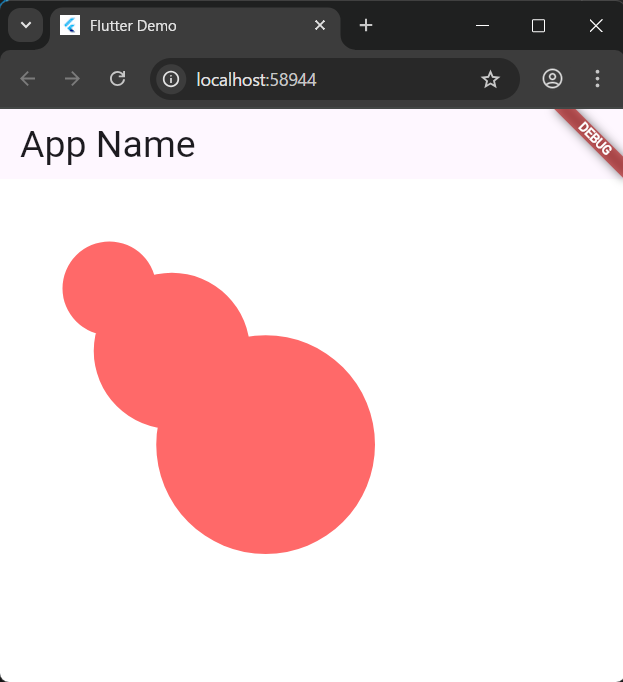
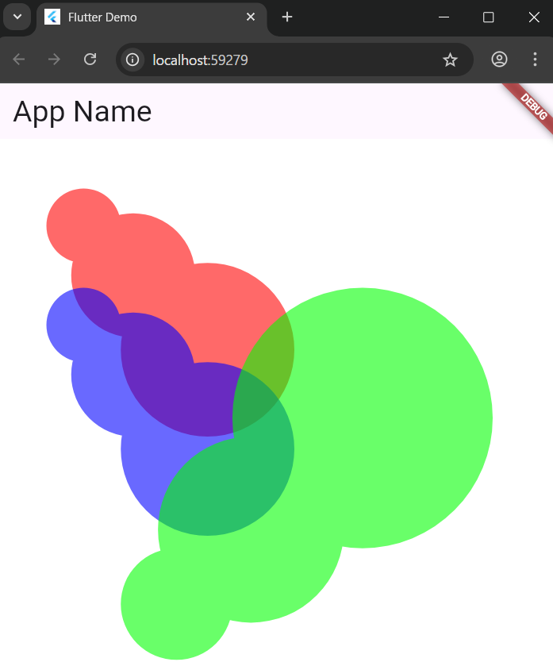

# 5-3: パスと座標交換

2025年7月23日
### 今日のキーワード： 「ラーメン」➡ラーメンのルーツ: ラーメンのルーツは中国の麺料理にあります。日本には明治時代に伝わり、横浜中華街などで提供され始めたのが最初とされています。語源: 「ラーメン」という言葉の語源には諸説ありますが、中国語の「拉麺（ラーミエン）」（麺を引っ張って作るという意味）から来ているという説が有力です。また、屋台で「はい、ラーメン！」と掛け声がかかったことから、という説もあります。ご当地ラーメンの多様性: 日本全国には数え切れないほどのご当地ラーメンがあります。札幌ラーメン（味噌）、喜多方ラーメン（醤油）、博多ラーメン（豚骨）などが有名ですが、他にも地域ごとに独自の進化を遂げたラーメンがたくさん存在します。麺の種類: ラーメンの麺は、太さ、形状（ちぢれ麺、ストレート麺）、加水率（麺に含まれる水分量）などによって多種多様です。これらがスープとの絡み具合や食感に大きく影響します。スープの進化: スープも豚骨、鶏ガラ、魚介、野菜など、様々な素材を組み合わせて作られます。最近では、フレンチやイタリアンの要素を取り入れた斬新なラーメンも増えています。海外での人気: ラーメンは今や日本だけでなく、世界中で人気を集めています。特に欧米やアジアの主要都市では、日本のラーメン店が続々とオープンし、多くの人々を魅了しています。

---
`main.dartのソースコード(Pathを描画する)`
```dart
import 'package:flutter/material.dart'; // FlutterのマテリアルデザインUIコンポーネントをインポートします。

// アプリケーションのエントリーポイント（開始点）です。
void main() {
  runApp(const MyApp()); // MyAppウィジェットを実行してアプリケーションを開始します。
}

// MyAppクラスは、アプリケーション全体のルートウィジェットです。
// StatelessWidgetは、状態を持たない（一度描画されたら変更されない）ウィジェットを定義する際に使用します。
class MyApp extends StatelessWidget {
  const MyApp({super.key}); // コンストラクタ。keyはウィジェットを一意に識別するために使われます。

  @override
  Widget build(BuildContext context) {
    // MaterialAppは、マテリアルデザインのアプリケーションを作成するための基本的な構造を提供します。
    return MaterialApp(
      title: 'Flutter Demo', // アプリケーションのタイトル（タスクスイッチャーなどに表示されます）。
      theme: ThemeData(
        // アプリケーションのテーマを設定します。
        // ColorScheme.fromSeedは、指定されたシードカラーから色のパレットを生成します。
        seedColor: Colors.deepPurple, // テーマの基準となる色をディープパープルに設定します。
      ),
      // アプリケーションの最初の画面（ホーム画面）を設定します。
      home: const MyHomePage(title: 'Flutter Demo Home Page'), // MyHomePageをホーム画面として設定し、タイトルを渡します。
    );
  }
}

// MyHomePageクラスは、アプリケーションのホーム画面を表すウィジェットです。
// StatefulWidgetは、状態を持つ（時間の経過とともに変更される可能性がある）ウィジェットを定義する際に使用します。
class MyHomePage extends StatefulWidget {
  const MyHomePage({super.key, required this.title}); // コンストラクタ。タイトルは必須です。

  final String title; // このウィジェットに渡されるタイトルを保存します。

  @override
  State<MyHomePage> createState() => _MyHomePageState(); // このウィジェットの状態を作成します。
}

// _MyHomePageStateクラスは、MyHomePageウィジェットの状態を管理します。
// Stateクラスは、StatefulWidgetの状態を保持し、ウィジェットのビルドメソッドが呼び出されるたびに再構築されます。
class _MyHomePageState extends State<MyHomePage> {
  @override
  Widget build(BuildContext context) {
    // Scaffoldは、マテリアルデザインの基本的な視覚的レイアウト構造（アプリバー、ボディなど）を実装します。
    return Scaffold(
      backgroundColor: const Color.fromARGB(255, 255, 255, 255), // 背景色を白に設定します。
      appBar: AppBar(
          // アプリケーションバー（画面上部のバー）を設定します。
          title: const Text('App Name',
              style:
                  TextStyle(fontSize: 30.0))), // アプリバーのタイトルを「App Name」に設定し、フォントサイズを30にします。
      body: Container(
          // 画面のメインコンテンツ領域です。
          // Containerは、レイアウト、ペイント、ポジショニングのための便利なウィジェットです。
          child: CustomPaint(
              // CustomPaintは、カスタムな図形を描画するために使用されます。
              painter:
                  MyPainter())), // MyPainterクラスを使ってカスタムな描画を行います。
    );
  }
}

// MyPainterクラスは、CustomPainterを継承しており、カスタムな図形を描画するためのロジックを含みます。
class MyPainter extends CustomPainter {
  @override
  void paint(Canvas canvas, Size size) {
    // paintメソッドは、実際に描画を行う場所です。
    // Canvasは描画コンテキストを提供し、Sizeは描画領域のサイズを示します。

    Path path = Path(); // 図形（パス）を定義するためのPathオブジェクトを作成します。

    // 最初の楕円（円）の領域を定義します。
    // Rect.fromLTWH(left, top, width, height) は、左上隅の座標と幅、高さを指定して四角形を作成します。
    Rect r = Rect.fromLTWH(50.0, 50.0, 75.0, 75.0);
    path.addOval(r); // 定義した四角形に収まるような楕円をパスに追加します。

    // 2番目の楕円の領域を定義します。
    r = Rect.fromLTWH(75.0, 75.0, 125.0, 125.0);
    path.addOval(r); // パスに2番目の楕円を追加します。

    // 3番目の楕円の領域を定義します。
    r = Rect.fromLTWH(125.0, 125.0, 175.0, 175.0);
    path.addOval(r); // パスに3番目の楕円を追加します。

    Paint p = Paint(); // 描画スタイル（色、線の太さなど）を定義するためのPaintオブジェクトを作成します。
    p.color = const Color.fromARGB(150, 255, 0, 0); // 描画色を半透明の赤（ARGB: Alpha, Red, Green, Blue）に設定します。
    p.style = PaintingStyle.fill; // 描画スタイルを塗りつぶしに設定します。
    canvas.drawPath(path, p); // 定義したパス（複数の楕円）を、設定したペイントスタイルでキャンバスに描画します。
  }

  @override
  // shouldRepaintメソッドは、ウィジェットが再描画されるべきかどうかを決定します。
  // trueを返すと、常に再描画されます。
  bool shouldRepaint(CustomPainter oldDelegate) => true;
}
```

【 格納画面 】


> 主なPathメソッド
- 四角形 ➡ ≪Path≫.addRect(≪Rect≫);
- 楕円 ➡ ≪Path≫.addOval(≪Rect≫);
- 多角形 ➡ ≪Path≫.addPolygon([List<offset>],≪bool≫);
- 円弧 ➡ ≪Path≫.addArc(≪Rect≫,≪double≫,≪double≫);

---

`main.dartのソースコード(座標変換)`
```dart
import 'package:flutter/material.dart'; // FlutterのマテリアルデザインUIコンポーネントをインポートします。
import 'dart:math'; // 数学的な定数（例: pi）や関数を使用するためにインポートします。

// アプリケーションのエントリーポイント（開始点）です。
void main() {
  runApp(const MyApp()); // MyAppウィジェットを実行してアプリケーションを開始します。
}

// MyAppクラスは、アプリケーション全体のルートウィジェットです。
// StatelessWidgetは、状態を持たない（一度描画されたら変更されない）ウィジェットを定義する際に使用します。
class MyApp extends StatelessWidget {
  const MyApp({super.key}); // コンストラクタ。keyはウィジェットを一意に識別するために使われます。

  @override
  Widget build(BuildContext context) {
    // MaterialAppは、マテリアルデザインのアプリケーションを作成するための基本的な構造を提供します。
    return MaterialApp(
      title: 'Flutter Demo', // アプリケーションのタイトル（タスクスイッチャーなどに表示されます）。
      theme: ThemeData(
        // アプリケーションのテーマを設定します。
        // ColorScheme.fromSeedは、指定されたシードカラーから色のパレットを生成します。
        seedColor: Colors.deepPurple, // テーマの基準となる色をディープパープルに設定します。
      ),
      // アプリケーションの最初の画面（ホーム画面）を設定します。
      home: const MyHomePage(title: 'Flutter Demo Home Page'), // MyHomePageをホーム画面として設定し、タイトルを渡します。
    );
  }
}

// MyHomePageクラスは、アプリケーションのホーム画面を表すウィジェットです。
// StatefulWidgetは、状態を持つ（時間の経過とともに変更される可能性がある）ウィジェットを定義する際に使用します。
class MyHomePage extends StatefulWidget {
  const MyHomePage({super.key, required this.title}); // コンストラクタ。タイトルは必須です。

  final String title; // このウィジェットに渡されるタイトルを保存します。

  @override
  State<MyHomePage> createState() => _MyHomePageState(); // このウィジェットの状態を作成します。
}

// _MyHomePageStateクラスは、MyHomePageウィジェットの状態を管理します。
// Stateクラスは、StatefulWidgetの状態を保持し、ウィジェットのビルドメソッドが呼び出されるたびに再構築されます。
class _MyHomePageState extends State<MyHomePage> {
  @override
  Widget build(BuildContext context) {
    // Scaffoldは、マテリアルデザインの基本的な視覚的レイアウト構造（アプリバー、ボディなど）を実装します。
    return Scaffold(
      backgroundColor: const Color.fromARGB(255, 255, 255, 255), // 背景色を白に設定します。
      appBar: AppBar(
          // アプリケーションバー（画面上部のバー）を設定します。
          title: const Text('App Name',
              style:
                  TextStyle(fontSize: 30.0))), // アプリバーのタイトルを「App Name」に設定し、フォントサイズを30にします。
      body: Container(
          // 画面のメインコンテンツ領域です。
          // Containerは、レイアウト、ペイント、ポジショニングのための便利なウィジェットです。
          child: CustomPaint(
              // CustomPaintは、カスタムな図形を描画するために使用されます。
              painter:
                  MyPainter())), // MyPainterクラスを使ってカスタムな描画を行います。
    );
  }
}

// MyPainterクラスは、CustomPainterを継承しており、カスタムな図形を描画するためのロジックを含みます。
class MyPainter extends CustomPainter {
  @override
  void paint(Canvas canvas, Size size) {
    // paintメソッドは、実際に描画を行う場所です。
    // Canvasは描画コンテキストを提供し、Sizeは描画領域のサイズを示します。

    Path path = Path(); // 図形（パス）を定義するためのPathオブジェクトを作成します。

    // 最初の楕円（円）の領域を定義します。
    // Rect.fromLTWH(left, top, width, height) は、左上隅の座標と幅、高さを指定して四角形を作成します。
    Rect r = Rect.fromLTWH(50.0, 50.0, 75.0, 75.0);
    path.addOval(r); // 定義した四角形に収まるような楕円をパスに追加します。

    // 2番目の楕円の領域を定義します。
    r = Rect.fromLTWH(75.0, 75.0, 125.0, 125.0);
    path.addOval(r); // パスに2番目の楕円を追加します。

    // 3番目の楕円の領域を定義します。
    r = Rect.fromLTWH(125.0, 125.0, 175.0, 175.0);
    path.addOval(r); // パスに3番目の楕円を追加します。

    canvas.save(); // 現在のキャンバスの状態（変換行列、クリッピング、スタイルなど）を保存します。
                  // これにより、後で restore() を呼び出すことで、この時点の状態に戻すことができます。

    Paint p = Paint(); // 描画スタイル（色、線の太さなど）を定義するためのPaintオブジェクトを作成します。
    p.color = const Color.fromARGB(150, 255, 0, 0); // 描画色を半透明の赤（ARGB: Alpha, Red, Green, Blue）に設定します。
    p.style = PaintingStyle.fill; // 描画スタイルを塗りつぶしに設定します。
    canvas.drawPath(path, p); // 定義したパス（複数の楕円）を、設定したペイントスタイルでキャンバスに描画します。
                              // これが最初の（赤い）図形です。

    canvas.translate(0.0, 100.0); // キャンバスの原点をY軸方向に100.0ピクセル移動させます。
                                  // これ以降の描画は、この新しい原点からの相対位置になります。
    p.color = const Color.fromARGB(150, 0, 0, 255); // 描画色を半透明の青に設定します。
    canvas.drawPath(path, p); // 移動したキャンバスに同じパスを再描画します。
                              // これが2番目の（青い）図形です。元の図形からY軸方向に100ピクセル下に移動して表示されます。

    p.color = const Color.fromARGB(150, 0, 255, 0); // 描画色を半透明の緑に設定します。
    canvas.rotate(-0.5 * pi); // キャンバスを現在の原点（X軸0, Y軸100）を中心に-0.5πラジアン（-90度）回転させます。
                              // `pi`はdart:mathからインポートされた数学定数です。
    canvas.translate(-500.0, 50.0); // 回転したキャンバスの原点をさらに移動させます。
                                   // この移動は回転後の座標系で行われるため、直感的な動きと異なる場合があります。
    canvas.scale(1 * 1.5); // キャンバスのスケール（拡大率）を1.5倍にします。
                           // これ以降の描画は1.5倍に拡大されます。
    canvas.drawPath(path, p); // 回転、移動、拡大されたキャンバスに同じパスを再描画します。
                              // これが3番目の（緑の）図形です。

    canvas.restore(); // save() で保存したキャンバスの状態に戻します。
                      // これにより、translate(), rotate(), scale() による変換がリセットされ、
                      // この restore() 以降の描画は save() 時点の状態（元の座標系）で行われます。
  }

  @override
  // shouldRepaintメソッドは、ウィジェットが再描画されるべきかどうかを決定します。
  // trueを返すと、常に再描画されます。
  bool shouldRepaint(CustomPainter oldDelegate) => true;
}
```

【 実行画面 】



> 座標変換を行っての描画時の注意事項
- 描画で座標を決めたまま、次の描画に移ると前の描画が残ってしまうため、一度描画したら座標を基に戻しておくこと。※下記メソッドを利用する。
  - 保存 ➡≪Canvas≫.save();
  - リストア ➡ ≪Canvas≫.restore();

---


