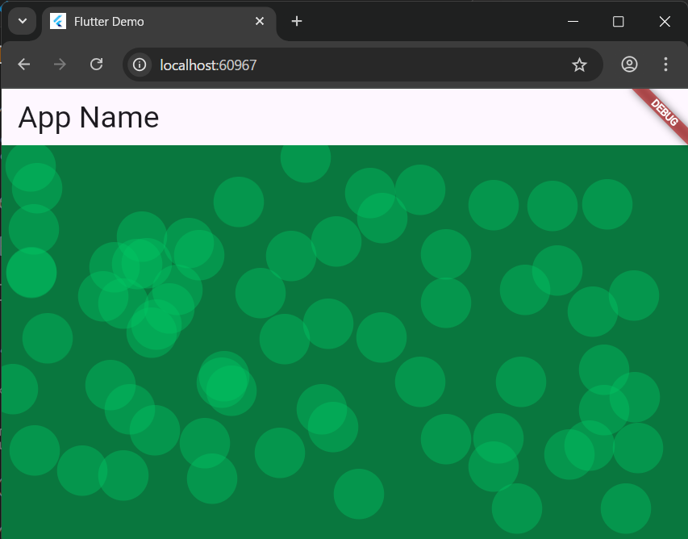
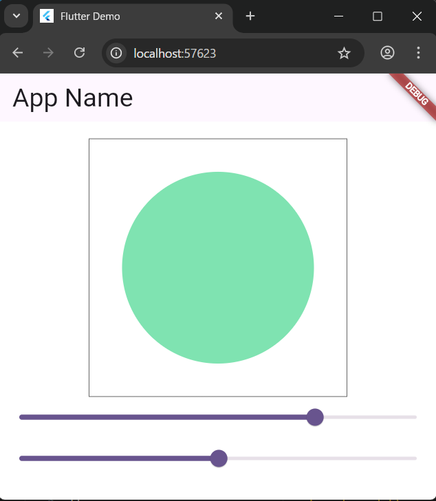
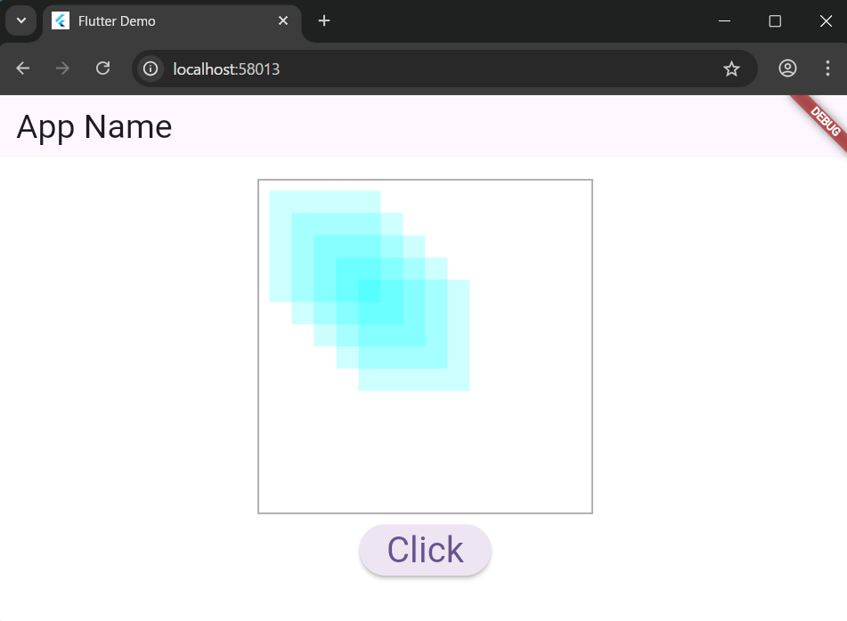

# 5-4: グラフィック描画のイベント処理

2025年7月29日
### 今日のキーワード： 「ツナマヨ」➡マグロやカツオの油漬け缶を使った「ツナ」と「マヨネーズ」を合わせたもので、おにぎりやパンの具材として広く親しまれています。その起源を探ると、初めてコンビニで販売されたのは1983年のセブンイレブンの「シーチキンマヨネーズ」からだったそうです。ツナ缶の中でも「シーチキン」は、はごろもフーズの商標名で、他社の製品は「ツナ」という名称を使っています。和風アレンジではしょうゆやめんつゆを加えた「和風ツナマヨ」も人気です。さらに海外では、イタリア料理の「ヴィテッロ・トンナート」という料理で似たようなソースが使われています。ツナ、アンチョビ、マヨネーズをフードプロセッサーで撹拌し、仔牛肉と一緒に提供するのが定番です。
---
`main.dartのソースコード(クリックして表示する)`
```dart
// Flutterのマテリアルデザインウィジェットをインポートします。
// これにより、AppBarやScaffoldなどのUI部品が使えるようになります。
import 'package:flutter/material.dart';
// このコードでは直接使われていませんが、数学的な計算が必要な場合に使用します。
import 'dart:math';

// アプリケーションが起動する最初の場所（エントリーポイント）です。
void main() {
  // MyAppウィジェットを画面に表示してアプリを起動します。
  runApp(const MyApp());
}

// アプリケーション全体のルート（根っこ）となるウィジェットです。
// StatelessWidgetは、自身では状態（データ）を持たない静的なウィジェットです。
class MyApp extends StatelessWidget {
  const MyApp({super.key});

  // buildメソッドがUI（ユーザーインターフェース）を構築します。
  @override
  Widget build(BuildContext context) {
    // MaterialAppは、マテリアルデザインのアプリを作るための基本的な設定を提供します。
    return MaterialApp(
      title: 'Flutter Demo', // アプリのタイトル
      theme: ThemeData( // アプリ全体のデザインテーマ設定
        colorScheme: ColorScheme.fromSeed(seedColor: Colors.deepPurple),
      ),
      // アプリが起動したときに最初に表示される画面（ホームページ）を指定します。
      home: const MyHomePage(title: 'Flutter Demo Home Page'),
    );
  }
}

// アプリのホームページ画面です。
// StatefulWidgetは、ユーザーの操作などで見た目が変わる可能性のある、状態（データ）を持つウィジェットです。
class MyHomePage extends StatefulWidget {
  const MyHomePage({super.key, required this.title});

  // このウィジェットに渡されるデータ（ここではアプリのタイトル）です。
  final String title;

  // StatefulWidgetは、Stateオブジェクトを作成することで状態を管理します。
  @override
  State<MyHomePage> createState() => _MyHomePageState();
}

// MyHomePageウィジェットの状態を管理するクラスです。
// UIの見た目や持っているデータはここで管理されます。
class _MyHomePageState extends State<MyHomePage> {
  // タップされた位置（座標）を保存するためのリスト。
  // Offsetは2次元の座標(x, y)を保持します。
  // staticにすると、このリストはアプリ全体で一つだけになり、アプリを再起動しない限りクリアされません。
  static List<Offset> _points = [];

  // Stateが作成されたときに一度だけ呼ばれる初期化メソッドです。
  @override
  void initState() {
    super.initState();
  }

  // 画面のUIを構築するメソッドです。setStateが呼ばれるたびに再実行されます。
  @override
  Widget build(BuildContext context) {
    // Scaffoldは、アプリの基本的な画面レイアウト（アプ​​リバー、ボディなど）を提供します。
    return Scaffold(
      backgroundColor: Color.fromARGB(255, 9, 119, 62), // 背景色を緑に設定
      appBar: AppBar(title: Text('円を描くアプリ', style: TextStyle(fontSize: 24.0))), // 画面上部のアプ​​リバー
      body: Center( // 子ウィジェットを中央に配置
        // Listenerは、タップやドラッグなどのポインタイベントを検出します。
        child: Listener(
          // 画面がタップ（押下）されたときに_addPointメソッドを呼び出します。
          onPointerDown: _addPoint,
          // CustomPaintは、CustomPainterを使って独自の描画を行います。
          // painterプロパティに、描画ロジックを実装したMyPainterを指定します。
          // childにCenter()を指定することで、Listenerが画面全体を検知できるようにしています。
          child: CustomPaint(painter: MyPainter(_points), child: Center()),
        ),
      ),
    );
  }

  // 画面がタップされたときに呼び出されるメソッドです。
  void _addPoint(PointerDownEvent event) {
    // setStateを呼び出すと、Flutterに状態が変わったことを伝えます。
    // これによりbuildメソッドが再実行され、画面が再描画されます。
    setState(() {
      // タップされた位置のローカル座標を_pointsリストに追加します。
      _points.add(event.localPosition);
    });
  }
}

// 実際にキャンバスに描画するロジックを定義するクラスです。
class MyPainter extends CustomPainter {
  // 描画する円の中心座標のリスト。
  final List<Offset> _points;

  // コンストラクタ。Stateから座標のリストを受け取ります。
  MyPainter(this._points);

  // 実際の描画処理を行うメソッドです。
  @override
  void paint(Canvas canvas, Size size) {
    // 描画ツールの設定（色、線の太さ、スタイルなど）を行うPaintオブジェクトを作成します。
    Paint p = Paint();

    p.style = PaintingStyle.fill; // 図形を塗りつぶすスタイルに設定
    p.color = Color.fromARGB(100, 0, 200, 100); // 描画色を半透明の緑に設定

    // _pointsリストに保存されている全ての座標に対してループ処理を行います。
    for (var pos in _points) {
      // 円を描画するための四角形（Rect）を定義します。
      // fromLTWHは、左上の座標(Left, Top)と幅(Width), 高さ(Height)を指定します。
      // posを中心にするため、座標から半径(25)分だけずらしています。
      Rect r = Rect.fromLTWH(pos.dx - 25, pos.dy - 25, 50.0, 50.0);
      
      // canvasに、指定した四角形(r)に内接する楕円（この場合は円）を指定したPaint(p)で描画します。
      canvas.drawOval(r, p);
    }
  }

  // このCustomPainterを再描画する必要があるかどうかを判断するメソッドです。
  // trueを返すと、ウィジェットが更新されるたびに常に再描画されます。
  @override
  bool shouldRepaint(CustomPainter oldDelegate) => true;
}
```

【 格納画面 】



---

`main.dartのソースコード(UIウィジェットで操作する)`
```dart
import 'package:flutter/material.dart';
import 'dart:math'; // ランダムな処理や数学的計算に使えるライブラリ

// アプリのエントリーポイント
void main() {
  runApp(const MyApp()); // アプリを起動し、MyAppウィジェットをルートとして設定
}

// アプリ全体の基本構造を定義するウィジェット
class MyApp extends StatelessWidget {
  const MyApp({super.key});

  @override
  Widget build(BuildContext context) {
    // アプリのタイトルとテーマを設定
    return MaterialApp(
      title: 'Flutter Demo',
      theme: ThemeData(
        colorScheme: ColorScheme.fromSeed(seedColor: Colors.deepPurple), // テーマカラー
      ),
      home: const MyHomePage(title: 'Flutter Demo Home Page'), // メイン画面を設定
    );
  }
}

// メイン画面のウィジェット
class MyHomePage extends StatefulWidget {
  const MyHomePage({super.key, required this.title});

  final String title; // ウィジェットのタイトル

  @override
  State<MyHomePage> createState() => _MyHomePageState();
}

// ウィジェットの状態を持つクラス
class _MyHomePageState extends State<MyHomePage> {
  static double _value = 0; // スライダーの値（サイズを調整するために使用）
  static double _opaq = 0; // スライダーの値（不透明度を調整するために使用）

  @override
  void initState() {
    super.initState(); // 初期化処理を行うメソッド（ここでは特に何も追加していない）
  }

  @override
  Widget build(BuildContext context) {
    // 画面の構成を定義
    return Scaffold(
      backgroundColor: Color.fromARGB(255, 255, 255, 255), // 背景色を白に設定
      appBar: AppBar(
        title: Text('App Name', style: TextStyle(fontSize: 30.0)), // タイトル
      ),
      body: Column(
        children: [
          Padding(padding: EdgeInsets.all(10)), // 余白を確保
          Container(
            width: 300,
            height: 300,
            child: CustomPaint(
              painter: MyPainter(_value, _opaq.toInt()), // 描画処理を行うカスタムペインターを設定
              child: Center(), // 中心配置
            ),
          ),
          Slider(
            min: 0.0, max: 300.0, value: _value, // スライダーの範囲を設定（サイズ調整用）
            onChanged: _changeVal, // 値が変更されたときに呼び出されるメソッド
          ),
          Slider(
            min: 0.0, max: 255.0, value: _opaq, // スライダーの範囲を設定（不透明度調整用）
            onChanged: _changeOpaq, // 値が変更されたときに呼び出されるメソッド
          ),
        ],
      ),
    );
  }

  // スライダーでサイズが変更されたときに呼び出される関数
  void _changeVal(double value) {
    setState(() {
      _value = value; // サイズを更新
    });
  }

  // スライダーで不透明度が変更されたときに呼び出される関数
  void _changeOpaq(double value) {
    setState(() {
      _opaq = value; // 不透明度を更新
    });
  }
}

// 描画処理を行うクラス
class MyPainter extends CustomPainter {
  final double _value; // 楕円のサイズ
  final int _opaq; // 色の不透明度

  MyPainter(this._value, this._opaq); // コンストラクタで値を受け取る

  @override
  void paint(Canvas canvas, Size size) {
    Paint p = Paint(); // 描画に使うペイントオブジェクトを生成

    // 楕円の塗りつぶしを設定
    p.style = PaintingStyle.fill;
    p.color = Color.fromARGB(_opaq, 0, 200, 100); // 不透明度と色を設定
    Rect r = Rect.fromLTWH(
      (size.width - _value) / 2, // 中央に配置するために調整
      (size.height - _value) / 2,
      _value, // 幅
      _value, // 高さ
    );
    canvas.drawOval(r, p); // 楕円を描画

    // 外側の枠線を設定
    r = Rect.fromLTWH(0, 0, size.width, size.height); // 枠全体のサイズを指定
    p.style = PaintingStyle.stroke;
    p.color = Color.fromARGB(255, 100, 100, 100); // 枠線の色を設定
    canvas.drawRect(r, p); // 枠線を描画
  }

  @override
  bool shouldRepaint(CustomPainter oldDelegate) => true; // 再描画の必要がある場合にtrueを返す
}
```

【 実行画面 】



---


`main.dartのソースコード(ValueNotifierによる更新)`
```dart
import 'package:flutter/material.dart'; // Flutterの基本ウィジェットを提供するパッケージ
import 'dart:math'; // ランダム処理や数学計算に使えるパッケージ

void main() {
  // アプリケーションのエントリーポイント
  runApp(const MyApp()); // アプリを起動し、MyAppをルートウィジェットとして設定
}

class MyApp extends StatelessWidget {
  const MyApp({super.key});

  @override
  Widget build(BuildContext context) {
    // アプリ全体の構造とテーマを設定する部分
    return MaterialApp(
      title: 'Flutter Demo', // アプリのタイトル
      theme: ThemeData(
        colorScheme: ColorScheme.fromSeed(seedColor: Colors.deepPurple), // テーマカラーの設定
      ),
      home: const MyHomePage(title: 'Flutter Demo Home Page'), // メイン画面の設定
    );
  }
}

class MyHomePage extends StatefulWidget {
  const MyHomePage({super.key, required this.title});

  final String title; // 画面タイトルを保持する変数

  @override
  State<MyHomePage> createState() => _MyHomePageState(); // 状態を管理するクラスの作成
}

class _MyHomePageState extends State<MyHomePage> {
  // ValueNotifierを使って値の変更を通知する仕組みを持つ変数
  static ValueNotifier<int> _value = ValueNotifier<int>(0);

  @override
  void initState() {
    // ウィジェットの初期化処理を行う（今回は特に処理を追加していない）
    super.initState();
  }

  @override
  Widget build(BuildContext context) {
    // UIを構築するメソッド
    return Scaffold(
      backgroundColor: Color.fromARGB(255, 255, 255, 255), // 背景を白に設定
      appBar: AppBar(
        // 上部のバー（タイトル）
        title: Text('App Name', style: TextStyle(fontSize: 30.0)), // タイトルのスタイルを設定
      ),
      body: Center(
        // 画面中央にウィジェットを配置
        child: Column(
          children: [
            Padding(padding: EdgeInsets.all(10)), // 上部に余白を追加
            Container(
              width: 300, // コンテナの幅
              height: 300, // コンテナの高さ
              child: CustomPaint(
                // CustomPainterを使ってグラフィックスを描画
                painter: MyPainter(_value),
                child: Center(), // 中心を指定（空のウィジェット）
              ),
            ),
            Padding(padding: EdgeInsets.all(5)), // ボタンとの余白
            ElevatedButton(
              // ボタンを作成
              child: Text("Click", style: TextStyle(fontSize: 32)), // ボタンのテキストとスタイル
              onPressed: () => _value.value++, // ボタンを押すと値が1増える
            ),
          ],
        ),
      ),
    );
  }
}

class MyPainter extends CustomPainter {
  final ValueNotifier<int> _value; // 描画する矩形の数を管理するValueNotifier

  MyPainter(this._value); // コンストラクタで値を受け取る

  @override
  void paint(Canvas canvas, Size size) {
    Paint p = Paint(); // 描画のスタイルを管理するクラス
    p.style = PaintingStyle.fill; // 塗りつぶしのスタイルを設定
    p.color = Color.fromARGB(50, 0, 255, 255); // 色と不透明度を設定
    Rect r;

    for (var i = 0; i < _value.value; i++) {
      // _value.valueの数だけ矩形を描画
      r = Rect.fromLTWH(10 + i * 20, 10 + i * 20, 100, 100); // 各矩形の位置を調整
      canvas.drawRect(r, p); // 矩形を描画
    }

    r = Rect.fromLTWH(0, 0, size.width, size.height); // 外枠の矩形サイズを定義
    p.style = PaintingStyle.stroke; // 線のスタイルを設定
    p.color = Color.fromARGB(255, 100, 100, 100); // 枠線の色を設定
    canvas.drawRect(r, p); // 枠線を描画

    if (_value.value > 10) {
      // 矩形数が10を超えたらリセット
      _value.value = 0;
    }
  }

  @override
  bool shouldRepaint(CustomPainter oldDelegate) => true; // 再描画が必要な場合はtrueを返す
}
```

【 実行画面 】



> ValueNotifierとは、値を変更すると自動的に通知され表示が更新できるようになるもの
- changeNotifierのサブクラス（状態の変更を通知するための仕組みを提供するためもの）で、
　valueNotifierは「値の変更」を通知するための仕組みを提供。

---
