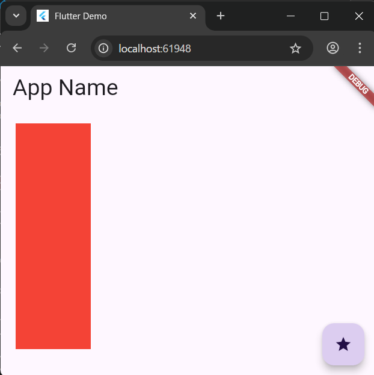

# 5-5: アニメーション

2025年7月30日
### 今日のキーワード： 「かつどん」➡カツ丼は日本の食文化のなかで一際ユニークな存在です！明治時代後半の日本で洋食の「カツレツ」から発展し、卵でとじたスタイルやソースを使用するスタイルが広まっていきました。起源としては東京の早稲田大学近くのお店で誕生したという説が有力ですが、山梨県の甲府市や福井県も「発祥地」とされることがあるそうです。実は地域ごとに異なる個性があるのも面白いポイントで、例えば、群馬県桐生市では「ソースカツ丼」として知られ、ウスターソースに浸したカツが特徴。福島県会津若松市ではキャベツを敷いた上にソースカツを乗せる形式が発祥とされています。そして、沖縄では野菜炒めを使った独特のスタイルも存在します。

---


`main.dartのソースコード(図形が回転するアニメーション)`
```dart
import 'package:flutter/material.dart'; // Flutterの基本的なUIウィジェットを提供するパッケージ
import 'dart:math'; // 数学的な計算（例：円周率や三角関数）を提供するパッケージ

void main() {
  // アプリのエントリーポイント
  runApp(const MyApp()); // アプリを起動し、MyAppウィジェットをルートとして指定
}

// アプリ全体を管理するStatelessWidget
class MyApp extends StatelessWidget {
  const MyApp({super.key});

  @override
  Widget build(BuildContext context) {
    // MaterialAppはアプリ全体の設定（テーマやルート）を提供する
    return MaterialApp(
      title: 'Flutter Demo', // アプリのタイトル
      theme: ThemeData(
        // アプリ全体のテーマカラーを設定
        colorScheme: ColorScheme.fromSeed(seedColor: Colors.deepPurple),
      ),
      home: const MyHomePage(title: 'Flutter Demo Home Page'), // メイン画面を指定
    );
  }
}

// メイン画面を表すStatefulWidget
class MyHomePage extends StatefulWidget {
  const MyHomePage({super.key, required this.title});

  final String title; // 画面のタイトル

  @override
  State<MyHomePage> createState() => _MyHomePageState(); // 状態を管理するStateを生成
}

// メイン画面の状態を管理するクラス
class _MyHomePageState extends State<MyHomePage> with SingleTickerProviderStateMixin {
  late Animation<double> animation; // 回転の角度を管理するアニメーション
  late AnimationController controller; // アニメーションの制御を行うコントローラー

  @override
  void initState() {
    super.initState();
    // アニメーションコントローラーの初期化
    controller = AnimationController(
      duration: const Duration(seconds: 3), // アニメーションの期間を3秒に設定
      vsync: this, // アニメーションの効率を向上させるためにvsyncを提供
    );
    // 角度を0から2πまで変化させるアニメーションを作成
    animation = Tween<double>(begin: 0, end: pi * 2).animate(controller)
      ..addListener(() {
        setState(() {}); // アニメーションの進行に応じて画面を再描画
      });
    controller.repeat(reverse: false); // アニメーションを繰り返し実行
  }

  @override
  Widget build(BuildContext context) {
    // メインのUIを構築
    return Scaffold(
      backgroundColor: Color.fromARGB(255, 255, 255, 255), // 背景を白に設定
      appBar: AppBar(
        title: Text('App Name', style: TextStyle(fontSize: 30.0)), // アプリバーのタイトル
      ),
      body: Center(
        // 中心にコンテンツを配置
        child: Column(
          children: [
            Padding(padding: EdgeInsets.all(10)), // 上部に余白を設定
            Container(
              width: 300, // コンテナの幅
              height: 300, // コンテナの高さ
              child: CustomPaint(
                // カスタム描画を行うCustomPainterを指定
                painter: MyPainter(animation.value), // アニメーションの値を渡す
                child: Center(), // 子ウィジェットを配置
              ),
            ),
          ],
        ),
      ),
    );
  }
}

// カスタム描画を行うCustomPainter
class MyPainter extends CustomPainter {
  final double value; // 回転角度を表す値

  MyPainter(this.value); // コンストラクタで回転値を受け取る

  @override
  void paint(Canvas canvas, Size size) {
    Paint p = Paint(); // 描画ツールを定義

    canvas.save(); // 変換をリセットできるように保存
    // 最初の塗りつぶしの四角形を描画
    p.style = PaintingStyle.fill; // 塗りつぶしスタイル
    p.color = Color.fromARGB(100, 255, 0, 255); // 色を薄い紫色に設定
    Rect r = Rect.fromLTWH(0, 0, 250, 250); // 四角形のサイズと位置
    canvas.translate(150, 250); // キャンバスを中央付近に移動
    canvas.rotate(value); // アニメーションの値を用いて回転
    canvas.translate(-125, -125); // 四角形の中心位置を調整
    canvas.drawRect(r, p); // 四角形を描画
    canvas.restore(); // 保存した状態を復元

    // 線の四角形を描画
    p.style = PaintingStyle.stroke; // 線描画スタイル
    p.strokeWidth = 25; // 線の太さ
    p.color = Color.fromARGB(100, 0, 255, 255); // 薄い青緑の色を設定
    r = Rect.fromLTWH(0, 0, 250, 250); // 四角形のサイズと位置
    canvas.translate(150, 250); // 中心位置に移動
    canvas.rotate(value * -1); // アニメーションの逆方向の回転
    canvas.translate(-125, -125); // 四角形の中心を調整
    canvas.drawRect(r, p); // 四角形を描画
  }

  @override
  bool shouldRepaint(CustomPainter oldDelegate) => true; // 再描画が必要かを指定
}
```

【 格納画面 】


> AnimationControllerの設定
- 「repeat」メソッドにて繰り返し再生。
- 「forward」メソッドにて最初から最後へ再生
- 「reverse」メソッドにて最後から最初に再生。

---

`main.dartのソースコード(アニメーションウィジェットの利用)`
```dart
import 'package:flutter/material.dart'; // FlutterのUIウィジェットを提供するパッケージ
import 'dart:math'; // 数学的な計算（例: 円周率など）を提供するパッケージ

void main() {
  // Flutterアプリのエントリーポイント
  runApp(const MyApp()); // アプリを起動し、MyAppウィジェットをルートとして指定
}

// アプリ全体の設定を行うStatelessWidget
class MyApp extends StatelessWidget {
  const MyApp({super.key});

  @override
  Widget build(BuildContext context) {
    // Materialデザインを基にしたアプリを構築する
    return MaterialApp(
      title: 'Flutter Demo', // アプリのタイトルを設定
      theme: ThemeData(
        colorScheme: ColorScheme.fromSeed(seedColor: Colors.deepPurple), // デザインテーマの色設定
      ),
      home: const MyHomePage(title: 'Flutter Demo Home Page'), // メイン画面を指定
    );
  }
}

// メイン画面となるStatefulWidget
class MyHomePage extends StatefulWidget {
  const MyHomePage({super.key, required this.title});

  final String title; // 画面のタイトル

  @override
  State<MyHomePage> createState() => _MyHomePageState(); // Stateを生成
}

// メイン画面の状態を管理するクラス
class _MyHomePageState extends State<MyHomePage> {
  bool flg = false; // アニメーションの状態を管理するフラグ

  @override
  Widget build(BuildContext context) {
    // アプリの画面レイアウトを構築
    return Scaffold(
      appBar: AppBar(
        // 画面上部のバーにタイトルを表示
        title: Text('App Name', style: TextStyle(fontSize: 30.0)),
      ),
      body: Padding(
        // 画面内に余白を追加
        padding: EdgeInsets.all(20),
        child: Column(
          children: [
            AnimatedAlign(
              // アニメーション付きで位置を変更
              alignment: flg ? Alignment.topLeft : Alignment.topRight, // フラグによって位置を切り替え
              duration: const Duration(seconds: 1), // アニメーションの時間を設定
              child: Container(color: Colors.red, width: 100, height: 100), // アニメーション対象となる赤いボックス
              curve: Curves.linear, // アニメーションの動きを線形に設定
            ),
          ],
        ),
      ),
      floatingActionButton: FloatingActionButton(
        // ボタンを押すと画面の状態を変更
        onPressed: () {
          setState(() {
            flg = !flg; // フラグを反転させて位置を変更
          });
        },
        child: const Icon(Icons.star), // ボタンに星型アイコンを設定
      ),
    );
  }
}

// カスタム描画を行うためのクラス
class MyPainter extends CustomPainter {
  final double value; // 回転角度を受け取る値

  MyPainter(this.value); // コンストラクタで値を設定

  @override
  void paint(Canvas canvas, Size size) {
    Paint p = Paint(); // 描画に使用するツールを初期化
    canvas.save(); // 現在のキャンバス状態を保存

    // 塗りつぶしの四角形を描画
    p.style = PaintingStyle.fill; // 塗りつぶしスタイル
    p.color = Color.fromARGB(100, 255, 0, 255); // 薄い紫色を設定
    Rect r = Rect.fromLTWH(0, 0, 250, 250); // 四角形のサイズと位置を定義
    canvas.translate(150, 250); // 四角形を描画する位置を移動
    canvas.rotate(value); // 回転角度を適用
    canvas.translate(-125, -125); // 四角形の中心位置を調整
    canvas.drawRect(r, p); // 四角形を描画

    canvas.restore(); // キャンバス状態を復元

    // 枠線付きの四角形を描画
    p.style = PaintingStyle.stroke; // 枠線スタイル
    p.strokeWidth = 25; // 枠線の太さを設定
    p.color = Color.fromARGB(100, 0, 255, 255); // 薄い青緑色を設定
    r = Rect.fromLTWH(0, 0, 250, 250); // 四角形のサイズと位置を定義
    canvas.translate(150, 250); // 描画位置を移動
    canvas.rotate(value * -1); // 回転角度を逆方向に適用
    canvas.translate(-125, -125); // 中心位置を調整
    canvas.drawRect(r, p); // 四角形を描画
  }

  @override
  bool shouldRepaint(CustomPainter oldDelegate) => true; // 再描画が必要かを判定
}
```

【 実行画面 】


---


`main.dartのソースコード(AnimatedDefaultTextStyleのよるテキスト操作)`
```dart
import 'package:flutter/material.dart';
import 'dart:math'; // 標準ライブラリのmathクラスを使用して、角度の回転や計算をサポート

void main() {
  // アプリケーションのエントリーポイント
  runApp(const MyApp());
}

// アプリのメイン構造を提供するStatelessWidget
class MyApp extends StatelessWidget {
  const MyApp({super.key}); // Widgetのキーを渡す（キーを使えばWidgetを効率的に管理可能）

  @override
  Widget build(BuildContext context) {
    // Materialデザインを設定し、テーマや初期画面を指定する
    return MaterialApp(
      title: 'Flutter Demo', // アプリのタイトル設定
      theme: ThemeData(
        // テーマの色設定。シードカラーを使ってカラーパレットを生成
        colorScheme: ColorScheme.fromSeed(seedColor: Colors.deepPurple),
      ),
      home: const MyHomePage(title: 'Flutter Demo Home Page'), // 初期画面設定
    );
  }
}

// Stateを持つWidgetで、アプリのホームページとして使用
class MyHomePage extends StatefulWidget {
  const MyHomePage({super.key, required this.title}); // タイトルを引数で受け取る

  final String title; // 画面のタイトル保持

  @override
  State<MyHomePage> createState() => _MyHomePageState(); // Stateの作成
}

// 動的な動作を管理するためのStateクラス
class _MyHomePageState extends State<MyHomePage> {
  bool flg = false; // テキストのスタイル切替フラグ

  @override
  Widget build(BuildContext context) {
    // 画面の構成を返す
    return Scaffold(
      appBar: AppBar(
          // 上部のタイトルバー
          title: Text('App Name', style: TextStyle(fontSize: 30.0))), // タイトル表示
      body: Padding(
        // コンテンツの余白を設定
        padding: EdgeInsets.all(20),
        child: Column(
          // ウィジェットを縦に並べる
          children: [
            AnimatedDefaultTextStyle(
              // テキストのスタイルをアニメーションで変更するウィジェット
              duration: const Duration(seconds: 1), // スタイル変更にかける時間
              style: TextStyle(
                fontSize: flg ? 48 : 96, // フラグに応じたフォントサイズ設定
                fontWeight: FontWeight.bold, // 太字
                color: flg ? Colors.red : Colors.blue, // フラグに応じた色設定
              ),
              child: Text("Hello Flutter!"), // 実際に表示するテキスト
            ),
          ],
        ),
      ),
      floatingActionButton: FloatingActionButton(
        // 浮いているアクションボタンの設定
        onPressed: () {
          // ボタンが押された時の動作
          setState(() {
            flg = !flg; // フラグを反転してスタイルを変更
          });
        },
        child: const Icon(Icons.star), // ボタン内のアイコンを星に設定
      ),
    );
  }
}

// カスタム描画を行うためのクラス
class MyPainter extends CustomPainter {
  final double value; // 回転角度を保持するプロパティ

  MyPainter(this.value); // 角度をコンストラクタで受け取る

  @override
  void paint(Canvas canvas, Size size) {
    Paint p = Paint(); // 描画用の設定を保持するオブジェクト
    canvas.save(); // 現在のキャンバスの状態を保存

    // 塗り潰しのスタイルを設定
    p.style = PaintingStyle.fill;
    p.color = Color.fromARGB(100, 255, 0, 255); // 塗り潰し色（ピンク）
    Rect r = Rect.fromLTWH(0, 0, 250, 250); // 四角形の位置とサイズを指定
    canvas.translate(150, 250); // キャンバスを移動
    canvas.rotate(value); // 四角形を回転
    canvas.translate(-125, -125); // 四角形の中心に戻すために再移動
    canvas.drawRect(r, p); // 四角形を描画

    canvas.restore(); // 保存したキャンバスの状態に戻す
    p.style = PaintingStyle.stroke; // 外枠のみ描画するスタイル
    p.strokeWidth = 25; // 外枠の幅を設定
    p.color = Color.fromARGB(100, 0, 255, 255); // 外枠の色（水色）
    r = Rect.fromLTWH(0, 0, 250, 250); // 再設定した四角形の描画
    canvas.translate(150, 250); // 再度移動
    canvas.rotate(value * -1); // 回転（逆方向）
    canvas.translate(-125, -125); // 中心に戻すため再移動
    canvas.drawRect(r, p); // 外枠を描画
  }

  @override
  bool shouldRepaint(CustomPainter oldDelegate) => true; // 再描画が必要な場合
}
```

【 実行画面 】


---


`main.dartのソースコード(AnimatedPositionedによる位置の移動)`
```dart
import 'package:flutter/material.dart';
import 'dart:math'; // 数学関連のクラス（例えば、角度計算など）を使うためのライブラリをインポート

void main() {
  // アプリケーションのエントリポイント。MyAppウィジェットを画面に描画する
  runApp(const MyApp());
}

class MyApp extends StatelessWidget {
  // MyAppは、アプリ全体の構造を定義するStatelessWidget
  const MyApp({super.key});

  @override
  Widget build(BuildContext context) {
    // Material Designを適用し、アプリのテーマや初期画面を設定
    return MaterialApp(
      title: 'Flutter Demo', // アプリの名前を設定
      theme: ThemeData(
        colorScheme: ColorScheme.fromSeed(seedColor: Colors.deepPurple), // 深紫を基調としたテーマのカラースキームを設定
      ),
      home: const MyHomePage(title: 'Flutter Demo Home Page'), // ホームページを指定
    );
  }
}

class MyHomePage extends StatefulWidget {
  // MyHomePageは動的な動作を管理するStatefulWidget
  const MyHomePage({super.key, required this.title});

  final String title; // 画面のタイトルを保持するプロパティ

  @override
  State<MyHomePage> createState() => _MyHomePageState(); // Stateオブジェクトを生成
}

class _MyHomePageState extends State<MyHomePage> {
  bool flg = false; // アニメーション位置を切り替えるためのフラグ

  @override
  Widget build(BuildContext context) {
    // Scaffoldでアプリの基本構造を定義
    return Scaffold(
      appBar: AppBar(
          title: Text(
        'App Name',
        style: TextStyle(fontSize: 30.0), // タイトルバーのフォントサイズを設定
      )),
      body: Padding(
        padding: EdgeInsets.all(20), // 画面の余白を設定
        child: Stack(
          // Stackウィジェットを使って、複数のウィジェットを重ね合わせる
          children: [
            AnimatedPositioned(
              // 位置をアニメーションで変更するウィジェット
              duration: Duration(seconds: 3), // アニメーションの時間（3秒）
              top: flg ? 300 : 0, // フラグの状態によって縦位置を切り替え
              left: flg ? 0 : 300, // フラグの状態によって横位置を切り替え
              child: Container(
                color: Colors.red, // 四角形の色を赤に設定
                width: 100, // 四角形の幅を100に設定
                height: 100, // 四角形の高さを100に設定
              ),
            ),
          ],
        ),
      ),
      floatingActionButton: FloatingActionButton(
        // 浮いているアクションボタン
        onPressed: () {
          setState(() {
            flg = !flg; // フラグを反転してアニメーションの状態を切り替え
          });
        },
        child: const Icon(Icons.star), // ボタン内のアイコンを星に設定
      ),
    );
  }
}

class MyPainter extends CustomPainter {
  // CustomPainterを使ってカスタム描画を行う
  final double value; // 描画時の回転角度を保持する変数

  MyPainter(this.value);

  @override
  void paint(Canvas canvas, Size size) {
    Paint p = Paint(); // 描画設定を保持するオブジェクト
    canvas.save(); // キャンバスの状態を保存

    // 塗りつぶしのスタイルを設定
    p.style = PaintingStyle.fill;
    p.color = Color.fromARGB(100, 255, 0, 255); // ピンク色で塗りつぶし
    Rect r = Rect.fromLTWH(0, 0, 250, 250); // 四角形の位置とサイズを設定
    canvas.translate(150, 250); // キャンバスを移動
    canvas.rotate(value); // 四角形を指定した角度で回転
    canvas.translate(-125, -125); // 四角形の中心に移動
    canvas.drawRect(r, p); // 四角形を描画

    canvas.restore(); // 保存したキャンバス状態に戻す
    p.style = PaintingStyle.stroke; // 外枠のみ描画するスタイル
    p.strokeWidth = 25; // 外枠の幅を設定
    p.color = Color.fromARGB(100, 0, 255, 255); // 水色で外枠描画
    r = Rect.fromLTWH(0, 0, 250, 250); // 四角形の位置とサイズを再度設定
    canvas.translate(150, 250); // キャンバスを移動
    canvas.rotate(value * -1); // 回転方向を逆に設定
    canvas.translate(-125, -125); // 四角形の中心に戻す
    canvas.drawRect(r, p); // 外枠を描画
  }

  @override
  bool shouldRepaint(CustomPainter oldDelegate) => true; // 再描画するかを指定
}
```

【 実行画面 】


---


`main.dartのソースコード(AnimatedCrossFadeによるウィジェットの切り替え)`
```dart
import 'package:flutter/material.dart';
import 'dart:math'; //数学的な機能（例えば角度計算）をサポートするライブラリ

void main() {
  // アプリケーションのエントリーポイント
  runApp(const MyApp());
}

class MyApp extends StatelessWidget {
  const MyApp({super.key});

  @override
  Widget build(BuildContext context) {
    // アプリのテーマや初期画面を設定するMaterialAppウィジェット
    return MaterialApp(
      title: 'Flutter Demo', // アプリのタイトル
      theme: ThemeData(
        colorScheme: ColorScheme.fromSeed(seedColor: Colors.deepPurple), // アプリのカラースキーム設定
      ),
      home: const MyHomePage(title: 'Flutter Demo Home Page'), // 初期画面のウィジェットを指定
    );
  }
}

class MyHomePage extends StatefulWidget {
  const MyHomePage({super.key, required this.title});

  final String title; // 画面タイトルを保持するプロパティ

  @override
  State<MyHomePage> createState() => _MyHomePageState();
}

class _MyHomePageState extends State<MyHomePage> {
  bool flg = false; // 画面状態を切り替えるためのフラグ

  @override
  Widget build(BuildContext context) {
    // アプリの画面全体を構成するScaffoldウィジェット
    return Scaffold(
      appBar: AppBar(
          title: Text(
        'App Name',
        style: TextStyle(fontSize: 30.0), // タイトルのフォントサイズ設定
      )),
      body: Padding(
        padding: EdgeInsets.all(20), // ページの余白
        child: Column(
          children: [
            AnimatedCrossFade(
              // 2つの子ウィジェットをアニメーションで切り替えるウィジェット
              duration: const Duration(seconds: 1), // 切り替えにかかる時間
              firstChild: const FlutterLogo(
                style: FlutterLogoStyle.horizontal, // 最初のロゴのスタイル
                size: 300.0, // ロゴサイズ
              ),
              secondChild: const FlutterLogo(
                style: FlutterLogoStyle.stacked, // 切り替え後のロゴのスタイル
                size: 300.0, // ロゴサイズ
              ),
              crossFadeState: flg
                  ? CrossFadeState.showFirst // フラグがtrueの場合に最初のロゴを表示
                  : CrossFadeState.showSecond, // フラグがfalseの場合に2番目のロゴを表示
            ),
          ],
        ),
      ),
      floatingActionButton: FloatingActionButton(
        // フローティングアクションボタン（FAB）の設定
        onPressed: () {
          setState(() {
            flg = !flg; // ボタンを押した際にフラグを反転させる
          });
        },
        child: const Icon(Icons.star), // FAB内に星のアイコンを表示
      ),
    );
  }
}

class MyPainter extends CustomPainter {
  // CustomPainterを使用してキャンバス上で図形を描画するクラス
  final double value; // 回転角度を保持するプロパティ

  MyPainter(this.value);

  @override
  void paint(Canvas canvas, Size size) {
    Paint p = Paint(); // 描画設定を管理するオブジェクト
    canvas.save(); // 現在のキャンバス状態を保存

    // 塗りつぶしスタイルで四角形を描画
    p.style = PaintingStyle.fill;
    p.color = Color.fromARGB(100, 255, 0, 255); // 塗りつぶし色（ピンク）
    Rect r = Rect.fromLTWH(0, 0, 250, 250); // 描画する四角形の位置とサイズ
    canvas.translate(150, 250); // キャンバスを移動
    canvas.rotate(value); // 四角形を指定の角度で回転
    canvas.translate(-125, -125); // 中心位置を調整
    canvas.drawRect(r, p); // 四角形を描画

    canvas.restore(); // キャンバスの状態を元に戻す

    // 線描画スタイルで四角形の外枠を描画
    p.style = PaintingStyle.stroke;
    p.strokeWidth = 25; // 線の太さ設定
    p.color = Color.fromARGB(100, 0, 255, 255); // 線の色（水色）
    r = Rect.fromLTWH(0, 0, 250, 250); // 四角形のサイズと位置を再設定
    canvas.translate(150, 250); // キャンバスを移動
    canvas.rotate(value * -1); // 外枠の回転方向を逆に設定
    canvas.translate(-125, -125); // 中心位置を調整
    canvas.drawRect(r, p); // 四角形の外枠を描画
  }

  @override
  bool shouldRepaint(CustomPainter oldDelegate) => true; // 再描画の必要性を指定
}
```

【 実行画面 】


---


`main.dartのソースコード(AnimatedContainerによるウィジェット操作)`
```dart
import 'package:flutter/material.dart';
import 'dart:math'; // 数学的な計算や角度操作を可能にするライブラリ

void main() {
  // アプリケーションの開始地点。MyAppウィジェットを画面に描画
  runApp(const MyApp());
}

class MyApp extends StatelessWidget {
  // アプリ全体の基本構造を定義するStatelessWidget
  const MyApp({super.key});

  @override
  Widget build(BuildContext context) {
    // アプリテーマや初期画面を提供するMaterialAppウィジェット
    return MaterialApp(
      title: 'Flutter Demo', // アプリのタイトル
      theme: ThemeData(
        colorScheme: ColorScheme.fromSeed(seedColor: Colors.deepPurple), // アプリのテーマカラー設定
      ),
      home: const MyHomePage(title: 'Flutter Demo Home Page'), // 初期画面のウィジェットを指定
    );
  }
}

class MyHomePage extends StatefulWidget {
  // StatefulWidgetとしてホーム画面を定義。動的な内容の更新を管理できる
  const MyHomePage({super.key, required this.title});

  final String title; // ホーム画面のタイトルを保持

  @override
  State<MyHomePage> createState() => _MyHomePageState(); // Stateオブジェクトを生成
}

class _MyHomePageState extends State<MyHomePage> {
  bool flg = false; // アニメーションの状態を切り替えるためのフラグ

  @override
  Widget build(BuildContext context) {
    // Scaffoldで画面全体を構築。AppBarやボディ、アクションボタンを含む
    return Scaffold(
      appBar: AppBar(
          // 画面上部のタイトルバー
          title: Text(
        'App Name',
        style: TextStyle(fontSize: 30.0), // タイトルのフォントサイズ設定
      )),
      body: Padding(
        padding: EdgeInsets.all(20), // ウィジェット間に余白を与える
        child: Column(
          // 縦方向にウィジェットを並べる
          children: [
            AnimatedContainer(
              // アニメーション付きコンテナ。プロパティの変更がアニメーション化される
              duration: const Duration(seconds: 1), // アニメーションの所要時間（1秒）
              color: flg ? Colors.red : Colors.yellow, // フラグによる背景色の変更
              width: flg ? 100 : 300, // フラグによる横幅の変更
              height: flg ? 300 : 100, // フラグによる高さの変更
            ),
          ],
        ),
      ),
      floatingActionButton: FloatingActionButton(
        // 画面右下のフローティングアクションボタン
        onPressed: () {
          setState(() {
            flg = !flg; // ボタンを押すたびにフラグを反転させてアニメーションを更新
          });
        },
        child: const Icon(Icons.star), // ボタン内に星アイコンを表示
      ),
    );
  }
}

class MyPainter extends CustomPainter {
  // カスタム描画を担当するクラス
  final double value; // 回転角度を保持するプロパティ

  MyPainter(this.value); // コンストラクタで角度を受け取る

  @override
  void paint(Canvas canvas, Size size) {
    Paint p = Paint(); // 描画設定を管理するオブジェクト
    canvas.save(); // キャンバスの状態を保存

    // 塗りつぶしスタイルで矩形を描画
    p.style = PaintingStyle.fill;
    p.color = Color.fromARGB(100, 255, 0, 255); // 塗りつぶし色（ピンク）
    Rect r = Rect.fromLTWH(0, 0, 250, 250); // 矩形の位置とサイズを指定
    canvas.translate(150, 250); // 描画位置を移動
    canvas.rotate(value); // 矩形を指定角度で回転
    canvas.translate(-125, -125); // 描画中心に移動
    canvas.drawRect(r, p); // 矩形を描画

    canvas.restore(); // 保存したキャンバス状態に戻す

    // 線描画スタイルで矩形の枠線を描画
    p.style = PaintingStyle.stroke;
    p.strokeWidth = 25; // 枠線の太さを設定
    p.color = Color.fromARGB(100, 0, 255, 255); // 線の色（水色）
    r = Rect.fromLTWH(0, 0, 250, 250); // 矩形の再設定
    canvas.translate(150, 250); // 描画位置を移動
    canvas.rotate(value * -1); // 回転方向を逆に設定
    canvas.translate(-125, -125); // 描画中心に戻す
    canvas.drawRect(r, p); // 矩形の枠線を描画
  }

  @override
  bool shouldRepaint(CustomPainter oldDelegate) => true; // 再描画が必要かどうか指定
}
```

【 実行画面 】



---

