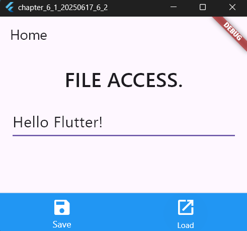
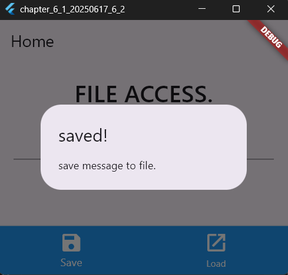
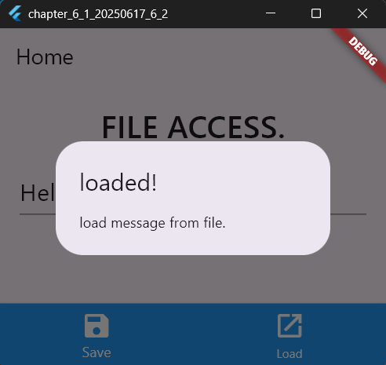
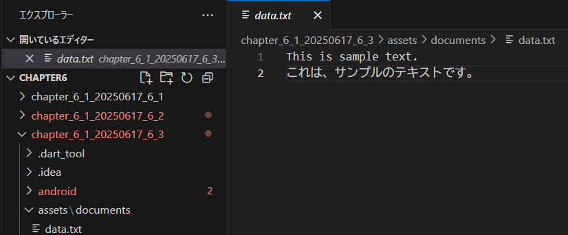
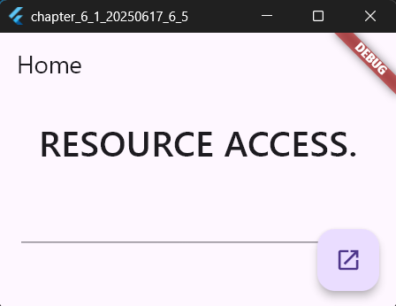
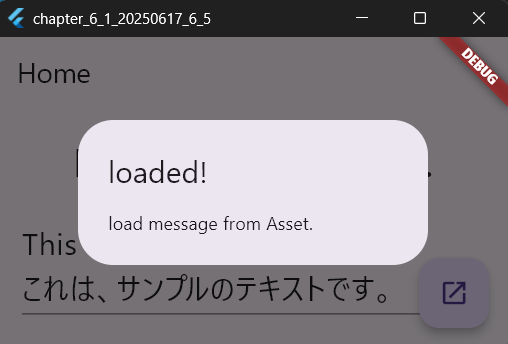

# ファイルアクセス

2025年6月17日
### 今日のキーワード： 「まなたまご（ほかのサービスの連携で乗り換えません！）」➡新鮮な卵かどうかを見極める方法のひとつとして、食塩水に卵を沈めるテストがあります。卵が沈んだら新鮮、浮いたら古い卵。また、日本は生卵を食べる文化が特別で、海外では生卵を食べることが一般的ではありません。理由にサルモネラ菌のリスクが挙げられ、日本の卵は殺菌や洗浄プロセスが徹底されているから安心して食べられます。さらに、卵には「完全栄養食品」としての魅力があって、タンパク質やビタミンA、B群、鉄分が豊富。一日に卵をいくつか食べても体に良いです。

---
 
`pubspec.yamlのソースコード(Path Providerのインストール)`
```yaml
# プロジェクトの名前と説明を定義します。
# Flutterでは、名前と説明を設定すると、プロジェクトの目的が分かりやすくなります。
name: chapter_6_1_20250617_6_7
description: "A new Flutter project."

# パッケージを公開しないことを指定しています。通常、Flutterプロジェクトでは 'none' を指定します。
publish_to: 'none'

# バージョン管理情報です。プロジェクトのバージョンとビルド番号を指定します。
version: 1.0.0+1

# Dart SDKのバージョンを指定します。 ^3.7.2 は互換性のあるバージョン範囲を示します。
environment:
  sdk: ^3.7.2

dependencies:
  # Flutter SDKをプロジェクトに追加します。これがメインの依存関係です。
  flutter:
    sdk: flutter
  # path_providerは、ファイルパスにアクセスするための便利なライブラリです。
  path_provider: any
  # shared_preferencesは、アプリの設定やデータ保存に使用されるライブラリです。
  shared_preferences: any
  # Cupertinoアイコンを使用するためのライブラリです。
  cupertino_icons: ^1.0.8

dev_dependencies:
  # Flutterのテスト用ライブラリです。ユニットテストを書く際に役立ちます。
  flutter_test:
    sdk: flutter
  # Flutterのコードを解析して、推奨されるスタイルを提供するライブラリです。
  flutter_lints: ^5.0.0

flutter:
  # FlutterでMaterial Designを使用可能にする設定です。
  uses-material-design: true
```

> path Providerのインストール
- アプリファイルの保存場所を調べる機能である。スマホの場合はあらかじめ割り当てられた場所を指定しないと保存に失敗してしまうため、path Providerに保存場所を取得しておく。


---
 
`main.dartのソースコード(ファイルアクセスの例)`
```dart
// Flutterアプリを作成するために必要なパッケージをインポートします。
// 'foundation.dart'は基本的なFlutter機能を提供します。
// 'material.dart'はMaterial DesignのUIコンポーネントを提供します。
// 'path_provider'はファイルパスの操作に役立つライブラリです。
import 'package:flutter/foundation.dart';
import 'package:flutter/material.dart';
import 'dart:ui' as ui;
import 'dart:io';
import 'package:path_provider/path_provider.dart';

// アプリの実行エントリーポイントを定義します。
// runAppは、Flutterアプリケーションを画面に表示するための関数です。
void main() => runApp(MyApp());

// MyAppクラスはアプリケーションのルートウィジェットです。
// StatelessWidgetなので状態を持たない画面を表します。
class MyApp extends StatelessWidget {
  const MyApp({super.key});

  @override
  Widget build(BuildContext context) {
    // MaterialAppはアプリの全体的な構造を定義します。
    // 'title'はアプリのタイトルを設定し、'theme'でデザインを変更できます。
    return MaterialApp(
      title: 'Generated App', // アプリのタイトル
      theme: ThemeData(
        // UIテーマを設定します。主な色や背景色を定義します。
        primarySwatch: Colors.blue, // 青色のテーマ
        primaryColor: const Color(0xff2196f3), // プライマリカラーを指定
        canvasColor: const Color(0xfffafafa), // 背景色を指定
      ),
      home: MyHomePage(), // アプリのホーム画面を指定します。
    );
  }
}

// MyHomePageはアプリのメイン画面を表します。
class MyHomePage extends StatefulWidget {
  const MyHomePage({super.key});

  @override
  // 状態管理を行うStateを作成します。
  _MyHomePageState createState() => _MyHomePageState();
}

// _MyHomePageStateクラスは画面の動作や表示を管理します。
class _MyHomePageState extends State<MyHomePage> {
  // テキスト入力用のコントローラーを作成します。
  final _controller = TextEditingController();
  // 保存するファイル名を指定します。
  final _fame = 'flutter_sampled.txt';

  @override
  Widget build(BuildContext context) {
    // Scaffoldは画面の基本構造を提供します。
    return Scaffold(
      appBar: AppBar(title: Text('Home')), // 上部のバーにタイトルを表示します。
      body: Padding(
        padding: EdgeInsets.all(20.0), // 画面の余白を設定します。
        child: Column(
          children: <Widget>[
            Text(
              'FILE ACCESS.', // ファイル操作に関連するタイトルを表示します。
              style: TextStyle(fontSize: 32, fontWeight: ui.FontWeight.w500),
            ),
            Padding(padding: EdgeInsets.all(10.0)), // 余白を追加します。
            TextField(
              controller: _controller, // テキストの入力を管理します。
              style: TextStyle(fontSize: 24), // テキストのスタイルを設定します。
              minLines: 1, // テキストの最小行数を設定します。
              maxLines: 5, // テキストの最大行数を設定します。
            ),
          ],
        ),
      ),
      // 画面下部のナビゲーションバーを作成します。
      bottomNavigationBar: BottomNavigationBar(
        backgroundColor: Colors.blue, // ナビゲーションバーの背景色を青に設定します。
        selectedItemColor: Colors.white, // 選択されたアイテムの色を白にします。
        unselectedItemColor: Colors.white, // 未選択のアイテムの色を白にします。
        currentIndex: 0, // 現在の選択されたアイテムのインデックスを設定します。
        items: <BottomNavigationBarItem>[
          BottomNavigationBarItem(
            label: 'Save', // 保存アイテムのラベル
            icon: Icon(Icons.save, color: Colors.white, size: 32), // 保存アイコン
          ),
          BottomNavigationBarItem(
            label: 'Load', // 読み込みアイテムのラベル
            icon: Icon(Icons.open_in_new, color: Colors.white, size: 32), // 読み込みアイコン
          ),
        ],
        // アイテムが選択されたときの動作を定義します。
        onTap: (int value) async {
          switch (value) {
            case 0: // 保存ボタンが押された場合
              saveIt(_controller.text); // 入力されたテキストを保存します。
              setState(() {
                _controller.text = ''; // テキスト入力をクリアします。
              });
              showDialog(
                context: context,
                builder: (BuildContext context) => AlertDialog(
                  title: Text("saved!"), // 保存完了のダイアログタイトル
                  content: Text("save message to file."), // ダイアログ内容
                ),
              );
              break;
            case 1: // 読み込みボタンが押された場合
              String value = await loadIt(); // ファイルからテキストを読み込みます。
              setState(() {
                _controller.text = value; // 読み込んだテキストを表示します。
              });
              showDialog(
                context: context,
                builder: (BuildContext context) => AlertDialog(
                  title: Text("loaded!"), // 読み込み完了のダイアログタイトル
                  content: Text("load message from file."), // ダイアログ内容
                ),
              );
              break;
            default:
              // デフォルト動作
              if (kDebugMode) {
                print('no default.'); // デバッグモードでメッセージを出力します。
              }
          }
        },
      ),
    );
  }

  // 保存するファイルのパスを取得する非同期関数です。
  Future<File> getDataFile(String filename) async {
    final directory = await getApplicationDocumentsDirectory(); // アプリのドキュメントディレクトリを取得します。
    return File('${directory.path}/$filename'); // 指定したファイル名のFileオブジェクトを返します。
  }

  // テキストをファイルに保存する非同期関数です。
  void saveIt(String value) async {
    final file = await getDataFile(_fame); // 保存先のファイルを取得します。
    file.writeAsString(value); // テキストをファイルに書き込みます。
  }

  // ファイルからテキストを読み込む非同期関数です。
  Future<String> loadIt() async {
    try {
      final file = await getDataFile(_fame); // 読み込み先のファイルを取得します。
      return file.readAsString(); // ファイルの内容をテキストとして返します。
    } catch (e) {
      return '*** no data ***'; // ファイルが存在しない場合のデフォルトメッセージ。
    }
  }
}
```

【 実行画面 】






> ファイルアクセスの流れについて
- saveアイコンをクリックすると、画面上に「saved!」と表示され、入力したテキストが保存される流れとなる。ただし、flutterをrunにする際に、windowsを選択しないと保存ファイルが指定したPCの場所（ドキュメントフォルダ内のflutter_sampledata.txtファイル）に保存されないので注意すること！
- windowsアプリとして実行した際に、アプリが動かなくなった際は、windowsの設定－更新とセキュリティ－開発者向けの「開発者モードをオン」となっているか確認すること！

---
 
`pubspec.yamlのソースコード(リソースファイル利用の例)`
```yaml
# プロジェクトの名前と説明を定義します。
# 'name'はプロジェクトの識別名、'description'は簡単な説明を設定します。
name: chapter_6_1_20250617_6_4
description: "A new Flutter project." # プロジェクトの内容や目的を記述

# 'publish_to'はパッケージの公開先を指定します。
# 'none'に設定されている場合、pub.devに公開されません。
publish_to: 'none' # 公開する場合、この行を削除します。

# プロジェクトのバージョン情報を設定します。
# '1.0.0'がバージョン番号、'+1'がビルド番号を意味します。
version: 1.0.0+1

# Dart SDKのバージョンを指定します。
# '^3.7.2'は、3.7.2以上の互換性のあるバージョンを使用することを表します。
environment:
  sdk: ^3.7.2

# アプリの依存関係をリストします。
dependencies:
  # Flutterフレームワークをプロジェクトに含めます。
  flutter:
    sdk: flutter
  # Cupertinoデザインのアイコンを使うためのライブラリです。
  cupertino_icons: ^1.0.8

# 開発に必要な依存関係を定義します。
dev_dependencies:
  # Flutterのテストフレームワークを含めます。単体テストを実行する際に使用します。
  flutter_test:
    sdk: flutter
  # コードスタイルやLint（規約チェック）のためのパッケージです。
  flutter_lints: ^5.0.0

flutter:
  # Material Designを有効にします。Flutterの標準デザインを利用できます。
  uses-material-design: true

  # アセット（静的ファイル）のパスを設定します。
  # 画像やデータファイルなどをアプリ内で利用できます。
  assets:
    # - assets/images/image.jpg # コメントアウトされているので利用されません。
    - assets/documents/data.txt # このテキストファイルが利用されます。
```
 
`main.dartのソースコード(リソースファイル利用の例)`
```dart
// Flutterアプリの基本パッケージをインポートします。
// Material Designを利用するための 'material.dart' をインポート。
// システムリソースを扱うための 'services.dart' をインポートします。
// UIのカスタムフォントや太さを扱うために 'ui' をインポートします。
import 'package:flutter/material.dart';
import 'package:flutter/services.dart';
import 'dart:ui' as ui;

// アプリのエントリーポイントです。runApp() で MyApp を起動します。
void main() => runApp(MyApp());

// アプリ全体の構造を定義するStatelessWidgetです。
class MyApp extends StatelessWidget {
  const MyApp({super.key});

  @override
  Widget build(BuildContext context) {
    // MaterialAppはアプリ全体の設定を行います。
    return MaterialApp(
      title: 'Generated App', // アプリのタイトルを指定します（デバイスで確認可能）。
      theme: ThemeData(
        primarySwatch: Colors.blue, // UIで使う色を青系に設定。
        primaryColor: const Color(0xff2196f3), // プライマリカラーを細かく指定。
        canvasColor: const Color(0xfffafafa), // 背景色を薄いグレーに設定。
      ),
      home: MyHomePage(), // アプリのメイン画面を設定します。
    );
  }
}

// メイン画面をStatefulWidget（状態を持つウィジェット）として定義します。
class MyHomePage extends StatefulWidget {
  const MyHomePage({super.key});

  @override
  // _MyHomePageStateが画面の動作を管理します。
  _MyHomePageState createState() => _MyHomePageState();
}

// _MyHomePageStateクラスは画面の状態を管理します。
class _MyHomePageState extends State<MyHomePage> {
  // TextFieldの入力内容を管理するためのコントローラー。
  final _controller = TextEditingController();
  // 読み込むアセットのファイル名を指定します。
  final _fame = 'assets/documents/data.txt';

  @override
  Widget build(BuildContext context) {
    // Scaffoldはアプリの基本的なUI構造（画面全体）を提供します。
    return Scaffold(
      appBar: AppBar(title: Text('Home')), // 上部にタイトルを表示するバー。
      body: Padding(
        padding: EdgeInsets.all(20.0), // 画面全体の余白を設定。
        child: Column(
          children: <Widget>[
            // ファイル操作のラベルとして大きな文字で表示。
            Text(
              'RESOURCE ACCESS.',
              style: TextStyle(fontSize: 32, fontWeight: ui.FontWeight.w500),
            ),
            Padding(padding: EdgeInsets.all(10.0)), // ラベルと入力欄の間に余白を追加。
            // 入力欄を作成します。ユーザーがテキストを入力できます。
            TextField(
              controller: _controller, // 入力データの管理を委ねます。
              style: TextStyle(fontSize: 24), // テキストのサイズを設定。
              minLines: 1, // 最小1行。
              maxLines: 5, // 最大5行まで入力可能。
            ),
          ],
        ),
      ),
      // 画面右下に配置するアクションボタン。
      floatingActionButton: FloatingActionButton(
        child: Icon(Icons.open_in_new), // ボタンのアイコン。
        onPressed: () async {
          // アクションが実行されたときの処理。
          final value = await loadIt(); // ファイルからデータを読み込む。
          setState(() {
            _controller.text = value; // 読み込んだデータを入力欄に反映。
          });
          showDialog(
            // ダイアログを表示します（読み込み完了を通知）。
            context: context,
            builder: (BuildContext context) => AlertDialog(
              title: Text("loaded!"), // ダイアログのタイトル。
              content: Text("load message from Asset."), // ダイアログの内容。
            ),
          );
        },
      ),
    );
  }

  // アセットフォルダにあるファイルを非同期で読み込む関数。
  Future<String> getDataAsset(String path) async {
    return await rootBundle.loadString(path); // ファイルの内容を文字列として返す。
  }

  // ファイルからデータを取得し、例外処理も行う関数。
  Future<String> loadIt() async {
    try {
      final res = await getDataAsset(_fame); // ファイルの内容を取得。
      return res; // 成功した場合は取得内容を返す。
    } catch (e) {
      return '*** no data ***'; // エラー発生時のデフォルトメッセージ。
    }
  }
}
```

【 実行画面 】






> loadltの処理について
- ファイルの読み込みからでなくリソースから読み込むこともできる。値を保存する場合は。アプリ外にテキストファイルを作成が必要だが、必要なデータを利用するだけなら、リソースファイルを利用した方が便利である。