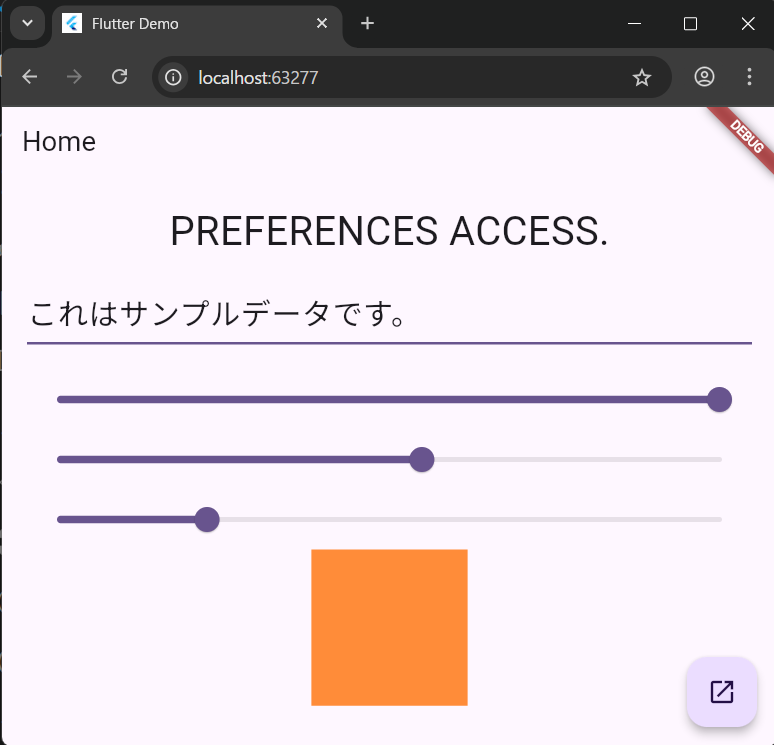

# 設定情報の利用

 
`pubspec.yamlのソースコード(Shared Preferencesの追加)`
```yaml
# プロジェクトの名前と説明を定義します。
# 'name'はプロジェクトの識別名、'description'は簡単な説明です。
name: chapter_6_1_20250617_6_6
description: "A new Flutter project." # プロジェクトの概要や目的を記載します。

# 'publish_to'はパッケージの公開先を指定します。
# 'none'に設定すると、このプロジェクトはpub.devに公開されません。
publish_to: 'none' # 公開したい場合、この行を削除します。

# プロジェクトのバージョン情報を指定します。
# '1.0.0'がバージョン番号で、'+1'がビルド番号を意味します。
version: 1.0.0+1

# Dart SDKのバージョンを指定します。
# '^3.7.2'は、このバージョン以上の互換性を保証します。
environment:
  sdk: ^3.7.2

# プロジェクトに必要な依存関係を定義します。
dependencies:
  # Flutter SDKを指定します。Flutterプロジェクトの基盤となります。
  flutter:
    sdk: flutter
  # 'path_provider'は、デバイス内の特定のディレクトリへのアクセスを可能にします。
  path_provider: any
  # 'shared_preferences'は、簡単なデータをローカルに保存するために使用します。
  shared_preferences: any
  # 'cupertino_icons'は、iOSのスタイルアイコンを提供します。
  cupertino_icons: ^1.0.8

# 開発中にのみ使用する依存関係を指定します。
dev_dependencies:
  # 'flutter_test'は、テストを実行するためのFlutter専用ツールです。
  flutter_test:
    sdk: flutter
  # 'flutter_lints'は、コードスタイルチェック用のツールです。
  flutter_lints: ^5.0.0

# Flutter固有の設定を指定します。
flutter:
  # Material Designウィジェットを有効化します。
  uses-material-design: true
```

`main.dartのソースコード(Shared Preferencesを使った設定の読み書き)`
```dart
// Flutterの基礎パッケージをインポートします。
// 'material.dart'はMaterial Design UIを提供します。
// 'shared_preferences'は設定やデータを簡単に保存するためのライブラリです。
import 'package:flutter/material.dart';
import 'package:shared_preferences/shared_preferences.dart';
import 'dart:ui' as ui; // UI関連のフォントやスタイルを扱うためのパッケージ。

// アプリを実行するためのエントリーポイントです。
void main() {
  runApp(const MyApp());
}

// アプリ全体の構造を定義するクラスです。状態を持たないStatelessWidgetです。
class MyApp extends StatelessWidget {
  const MyApp({super.key});

  // このウィジェットはアプリケーションのルート部分を構成します。
  @override
  Widget build(BuildContext context) {
    return MaterialApp(
      title: 'Flutter Demo', // アプリのタイトルを設定します。
      theme: ThemeData(
        // アプリのテーマ（デザインスタイル）を設定します。
        colorScheme: ColorScheme.fromSeed(seedColor: Colors.deepPurple), // 基調の色を設定。
      ),
      home: const MyHomePage(title: 'Flutter Demo Home Page'), // ホーム画面としてMyHomePageを指定。
    );
  }
}

// アプリのホーム画面を定義するクラスです。状態を持つStatefulWidget。
class MyHomePage extends StatefulWidget {
  const MyHomePage({super.key, required this.title});

  final String title; // 親ウィジェットから渡されるタイトル値。

  @override
  State<MyHomePage> createState() => _MyHomePageState();
}

// このクラスでは、ホーム画面の動作や状態を管理します。
class _MyHomePageState extends State<MyHomePage> {
  // ユーザーの入力を管理するためのテキストコントローラー。
  final _controller = TextEditingController();
  // RGBの色値を管理する変数。初期値は0です。
  double _r = 0.0;
  double _g = 0.0;
  double _b = 0.0;

  // 初期化時にSharedPreferencesからデータを読み込みます。
  @override
  void initState() {
    super.initState();
    loadPref(); // 保存された設定を読み込む関数。
  }

  @override
  Widget build(BuildContext context) {
    return Scaffold(
      appBar: AppBar(title: Text('Home')), // 上部のバーにタイトルを表示。
      body: Padding(
        padding: EdgeInsets.all(20.0), // 全体の余白を設定します。
        child: Column(
          children: <Widget>[
            // 画面のタイトルとして大きなテキストを表示。
            Text(
              'PREFERENCES ACCESS.',
              style: TextStyle(fontSize: 32, fontWeight: ui.FontWeight.w500),
            ),
            Padding(padding: EdgeInsets.all(10.0)), // タイトルの下に余白を追加。
            // ユーザーが入力できるテキストフィールド。
            TextField(
              controller: _controller,
              style: TextStyle(fontSize: 24), // テキストのサイズを設定。
              minLines: 1, // 最小1行。
              maxLines: 5, // 最大5行まで入力可能。
            ),
            Padding(padding: EdgeInsets.all(10.0)),
            // 赤色値を設定するスライダー。
            Slider(
              min: 0.0, // 最小値は0。
              max: 255.0, // 最大値は255。
              value: _r, // 現在の値。
              divisions: 255, // スライダーのステップを255に分割。
              onChanged: (double value) {
                setState(() {
                  _r = value; // 値が変わるたびに更新。
                });
              },
            ),
            // 緑色値を設定するスライダー。
            Slider(
              min: 0.0,
              max: 255.0,
              value: _g,
              divisions: 255,
              onChanged: (double value) {
                setState(() {
                  _g = value;
                });
              },
            ),
            // 青色値を設定するスライダー。
            Slider(
              min: 0.0,
              max: 255.0,
              value: _b,
              divisions: 255,
              onChanged: (double value) {
                setState(() {
                  _b = value;
                });
              },
            ),
            // 設定した色を表示するコンテナ（矩形）。
            Container(
              padding: EdgeInsets.all(20),
              width: 125,
              height: 125,
              color: Color.fromARGB(255, _r.toInt(), _g.toInt(), _b.toInt()),
            ),
          ],
        ),
      ),
      // 画面右下に配置する保存ボタン。
      floatingActionButton: FloatingActionButton(
        child: Icon(Icons.open_in_new), // 保存アイコン。
        onPressed: () {
          savePref(); // 現在の設定を保存。
          showDialog(
            context: context,
            builder: (BuildContext context) => AlertDialog(
              title: Text("saved!"), // 保存成功の通知タイトル。
              content: Text("save preferences."), // 通知内容。
            ),
          );
        },
      ),
    );
  }

  // SharedPreferencesを使って保存されたデータを読み込む関数。
  void loadPref() async {
    final prefs = await SharedPreferences.getInstance();
    setState(() {
      _r = (prefs.getDouble('r') ?? 0.0); // 赤色値を読み込み、存在しなければ0に。
      _g = (prefs.getDouble('g') ?? 0.0); // 緑色値を読み込み、存在しなければ0に。
      _b = (prefs.getDouble('b') ?? 0.0); // 青色値を読み込み、存在しなければ0に。
      _controller.text = (prefs.getString('input') ?? ''); // 入力されたテキストを読み込み。
    });
  }

  // SharedPreferencesを使って現在のデータを保存する関数。
  void savePref() async {
    final prefs = await SharedPreferences.getInstance();
    prefs.setDouble('r', _r); // 赤色値を保存。
    prefs.setDouble('g', _g); // 緑色値を保存。
    prefs.setDouble('b', _b); // 青色値を保存。
    prefs.setString('input', _controller.text); // 入力されたテキストを保存。
  }
}
```

【 実行画面 】



> flutter runの再起動について
- 設定情報を登録した際に、再度停止を行ってから、runすると起動に時間がかかるため、ホットリロード（ターミナルにてrを押下）すると即時変更内容を反映することができる。


