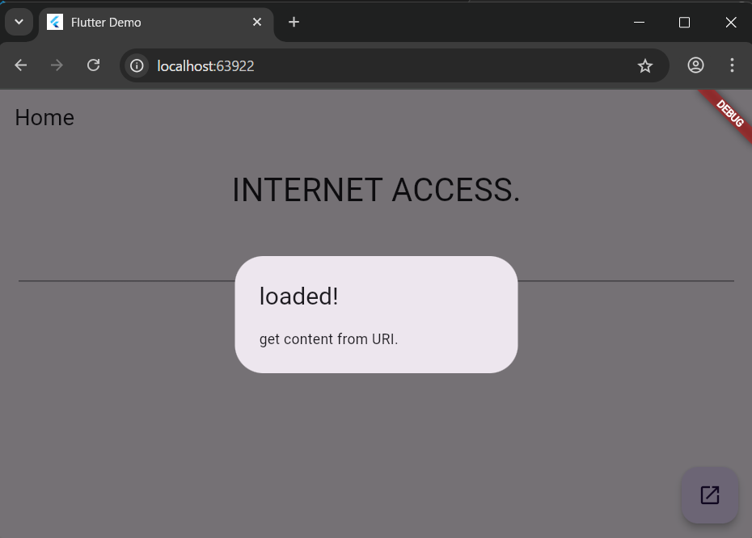
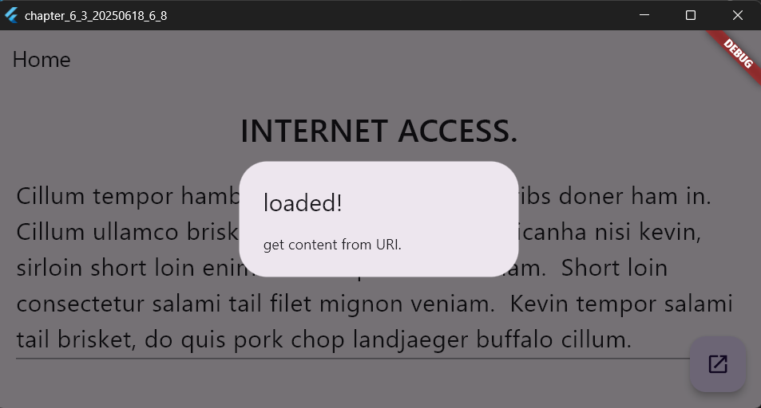
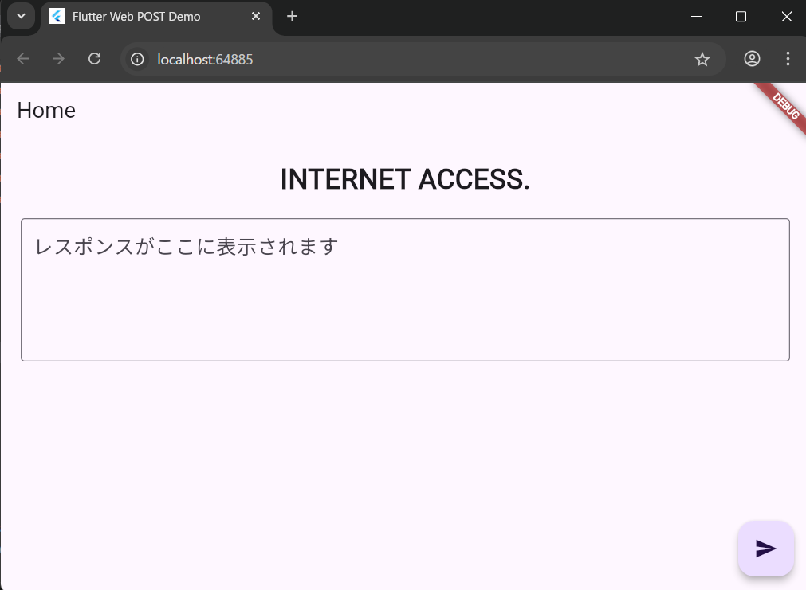

# ネットワークアクセス

2025年6月18日
### 今日のキーワード： 「BBQ（推しにはお金は使いません！）」➡BBQの起源は、カリブ海の先住民族が牛や豚を丸焼きにしていた「バルバコア」という方法にさかのぼります。この技法がスペインを経由してアメリカに伝わり、現代の「バーベキュー」になったと言われている。ちなみに、「BBQ」って略称は英語の「Barbecue」の頭文字を使った言葉からきています。また、アメリカのバーベキューと日本の焼肉は似ているが、焼き方やスタイルが少し異なり、アメリカでは鉄板でじっくり火を通すことが多いが、日本の焼肉は薄切りの肉を手早く焼いてすぐに食べるスタイルが特徴です。

---
 
`main.dartのソースコード(Webサイトからテキストを取得し表示する)`
```dart
// 必要なライブラリをインポートします。
// 'dart:convert' はJSONデータのエンコード/デコードに使用。
// 'dart:io' はHTTP通信を扱うためのライブラリ。
// 'material.dart' はFlutterのUIコンポーネントを提供。
import 'dart:convert';
import 'dart:io';
import 'package:flutter/material.dart';
import 'dart:ui' as ui; // UI関連のフォントやスタイルを扱うためのパッケージ。

// アプリのエントリーポイント。runApp() でアプリを起動。
void main() {
  runApp(const MyApp());
}

// アプリ全体の構造を定義するクラス。StatelessWidgetで状態を持たない。
class MyApp extends StatelessWidget {
  const MyApp({super.key});

  @override
  Widget build(BuildContext context) {
    // アプリ全体のテーマやホーム画面を設定するMaterialApp。
    return MaterialApp(
      title: 'Flutter Demo', // アプリのタイトルを指定。
      theme: ThemeData(
        // アプリのテーマカラーを設定。深い紫色を基調にします。
        colorScheme: ColorScheme.fromSeed(seedColor: Colors.deepPurple),
      ),
      home: const MyHomePage(title: 'Flutter Demo Home Page'), // ホーム画面を指定。
    );
  }
}

// 状態を持つウィジェット（StatefulWidget）を定義。
class MyHomePage extends StatefulWidget {
  const MyHomePage({super.key, required this.title});

  // 親ウィジェットから渡されるタイトル値。
  final String title;

  @override
  State<MyHomePage> createState() => _MyHomePageState(); // 状態管理クラスを作成。
}

// ホーム画面の動作や状態を管理するクラス。
class _MyHomePageState extends State<MyHomePage> {
  // ユーザーの入力を管理するためのTextEditingController。
  final _controller = TextEditingController();

  // HTTP通信に使用するホスト名とパスを定義。
  static const host = 'baconipsum.com';
  static const path = '/api/?type=meat-and-filler&paras=1&format=text';

  @override
  Widget build(BuildContext context) {
    // アプリのUI構造を定義するScaffoldウィジェット。
    return Scaffold(
      appBar: AppBar(title: Text('Home')), // 上部のAppBarにタイトルを表示。
      body: Padding(
        padding: EdgeInsets.all(20.0), // 全体に余白を設定。
        child: Column(
          children: <Widget>[
            // タイトルとして大きな文字を表示。
            Text(
              'INTERNET ACCESS.',
              style: TextStyle(fontSize: 32, fontWeight: ui.FontWeight.w500),
            ),
            Padding(padding: EdgeInsets.all(10.0)), // テキストと入力欄の間に余白を追加。
            // ユーザーが入力できるテキストフィールドを作成。
            TextField(
              controller: _controller, // 入力内容を管理。
              style: TextStyle(fontSize: 24), // テキストの大きさを設定。
              minLines: 1, // 最小1行。
              maxLines: 5, // 最大5行まで入力可能。
            ),
          ],
        ),
      ),
      // 画面右下に配置するボタン（FloatingActionButton）。
      floatingActionButton: FloatingActionButton(
        child: Icon(Icons.open_in_new), // ボタンのアイコンを設定。
        onPressed: () {
          getData(); // ボタンが押されたらHTTPリクエストを送信。
          showDialog(
            context: context, // ダイアログを表示。
            builder: (BuildContext context) => AlertDialog(
              title: Text("loaded!"), // ダイアログのタイトル。
              content: Text("get content from URI."), // ダイアログのメッセージ。
            ),
          );
        },
      ),
    );
  }

  // HTTPリクエストを送信してデータを取得する関数。
  void getData() async {
    var http = await HttpClient(); // HttpClientインスタンスを作成。
    // HTTP GETリクエストを作成し、指定したホストとパスに送信。
    HttpClientRequest request = await http.get(host, 80, path);
    // サーバーからのレスポンスを受け取る。
    HttpClientResponse response = await request.close();
    // レスポンスデータを文字列として取得。
    final value = await response.transform(utf8.decoder).join();
    // 取得したデータをテキストフィールドに表示。
    _controller.text = value;
  }
}
```
> Http Clientクラスの利用について
- dart:ioというパッケージに用意されているクラスを利用。指定のURLにアクセスしてデータを取得する。
- フローティングアクションボタンをクリックすると、baconipsum.comというWebサイトにアクセスし、ランダムなテキストを取得して表示する。ここでは、getDataというメソッドとして、インターネットアクセスしデータを取得する処理を用意している。


---
 
`main.dartのソースコード(getUriでHTTPアクセスする)`
```dart
// 必要なライブラリをインポートします。
// 'dart:convert' はデータのエンコード/デコード（例: JSON操作）に使用します。
// 'dart:io' はHTTP通信やファイル操作など、OS関連の処理を行います。
// 'material.dart' はFlutterの基本UIコンポーネントを提供します。
// 'dart:ui' はカスタムフォントやスタイルを扱うために使用します。
import 'dart:convert';
import 'dart:io';
import 'package:flutter/material.dart';
import 'dart:ui' as ui;

// アプリケーションのエントリーポイント。
// runApp()でMyAppクラスをFlutterのルートウィジェットとして起動します。
void main() {
  runApp(const MyApp());
}

// アプリの全体構造を定義するクラス。
// StatelessWidgetを継承しており、状態を持たない静的なウィジェットです。
class MyApp extends StatelessWidget {
  const MyApp({super.key});

  @override
  Widget build(BuildContext context) {
    // MaterialAppはFlutterアプリケーションの基本構造を提供します。
    return MaterialApp(
      title: 'Flutter Demo', // アプリのタイトル（デバッグ画面などに表示されます）。
      theme: ThemeData(
        // アプリのテーマ（デザインスタイル）を設定します。
        colorScheme: ColorScheme.fromSeed(seedColor: Colors.deepPurple), // メインの色を紫に設定。
      ),
      home: const MyHomePage(title: 'Flutter Demo Home Page'), // アプリのホーム画面を指定。
    );
  }
}

// StatefulWidgetは動的な状態を持つウィジェットを定義するクラスです。
// 動的なデータやユーザー入力を管理するのに適しています。
class MyHomePage extends StatefulWidget {
  const MyHomePage({super.key, required this.title});

  final String title; // ウィジェットのタイトル。

  @override
  State<MyHomePage> createState() => _MyHomePageState(); // 状態管理クラスを作成。
}

// アプリのメイン画面の動作や状態を管理するクラスです。
class _MyHomePageState extends State<MyHomePage> {
  // テキスト入力を管理するためのコントローラーを用意します。
  final _controller = TextEditingController();

  // データ取得先のサーバー情報を定義します。
  static const host = 'baconipsum.com'; // サーバーのホスト名。
  static const path = '/api/?type=meat-and-filler&paras=1&format=text'; // APIのパス。
  static const url =
      'https://baconipsum.com/api/?type=meat-and-filler&paras=1&format=text'; // APIの完全なURL。

  @override
  Widget build(BuildContext context) {
    // 画面のレイアウトを定義します。
    return Scaffold(
      appBar: AppBar(title: Text('Home')), // 上部にタイトルバーを配置します。
      body: Padding(
        padding: EdgeInsets.all(20.0), // 画面全体に余白を設定。
        child: Column(
          children: <Widget>[
            // タイトルテキストを大きな文字で表示。
            Text(
              'INTERNET ACCESS.',
              style: TextStyle(fontSize: 32, fontWeight: ui.FontWeight.w500),
            ),
            Padding(padding: EdgeInsets.all(10.0)), // タイトルの下に余白を挿入。
            // 入力欄を配置。取得したデータを表示する際にも使います。
            TextField(
              controller: _controller, // テキストフィールドの入力内容を管理。
              style: TextStyle(fontSize: 24), // フォントサイズを設定。
              minLines: 1, // 最小1行の高さ。
              maxLines: 5, // 最大5行の高さ。
            ),
          ],
        ),
      ),
      // 画面右下にボタンを設置。
      floatingActionButton: FloatingActionButton(
        child: Icon(Icons.open_in_new), // ボタンのアイコン。
        onPressed: () {
          getData(); // ボタンが押されたらAPIからデータを取得。
          showDialog(
            // データ取得後にダイアログを表示します。
            context: context,
            builder: (BuildContext context) => AlertDialog(
              title: Text("loaded!"), // ダイアログのタイトル。
              content: Text("get content from URI."), // ダイアログの内容。
            ),
          );
        },
      ),
    );
  }

  // APIからデータを取得する非同期関数。
  void getData() async {
    var https = await HttpClient(); // HTTP通信をするためのクライアントを作成。
    HttpClientRequest request = await https.getUrl(Uri.parse(url)); // GETリクエストを送信。
    HttpClientResponse response = await request.close(); // サーバーからの応答を取得。
    final value = await response.transform(utf8.decoder).join(); // UTF-8でデコードしてデータを読み込む。
    _controller.text = value; // 取得したデータをテキストフィールドに表示。
  }
}
```

【 実行画面 】




> getUriでのHTTPSアクセスについて

- HTTPでもHTTPSでも、get以降の部分を変えることで、GETリクエストを作成し、指定したホストとパスに送信している。
  - HTTP ➡ HttpClientRequest request = await http.get(host, 80,path);
  - HTTPS ➡ HttpClientRequest request = await https.getUrl(Uri.parse(url));

---
 
`pubspec.yamlのソースコード(Webサイトにデータを送信する)`
```yaml
【yaml】
# プロジェクトの名前と説明を定義します。
# 'name'はプロジェクトの識別名、'description'は簡単な概要を記述します。
name: chapter_6_3_20250618_6_11
description: "A new Flutter project." # プロジェクトの目的や内容を記載。

# パッケージの公開先を設定します。
# 'none'に設定されている場合、このプロジェクトはpub.devに公開されません。
publish_to: 'none' # 公開する場合はこの行を削除してください。

# プロジェクトのバージョン情報を設定します。
# '1.0.0'がバージョン番号、'+1'がビルド番号を意味します。
version: 1.0.0+1

# Dart SDKのバージョンを指定します。
# '^3.7.2'は、このバージョン以上を使用することを示します。
environment:
  sdk: ^3.7.2

# プロジェクトで利用する依存関係を定義します。
dependencies:
  # HTTP通信に使用するパッケージです。APIとのやりとりに役立ちます。
  http: ^0.13.6
  # Flutter SDKを指定します。このプロジェクトの基盤です。
  flutter:
    sdk: flutter
  # Cupertinoスタイルのアイコンを利用するためのライブラリです。
  cupertino_icons: ^1.0.8

# 開発中にのみ使用される依存関係を定義します。
dev_dependencies:
  # Flutterでユニットテストを実行するためのパッケージです。
  flutter_test:
    sdk: flutter
  # コードスタイルをチェックするためのツールです。
  flutter_lints: ^5.0.0

# Flutter特有の設定を指定します。
flutter:
  # Material Designを有効化します。Flutterアプリのデザイン基準として使用します。
  uses-material-design: true

```

`main.dartのソースコード(Webサイトにデータを送信する)`
```dart
// 必要なライブラリをインポートします。
// 'dart:convert' はJSONのエンコードやデコードに使用します。
// 'flutter/material.dart' はUIコンポーネントを提供します。
// 'http' はAPI通信をするためのパッケージです。
import 'dart:convert';
import 'package:flutter/material.dart';
import 'package:http/http.dart' as http;

// アプリケーションのエントリーポイント。
// runApp()でMyAppクラスを起動し、アプリのルートウィジェットとして指定します。
void main() {
  runApp(const MyApp());
}

// アプリ全体の構造を定義するStatelessWidgetクラス。
// StatelessWidgetは状態を持たない静的なUIを提供します。
class MyApp extends StatelessWidget {
  const MyApp({super.key});

  @override
  Widget build(BuildContext context) {
    // MaterialAppはFlutterアプリケーションの基盤を提供します。
    return MaterialApp(
      title: 'Flutter Web POST Demo', // アプリのタイトル（デバッグ画面などで確認できます）。
      theme: ThemeData(
        // アプリのテーマ設定。紫を基調としたデザイン。
        colorScheme: ColorScheme.fromSeed(seedColor: Colors.deepPurple),
      ),
      home: const MyHomePage(title: 'Home'), // ホーム画面としてMyHomePageを指定します。
    );
  }
}

// ホーム画面を動的に管理するためのStatefulWidgetクラス。
// StatefulWidgetは状態を持つウィジェットです。
class MyHomePage extends StatefulWidget {
  const MyHomePage({super.key, required this.title});

  final String title; // 親ウィジェットから渡されるタイトル。

  @override
  State<MyHomePage> createState() => _MyHomePageState();
}

// ホーム画面の動作や状態を管理するクラス。
class _MyHomePageState extends State<MyHomePage> {
  // ユーザー入力を管理するためのTextEditingController。
  final _controller = TextEditingController();

  // データを送信するAPIのURLを定義します。
  static const url = 'https://jsonplaceholder.typicode.com/posts';

  @override
  Widget build(BuildContext context) {
    // UIの構造を定義するScaffoldウィジェット。
    return Scaffold(
      appBar: AppBar(title: Text(widget.title)), // アプリのタイトルバー。
      body: Padding(
        padding: const EdgeInsets.all(20.0), // 余白を設定。
        child: Column(
          children: <Widget>[
            // タイトルテキストを表示。
            const Text(
              'INTERNET ACCESS.', // 表示タイトル。
              style: TextStyle(fontSize: 28, fontWeight: FontWeight.w600),
            ),
            const SizedBox(height: 20), // タイトルと入力欄の間にスペースを追加。
            // レスポンスを表示するためのテキストフィールド。
            TextField(
              controller: _controller, // テキスト入力を管理します。
              style: const TextStyle(fontSize: 20), // フォントサイズを設定。
              minLines: 4, // 表示行数の最小値。
              maxLines: 8, // 表示行数の最大値。
              decoration: const InputDecoration(
                border: OutlineInputBorder(), // 枠線を表示します。
                hintText: 'レスポンスがここに表示されます', // 入力欄のヒント。
              ),
            ),
          ],
        ),
      ),
      // 画面右下にボタンを設置。
      floatingActionButton: FloatingActionButton(
        child: const Icon(Icons.send), // ボタンにアイコンを設定。
        onPressed: () {
          // ボタンが押されたときにデータ送信処理を実行。
          postData();
          showDialog(
            context: context,
            builder: (BuildContext context) => const AlertDialog(
              title: Text("送信完了！"), // ダイアログのタイトル。
              content: Text("POSTリクエストを送信しました。"), // ダイアログの内容。
            ),
          );
        },
      ),
    );
  }

  // APIにデータを送信する非同期関数。
  Future<void> postData() async {
    // 送信するデータを定義します。
    final data = {
      "title": "foo", // データのタイトル。
      "body": "this is content. これはサンプルのコンテンツです。", // データの内容。
      "userId": 1, // ユーザーIDを指定します。
    };

    try {
      // HTTP POSTリクエストを送信します。
      final response = await http.post(
        Uri.parse(url), // APIのURLを解析してリクエストに渡します。
        headers: {"Content-Type": "application/json; charset=UTF-8"}, // リクエストヘッダー。
        body: json.encode(data), // データをJSON形式に変換して送信。
      );

      if (response.statusCode == 201) {
        // レスポンスのステータスコードが201（作成成功）の場合。
        setState(() {
          _controller.text = response.body; // レスポンス内容をテキストフィールドに表示。
        });
      } else {
        // ステータスコードが成功でない場合はエラーメッセージを表示。
        setState(() {
          _controller.text = 'エラー: ステータスコード ${response.statusCode}';
        });
      }
    } catch (e) {
      // 通信エラーが発生した場合。
      setState(() {
        _controller.text = '通信エラー: $e'; // エラー内容をテキストフィールドに表示。
      });
    }
  }
}
```

【 実行画面 】




> Webサイトにデータを送信する方法の変更について
- import 'dart:io';は、Webでは使用できないライブラリ。
そのため、HttpClient() など dart:io のAPIは Flutter Webでは動作しないため、httpパッケージに切り替えて実施
> 動作内容
1. 「送信」ボタン（FAB）を押すと、jsonplaceholder.typicode.com/posts にデータを送信
2. 成功すると、受け取ったJSONレスポンスをTextFieldに表示
3. 通信エラー・ステータスコードエラーも表示