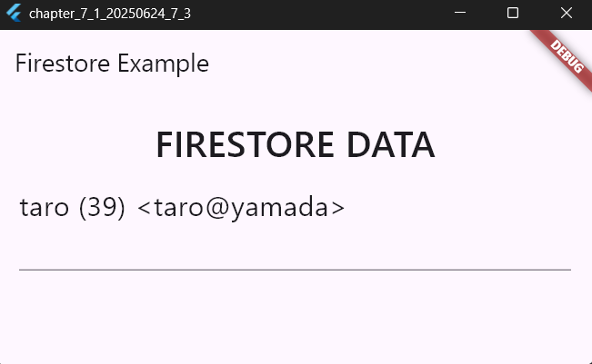
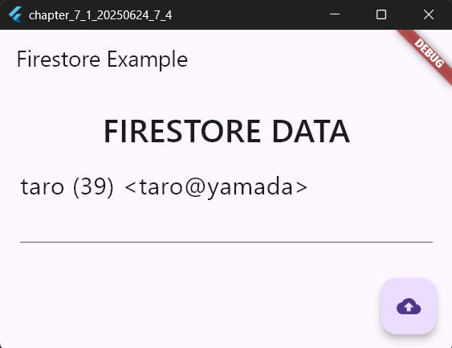

# Firebaseの利用

2025年6月24日
### 今日のキーワード： 「しょうゆ」➡醤油は紀元前300年ごろ、中国で誕生したのが始まりと言われている。その後、日本には奈良時代に伝わり、独自の発展を遂げた。日本の醤油は5つの種類に分けられ：濃口、淡口、溜まり、白醤油、そして再仕込み醤油。それぞれに異なる味や用途があり、料理に合わせた使い方が楽しめるのが特徴です。たとえば、関西地方では「淡口醤油」が主流で、素材の味を引き立てる使い方が好まれる。一方、関東地方では「濃口醤油」が主流で、コクのある味わいが人気。ちなみに、醤油の熟成過程でできる「香り」は約300種類以上とも言われている。現代では、健康に配慮して塩分控えめの醤油やグルテンフリー醤油なんかも登場しています。
---
> Firebase利用の準備について
- 今回はnpmを利用してCLIをインストール（Node.jsをインストールして実施）※スタンドアロンバイナリではインストールできなかった。
1. コマンドプロンプトにて、npmをインストール  
  ➡ npm install -g firebase-tools
2. コマンドプロンプトにて、Firebaseにログイン  
  ➡ firebase login
3. VScodeのターミナルにて、Firebaseのコアパッケージをインストール  
  ➡ flutter pub add firebase_core  ※Flutterプロジェクトのフォルダ内にカレントディレクトリを移動させること
4. VScodeのターミナルにて、Firebaseのコアパッケージを最新のものにバージョンアップ  
  ➡ flutter pub upgrade firebase_core
5. VScodeのターミナルにて、cloud_Firestoreのインストール  
  ➡ flutter pub add cloud_firestore  
  ➡ flutter pub upgrade cloud_firestore
> Firebaseの設定について
1. VScodeのターミナルにて、flutterfireコマンドプログラムの用意  
  ➡ dart pub global activate flutterfire_cli
2. VScodeのターミナルにて、firebaseの設定  
  ➡ flutterfire configure  ※カレントディレクトリをFlutterプロジェクトのフォルダ内移動させること
3. VScodeのターミナルにて、firebaseに用意されているプロジェクトを確認し利用するプロジェクトを選択  
4. VScodeのターミナルにて、どのプラットフォームの設定をサポートするか指定する  ※windows(クローム)を選択しないとうまくいかない。

---

 
`main.dartのソースコード(_MyHomePageStateからFirestoreにアクセスする)`
```dart
import 'package:flutter/material.dart'; // Flutter UIフレームワークのコアライブラリ。
import 'dart:ui' as ui; // UI関連で細かいカスタマイズに使用。
import 'package:firebase_core/firebase_core.dart'; // Firebase初期化用ライブラリ。
import 'firebase_options.dart'; // Firebase設定ファイル（自動生成されたもの）。
import 'package:cloud_firestore/cloud_firestore.dart'; // Firestoreデータベース操作用。

void main() async {
  // Firebaseの設定を初期化するため、Flutterエンジンバインディングを初期化。
  WidgetsFlutterBinding.ensureInitialized();

  // Firebaseアプリの初期化。
  // Firebaseプロジェクトの設定ファイル（firebase_options.dart）を指定して初期化。
  await Firebase.initializeApp(options: DefaultFirebaseOptions.currentPlatform);

  // Flutterアプリを開始し、MyAppウィジェットをルートとして表示。
  runApp(MyApp());
}

// アプリ全体の構造と外観を提供するStatelessWidgetクラス。
class MyApp extends StatelessWidget {
  const MyApp({super.key}); // 必須のコンストラクタ。

  @override
  Widget build(BuildContext context) {
    // アプリ全体の設定を行うMaterialAppウィジェットを返す。
    return MaterialApp(
      title: 'Generated App', // アプリ名（端末で確認可能）。
      theme: ThemeData(
        primarySwatch: Colors.blue, // アプリ全体のカラーテーマを青に設定。
        primaryColor: const Color(0xff2196f3), // メインカラーをより具体的に指定。
        canvasColor: const Color(0xfffafafa), // 背景色を設定（薄いグレー）。
      ),
      home: MyHomePage(), // アプリのメイン画面（MyHomePage）を設定。
    );
  }
}

// メイン画面を表すStatefulWidgetクラス（動的な要素を持つ）。
class MyHomePage extends StatefulWidget {
  const MyHomePage({super.key}); // コンストラクタ。

  @override
  _MyHomePageState createState() => _MyHomePageState(); // 状態管理クラスを作成。
}

// MyHomePageの状態を管理するクラス。
class _MyHomePageState extends State<MyHomePage> {
  // 入力フィールドの内容を操作するためのコントローラー。
  final _controller = TextEditingController();

  @override
  void initState() {
    super.initState();
    // 画面が作成されると同時にFirestoreからデータを取得して表示。
    fetchFirestoreData();
  }

  @override
  Widget build(BuildContext context) {
    // 画面全体のUI構造を提供するScaffoldウィジェット。
    return Scaffold(
      appBar: AppBar(title: Text('Firestore Example')), // 画面上部にタイトルを表示。
      body: Padding(
        padding: EdgeInsets.all(20.0), // UI全体に20pxの余白を設定。
        child: Column(
          children: <Widget>[
            Text(
              'FIRESTORE DATA', // 見出し（大文字）を表示。
              style: TextStyle(
                fontSize: 32,
                fontWeight: ui.FontWeight.w500,
              ), // テキストのスタイルを設定。
            ),
            SizedBox(height: 10), // 見出しと入力欄の間に余白を追加。
            TextField(
              controller: _controller, // テキストフィールドにデータを表示させるためのコントローラー。
              style: TextStyle(fontSize: 24), // テキストのサイズを設定。
              minLines: 1, // 最小行数を1行に設定。
              maxLines: 10, // 最大行数を10行に設定。
            ),
          ],
        ),
      ),
    );
  }

  // Firestoreからデータを取得して表示する非同期処理。
  Future<void> fetchFirestoreData() async {
    try {
      // Firestoreデータベースのインスタンスを取得。
      FirebaseFirestore firestore = FirebaseFirestore.instance;

      // コレクション 'mydata' のすべてのドキュメントを取得。
      QuerySnapshot snapshot = await firestore.collection('mydata').get();

      String msg = ''; // 表示用の文字列を格納する変数。
      // 各ドキュメントをループ処理してデータを取得。
      for (var doc in snapshot.docs) {
        final name = doc.get('name'); // ドキュメントから"name"フィールドを取得。
        final mail = doc.get('mail'); // ドキュメントから"mail"フィールドを取得。
        final age = doc.get('age'); // ドキュメントから"age"フィールドを取得。
        // 取得したデータを1行にまとめて格納。
        msg += "$name ($age) <$mail>\n";
      }

      // テキストフィールドに取得したデータを表示。
      setState(() {
        _controller.text = msg; // データをコントローラーにセット。
      });
    } catch (e) {
      // エラー発生時にエラーメッセージを表示。
      setState(() {
        _controller.text = 'Error fetching data: $e';
      });
    }
  }
}
```
【 実行画面 】




> WidgetsFlutterBindingについて
- Flutterエンジンの機能をフレームワークから利用するためのもの。runAppを実行する前に何らかの処理を行う場合は、WidgetsFlutterBindingを準備し利用する必要がある。今回は、runAPPの前にFirebaseを初期化処理をするためこのコードを記載している。

> DefaultFirebaseOptions.currentPlatformについて
- Firebase.initializeApp(options: 設定情報) ⇐ options引数に、DefaultFirebaseOptions.currentPlatformという値を指定して呼び出すとFirebaseが初期化される。DefaultFirebaseOptionsは、firebase_Options.dartに用意されているクラスで、currentPlatformプロパティにはアプリが実行されているプラットフォームの設定情報が保管されている。これをoptionsに指定することでアプリが動いているプラットフォームに合わせてFirebaseが初期化されるようになる。

---
 
`main.dartのソースコード(_MyHomePageStateからFirestoreにアクセスする：フローティングアクションボタンで取得)`
```dart
import 'package:flutter/material.dart';
import 'dart:ui' as ui;
import 'package:firebase_core/firebase_core.dart';
import 'firebase_options.dart';
import 'package:cloud_firestore/cloud_firestore.dart';

void main() async {
  WidgetsFlutterBinding.ensureInitialized();
  await Firebase.initializeApp(options: DefaultFirebaseOptions.currentPlatform);
  runApp(MyApp());
}

// アプリ全体の構造を定義するStatelessWidgetです。
class MyApp extends StatelessWidget {
  const MyApp({super.key});

  @override
  Widget build(BuildContext context) {
    // MaterialAppはアプリ全体の設定を行います。
    return MaterialApp(
      title: 'Generated App',
      theme: ThemeData(
        primarySwatch: Colors.blue,
        primaryColor: const Color(0xff2196f3),
        canvasColor: const Color(0xfffafafa),
      ),
      home: MyHomePage(),
    );
  }
}

// メイン画面をStatefulWidget（状態を持つウィジェット）として定義します。
class MyHomePage extends StatefulWidget {
  const MyHomePage({super.key});

  @override
  _MyHomePageState createState() => _MyHomePageState();
}

// _MyHomePageStateクラスは画面の状態を管理します。
class _MyHomePageState extends State<MyHomePage> {
  // TextFieldの入力内容を管理するためのコントローラー。
  final _controller = TextEditingController();

  @override
  Widget build(BuildContext context) {
    // Scaffoldはアプリの基本的なUI構造（画面全体）を提供します。
    return Scaffold(
      appBar: AppBar(title: Text('Firestore Example')), // 上部にタイトルを表示。
      body: Padding(
        padding: EdgeInsets.all(20.0),
        child: Column(
          children: <Widget>[
            Text(
              'FIRESTORE DATA',
              style: TextStyle(fontSize: 32, fontWeight: ui.FontWeight.w500),
            ),
            SizedBox(height: 10),
            TextField(
              controller: _controller,
              style: TextStyle(fontSize: 24),
              minLines: 1,
              maxLines: 10,
            ),
          ],
        ),
      ),
      floatingActionButton: FloatingActionButton(
        child: Icon(Icons.cloud_upload), // Firestoreからデータを取得するアイコン。
        onPressed: () async {
          // Firestoreからデータを取得。
          await fetchFirestoreData();
        },
      ),
    );
  }

  // Firestoreからデータを取得するメソッド。
  Future<void> fetchFirestoreData() async {
    try {
      FirebaseFirestore firestore = FirebaseFirestore.instance;
      QuerySnapshot snapshot = await firestore.collection('mydata').get();

      String msg = '';
      for (var doc in snapshot.docs) {
        final name = doc.get('name');
        final mail = doc.get('mail');
        final age = doc.get('age');
        msg += "$name ($age) <$mail>\n";
      }

      setState(() {
        _controller.text = msg; // TextFieldにデータを表示。
      });
    } catch (e) {
      setState(() {
        _controller.text = 'Error fetching data: $e';
      });
    }
  }
}
```

【 実行画面 】



> Firestoreからのデータの取得について
- データの取得に失敗した場合は、Firestore作成の際に、テストモードで作成したかを確認すること。セキュリティ保護ルールの兼ね合いのため、テストモードでないとアクセスが失敗する。

