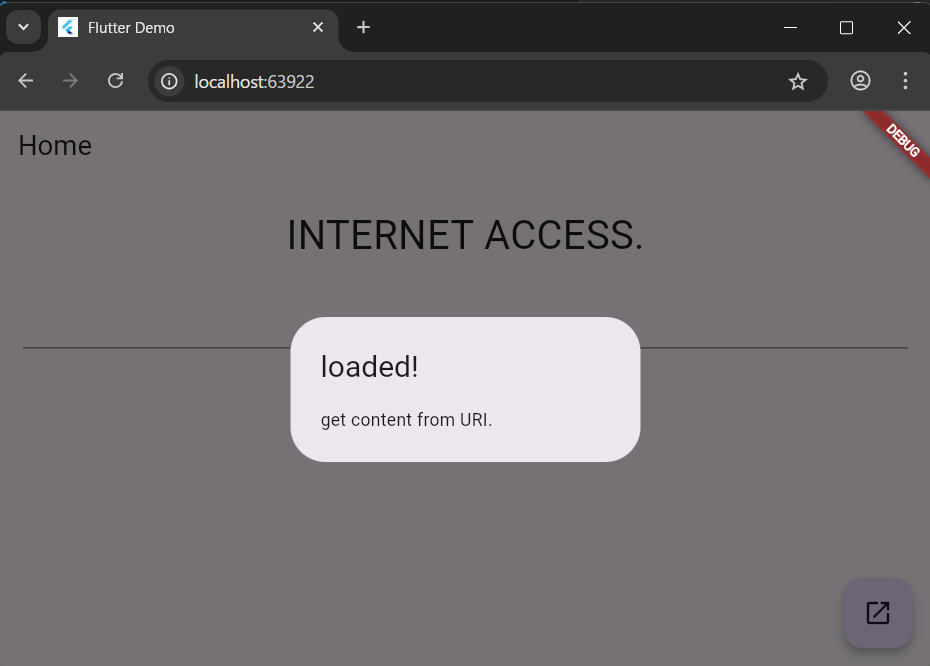
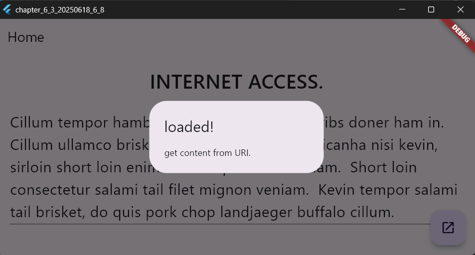
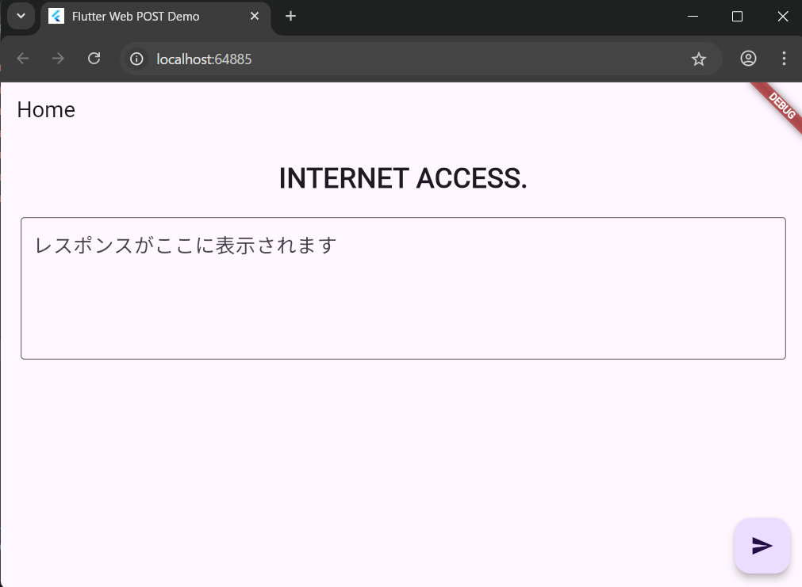
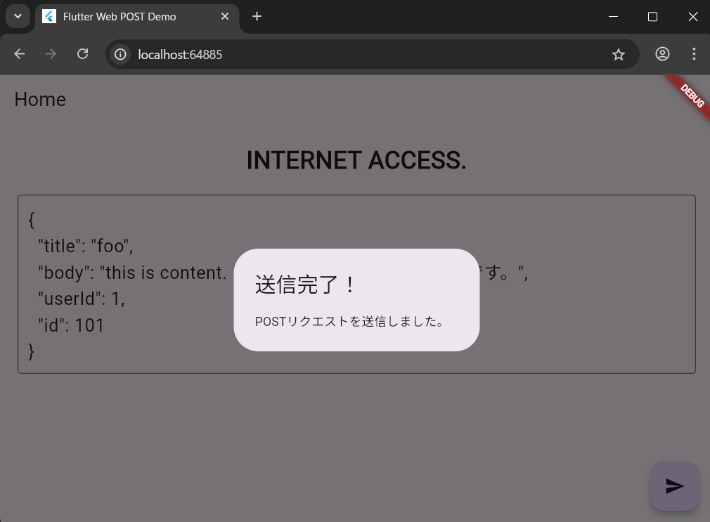

# 検索とソート

2025年6月25日
### 今日のキーワード： 「ハンバーガー」➡アメリカのコネチカット州ニューヘイブンにある「ルイスランチ」というお店が、ハンバーガー発祥の地とされています。ここでは1900年から食パンでパティを挟むスタイルで提供されていたそうです！また、ハンバーガーは「サンドイッチ」の一種と考えられていおり、さらに、日本では1971年7月20日に東京・銀座で初めてマクドナルドの店舗がオープンし、この日を「ハンバーガーの日」として制定しています。オープン当初は、ハンバーガーが高級品とされていました。ちなみに、ハンバーガーってファーストフードの定番ではあるが、実は地域によってスタイルや味が異なっておりアメリカ南部では「スラッピージョー」というピリ辛ミートソースを挟むスタイルが人気で、日本では照り焼きソースを使ったバーガーが独自に進化していきました。

---
 
`main.dartのソースコード(Webサイトからテキストを取得し表示する)`
```dart
// 必要なライブラリをインポートします。
// 'dart:convert' はJSONデータのエンコード/デコードに使用。
// 'dart:io' はHTTP通信を扱うためのライブラリ。
// 'material.dart' はFlutterのUIコンポーネントを提供。
import 'dart:convert';
import 'dart:io';
import 'package:flutter/material.dart';
import 'dart:ui' as ui; // UI関連のフォントやスタイルを扱うためのパッケージ。

// アプリのエントリーポイント。runApp() でアプリを起動。
void main() {
  runApp(const MyApp());
}

// アプリ全体の構造を定義するクラス。StatelessWidgetで状態を持たない。
class MyApp extends StatelessWidget {
  const MyApp({super.key});

  @override
  Widget build(BuildContext context) {
    // アプリ全体のテーマやホーム画面を設定するMaterialApp。
    return MaterialApp(
      title: 'Flutter Demo', // アプリのタイトルを指定。
      theme: ThemeData(
        // アプリのテーマカラーを設定。深い紫色を基調にします。
        colorScheme: ColorScheme.fromSeed(seedColor: Colors.deepPurple),
      ),
      home: const MyHomePage(title: 'Flutter Demo Home Page'), // ホーム画面を指定。
    );
  }
}

// 状態を持つウィジェット（StatefulWidget）を定義。
class MyHomePage extends StatefulWidget {
  const MyHomePage({super.key, required this.title});

  // 親ウィジェットから渡されるタイトル値。
  final String title;

  @override
  State<MyHomePage> createState() => _MyHomePageState(); // 状態管理クラスを作成。
}

// ホーム画面の動作や状態を管理するクラス。
class _MyHomePageState extends State<MyHomePage> {
  // ユーザーの入力を管理するためのTextEditingController。
  final _controller = TextEditingController();

  // HTTP通信に使用するホスト名とパスを定義。
  static const host = 'baconipsum.com';
  static const path = '/api/?type=meat-and-filler&paras=1&format=text';

  @override
  Widget build(BuildContext context) {
    // アプリのUI構造を定義するScaffoldウィジェット。
    return Scaffold(
      appBar: AppBar(title: Text('Home')), // 上部のAppBarにタイトルを表示。
      body: Padding(
        padding: EdgeInsets.all(20.0), // 全体に余白を設定。
        child: Column(
          children: <Widget>[
            // タイトルとして大きな文字を表示。
            Text(
              'INTERNET ACCESS.',
              style: TextStyle(fontSize: 32, fontWeight: ui.FontWeight.w500),
            ),
            Padding(padding: EdgeInsets.all(10.0)), // テキストと入力欄の間に余白を追加。
            // ユーザーが入力できるテキストフィールドを作成。
            TextField(
              controller: _controller, // 入力内容を管理。
              style: TextStyle(fontSize: 24), // テキストの大きさを設定。
              minLines: 1, // 最小1行。
              maxLines: 5, // 最大5行まで入力可能。
            ),
          ],
        ),
      ),
      // 画面右下に配置するボタン（FloatingActionButton）。
      floatingActionButton: FloatingActionButton(
        child: Icon(Icons.open_in_new), // ボタンのアイコンを設定。
        onPressed: () {
          getData(); // ボタンが押されたらHTTPリクエストを送信。
          showDialog(
            context: context, // ダイアログを表示。
            builder: (BuildContext context) => AlertDialog(
              title: Text("loaded!"), // ダイアログのタイトル。
              content: Text("get content from URI."), // ダイアログのメッセージ。
            ),
          );
        },
      ),
    );
  }

  // HTTPリクエストを送信してデータを取得する関数。
  void getData() async {
    var http = await HttpClient(); // HttpClientインスタンスを作成。
    // HTTP GETリクエストを作成し、指定したホストとパスに送信。
    HttpClientRequest request = await http.get(host, 80, path);
    // サーバーからのレスポンスを受け取る。
    HttpClientResponse response = await request.close();
    // レスポンスデータを文字列として取得。
    final value = await response.transform(utf8.decoder).join();
    // 取得したデータをテキストフィールドに表示。
    _controller.text = value;
  }
}
```
> Http Clientクラスの利用について
- dart:ioというパッケージに用意されているクラスを利用。指定のURLにアクセスしてデータを取得する。
- フローティングアクションボタンをクリックすると、baconipsum.comというWebサイトにアクセスし、ランダムなテキストを取得して表示する。ここでは、getDataというメソッドとして、インターネットアクセスしデータを取得する処理を用意している。


---
 
`main.dartのソースコード(getUriでHTTPアクセスする)`
```dart
// 必要なライブラリをインポートします。
// 'dart:convert' はデータのエンコード/デコード（例: JSON操作）に使用します。
// 'dart:io' はHTTP通信やファイル操作など、OS関連の処理を行います。
// 'material.dart' はFlutterの基本UIコンポーネントを提供します。
// 'dart:ui' はカスタムフォントやスタイルを扱うために使用します。
import 'dart:convert';
import 'dart:io';
import 'package:flutter/material.dart';
import 'dart:ui' as ui;

// アプリケーションのエントリーポイント。
// runApp()でMyAppクラスをFlutterのルートウィジェットとして起動します。
void main() {
  runApp(const MyApp());
}

// アプリの全体構造を定義するクラス。
// StatelessWidgetを継承しており、状態を持たない静的なウィジェットです。
class MyApp extends StatelessWidget {
  const MyApp({super.key});

  @override
  Widget build(BuildContext context) {
    // MaterialAppはFlutterアプリケーションの基本構造を提供します。
    return MaterialApp(
      title: 'Flutter Demo', // アプリのタイトル（デバッグ画面などに表示されます）。
      theme: ThemeData(
        // アプリのテーマ（デザインスタイル）を設定します。
        colorScheme: ColorScheme.fromSeed(seedColor: Colors.deepPurple), // メインの色を紫に設定。
      ),
      home: const MyHomePage(title: 'Flutter Demo Home Page'), // アプリのホーム画面を指定。
    );
  }
}

// StatefulWidgetは動的な状態を持つウィジェットを定義するクラスです。
// 動的なデータやユーザー入力を管理するのに適しています。
class MyHomePage extends StatefulWidget {
  const MyHomePage({super.key, required this.title});

  final String title; // ウィジェットのタイトル。

  @override
  State<MyHomePage> createState() => _MyHomePageState(); // 状態管理クラスを作成。
}

// アプリのメイン画面の動作や状態を管理するクラスです。
class _MyHomePageState extends State<MyHomePage> {
  // テキスト入力を管理するためのコントローラーを用意します。
  final _controller = TextEditingController();

  // データ取得先のサーバー情報を定義します。
  static const host = 'baconipsum.com'; // サーバーのホスト名。
  static const path = '/api/?type=meat-and-filler&paras=1&format=text'; // APIのパス。
  static const url =
      'https://baconipsum.com/api/?type=meat-and-filler&paras=1&format=text'; // APIの完全なURL。

  @override
  Widget build(BuildContext context) {
    // 画面のレイアウトを定義します。
    return Scaffold(
      appBar: AppBar(title: Text('Home')), // 上部にタイトルバーを配置します。
      body: Padding(
        padding: EdgeInsets.all(20.0), // 画面全体に余白を設定。
        child: Column(
          children: <Widget>[
            // タイトルテキストを大きな文字で表示。
            Text(
              'INTERNET ACCESS.',
              style: TextStyle(fontSize: 32, fontWeight: ui.FontWeight.w500),
            ),
            Padding(padding: EdgeInsets.all(10.0)), // タイトルの下に余白を挿入。
            // 入力欄を配置。取得したデータを表示する際にも使います。
            TextField(
              controller: _controller, // テキストフィールドの入力内容を管理。
              style: TextStyle(fontSize: 24), // フォントサイズを設定。
              minLines: 1, // 最小1行の高さ。
              maxLines: 5, // 最大5行の高さ。
            ),
          ],
        ),
      ),
      // 画面右下にボタンを設置。
      floatingActionButton: FloatingActionButton(
        child: Icon(Icons.open_in_new), // ボタンのアイコン。
        onPressed: () {
          getData(); // ボタンが押されたらAPIからデータを取得。
          showDialog(
            // データ取得後にダイアログを表示します。
            context: context,
            builder: (BuildContext context) => AlertDialog(
              title: Text("loaded!"), // ダイアログのタイトル。
              content: Text("get content from URI."), // ダイアログの内容。
            ),
          );
        },
      ),
    );
  }

  // APIからデータを取得する非同期関数。
  void getData() async {
    var https = await HttpClient(); // HTTP通信をするためのクライアントを作成。
    HttpClientRequest request = await https.getUrl(Uri.parse(url)); // GETリクエストを送信。
    HttpClientResponse response = await request.close(); // サーバーからの応答を取得。
    final value = await response.transform(utf8.decoder).join(); // UTF-8でデコードしてデータを読み込む。
    _controller.text = value; // 取得したデータをテキストフィールドに表示。
  }
}
```

【 実行画面 】




> getUriでのHTTPSアクセスについて

- HTTPでもHTTPSでも、get以降の部分を変えることで、GETリクエストを作成し、指定したホストとパスに送信している。
  - HTTP ➡ HttpClientRequest request = await http.get(host, 80,path);
  - HTTPS ➡ HttpClientRequest request = await https.getUrl(Uri.parse(url));

---
 
`pubspec.yamlのソースコード(Webサイトにデータを送信する)`
```yaml
【yaml】
# プロジェクトの名前と説明を定義します。
# 'name'はプロジェクトの識別名、'description'は簡単な概要を記述します。
name: chapter_6_3_20250618_6_11
description: "A new Flutter project." # プロジェクトの目的や内容を記載。

# パッケージの公開先を設定します。
# 'none'に設定されている場合、このプロジェクトはpub.devに公開されません。
publish_to: 'none' # 公開する場合はこの行を削除してください。

# プロジェクトのバージョン情報を設定します。
# '1.0.0'がバージョン番号、'+1'がビルド番号を意味します。
version: 1.0.0+1

# Dart SDKのバージョンを指定します。
# '^3.7.2'は、このバージョン以上を使用することを示します。
environment:
  sdk: ^3.7.2

# プロジェクトで利用する依存関係を定義します。
dependencies:
  # HTTP通信に使用するパッケージです。APIとのやりとりに役立ちます。
  http: ^0.13.6
  # Flutter SDKを指定します。このプロジェクトの基盤です。
  flutter:
    sdk: flutter
  # Cupertinoスタイルのアイコンを利用するためのライブラリです。
  cupertino_icons: ^1.0.8

# 開発中にのみ使用される依存関係を定義します。
dev_dependencies:
  # Flutterでユニットテストを実行するためのパッケージです。
  flutter_test:
    sdk: flutter
  # コードスタイルをチェックするためのツールです。
  flutter_lints: ^5.0.0

# Flutter特有の設定を指定します。
flutter:
  # Material Designを有効化します。Flutterアプリのデザイン基準として使用します。
  uses-material-design: true

```

`main.dartのソースコード(Webサイトにデータを送信する)`
```dart
// 必要なライブラリをインポートします。
// 'dart:convert' はJSONのエンコードやデコードに使用します。
// 'flutter/material.dart' はUIコンポーネントを提供します。
// 'http' はAPI通信をするためのパッケージです。
import 'dart:convert';
import 'package:flutter/material.dart';
import 'package:http/http.dart' as http;

// アプリケーションのエントリーポイント。
// runApp()でMyAppクラスを起動し、アプリのルートウィジェットとして指定します。
void main() {
  runApp(const MyApp());
}

// アプリ全体の構造を定義するStatelessWidgetクラス。
// StatelessWidgetは状態を持たない静的なUIを提供します。
class MyApp extends StatelessWidget {
  const MyApp({super.key});

  @override
  Widget build(BuildContext context) {
    // MaterialAppはFlutterアプリケーションの基盤を提供します。
    return MaterialApp(
      title: 'Flutter Web POST Demo', // アプリのタイトル（デバッグ画面などで確認できます）。
      theme: ThemeData(
        // アプリのテーマ設定。紫を基調としたデザイン。
        colorScheme: ColorScheme.fromSeed(seedColor: Colors.deepPurple),
      ),
      home: const MyHomePage(title: 'Home'), // ホーム画面としてMyHomePageを指定します。
    );
  }
}

// ホーム画面を動的に管理するためのStatefulWidgetクラス。
// StatefulWidgetは状態を持つウィジェットです。
class MyHomePage extends StatefulWidget {
  const MyHomePage({super.key, required this.title});

  final String title; // 親ウィジェットから渡されるタイトル。

  @override
  State<MyHomePage> createState() => _MyHomePageState();
}

// ホーム画面の動作や状態を管理するクラス。
class _MyHomePageState extends State<MyHomePage> {
  // ユーザー入力を管理するためのTextEditingController。
  final _controller = TextEditingController();

  // データを送信するAPIのURLを定義します。
  static const url = 'https://jsonplaceholder.typicode.com/posts';

  @override
  Widget build(BuildContext context) {
    // UIの構造を定義するScaffoldウィジェット。
    return Scaffold(
      appBar: AppBar(title: Text(widget.title)), // アプリのタイトルバー。
      body: Padding(
        padding: const EdgeInsets.all(20.0), // 余白を設定。
        child: Column(
          children: <Widget>[
            // タイトルテキストを表示。
            const Text(
              'INTERNET ACCESS.', // 表示タイトル。
              style: TextStyle(fontSize: 28, fontWeight: FontWeight.w600),
            ),
            const SizedBox(height: 20), // タイトルと入力欄の間にスペースを追加。
            // レスポンスを表示するためのテキストフィールド。
            TextField(
              controller: _controller, // テキスト入力を管理します。
              style: const TextStyle(fontSize: 20), // フォントサイズを設定。
              minLines: 4, // 表示行数の最小値。
              maxLines: 8, // 表示行数の最大値。
              decoration: const InputDecoration(
                border: OutlineInputBorder(), // 枠線を表示します。
                hintText: 'レスポンスがここに表示されます', // 入力欄のヒント。
              ),
            ),
          ],
        ),
      ),
      // 画面右下にボタンを設置。
      floatingActionButton: FloatingActionButton(
        child: const Icon(Icons.send), // ボタンにアイコンを設定。
        onPressed: () {
          // ボタンが押されたときにデータ送信処理を実行。
          postData();
          showDialog(
            context: context,
            builder: (BuildContext context) => const AlertDialog(
              title: Text("送信完了！"), // ダイアログのタイトル。
              content: Text("POSTリクエストを送信しました。"), // ダイアログの内容。
            ),
          );
        },
      ),
    );
  }

  // APIにデータを送信する非同期関数。
  Future<void> postData() async {
    // 送信するデータを定義します。
    final data = {
      "title": "foo", // データのタイトル。
      "body": "this is content. これはサンプルのコンテンツです。", // データの内容。
      "userId": 1, // ユーザーIDを指定します。
    };

    try {
      // HTTP POSTリクエストを送信します。
      final response = await http.post(
        Uri.parse(url), // APIのURLを解析してリクエストに渡します。
        headers: {"Content-Type": "application/json; charset=UTF-8"}, // リクエストヘッダー。
        body: json.encode(data), // データをJSON形式に変換して送信。
      );

      if (response.statusCode == 201) {
        // レスポンスのステータスコードが201（作成成功）の場合。
        setState(() {
          _controller.text = response.body; // レスポンス内容をテキストフィールドに表示。
        });
      } else {
        // ステータスコードが成功でない場合はエラーメッセージを表示。
        setState(() {
          _controller.text = 'エラー: ステータスコード ${response.statusCode}';
        });
      }
    } catch (e) {
      // 通信エラーが発生した場合。
      setState(() {
        _controller.text = '通信エラー: $e'; // エラー内容をテキストフィールドに表示。
      });
    }
  }
}
```

【 実行画面 】




> Webサイトにデータを送信する方法の変更について
- import 'dart:io';は、Webでは使用できないライブラリ。
そのため、HttpClient() など dart:io のAPIは Flutter Webでは動作しないため、httpパッケージに切り替えて実施
> 動作内容
1. 「送信」ボタン（FAB）を押すと、jsonplaceholder.typicode.com/posts にデータを送信
2. 成功すると、受け取ったJSONレスポンスをTextFieldに表示
3. 通信エラー・ステータスコードエラーも表示