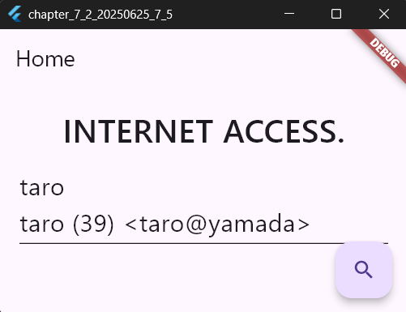
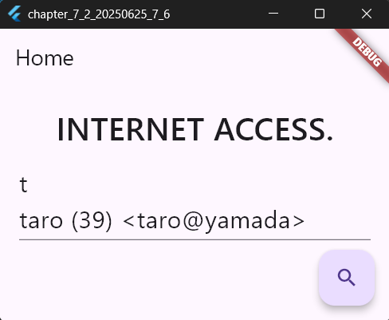
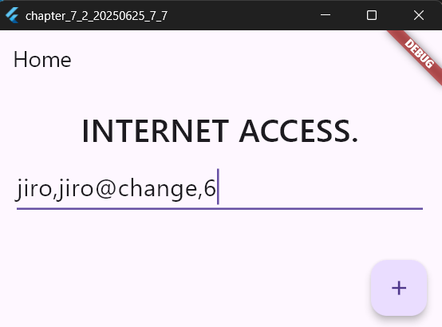
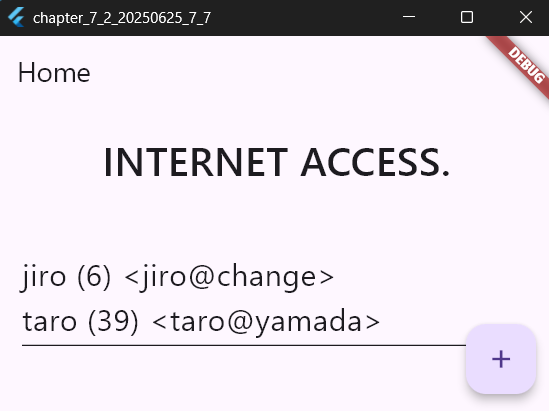

# 検索とソート

2025年6月25日
### 今日のキーワード： 「ハンバーガー」➡アメリカのコネチカット州ニューヘイブンにある「ルイスランチ」というお店が、ハンバーガー発祥の地とされています。ここでは1900年から食パンでパティを挟むスタイルで提供されていたそうです！また、ハンバーガーは「サンドイッチ」の一種と考えられていおり、さらに、日本では1971年7月20日に東京・銀座で初めてマクドナルドの店舗がオープンし、この日を「ハンバーガーの日」として制定しています。オープン当初は、ハンバーガーが高級品とされていました。ちなみに、ハンバーガーってファーストフードの定番ではあるが、実は地域によってスタイルや味が異なっておりアメリカ南部では「スラッピージョー」というピリ辛ミートソースを挟むスタイルが人気で、日本では照り焼きソースを使ったバーガーが独自に進化していきました。

---
 
`main.dartのソースコード(入力した名前のドキュメントを表示する)`
```dart
// Flutterの基本UIウィジェットをインポート
import 'package:flutter/material.dart';
// UIフォントウェイト用のユーティリティをインポート
import 'dart:ui' as ui;
// Firebase初期化を行うためのパッケージをインポート
import 'package:firebase_core/firebase_core.dart';
// Firebaseのオプション設定ファイルをインポート
import 'firebase_options.dart';
// Firestore（クラウドデータベース）を操作するためのパッケージをインポート
import 'package:cloud_firestore/cloud_firestore.dart';

void main() async {
  // FlutterフレームワークとFirebaseの初期化を行うための設定
  WidgetsFlutterBinding.ensureInitialized();
  await Firebase.initializeApp(options: DefaultFirebaseOptions.currentPlatform);
  // アプリの起動
  runApp(MyApp());
}

// アプリ全体を定義するクラス
class MyApp extends StatelessWidget {
  const MyApp({super.key});

  @override
  Widget build(BuildContext context) {
    // MaterialAppを返す。これはアプリ全体の設定を提供。
    return MaterialApp(
      title: 'Generated App', // アプリのタイトル
      theme: ThemeData(
        primarySwatch: Colors.blue, // メインのカラー
        primaryColor: const Color(0xff2196f3), // アプリのテーマカラー
        canvasColor: const Color(0xfffafafa), // 背景色
      ),
      // メイン画面のウィジェットを指定
      home: MyHomePage(),
    );
  }
}

// メイン画面を定義するStatefulWidget（状態を持つウィジェット）
class MyHomePage extends StatefulWidget {
  const MyHomePage({super.key});

  @override
  _MyHomePageState createState() => _MyHomePageState();
}

// メイン画面の状態を管理するクラス
class _MyHomePageState extends State<MyHomePage> {
  // 入力フィールド（TextField）のコントローラーを作成
  final _controller = TextEditingController();

  @override
  Widget build(BuildContext context) {
    // アプリ画面の全体構造をScaffoldで定義
    return Scaffold(
      // 上部のタイトルバー
      appBar: AppBar(title: Text('Home')),
      // 画面の中央部分
      body: Padding(
        padding: EdgeInsets.all(20.0), // 余白を設定
        child: Column(
          children: <Widget>[
            // ヘッダーテキスト
            Text(
              'INTERNET ACCESS.', // 見出しテキスト
              style: TextStyle(fontSize: 32, fontWeight: ui.FontWeight.w500),
            ),
            SizedBox(height: 10), // 上下にスペースを挿入
            // ユーザーからの入力を受け付けるテキストフィールド
            TextField(
              controller: _controller, // 入力内容を管理するコントローラーを指定
              style: TextStyle(fontSize: 24), // フォントサイズを設定
              minLines: 1, // 最小行数
              maxLines: 10, // 最大行数
            ),
          ],
        ),
      ),
      // 画面右下のアクションボタン
      floatingActionButton: FloatingActionButton(
        child: Icon(Icons.search), // ボタンに表示するアイコン
        onPressed: () async {
          // ボタンを押すとFirestoreからデータを取得
          fire();
        },
      ),
    );
  }

  // Firestoreからデータを取得し、表示するメソッド
  void fire() async {
    // ユーザーが入力したテキストを取得
    var msg = _controller.text;
    // Firestoreインスタンスを取得
    FirebaseFirestore firestore = FirebaseFirestore.instance;
    // 'mydata'コレクションから条件に合うデータを取得
    final snapshot =
        await firestore
            .collection('mydata') // 対象のコレクション
            .where('name', isEqualTo: msg) // 検索条件：nameフィールドがmsgに一致
            .get();
    // 検索結果をリストで処理
    snapshot.docs.forEach((element) {
      // 各ドキュメントからデータを取得
      final name = element.get('name');
      final mail = element.get('mail');
      final age = element.get('age');
      // 取得したデータをmsgに追加
      msg += "\n${name} (${age}) <${mail}>";
    });
    // 更新されたmsgをテキストフィールドに表示
    _controller.text = msg;
  }
}
```
【 実行画面 】




> whereによる検索条件の設定
- 特定のドキュメントの検索を行うときにwhereというメソッドを利用。注意点として、フィールドで検索した内容がドキュメント内のスペルと完全一致していないと検索に引っかからないので注意すること。

---
 
`main.dartのソースコード(値を取り出す範囲を指定するメソッド)`
```dart
// Flutterの基本UIフレームワークをインポート
import 'package:flutter/material.dart';
// フォントウェイトなどのUI関連ユーティリティをインポート
import 'dart:ui' as ui;
// Firebaseを操作するための初期化パッケージをインポート
import 'package:firebase_core/firebase_core.dart';
// Firebaseの設定を格納したファイルをインポート
import 'firebase_options.dart';
// Firebase Firestore（クラウドデータベース）操作用のパッケージをインポート
import 'package:cloud_firestore/cloud_firestore.dart';

// アプリのエントリーポイント。FlutterとFirebaseを初期化してアプリを実行
void main() async {
  // Firebaseの初期化が終了するまでFlutterが進まないよう設定
  WidgetsFlutterBinding.ensureInitialized();
  // Firebaseアプリを初期化（設定を`firebase_options.dart`から取得）
  await Firebase.initializeApp(options: DefaultFirebaseOptions.currentPlatform);
  // アプリケーションを実行
  runApp(MyApp());
}

// アプリ全体の構造を定義するクラス
class MyApp extends StatelessWidget {
  const MyApp({super.key});

  @override
  Widget build(BuildContext context) {
    // アプリの全体テーマや初期画面を設定する
    return MaterialApp(
      title: 'Generated App', // アプリケーションのタイトル
      theme: ThemeData(
        primarySwatch: Colors.blue, // アプリ全体の主要テーマカラー
        primaryColor: const Color(0xff2196f3), // プライマリカラーの指定
        canvasColor: const Color(0xfffafafa), // 背景のデフォルトカラー
      ),
      // 起動時の画面を設定
      home: MyHomePage(),
    );
  }
}

// メイン画面を表す状態を持つウィジェットを定義
class MyHomePage extends StatefulWidget {
  const MyHomePage({super.key});

  @override
  _MyHomePageState createState() => _MyHomePageState();
}

// メイン画面の状態を管理するクラス
class _MyHomePageState extends State<MyHomePage> {
  // ユーザーが入力したテキストを管理するためのコントローラー
  final _controller = TextEditingController();

  @override
  Widget build(BuildContext context) {
    // 画面の主要構造を作成（ヘッダー、ボディ、ボタンなど）
    return Scaffold(
      // 上部のアプリバーを表示
      appBar: AppBar(title: Text('Home')),
      // メインのコンテンツ部分
      body: Padding(
        padding: EdgeInsets.all(20.0), // 上下左右に余白を設定
        child: Column(
          children: <Widget>[
            // タイトルテキスト
            Text(
              'INTERNET ACCESS.', // データ取得に関連したタイトル
              style: TextStyle(fontSize: 32, fontWeight: ui.FontWeight.w500),
            ),
            SizedBox(height: 10), // 空白スペースを挿入
            // ユーザーが入力を行うためのテキストフィールド
            TextField(
              controller: _controller, // 入力データを管理するコントローラー
              style: TextStyle(fontSize: 24), // フォントサイズを設定
              minLines: 1, // 表示する最小行数
              maxLines: 10, // 表示する最大行数
            ),
          ],
        ),
      ),
      // 画面右下のアクションボタン
      floatingActionButton: FloatingActionButton(
        child: Icon(Icons.search), // ボタンに表示するアイコン
        onPressed: () async {
          // ボタンを押したときにfireメソッドを実行
          fire();
        },
      ),
    );
  }

  // Firestoreからデータを取得して表示するメソッド
  void fire() async {
    // ユーザーが入力した値を取得
    var msg = _controller.text;
    // Firestoreインスタンスの取得
    FirebaseFirestore firestore = FirebaseFirestore.instance;
    // Firestoreのコレクション'mydata'から条件に合うデータを取得
    final snapshot =
        await firestore
            .collection('mydata') // 検索対象のコレクション名
            .orderBy('name', descending: false) // 順序を指定
            .startAt([msg]) // 開始条件：入力値が先頭
            .endAt([msg + '\uf8ff']) // 終了条件：入力値が含まれる範囲
            .get();
    // 取得したドキュメントごとにデータを処理
    snapshot.docChanges.forEach((element) {
      final name = element.doc.get('name'); // 名前を取得
      final mail = element.doc.get('mail'); // メールアドレスを取得
      final age = element.doc.get('age'); // 年齢を取得
      // メッセージに取得データを追加
      msg += "\n${name} (${age}) <${mail}>";
    });
    // 結果をテキストフィールドに表示
    _controller.text = msg;
  }
}
```

【 実行画面 】



> orderByというソートと範囲指定
- orderByは、コレクションをソートするために利用。

  
---
 
`main.dartのソースコード(mydataにドキュメントを追加する)`
```dart
// Flutterの基本的なUIコンポーネントをインポート
import 'package:flutter/material.dart';
// UIフォントウェイト用のユーティリティをインポート
import 'dart:ui' as ui;
// Firebaseアプリの初期化を行うためのパッケージをインポート
import 'package:firebase_core/firebase_core.dart';
// Firebaseの設定オプションを格納したファイルをインポート
import 'firebase_options.dart';
// Firebase Firestore（クラウドデータベース）を操作するためのパッケージをインポート
import 'package:cloud_firestore/cloud_firestore.dart';

// main関数: アプリのエントリーポイント
void main() async {
  // Flutterフレームワークを初期化
  WidgetsFlutterBinding.ensureInitialized();
  // Firebaseの初期化
  await Firebase.initializeApp(options: DefaultFirebaseOptions.currentPlatform);
  // アプリケーションを実行
  runApp(MyApp());
}

// アプリ全体の構造を定義するクラス
class MyApp extends StatelessWidget {
  const MyApp({super.key});

  @override
  Widget build(BuildContext context) {
    // MaterialAppはアプリのテーマや初期画面を設定する
    return MaterialApp(
      title: 'Generated App', // アプリのタイトルを設定
      theme: ThemeData(
        primarySwatch: Colors.blue, // カラーテーマの基本色
        primaryColor: const Color(0xff2196f3), // プライマリカラーの設定
        canvasColor: const Color(0xfffafafa), // 背景色の設定
      ),
      home: MyHomePage(), // 初期画面として設定
    );
  }
}

// StatefulWidget: ユーザーインタラクションに基づいて動的に変化するウィジェットを定義
class MyHomePage extends StatefulWidget {
  const MyHomePage({super.key});

  @override
  _MyHomePageState createState() => _MyHomePageState(); // 状態管理クラスを作成
}

// Stateクラス: ウィジェットの状態を管理する
class _MyHomePageState extends State<MyHomePage> {
  // TextFieldの入力内容を管理するコントローラー
  final _controller = TextEditingController();

  @override
  Widget build(BuildContext context) {
    // アプリ画面全体の構造を定義するScaffoldウィジェット
    return Scaffold(
      appBar: AppBar(title: Text('Home')), // 上部のバーにタイトルを表示
      body: Padding(
        padding: EdgeInsets.all(20.0), // 画面端に余白を設ける
        child: Column(
          children: <Widget>[
            // タイトルテキストを表示
            Text(
              'INTERNET ACCESS.', // セクションタイトル
              style: TextStyle(fontSize: 32, fontWeight: ui.FontWeight.w500),
            ),
            SizedBox(height: 10), // 上下にスペースを追加
            TextField(
              controller: _controller, // 入力内容を管理するためのコントローラー
              style: TextStyle(fontSize: 24), // テキストのフォントサイズを指定
              minLines: 1, // 最小行数
              maxLines: 10, // 最大行数
            ),
          ],
        ),
      ),
      floatingActionButton: FloatingActionButton(
        child: Icon(Icons.add), // ボタンにプラスアイコンを表示
        onPressed: () async {
          // ボタンを押した際にFirestoreに新しいデータを追加するメソッドを呼び出し
          addDoc();
        },
      ),
    );
  }

  @override
  void initState() {
    super.initState();
    // 画面表示時に既存データを取得して表示する
    fire();
  }

  // 新しいデータをFirestoreに追加するメソッド
  void addDoc() async {
    var msg = _controller.text; // ユーザーの入力を取得
    final input = msg.split(','); // 入力をカンマ区切りで分割
    // Firestoreに保存するデータを作成
    final data = {'name': input[0], 'mail': input[1], 'age': input[2]};
    FirebaseFirestore firestore = FirebaseFirestore.instance; // Firestoreインスタンスの取得
    await firestore.collection('mydata').add(data); // Firestoreに新しいドキュメントを追加
    fire(); // 最新のデータを取得して更新
  }

  // Firestoreからデータを取得してTextFieldに表示するメソッド
  void fire() async {
    var msg = ''; // データを格納する文字列を初期化
    FirebaseFirestore firestore = FirebaseFirestore.instance; // Firestoreインスタンスの取得
    final snapshot =
        await firestore.collection('mydata').orderBy('name', descending: false).get();
    // 取得したドキュメントを処理
    snapshot.docChanges.forEach((element) {
      final name = element.doc.get('name'); // 'name'フィールドの値を取得
      final mail = element.doc.get('mail'); // 'mail'フィールドの値を取得
      final age = element.doc.get('age'); // 'age'フィールドの値を取得
      // データを文字列に追加
      msg += "\n${name} (${age}) <${mail}>";
    });
    _controller.text = msg; // TextFieldに取得したデータを表示
  }
}
```

【 実行画面 】



