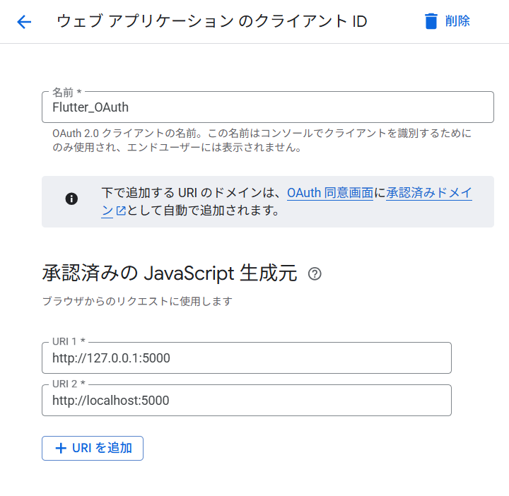
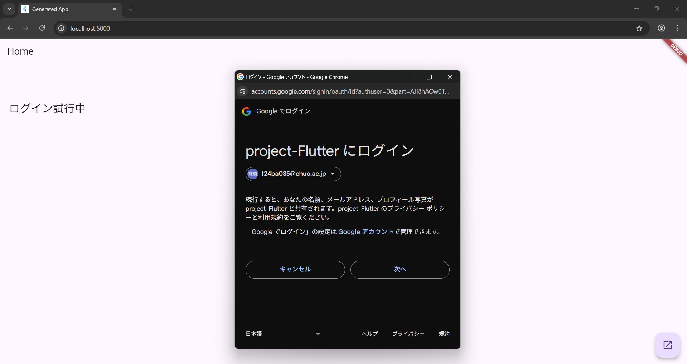
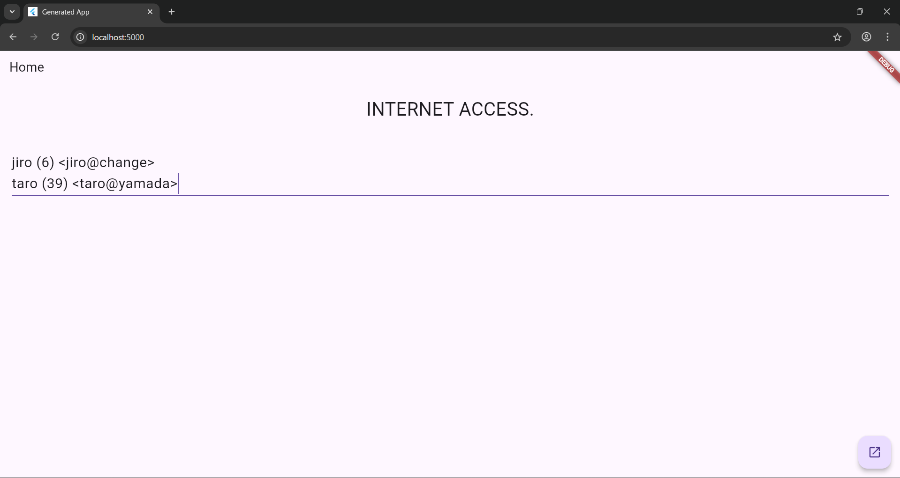
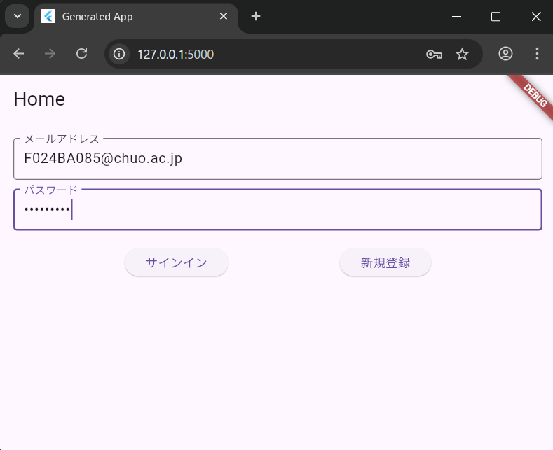
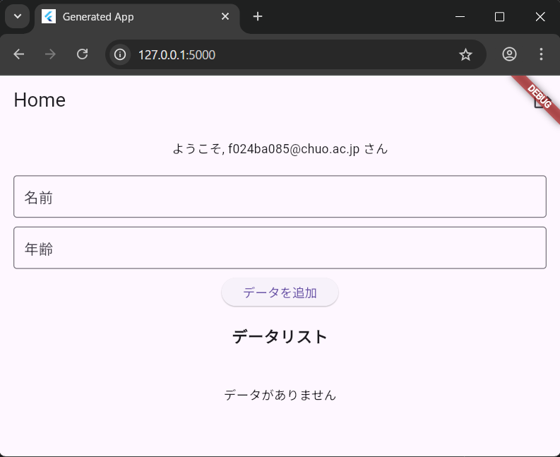

# Authenticationによるユーザー認証

2025年7月1日
### 今日のキーワード： 「おにぎり」➡日本最古のおにぎりの化石は、1987年に石川県の遺跡で発見されました。その形は三角形で、なんと弥生時代（約2000年前）のものとされています。おにぎりとおむすびの違いは、「おにぎり」は手で握ることを指し、「おむすび」は「結ぶ」という言葉に由来します。一説によると、「おむすび」は三角形が一般的で、それが山の形を模して神様への感謝を表しているとも言われています。おにぎりの形は、三角、俵型、丸型など様々ですが、どれも簡単に持ち運べて食べやすい形状に工夫されています。現代では「おにぎらず」という新しいスタイルも登場し、具材をたっぷり包み込むラップサンドのようなものも人気です。

---
 
`main.dartのソースコード(AuthenticationでGoogle承認を行う)`
```dart
// Flutterの基本的なUIコンポーネントをインポート
import 'package:flutter/material.dart';
// UIのフォントウェイトを使用するためのユーティリティをインポート
import 'dart:ui' as ui;
// Firebaseアプリの初期化を行うためのパッケージをインポート
import 'package:firebase_core/firebase_core.dart';
// Firebaseの設定オプションを記載したファイルをインポート
import 'firebase_options.dart';
// Firebase Firestore（クラウドデータベース）を操作するためのパッケージをインポート
import 'package:cloud_firestore/cloud_firestore.dart';
// Firebase認証を利用するためのパッケージをインポート
import 'package:firebase_auth/firebase_auth.dart';
// Googleサインインを利用するためのパッケージをインポート
import 'package:google_sign_in/google_sign_in.dart';

// アプリのエントリーポイント（main関数）
void main() async {
  // Flutterのフレームワークを初期化
  WidgetsFlutterBinding.ensureInitialized();

  // Firebaseを初期化（オプション情報を含める）
  await Firebase.initializeApp(options: DefaultFirebaseOptions.currentPlatform);

  // アプリを実行（MyAppクラスを根本のウィジェットとして設定）
  runApp(MyApp());
}

// アプリ全体の構造とテーマを定義するクラス
class MyApp extends StatelessWidget {
  const MyApp({super.key});

  @override
  Widget build(BuildContext context) {
    // MaterialAppでアプリのテーマやナビゲーションの基礎を設定
    return MaterialApp(
      title: 'Generated App', // アプリのタイトルを設定
      theme: ThemeData(
        primarySwatch: Colors.blue, // 基本色を青に設定
        primaryColor: const Color(0xff2196f3), // 主に使用する青色を指定
        canvasColor: const Color(0xfffafafa), // 背景色を設定
      ),
      home: MyHomePage(), // アプリ起動時に表示する画面を設定
    );
  }
}

// 動的に変化するウィジェット（StatefulWidget）を定義
class MyHomePage extends StatefulWidget {
  const MyHomePage({super.key});

  @override
  _MyHomePageState createState() => _MyHomePageState(); // 状態を管理するクラスを作成
}

// ウィジェットの状態を管理するクラス
class _MyHomePageState extends State<MyHomePage> {
  // ユーザー入力を管理するためのテキストコントローラー
  final _controller = TextEditingController();

  // Googleサインインのインスタンスを作成
  final GoogleSignIn _googleSignIn = GoogleSignIn(scopes: ['email', 'profile']);

  @override
  Widget build(BuildContext context) {
    // アプリ全体のレイアウトと構造を定義
    return Scaffold(
      appBar: AppBar(title: Text('Home')), // 画面上部のバーにタイトルを表示
      body: Padding(
        padding: EdgeInsets.all(20.0), // 画面全体に余白を設定
        child: Column(
          children: <Widget>[
            // 大きなタイトルテキストを表示
            Text(
              'INTERNET ACCESS.',
              style: TextStyle(fontSize: 32, fontWeight: ui.FontWeight.w500), // テキストのスタイル
            ),
            SizedBox(height: 10), // 上下の間隔を設定
            TextField(
              controller: _controller, // 入力内容を管理するためのコントローラーを設定
              style: TextStyle(fontSize: 24), // 入力テキストのスタイル
              minLines: 1, // 最小行数を指定
              maxLines: 10, // 最大行数を指定
            ),
          ],
        ),
      ),
      floatingActionButton: FloatingActionButton(
        child: Icon(Icons.open_in_new), // ボタンにアイコンを表示
        onPressed: () {
          doSignin(); // Googleサインインを実行
        },
      ),
    );
  }

  @override
  void initState() {
    super.initState();
    fire(); // 初期化時にFirestoreのデータを取得
  }

  // Firestoreに新しいデータを追加するメソッド
  void addDoc() async {
    var msg = _controller.text; // 入力された内容を取得
    final input = msg.split(','); // カンマで区切って分割
    final data = {'name': input[0], 'mail': input[1], 'age': input[2]}; // 保存するデータを準備
    FirebaseFirestore firestore = FirebaseFirestore.instance; // Firestoreインスタンスを取得
    await firestore.collection('mydata').add(data); // Firestoreにデータを保存
    fire(); // 更新後に再表示
  }

  // Firestoreからデータを取得して表示するメソッド
  void fire() async {
    var msg = ''; // 表示内容を初期化
    FirebaseFirestore firestore = FirebaseFirestore.instance; // Firestoreインスタンスを取得
    final snapshot = await firestore
        .collection('mydata')
        .orderBy('name', descending: false)
        .get(); // 'name'を基準に並べ替えて取得

    snapshot.docChanges.forEach((element) {
      final name = element.doc.get('name'); // 名前を取得
      final mail = element.doc.get('mail'); // メールを取得
      final age = element.doc.get('age'); // 年齢を取得
      msg += "\n${name} (${age}) <${mail}>"; // フォーマットして文字列に追加
    });
    _controller.text = msg; // 表示する内容をテキストフィールドに設定
  }

  // Googleサインインを使用してログインするメソッド
  Future<UserCredential> signInWithGoogle() async {
    try {
      // ユーザーにGoogleサインイン画面を表示
      final GoogleSignInAccount? googleUser = await _googleSignIn.signIn();

      if (googleUser != null) {
        // 認証トークンを取得
        final GoogleSignInAuthentication googleAuth =
            await googleUser.authentication;

        // Firebaseで認証するためのクレデンシャルを作成
        final credential = GoogleAuthProvider.credential(
          accessToken: googleAuth.accessToken,
          idToken: googleAuth.idToken,
        );

        // Firebase Authを使ってログイン
        return await FirebaseAuth.instance.signInWithCredential(credential);
      } else {
        throw Exception('Google Sign-In was cancelled'); // キャンセル時の処理
      }
    } catch (error) {
      print('Google Sign-In error: $error'); // エラー発生時のログ
      rethrow;
    }
  }

  // サインインプロセスを起動するメソッド
  void doSignin() {
    signInWithGoogle()
        .then((value) {
          if (value.user != null) {
            print('Sign-in successful: ${value.user!.displayName}'); // ログイン成功時
            fire(); // データを再表示
          }
        })
        .catchError((error) {
          print('Sign-in failed: $error'); // エラー時のログ
        });
  }
}

```
---
 
`index.htmlのソースコード(AuthenticationでGoogle承認を行う)`
```html
<!DOCTYPE html>
<html>
<head>
  <!-- Google Sign-In用のクライアントIDを指定 -->
  <meta name="google-signin-client_id" content="574165246822-nskvtnson23kne7samqpsd0u46ln4qj1.apps.googleusercontent.com">

  <!--
    Webアプリをルート以外のパスで提供する場合にベースパスを指定する
    例えば、`--base-href`でビルド時に指定された値がここに代入されます。
    パスは"/"で始まり、"/"で終わる必要があります。
    詳細は以下のリンクを参照:
    * https://developer.mozilla.org/en-US/docs/Web/HTML/Element/base
  -->
  <base href="$FLUTTER_BASE_HREF">

  <!-- 文字コードをUTF-8に設定 -->
  <meta charset="UTF-8">
  <!-- Internet Explorer用に互換モードを設定 -->
  <meta content="IE=Edge" http-equiv="X-UA-Compatible">
  <!-- Webページの説明を追加（SEO向け） -->
  <meta name="description" content="A new Flutter project.">

  <!-- iOS用メタタグとアイコン -->
  <meta name="mobile-web-app-capable" content="yes"> <!-- Webアプリとして実行可能に設定 -->
  <meta name="apple-mobile-web-app-status-bar-style" content="black"> <!-- iOSでのステータスバーの色を指定 -->
  <meta name="apple-mobile-web-app-title" content="chapter_7_3_20250701_7_13"> <!-- アプリ名を指定 -->
  <link rel="apple-touch-icon" href="icons/Icon-192.png"> <!-- iOSデバイス用アイコン -->

  <!-- Favicon（ブラウザタブに表示されるアイコン）を指定 -->
  <link rel="icon" type="image/png" href="favicon.png"/>

  <!-- ウェブページのタイトル -->
  <title>chapter_7_3_20250701_7_13</title>
  <!-- PWA（Progressive Web App）の設定ファイルをリンク -->
  <link rel="manifest" href="manifest.json">
</head>
<body>
  <!-- Flutterアプリを起動するJavaScriptファイルを読み込み -->
  <script src="flutter_bootstrap.js" async></script> <!-- async属性で非同期読み込みを指定 -->
</body>
</html>

```
---


`pubspec.yamlのソースコード(AuthenticationでGoogle承認を行う)`
```yaml
# アプリケーションの名前
name: chapter_7_3_20250701_7_13

# アプリケーションの説明
description: "A new Flutter project." # プロジェクトの簡単な概要を記述

# この行は、`flutter pub publish`コマンドを使用して誤ってpub.devに公開されないように設定
publish_to: 'none' # パブリッシュしたい場合は、この行を削除

# アプリケーションのバージョンとビルド番号を定義
# 例：バージョン "1.2.43" の後に "+1"（ビルド番号）が付く
version: 1.0.0+1

# 環境設定：アプリが動作するために必要なDart SDKのバージョンを指定
environment:
  sdk: ^3.7.2 # Dartのバージョンが3.7.2以上で動作することを示す

# 必要な依存パッケージを指定
dependencies:
  flutter:
    sdk: flutter # Flutter SDKを利用

  firebase_core: ^2.32.0 # Firebaseプロジェクトを初期化するためのパッケージ
  cloud_firestore: ^4.17.5 # FirebaseのCloud Firestore（データベース機能）を操作するためのパッケージ
  firebase_auth: ^4.15.3 # Firebase Authenticationを利用するためのパッケージ
  google_sign_in: ^6.2.1 # Googleサインインを利用するためのパッケージ

# 開発時にのみ必要な依存パッケージを指定
dev_dependencies:
  flutter_test:
    sdk: flutter # Flutterテスト環境

  # 推奨されるコード品質向上のためのlintルールセットを導入
  flutter_lints: ^5.0.0

# Flutter関連の設定を指定
flutter:
  # マテリアルデザインのアイコンフォントを使用するための設定
  uses-material-design: true

  # アプリケーションに追加する画像リソースを指定する場合の例
  # assets:
  #   - images/a_dot_burr.jpeg # サンプル画像パス
  #   - images/a_dot_ham.jpeg

  # カスタムフォントを使用したい場合の設定例
  # fonts:
  #   - family: Schyler
  #     fonts:
  #       - asset: fonts/Schyler-Regular.ttf # 標準フォント
  #       - asset: fonts/Schyler-Italic.ttf # イタリックフォント
  #         style: italic


```
---

【 実行画面 】





> ～７章firebase利用する際のコマンド～
- [コマンドプロンプト]
  - npm install -g firebase-tools
  - firebase login
- [VSコード:firebaseプロジェクト作成前（カレントディレクトリに移動するターミナル上でcd プロジェクトを作りたいカレントディレクトリのURL）]
  - flutter pub add firebase_core
  - flutter pub upgrade firebase_core
  - flutter pub add cloud_firestore
  - flutter pub upgrade cloud_firestore
- [VSコード:firebaseプロジェクト作成後（カレントディレクトリに移動する）]
  - dart pub global activate flutterfire_cli
  - flutterfire configure

> ～７章firebase Authをインストールする際のコマンド～
- [VSコード:Authenticationを利用するプラグイン]
  - flutter pub add firebase_auth
  - flutter pub upgrade firebase_auth
- [VSコード:googleログインプロバイダ利用時のプラグイン]
  - flutter pub add google_sign_in
  - flutter pub upgrade google_sign_in
- [VSコード:設定更新]
  - flutterfire configure
- [VSコード:ポート番号を指定して起動（Webアプリ利用時のみ）]
  - flutter run -d chrome --web-hostname localhost --web-port 5000
   もしくは
  - flutter run -d chrome --web-hostname=127.0.0.1 --web-port=5000

> 設定関係について
- firebaseにアクセスする際は、GoogleCloudのOAuthの設定はwebアプリを選択しないとプログラムが動作しない。
- webアプリのHTMLファイルのcontent値には、oAuthをで作成したクライアントIDを指定する必要があるため、クライアントID作成時に忘れないように控えておくこと。
- アプリ起動の際に、ポート番号を指定して起動するが、GoogleCloud承認情報のoAuthの承認済みのjavaScript生成元に登録したURLのポート番号のみを指定すること（番号の数字のみを指定）

---
 
`main.dartのソースコード(ユーザー/パスワードによるサインイン)`
```dart
// Flutterの基本的なUIコンポーネントをインポート
import 'package:flutter/material.dart';

// Firebaseアプリの初期化を行うためのパッケージをインポート
import 'package:firebase_core/firebase_core.dart';

// Firebaseの設定オプションを記載したファイルをインポート
import 'firebase_options.dart';

// Firebase Firestore（クラウドデータベース）を操作するためのパッケージをインポート
import 'package:cloud_firestore/cloud_firestore.dart';

// Firebase認証を利用するためのパッケージをインポート
import 'package:firebase_auth/firebase_auth.dart';

// アプリのエントリーポイント（main関数）
void main() async {
  // Flutterのフレームワークを初期化
  WidgetsFlutterBinding.ensureInitialized();

  // Firebaseを初期化（オプション情報を含める）
  await Firebase.initializeApp(options: DefaultFirebaseOptions.currentPlatform);

  // アプリを実行（MyAppクラスを根本のウィジェットとして設定）
  runApp(const MyApp());
}

// アプリ全体の構造とテーマを定義するクラス
class MyApp extends StatelessWidget {
  const MyApp({super.key});

  @override
  Widget build(BuildContext context) {
    // MaterialAppでアプリのテーマやナビゲーションの基礎を設定
    return MaterialApp(
      title: 'Generated App', // アプリのタイトルを設定
      theme: ThemeData(
        primarySwatch: Colors.blue, // 基本色を青に設定
        useMaterial3: true,
      ),
      home: const MyHomePage(), // アプリ起動時に表示する画面を設定
    );
  }
}

// 動的に変化するウィジェット（StatefulWidget）を定義
class MyHomePage extends StatefulWidget {
  const MyHomePage({super.key});

  @override
  _MyHomePageState createState() => _MyHomePageState(); // 状態を管理するクラスを作成
}

// ウィジェットの状態を管理するクラス
class _MyHomePageState extends State<MyHomePage> {
  // ユーザー入力を管理するためのテキストコントローラー
  final _emailController = TextEditingController();
  final _passwordController = TextEditingController();
  final _nameController = TextEditingController();
  final _ageController = TextEditingController();

  // Firebase Authのインスタンスを取得
  final FirebaseAuth _auth = FirebaseAuth.instance;

  @override
  void dispose() {
    // コントローラーを破棄してメモリリークを防ぐ
    _emailController.dispose();
    _passwordController.dispose();
    _nameController.dispose();
    _ageController.dispose();
    super.dispose();
  }

  // メールアドレスとパスワードでサインインするメソッド
  void signInWithMail() async {
    try {
      await _auth.signInWithEmailAndPassword(
        email: _emailController.text,
        password: _passwordController.text,
      );
      // 成功したらスナックバーで通知
      ScaffoldMessenger.of(
        context,
      ).showSnackBar(const SnackBar(content: Text('サインインに成功しました')));
    } on FirebaseAuthException catch (e) {
      // エラーが発生したらスナックバーで通知
      ScaffoldMessenger.of(
        context,
      ).showSnackBar(SnackBar(content: Text('サインインエラー: ${e.message}')));
    }
  }

  // メールアドレスとパスワードで新規登録するメソッド
  void registerWithMail() async {
    try {
      await _auth.createUserWithEmailAndPassword(
        email: _emailController.text,
        password: _passwordController.text,
      );
      // 成功したらスナックバーで通知
      ScaffoldMessenger.of(
        context,
      ).showSnackBar(const SnackBar(content: Text('ユーザー登録に成功しました')));
    } on FirebaseAuthException catch (e) {
      // エラーが発生したらスナックバーで通知
      ScaffoldMessenger.of(
        context,
      ).showSnackBar(SnackBar(content: Text('登録エラー: ${e.message}')));
    }
  }

  // サインアウトするメソッド
  void signOut() async {
    await _auth.signOut();
    ScaffoldMessenger.of(
      context,
    ).showSnackBar(const SnackBar(content: Text('サインアウトしました')));
  }

  // Firestoreに新しいデータを追加するメソッド
  void addDoc() async {
    if (_nameController.text.isEmpty || _ageController.text.isEmpty) {
      ScaffoldMessenger.of(
        context,
      ).showSnackBar(const SnackBar(content: Text('名前と年齢を入力してください')));
      return;
    }

    final user = _auth.currentUser;
    if (user == null) {
      ScaffoldMessenger.of(
        context,
      ).showSnackBar(const SnackBar(content: Text('データを追加するにはサインインが必要です')));
      return;
    }

    final data = {
      'name': _nameController.text,
      'mail': user.email, // 現在のユーザーのメールアドレスを使用
      'age': int.tryParse(_ageController.text) ?? 0,
      'createdAt': Timestamp.now(), // 作成日時を追加
    };

    await FirebaseFirestore.instance.collection('mydata').add(data);

    // 追加後にテキストフィールドをクリア
    _nameController.clear();
    _ageController.clear();

    ScaffoldMessenger.of(
      context,
    ).showSnackBar(const SnackBar(content: Text('データを追加しました')));
  }

  @override
  Widget build(BuildContext context) {
    return Scaffold(
      appBar: AppBar(
        title: const Text('Home'),
        // ユーザーのサインイン状態に応じてアクションボタンを切り替え
        actions: [
          StreamBuilder<User?>(
            stream: _auth.authStateChanges(),
            builder: (context, snapshot) {
              if (snapshot.hasData) {
                // サインインしている場合はサインアウトボタンを表示
                return IconButton(
                  icon: const Icon(Icons.logout),
                  onPressed: signOut,
                  tooltip: 'サインアウト',
                );
              }
              // サインインしていない場合は何も表示しない
              return const SizedBox.shrink();
            },
          ),
        ],
      ),
      body: Padding(
        padding: const EdgeInsets.all(16.0),
        child: Column(
          crossAxisAlignment: CrossAxisAlignment.stretch,
          children: <Widget>[
            // 認証状態に応じてUIを切り替える
            StreamBuilder<User?>(
              stream: _auth.authStateChanges(),
              builder: (context, snapshot) {
                // サインインしていない場合はログインフォームを表示
                if (!snapshot.hasData) {
                  return _buildSignInForm();
                }
                // サインインしている場合はデータ追加フォームとデータリストを表示
                return _buildDataSection(snapshot.data!);
              },
            ),
          ],
        ),
      ),
    );
  }

  // サインインフォームのウィジェット
  Widget _buildSignInForm() {
    return Column(
      children: [
        TextField(
          controller: _emailController,
          decoration: const InputDecoration(
            labelText: 'メールアドレス',
            border: OutlineInputBorder(),
          ),
          keyboardType: TextInputType.emailAddress,
        ),
        const SizedBox(height: 10),
        TextField(
          controller: _passwordController,
          decoration: const InputDecoration(
            labelText: 'パスワード',
            border: OutlineInputBorder(),
          ),
          obscureText: true,
        ),
        const SizedBox(height: 20),
        Row(
          mainAxisAlignment: MainAxisAlignment.spaceEvenly,
          children: [
            ElevatedButton(
              onPressed: signInWithMail,
              child: const Text('サインイン'),
            ),
            ElevatedButton(
              onPressed: registerWithMail,
              child: const Text('新規登録'),
            ),
          ],
        ),
      ],
    );
  }

  // データ追加フォームとデータリストのウィジェット
  Widget _buildDataSection(User user) {
    return Expanded(
      child: Column(
        children: [
          Text('ようこそ, ${user.email} さん'),
          const SizedBox(height: 20),
          // データ追加フォーム
          TextField(
            controller: _nameController,
            decoration: const InputDecoration(
              labelText: '名前',
              border: OutlineInputBorder(),
            ),
          ),
          const SizedBox(height: 10),
          TextField(
            controller: _ageController,
            decoration: const InputDecoration(
              labelText: '年齢',
              border: OutlineInputBorder(),
            ),
            keyboardType: TextInputType.number,
          ),
          const SizedBox(height: 10),
          ElevatedButton(onPressed: addDoc, child: const Text('データを追加')),
          const SizedBox(height: 20),
          const Text(
            'データリスト',
            style: TextStyle(fontSize: 18, fontWeight: FontWeight.bold),
          ),
          // Firestoreのデータをリアルタイムで表示するリスト
          Expanded(
            child: StreamBuilder<QuerySnapshot>(
              stream:
                  FirebaseFirestore.instance
                      .collection('mydata')
                      .orderBy('createdAt', descending: true) // 作成日時の降順でソート
                      .snapshots(),
              builder: (context, snapshot) {
                if (snapshot.connectionState == ConnectionState.waiting) {
                  return const Center(child: CircularProgressIndicator());
                }
                if (!snapshot.hasData || snapshot.data!.docs.isEmpty) {
                  return const Center(child: Text('データがありません'));
                }

                final docs = snapshot.data!.docs;

                return ListView.builder(
                  itemCount: docs.length,
                  itemBuilder: (context, index) {
                    final data = docs[index].data() as Map<String, dynamic>;
                    final name = data['name'] ?? '名前なし';
                    final age = data['age'] ?? 0;
                    final mail = data['mail'] ?? 'メールなし';
                    return Card(
                      margin: const EdgeInsets.symmetric(vertical: 4.0),
                      child: ListTile(
                        title: Text('$name ($age歳)'),
                        subtitle: Text(mail),
                      ),
                    );
                  },
                );
              },
            ),
          ),
        ],
      ),
    );
  }
}
```
---

`index.htmlのソースコード(ユーザー/パスワードによるサインイン)`
```html
<!DOCTYPE html>
<html>
<head>
  <meta name="google-signin-client_id" content="574165246822-nskvtnson23kne7samqpsd0u46ln4qj1.apps.googleusercontent.com">
  <!--
    If you are serving your web app in a path other than the root, change the
    href value below to reflect the base path you are serving from.

    The path provided below has to start and end with a slash "/" in order for
    it to work correctly.

    For more details:
    * https://developer.mozilla.org/en-US/docs/Web/HTML/Element/base

    This is a placeholder for base href that will be replaced by the value of
    the `--base-href` argument provided to `flutter build`.
  -->
  <base href="$FLUTTER_BASE_HREF">

  <meta charset="UTF-8">
  <meta content="IE=Edge" http-equiv="X-UA-Compatible">
  <meta name="description" content="A new Flutter project.">

  <!-- iOS meta tags & icons -->
  <meta name="mobile-web-app-capable" content="yes">
  <meta name="apple-mobile-web-app-status-bar-style" content="black">
  <meta name="apple-mobile-web-app-title" content="chapter_7_3_20250701_7_14">
  <link rel="apple-touch-icon" href="icons/Icon-192.png">

  <!-- Favicon -->
  <link rel="icon" type="image/png" href="favicon.png"/>

  <title>chapter_7_3_20250701_7_14</title>
  <link rel="manifest" href="manifest.json">
</head>
<body>
  <script src="flutter_bootstrap.js" async></script>
</body>
</html>

```
---

`pubspec.yamlのソースコード(ユーザー/パスワードによるサインイン)`
```yaml
name: chapter_7_3_20250701_7_14
description: "A new Flutter project."
# The following line prevents the package from being accidentally published to
# pub.dev using `flutter pub publish`. This is preferred for private packages.
publish_to: 'none' # Remove this line if you wish to publish to pub.dev

# The following defines the version and build number for your application.
# A version number is three numbers separated by dots, like 1.2.43
# followed by an optional build number separated by a +.
# Both the version and the builder number may be overridden in flutter
# build by specifying --build-name and --build-number, respectively.
# In Android, build-name is used as versionName while build-number used as versionCode.
# Read more about Android versioning at https://developer.android.com/studio/publish/versioning
# In iOS, build-name is used as CFBundleShortVersionString while build-number is used as CFBundleVersion.
# Read more about iOS versioning at
# https://developer.apple.com/library/archive/documentation/General/Reference/InfoPlistKeyReference/Articles/CoreFoundationKeys.html
# In Windows, build-name is used as the major, minor, and patch parts
# of the product and file versions while build-number is used as the build suffix.
version: 1.0.0+1

environment:
  sdk: ^3.7.2

# Dependencies specify other packages that your package needs in order to work.
# To automatically upgrade your package dependencies to the latest versions
# consider running `flutter pub upgrade --major-versions`. Alternatively,
# dependencies can be manually updated by changing the version numbers below to
# the latest version available on pub.dev. To see which dependencies have newer
# versions available, run `flutter pub outdated`.
dependencies:
  flutter:
    sdk: flutter
  firebase_core: ^2.32.0
  cloud_firestore: ^4.17.5
  firebase_auth: ^4.20.0 # Firebase Authenticationを使用するためのパッケージ
  #google_sign_in: ^7.1.0 # 最新の安定版を使用 #依存関係が不要なのでコメントアウト

dev_dependencies:
  flutter_test:
    sdk: flutter

  # The "flutter_lints" package below contains a set of recommended lints to
  # encourage good coding practices. The lint set provided by the package is
  # activated in the `analysis_options.yaml` file located at the root of your
  # package. See that file for information about deactivating specific lint
  # rules and activating additional ones.
  flutter_lints: ^5.0.0

# For information on the generic Dart part of this file, see the
# following page: https://dart.dev/tools/pub/pubspec

# The following section is specific to Flutter packages.
flutter:

  # The following line ensures that the Material Icons font is
  # included with your application, so that you can use the icons in
  # the material Icons class.
  uses-material-design: true

  # To add assets to your application, add an assets section, like this:
  # assets:
  #   - images/a_dot_burr.jpeg
  #   - images/a_dot_ham.jpeg

  # An image asset can refer to one or more resolution-specific "variants", see
  # https://flutter.dev/to/resolution-aware-images

  # For details regarding adding assets from package dependencies, see
  # https://flutter.dev/to/asset-from-package

  # To add custom fonts to your application, add a fonts section here,
  # in this "flutter" section. Each entry in this list should have a
  # "family" key with the font family name, and a "fonts" key with a
  # list giving the asset and other descriptors for the font. For
  # example:
  # fonts:
  #   - family: Schyler
  #     fonts:
  #       - asset: fonts/Schyler-Regular.ttf
  #       - asset: fonts/Schyler-Italic.ttf
  #         style: italic
  #   - family: Trajan Pro
  #     fonts:
  #       - asset: fonts/TrajanPro.ttf
  #       - asset: fonts/TrajanPro_Bold.ttf
  #         weight: 700
  #
  # For details regarding fonts from package dependencies,
  # see https://flutter.dev/to/font-from-package

```
---

【 実行画面 】





> ～プロジェクトのクリーンと再構築(依存関係の問題を解決するための最も一般的で効果的な手順でプロジェクトの「お掃除」とパッケージの再取得)～
- [VSコード:プロジェクトのルートディレクトリに移動して実施]
  - flutter clean ⇐ プロジェクトのクリーンアップ:古いビルドキャッシュや壊れた可能性のあるファイルを削除
  - flutter pub get ⇐ パッケージの再取得:pubspec.yamlファイルに基づいて、必要なパッケージをすべて再ダウンロードし、プロジェクトに正しくリンク

> メールとパスワードによる承認について
- バックエンド側で許可したユーザーだけしか使えないようにしたい場合に使用する。FirebaseのAuthenticationにて、メールアドレスとパスワードによる設定を有効にする。

---