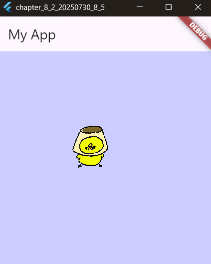

# 8-2: スプライトの利用

2025年7月30日
### 今日のキーワード： 「かつどん」➡カツ丼は日本の食文化のなかで一際ユニークな存在です！明治時代後半の日本で洋食の「カツレツ」から発展し、卵でとじたスタイルやソースを使用するスタイルが広まっていきました。起源としては東京の早稲田大学近くのお店で誕生したという説が有力ですが、山梨県の甲府市や福井県も「発祥地」とされることがあるそうです。実は地域ごとに異なる個性があるのも面白いポイントで、例えば、群馬県桐生市では「ソースカツ丼」として知られ、ウスターソースに浸したカツが特徴。福島県会津若松市ではキャベツを敷いた上にソースカツを乗せる形式が発祥とされています。そして、沖縄では野菜炒めを使った独特のスタイルも存在します。

---
  
`pubspec.yamlのソースコード(スプライトを使用する)`
```yaml
name: chapter_8_2_20250730_8_4
description: "A new Flutter project." # プロジェクトの説明。開発者が後から何のプロジェクトか思い出しやすいように記載する部分。

# この行は、pub.devに誤って公開されるのを防ぐ設定です。
publish_to: 'none' # プライベートなプロジェクトの場合は、この行を削除しないよう注意。

version: 1.0.0+1 # プロジェクトのバージョン番号。バージョン管理やアプリのアップデートに役立つ。

environment:
  sdk: ^3.7.2 # Dartの使用するバージョンの範囲を指定。このバージョンのDartで動作することを保証。

dependencies:
  flutter:
    sdk: flutter # Flutterフレームワークをプロジェクトに追加する設定。

  # CupertinoIconsを利用するための設定。iOSスタイルのアイコンを使えるようになる。
  cupertino_icons: ^1.0.8 
  flame: ^1.30.1 # Flameはゲーム開発用のライブラリ。ゲーム要素を組み込む際に便利。

dev_dependencies:
  flutter_test:
    sdk: flutter # Flutterアプリのテストを行うためのパッケージ。

  flutter_lints: ^5.0.0 # コードスタイルのチェックを行うための設定。

flutter:

  uses-material-design: true # Material Designスタイルを使用するアプリであることを示す設定。

  assets:
    - assets/images/chara.gif # この画像ファイルをアセットとしてアプリに含める設定。

```

`main.dartのソースコード(スプライトでキャラクタを表示する)`
```dart
import 'package:flame/game.dart'; // Flameフレームワークの基本機能をインポート
import 'package:flutter/material.dart'; // FlutterのUI構築のための機能をインポート
import 'package:flame/input.dart'; // Flameの入力関連機能をインポート
import 'package:flutter/services.dart'; // システム関連の操作に使う（例: 画像やリソースのロード）
import 'package:flame/components.dart'; // Flameのゲームコンポーネントを利用するために必要

void main() => runApp(MyApp()); 
// アプリのエントリーポイント。MyAppをアプリ全体のルートウィジェットとして設定

class MyApp extends StatelessWidget {
  @override
  Widget build(BuildContext context) {
    return MaterialApp(
      // アプリ全体を構築するためのウィジェット
      title: 'Generated App', // アプリのタイトル
      theme: ThemeData(
        primarySwatch: Colors.blue, // プライマリカラーとして青色を設定
        primaryColor: const Color(0xff2196f3), // メインの青色をカスタマイズ
        canvasColor: const Color(0xfffafafa), // 背景色の設定
      ),
      home: MyHomePage(), // アプリのホーム画面としてMyHomePageを設定
    );
  }
}

class MyHomePage extends StatefulWidget {
  MyHomePage({Key? key}) : super(key: key); // StatefulWidgetを作成。ホーム画面として表示
  @override
  _MyHomePageState createState() => _MyHomePageState();
}

class _MyHomePageState extends State<MyHomePage> {
  @override
  Widget build(BuildContext context) {
    return Scaffold(
      // Materialデザインの構造を提供するウィジェット
      appBar: AppBar(title: Text('My App')), // 上部のアプリバーにタイトルを表示

      body: GameWidget(game: SampleGame()), 
      // Flameのゲームをウィジェットとして表示。SampleGameが使用される
    );
  }
}

class SampleGame extends FlameGame {
  @override
  Color backgroundColor() => const Color(0xffCCCCFF); 
  // ゲームの背景色を薄紫色に設定

  @override
  Future<void> onLoad() async {
    // ゲームの初期設定を行うメソッド
    await super.onLoad(); // 親クラスの初期化処理を呼び出す
    add(MySprite(Vector2(100, 100))); 
    // 画面にスプライト（画像コンポーネント）を追加
  }
}

class MySprite extends SpriteComponent {
  late final Vector2 _position; 
  // スプライトの位置を保存するための変数

  MySprite(this._position) : super(); 
  // コンストラクタで位置を指定してスプライトを作成

  @override
  Future<void> onLoad() async {
    await super.onLoad(); 
    // 親クラスの初期化処理を呼び出す
    sprite = await Sprite.load('chara.gif'); 
    // スプライト画像として"chara.gif"をロード
    position = _position; 
    // コンストラクタで指定された位置にスプライトを配置
    size = Vector2(100, 100); 
    // スプライトのサイズを設定
  }

  @override
  void update(double delta) {
    super.update(delta); 
    // ゲームの更新時に呼ばれるメソッド（現時点では特に処理なし）
  }
}
```

【 実行画面 】


---

`main.dartのソースコード(キーボードでスプライトを動かす)`
```dart
import 'package:flame/game.dart'; // Flameフレームワークのゲーム機能をインポート
import 'package:flutter/material.dart'; // FlutterのUI構築ツールをインポート
import 'package:flame/input.dart'; // Flameの入力処理に関する機能をインポート
import 'package:flutter/services.dart'; // 入力やリソース管理に関わる機能をインポート
import 'package:flame/components.dart'; // Flameのゲーム用コンポーネントをインポート

void main() => runApp(MyApp());
// main関数：アプリケーションを起動するエントリーポイント

class MyApp extends StatelessWidget {
  @override
  Widget build(BuildContext context) {
    return MaterialApp(
      title: 'Generated App', // アプリのタイトルを設定
      theme: ThemeData(
        primarySwatch: Colors.blue, // アプリ全体のテーマカラーとして青を設定
        primaryColor: const Color(0xff2196f3), // メインカラーをカスタマイズ
        canvasColor: const Color(0xfffafafa), // 背景色を設定
      ),
      home: MyHomePage(), // 初期画面としてMyHomePageを設定
    );
  }
}

class MyHomePage extends StatefulWidget {
  MyHomePage({Key? key}) : super(key: key); // 状態を持つホーム画面ウィジェットを作成
  @override
  _MyHomePageState createState() => _MyHomePageState();
}

class _MyHomePageState extends State<MyHomePage> {
  @override
  Widget build(BuildContext context) {
    return Scaffold(
      appBar: AppBar(title: Text('My App')), // アプリの上部バーを追加しタイトルを表示

      body: GameWidget(game: SampleGame()), 
      // GameWidget：Flameゲームを埋め込むためのウィジェット。SampleGameをセット
    );
  }
}

class SampleGame extends FlameGame with HasKeyboardHandlerComponents {
  @override
  Color backgroundColor() => const Color(0xffCCCCFF); 
  // ゲームの背景色を薄い紫に設定

  @override
  Future<void> onLoad() async {
    await super.onLoad(); // FlameGameの初期化処理を実行
    add(MySprite(Vector2(100, 100))); 
    // 画面にスプライト（ゲーム内のキャラクター）を追加
  }
}

class MySprite extends SpriteComponent with KeyboardHandler {
  late Vector2 _position; // スプライトの位置を管理する変数
  late Vector2 _delta; // キー入力による移動方向の変化を管理する変数

  MySprite(this._position) : super(); 
  // コンストラクタでスプライトの位置を指定して初期化

  @override
  Future<void> onLoad() async {
    await super.onLoad(); 
    // SpriteComponentの初期化処理
    sprite = await Sprite.load('chara.gif'); 
    // スプライト画像をロード
    position = _position; 
    // 初期位置を設定
    size = Vector2(100, 100); 
    // スプライトのサイズを設定
    _delta = Vector2.zero(); 
    // 移動量を初期化（ゼロベクトル）
  }

  @override
  void update(double delta) {
    position += _delta * delta * 100; 
    // 移動量に応じて位置を更新。速度を掛けてなめらかな動きを実現
    super.update(delta);
  }

  @override
  bool onKeyEvent(KeyEvent event, Set<LogicalKeyboardKey> keysPressed) {
    if (event is KeyUpEvent) {
      _delta = Vector2.zero(); 
      // キーが離されたとき、移動量をゼロにリセット
    }
    // 以下は特定のキー入力に応じて移動方向を設定
    if (event.logicalKey == LogicalKeyboardKey.keyJ) {
      _delta.x = -1; // 左方向へ移動
    }
    if (event.logicalKey == LogicalKeyboardKey.keyL) {
      _delta.x = 1; // 右方向へ移動
    }
    if (event.logicalKey == LogicalKeyboardKey.keyI) {
      _delta.y = -1; // 上方向へ移動
    }
    if (event.logicalKey == LogicalKeyboardKey.keyK) {
      _delta.y = 1; // 下方向へ移動
    }
    return true; // イベントが処理されたことを示す
  }
}
```

【 実行画面 】


---

`main.dartのソースコード(マウスでスプライトを操作する)`
```dart
import 'package:flame/events.dart'; // Flameのイベント処理を利用するためのライブラリ
import 'package:flame/game.dart'; // Flameフレームワークのゲーム基本機能をインポート
import 'package:flutter/material.dart'; // FlutterのUI構築ライブラリ
import 'package:flame/input.dart'; // 入力処理を補助するための機能
import 'package:flutter/services.dart'; // システム入力に関連するツールをインポート
import 'package:flame/components.dart'; // ゲーム内のコンポーネントを構築するための機能
import 'package:flame/experimental.dart'; // Flameの試験的な機能をインポート

void main() => runApp(MyApp()); 
// アプリケーションのエントリーポイント。Flutterアプリを起動する。

class MyApp extends StatelessWidget {
  @override
  Widget build(BuildContext context) {
    return MaterialApp(
      title: 'Generated App', // アプリのタイトルを設定
      theme: ThemeData(
        primarySwatch: Colors.blue, // アプリ全体の色テーマを青に設定
        primaryColor: const Color(0xff2196f3), // メインカラーを青色にカスタマイズ
        canvasColor: const Color(0xfffafafa), // 背景の色を設定
      ),
      home: MyHomePage(), // 初期画面としてMyHomePageを表示
    );
  }
}

class MyHomePage extends StatefulWidget {
  MyHomePage({Key? key}) : super(key: key); 
  // 状態を持つホーム画面ウィジェット

  @override
  _MyHomePageState createState() => _MyHomePageState();
}

class _MyHomePageState extends State<MyHomePage> {
  @override
  Widget build(BuildContext context) {
    return Scaffold(
      appBar: AppBar(title: Text('My App')), // アプリバー（上部のタイトルバー）を表示

      body: GameWidget(game: SampleGame()), 
      // ゲームを表示するためのWidget。SampleGameをロード。
    );
  }
}

class SampleGame extends FlameGame with TapCallbacks {
  // TapCallbacks: 画面タッチイベントを処理できるようにする機能
  late final MySprite _sprite; 
  // ゲーム内で利用するスプライトを管理する変数

  @override
  Color backgroundColor() => const Color(0xffCCCCFF); 
  // ゲーム背景の色を薄い紫色に設定

  @override
  Future<void> onLoad() async {
    await super.onLoad(); 
    // FlameGameの初期化を実行
    _sprite = MySprite(Vector2(100, 100)); 
    // 初期位置を指定してスプライトを作成
    add(_sprite); 
    // 作成したスプライトをゲーム内に追加
  }

  @override
  void onTapDown(TapDownEvent event) {
    // タッチした位置を取得して、スプライトに新しいターゲット位置を設定
    _sprite.setTargetPosition(event.canvasPosition); 
  }
}

class MySprite extends SpriteComponent {
  late Vector2 _targetPosition; 
  // スプライトが移動する目標位置を管理する変数

  MySprite(Vector2 initialPosition) : super() {
    _targetPosition = initialPosition; 
    // 初期位置を設定
  }

  @override
  Future<void> onLoad() async {
    await super.onLoad(); 
    // SpriteComponentの初期化を実行
    sprite = await Sprite.load('chara.gif'); 
    // スプライト画像（キャラクター画像）をロード
    position = _targetPosition; 
    // 初期位置を設定
    size = Vector2(100, 100); 
    // スプライトのサイズを設定
    anchor = Anchor.center; 
    // スプライトの基準点を中心に設定
  }

  @override
  void update(double delta) {
    // 現在位置を目標位置に向かって少しずつ移動させる
    final d = (_targetPosition - position) / 20; 
    position += d * delta * 100; 
    // deltaは時間経過を表し、滑らかな移動を実現する
    super.update(delta);
  }

  void setTargetPosition(Vector2 newPosition) {
    // 新しいターゲット位置を設定するメソッド
    _targetPosition = newPosition; 
  }
}
```

【 実行画面 】


---

`main.dartのソースコード(コンポーネントを利用する)`
```dart
import 'package:flame/events.dart'; // Flameでイベント処理を行うためのライブラリ
import 'package:flame/game.dart'; // Flameフレームワークのゲーム機能
import 'package:flutter/material.dart'; // FlutterのUI構築ツール
import 'package:flame/input.dart'; // 入力処理を補助するライブラリ
import 'package:flutter/services.dart'; // 使用されていませんが、完全性を保つためにインポート
import 'package:flame/components.dart'; // ゲーム内のコンポーネントを扱うためのライブラリ
import 'package:flame/experimental.dart'; // 使用されていませんが、完全性を保つためにインポート

void main() => runApp(MyApp());
// アプリのエントリーポイント。MyAppを表示します。

class MyApp extends StatelessWidget {
  @override
  Widget build(BuildContext context) {
    return MaterialApp(
      title: 'Generated App', // アプリのタイトル
      theme: ThemeData(
        primarySwatch: Colors.blue, // 全体的なテーマカラーを青に設定
        primaryColor: const Color(0xff2196f3), // メインカラーを青色にカスタマイズ
        canvasColor: const Color(0xfffafafa), // 背景の色を設定
      ),
      home: MyHomePage(), // 初期画面としてMyHomePageを表示
    );
  }
}

class MyHomePage extends StatefulWidget {
  MyHomePage({Key? key}) : super(key: key); 
  // ホーム画面を表す状態管理可能なウィジェット

  @override
  _MyHomePageState createState() => _MyHomePageState();
}

class _MyHomePageState extends State<MyHomePage> {
  @override
  Widget build(BuildContext context) {
    return Scaffold(
      appBar: AppBar(title: Text('My App')), // 上部のタイトルバー
      body: GameWidget(game: SampleGame()), 
      // Flameのゲームを表示するためのウィジェット。SampleGameが利用される
    );
  }
}

class SampleGame extends FlameGame with TapCallbacks {
  // ゲームのロジックを管理するクラス。画面のタッチ入力を処理するためにTapCallbacksを利用。
  Vector2 _targetPosition = Vector2(100, 100);
  // スプライトが移動する目標位置を保持する変数

  @override
  Color backgroundColor() => const Color(0xffCCCCFF); 
  // ゲーム背景の色を設定

  @override
  Future<void> onLoad() async {
    await super.onLoad(); 
    // ゲームの初期設定を行う
    var sp1 = GreenRectSprite(Vector2(200, 100)); 
    // 緑色の矩形スプライトを指定位置に追加
    add(sp1);
    var sp2 = RedCircleSprite(Vector2(100, 200)); 
    // 赤色の円形スプライトを指定位置に追加
    add(sp2);
    add(WhiteTextSprite(Vector2(25, 25))); 
    // 白いテキストを指定位置に追加
  }

  @override
  void onTapDown(TapDownEvent event) {
    _targetPosition = event.canvasPosition - Vector2(50, 50); 
    // タッチした位置をスプライトの移動目標位置として設定
  }

  Vector2 get targetPosition => _targetPosition; 
  // 他のクラスが目標位置を参照できるようにするゲッター
}

class RedCircleSprite extends CircleComponent with HasGameRef<SampleGame> {
  // 赤い円を表すスプライト。ゲームの目標位置に基づいて移動するロジックを持つ。

  RedCircleSprite(Vector2 initialPosition)
    : super(position: initialPosition); 
    // 初期位置を設定する

  @override
  Future<void> onLoad() async {
    await super.onLoad();
    setColor(Colors.red); 
    // 赤色で円を描画する
    size = Vector2(100, 100); 
    // 円のサイズを設定
    anchor = Anchor.center; 
    // アンカーを中心に設定して一貫性を保持
  }

  @override
  void update(double delta) {
    final d = (gameRef.targetPosition - position) / 10; 
    // 目標位置に向かって移動する速度を計算
    position += d * delta * 100; 
    // 位置を更新してスムーズに移動する
    super.update(delta);
  }
}

class GreenRectSprite extends PositionComponent with HasGameRef<SampleGame> {
  // 緑色の矩形を表すスプライト。ゲームの目標位置に基づいて移動するロジックを持つ。
  late Paint _paint;

  GreenRectSprite(Vector2 initialPosition)
    : super(position: initialPosition); 
    // 初期位置を設定する

  @override
  Future<void> onLoad() async {
    await super.onLoad();
    size = Vector2(100, 100); 
    // 矩形のサイズを設定
    anchor = Anchor.center; 
    // アンカーを中心に設定して一貫性を保持
    _paint =
        Paint()
          ..style = PaintingStyle.fill
          ..color = Colors.green; 
          // 緑色で矩形を描画する準備
  }

  @override
  void update(double delta) {
    final d = (gameRef.targetPosition - position) / 50; 
    // 目標位置に向かって移動する速度を計算
    position += d * delta * 100; 
    // 位置を更新してスムーズに移動する
    super.update(delta);
  }

  @override
  void render(Canvas canvas) {
    super.render(canvas);
    final r = Rect.fromLTWH(0, 0, 100, 100); 
    // 矩形を描画する範囲を設定
    canvas.drawRect(r, _paint); 
    // 緑色の矩形をキャンバスに描画
  }
}

class WhiteTextSprite extends TextComponent {
  // 静的なテキストコンポーネントを表すスプライト
  WhiteTextSprite(Vector2 initialPosition) : super(position: initialPosition); 
  // 初期位置を設定する
}

```

【 実行画面 】


---