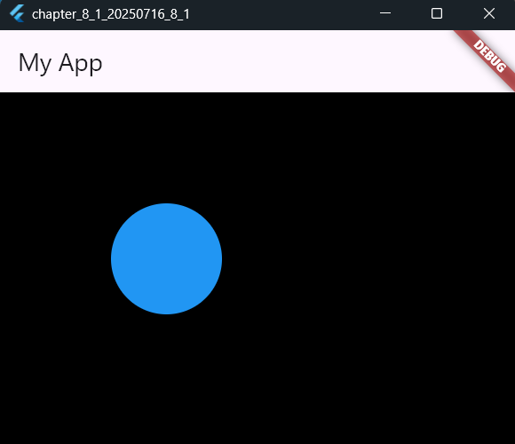
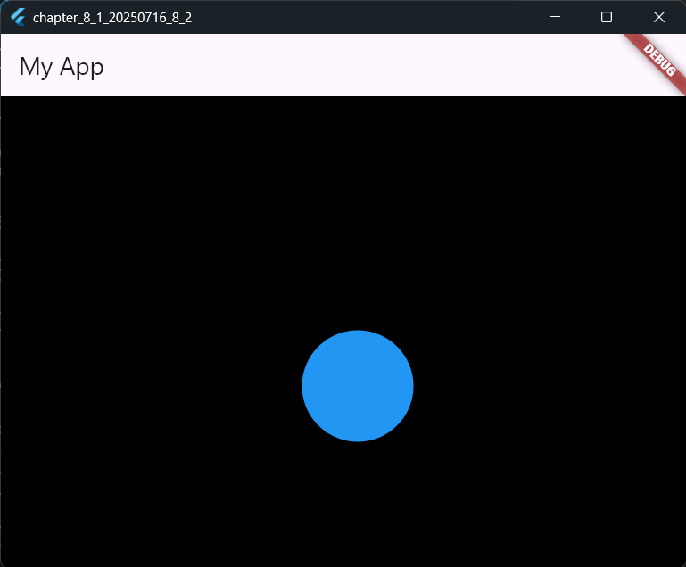
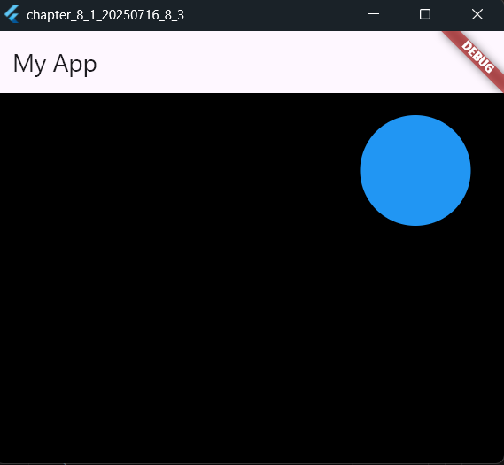

# 8-1: flameコンポーネントの基礎

2025年7月16日
### 今日のキーワード： 「ナン」➡ナンは、多くの人がインド料理と結びつけて考えますが、実はその起源はペルシャ（現代のイラン）にあります。「ナン」という言葉自体はペルシャ語で「パン」を意味しており、そこから中央アジアやインドに広がっていきました。インドでは、ナンは伝統的な「タンドール窯」で焼かれます。この窯の側面に生地を貼り付け、高温で短時間焼くことで、外側はパリッ、中はモッチリとした独特の食感に仕上がります。ただ、ナンは主に北インドで見られるもので、実際の日常の家庭ではチャパティやロティといった別の平焼きパンが主流です。また、日本ではナンがインドカレーの定番として人気ですが、インドの一般家庭では意外と贅沢品とされています。これは精製された小麦粉が高価であることや、タンドール窯が家庭にないことが理由です。

---
  
`main.dartのソースコード(ゲーム画面を表示する)`
```dart
import 'package:flame/game.dart'; // Flameライブラリを使ってゲームを構築
import 'package:flutter/material.dart'; // FlutterのUIコンポーネントを利用
import 'package:flame/input.dart'; // Flameの入力機能を利用
import 'package:flutter/services.dart'; // キーボード入力を処理するためのパッケージ

void main() => runApp(MyApp()); // アプリを起動するエントリーポイント

class MyApp extends StatelessWidget {
  @override
  Widget build(BuildContext context) {
    // アプリ全体の設定を提供するウィジェット
    return MaterialApp(
      title: 'Generated App', // アプリのタイトル
      theme: ThemeData(
        primarySwatch: Colors.blue, // アプリのメインカラーを設定
        primaryColor: const Color(0xff2196f3), // ヘッダーなどのプライマリ色
        canvasColor: const Color(0xfffafafa), // 背景色
      ),
      home: MyHomePage(), // 初期表示する画面を指定
    );
  }
}

class MyHomePage extends StatefulWidget {
  MyHomePage({Key? key}) : super(key: key);
  @override
  _MyHomePageState createState() => _MyHomePageState();
}

class _MyHomePageState extends State<MyHomePage> {
  @override
  Widget build(BuildContext context) {
    // アプリのメイン画面を作成する
    return Scaffold(
      appBar: AppBar(title: Text('My App')), // 画面上部のAppBarにタイトルを表示

      body: GameWidget(game: SampleGame()), // ゲームを表示するためのウィジェット
    );
  }
}

class SampleGame extends FlameGame with KeyboardEvents {
  late final paint; // 描画するオブジェクトを定義
  late Vector2 _loc; // オブジェクトの座標を保持

  @override
  Future<void> onLoad() async {
    await super.onLoad();
    paint = Paint(); // ペイントツールを初期化
    paint.color = Colors.blue; // 描画するオブジェクトの色を設定
    _loc = Vector2(100, 100); // 初期座標を設定
  }

  @override
  void render(Canvas canvas) {
    super.render(canvas);
    final rect = Rect.fromLTWH(_loc.x, _loc.y, 100, 100); // 楕円を描画するための矩形
    canvas.drawOval(rect, paint); // 楕円を描画
  }

  @override
  KeyEventResult onKeyEvent(
    KeyEvent event,
    Set<LogicalKeyboardKey> keysPressed,
  ) {
    final _dpos = Vector2(0, 0); // 移動量を初期化

    // 左矢印キーが押された場合
    if (keysPressed.contains(LogicalKeyboardKey.arrowLeft)) {
      _dpos.x = -10; // 左に10ピクセル移動
    }
    // 右矢印キーが押された場合
    if (keysPressed.contains(LogicalKeyboardKey.arrowRight)) {
      _dpos.x = 10; // 右に10ピクセル移動
    }
    // 上矢印キーが押された場合
    if (keysPressed.contains(LogicalKeyboardKey.arrowUp)) {
      _dpos.y = -10.0; // 上に10ピクセル移動
    }
    // 下矢印キーが押された場合
    if (keysPressed.contains(LogicalKeyboardKey.arrowDown)) {
      _dpos.y = 10.0; // 下に10ピクセル移動
    }
    _loc += _dpos; // 現在の座標に移動量を加算
    return KeyEventResult.handled; // キーイベントを処理済みとして返す
  }
}

```

【 実行画面 】


---

`main.dartのソースコード(キーで図形を操作する)`
```dart
import 'package:flame/game.dart'; // Flameゲームエンジンをインポート
import 'package:flutter/material.dart'; // UIを構築するためのFlutterのライブラリ
import 'package:flame/input.dart'; // 入力処理を行うためのFlameのライブラリ
import 'package:flutter/services.dart'; // キーボード入力を処理するためのライブラリ

void main() => runApp(MyApp()); // アプリケーションのエントリーポイント。MyAppを起動する

class MyApp extends StatelessWidget {
  @override
  Widget build(BuildContext context) {
    // アプリ全体の設定を提供する
    return MaterialApp(
      title: 'Generated App', // アプリケーション名
      theme: ThemeData(
        primarySwatch: Colors.blue, // メインの色設定
        primaryColor: const Color(0xff2196f3), // プライマリカラー
        canvasColor: const Color(0xfffafafa), // 背景色
      ),
      home: MyHomePage(), // アプリの初期画面を設定
    );
  }
}

class MyHomePage extends StatefulWidget {
  MyHomePage({Key? key}) : super(key: key);
  @override
  _MyHomePageState createState() => _MyHomePageState(); // 状態管理を行う
}

class _MyHomePageState extends State<MyHomePage> {
  @override
  Widget build(BuildContext context) {
    // アプリのメイン画面を構築
    return Scaffold(
      appBar: AppBar(title: Text('My App')), // ヘッダーにタイトルを表示

      body: GameWidget(game: SampleGame()), // ゲーム部分を表示するためのウィジェット
    );
  }
}

class SampleGame extends FlameGame with KeyboardEvents {
  // FlameGameクラスを使ってゲームのロジックを定義
  late final paint; // 描画に使うペイントオブジェクト
  late Vector2 _loc; // オブジェクトの現在の位置を保持する変数

  @override
  Future<void> onLoad() async {
    await super.onLoad(); // 基本の初期化処理
    paint = Paint(); // ペイントオブジェクトを作成
    paint.color = Colors.blue; // 描画する楕円の色を設定
    _loc = Vector2(100, 100); // 初期位置を設定
  }

  @override
  void render(Canvas canvas) {
    super.render(canvas);
    final rect = Rect.fromLTWH(_loc.x, _loc.y, 100, 100); // 楕円の領域を指定
    canvas.drawOval(rect, paint); // 指定した場所に楕円を描画
  }

  @override
  KeyEventResult onKeyEvent(
    KeyEvent event,
    Set<LogicalKeyboardKey> keysPressed,
  ) {
    final _dpos = Vector2(0, 0); // 移動量を初期化

    // 'J'キーが押されたら左に移動
    if (event.logicalKey == LogicalKeyboardKey.keyJ) {
      _dpos.x = -10; // 横方向に左へ10移動
    }
    // 'L'キーが押されたら右に移動
    if (event.logicalKey == LogicalKeyboardKey.keyL) {
      _dpos.x = 10; // 横方向に右へ10移動
    }
    // 'I'キーが押されたら上に移動
    if (event.logicalKey == LogicalKeyboardKey.keyI) {
      _dpos.y = -10.0; // 縦方向に上へ10移動
    }
    // 'K'キーが押されたら下に移動
    if (event.logicalKey == LogicalKeyboardKey.keyK) {
      _dpos.y = 10.0; // 縦方向に下へ10移動
    }
    _loc += _dpos; // 現在の位置に移動量を追加
    return KeyEventResult.handled; // イベントを処理済みにする
  }
}
```

【 実行画面 】


---

`main.dartのソースコード(矢印キーで操作する)`
```dart
import 'package:flame/game.dart'; // Flameライブラリを使ってゲームロジックを構築
import 'package:flutter/material.dart'; // FlutterでUIを作成
import 'package:flame/input.dart'; // Flameでキーボード入力を扱うための機能を提供
import 'package:flutter/services.dart'; // キーボードイベントを処理するライブラリ

void main() => runApp(MyApp()); // アプリのエントリーポイント

class MyApp extends StatelessWidget {
  @override
  Widget build(BuildContext context) {
    // アプリ全体の設定を提供するFlutterウィジェット
    return MaterialApp(
      title: 'Generated App', // アプリのタイトル
      theme: ThemeData(
        primarySwatch: Colors.blue, // アプリのテーマカラー
        primaryColor: const Color(0xff2196f3), // ヘッダーやアクセントの色
        canvasColor: const Color(0xfffafafa), // 背景色
      ),
      home: MyHomePage(), // アプリの最初の画面を指定
    );
  }
}

class MyHomePage extends StatefulWidget {
  MyHomePage({Key? key}) : super(key: key);

  @override
  _MyHomePageState createState() => _MyHomePageState(); // この画面の状態管理を提供
}

class _MyHomePageState extends State<MyHomePage> {
  @override
  Widget build(BuildContext context) {
    // アプリのメイン画面の構築
    return Scaffold(
      appBar: AppBar(title: Text('My App')), // 画面上部に表示するタイトルバー

      body: GameWidget(game: SampleGame()), // ゲーム部分を表示するためのウィジェット
    );
  }
}

class SampleGame extends FlameGame with KeyboardEvents {
  // FlameGameクラスを継承してゲームロジックを定義
  late final paint; // 描画に使用するペイントオブジェクト
  late Vector2 _loc; // 楕円の現在位置を保持する変数

  @override
  Future<void> onLoad() async {
    await super.onLoad(); // 基本の初期化処理
    paint = Paint(); // 描画ツールの初期化
    paint.color = Colors.blue; // 描画する楕円の色を青に設定
    _loc = Vector2(100, 100); // 楕円の初期位置を設定
  }

  @override
  void render(Canvas canvas) {
    super.render(canvas);
    final rect = Rect.fromLTWH(_loc.x, _loc.y, 100, 100); // 楕円の大きさと位置を指定する矩形
    canvas.drawOval(rect, paint); // 楕円を描画
  }

  @override
  KeyEventResult onKeyEvent(
    KeyEvent event,
    Set<LogicalKeyboardKey> keysPressed,
  ) {
    final _dpos = Vector2(0, 0); // 移動量を初期化

    // 左矢印キーが押されたら左に移動
    if (keysPressed.contains(LogicalKeyboardKey.arrowLeft)) {
      _dpos.x = -10; // 横方向に左へ移動
    }
    // 右矢印キーが押されたら右に移動
    if (keysPressed.contains(LogicalKeyboardKey.arrowRight)) {
      _dpos.x = 10; // 横方向に右へ移動
    }
    // 上矢印キーが押されたら上に移動
    if (keysPressed.contains(LogicalKeyboardKey.arrowUp)) {
      _dpos.y = -10.0; // 縦方向に上へ移動
    }
    // 下矢印キーが押されたら下に移動
    if (keysPressed.contains(LogicalKeyboardKey.arrowDown)) {
      _dpos.y = 10.0; // 縦方向に下へ移動
    }
    _loc += _dpos; // 現在の位置に移動量を加算
    return KeyEventResult.handled; // キーイベントを処理したことを通知
  }
}

```

【 実行画面 】


---
