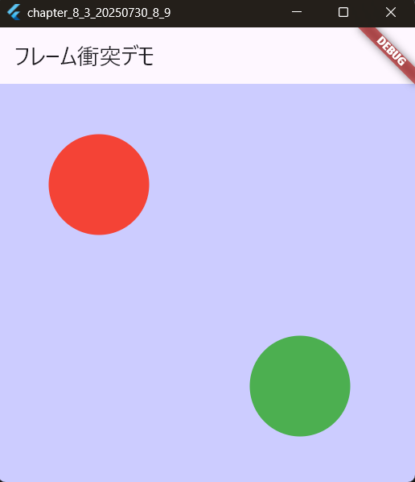
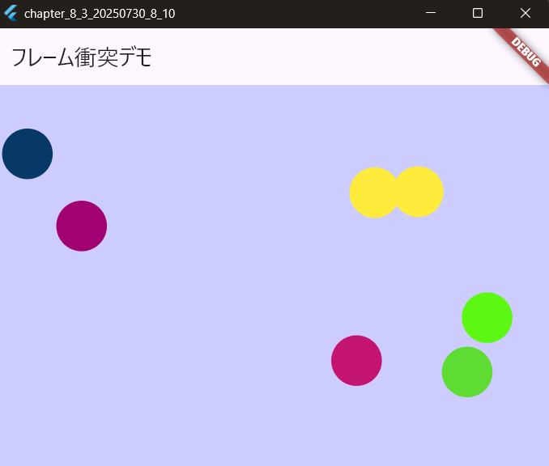
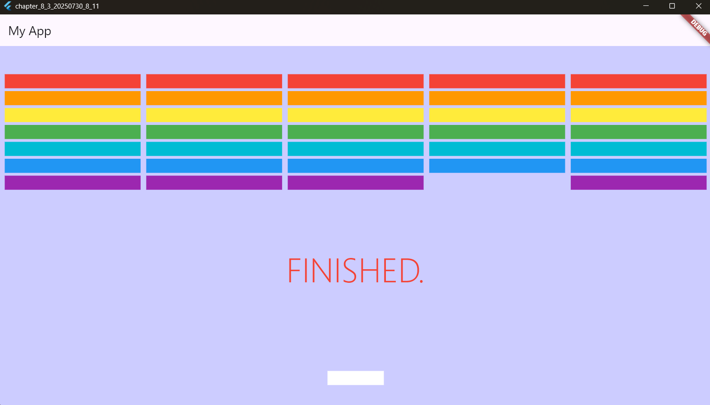

# 8-3: スプライトの衝突判定

2025年7月30日
### 今日のキーワード： 「かつどん」➡カツ丼は日本の食文化のなかで一際ユニークな存在です！明治時代後半の日本で洋食の「カツレツ」から発展し、卵でとじたスタイルやソースを使用するスタイルが広まっていきました。起源としては東京の早稲田大学近くのお店で誕生したという説が有力ですが、山梨県の甲府市や福井県も「発祥地」とされることがあるそうです。実は地域ごとに異なる個性があるのも面白いポイントで、例えば、群馬県桐生市では「ソースカツ丼」として知られ、ウスターソースに浸したカツが特徴。福島県会津若松市ではキャベツを敷いた上にソースカツを乗せる形式が発祥とされています。そして、沖縄では野菜炒めを使った独特のスタイルも存在します。

---
  
`main.dartのソースコード(接触したら色が変わる)`
```dart

import 'package:flame/components.dart'; // Flame内の基本コンポーネントを使用
import 'package:flame/events.dart'; // 入力イベントの処理を補助
import 'package:flame/game.dart'; // ゲームの管理に必要な基本機能
import 'package:flame/collisions.dart'; // 衝突検知を行うための機能
import 'package:flutter/material.dart'; // UIを構築するFlutterのライブラリ
import 'package:flutter/services.dart'; // キーボード入力やシステム操作に必要なツール

void main() => runApp(const MyApp());
// Flutterアプリのエントリーポイント。MyAppを最初に表示。

class MyApp extends StatelessWidget {
  const MyApp({super.key});

  @override
  Widget build(BuildContext context) {
    return MaterialApp(
      title: 'フレーム衝突デモ', // アプリのタイトル
      theme: ThemeData(primarySwatch: Colors.blue), // テーマカラーを青に設定
      home: const MyHomePage(), // ホーム画面としてMyHomePageを表示
    );
  }
}

class MyHomePage extends StatelessWidget {
  const MyHomePage({super.key});

  @override
  Widget build(BuildContext context) {
    return Scaffold(
      appBar: AppBar(title: const Text('フレーム衝突デモ')), // タイトルバーを表示
      body: GameWidget(game: SampleGame()), // ゲーム本体（SampleGame）を埋め込む
    );
  }
}

// ゲーム本体
class SampleGame extends FlameGame with HasCollisionDetection, KeyboardEvents {
  // 衝突検知とキーボード入力を管理する機能を追加

  @override
  Color backgroundColor() => const Color(0xffCCCCFF); 
  // ゲームの背景色を薄い紫色に設定

  @override
  Future<void> onLoad() async {
    await super.onLoad(); 
    // ゲームの初期設定を行う

    add(MySprite(Vector2(300, 300), isStatic: true)); 
    // 緑の静止スプライトを初期位置で追加
    add(MySprite(Vector2(100, 100), isStatic: false)); 
    // 赤の移動可能スプライトを初期位置で追加
  }
}

// スプライト（丸いキャラクター）のクラス
class MySprite extends CircleComponent
    with CollisionCallbacks, KeyboardHandler {
  // 衝突検知（CollisionCallbacks）とキーボード処理（KeyboardHandler）を追加
  final bool isStatic; // 静止かどうかを示すフラグ
  final double _speed = 100.0; // スプライトの移動速度
  Vector2 _delta = Vector2.zero(); // 移動の方向を管理する変数
  late Color _originalColor; // 元の色を保存

  MySprite(Vector2 initialPosition, {required this.isStatic})
    : super(position: initialPosition, radius: 50, anchor: Anchor.center);
    // 初期位置、円の半径、アンカー位置を設定

  @override
  Future<void> onLoad() async {
    await super.onLoad(); 
    // スプライトの初期化処理

    _originalColor = isStatic ? Colors.green : Colors.red; 
    // 静止スプライトは緑、移動スプライトは赤
    paint.color = _originalColor; // スプライトの色を設定

    add(CircleHitbox()); 
    // 円形の衝突判定領域を追加
  }

  @override
  bool onKeyEvent(KeyEvent event, Set<LogicalKeyboardKey> keysPressed) {
    if (isStatic) return false; 
    // 静止スプライトならキーボード入力を無視する

    _delta = Vector2.zero(); 
    // 移動量をリセット

    // 各キー入力に応じて移動方向を設定
    if (keysPressed.contains(LogicalKeyboardKey.keyJ) ||
        keysPressed.contains(LogicalKeyboardKey.arrowLeft)) {
      _delta.x = -1; // 左に移動
    }
    if (keysPressed.contains(LogicalKeyboardKey.keyL) ||
        keysPressed.contains(LogicalKeyboardKey.arrowRight)) {
      _delta.x = 1; // 右に移動
    }
    if (keysPressed.contains(LogicalKeyboardKey.keyI) ||
        keysPressed.contains(LogicalKeyboardKey.arrowUp)) {
      _delta.y = -1; // 上に移動
    }
    if (keysPressed.contains(LogicalKeyboardKey.keyK) ||
        keysPressed.contains(LogicalKeyboardKey.arrowDown)) {
      _delta.y = 1; // 下に移動
    }

    if (_delta.length != 0) {
      _delta.normalize(); 
      // 対角線移動時も速度を一定に保つ
    }

    return true; // 入力を処理したことを通知
  }

  @override
  void update(double dt) {
    super.update(dt);

    if (!isStatic) {
      position += _delta * dt * _speed; 
      // 移動量に基づいて位置を更新

      position.clamp(
        Vector2.zero() + size / 2, 
        // 画面の左上を範囲の開始点に
        (parent as FlameGame).size - size / 2, 
        // 画面の右下を範囲の終了点に
      );
      // スプライトが画面外に出ないように位置を制限
    }
  }

  @override
  void onCollisionStart(
    Set<Vector2> intersectionPoints,
    PositionComponent other,
  ) {
    super.onCollisionStart(intersectionPoints, other);
    paint.color = Colors.yellow; 
    // 衝突中はスプライトの色を黄色に変更
  }

  @override
  void onCollisionEnd(PositionComponent other) {
    super.onCollisionEnd(other);
    paint.color = _originalColor; 
    // 衝突が終わると元の色に戻す
  }
}
```

【 実行画面 】


---

`main.dartのソースコード(ゲーム画面の端との衝突)`
```dart
import 'package:flame/components.dart'; // Flameでゲームコンポーネントを管理するためのライブラリ
import 'package:flame/events.dart'; // Flameでイベント（入力操作など）を処理するためのライブラリ
import 'package:flame/game.dart'; // Flameフレームワークのゲームの基本機能を提供
import 'package:flame/collisions.dart'; // 衝突検知を管理するためのライブラリ
import 'package:flutter/material.dart'; // FlutterのUI構築ライブラリ
import 'package:flutter/services.dart'; // 入力操作やシステムとの連携に必要
import 'dart:math'; // ランダムな値を生成するために利用

void main() => runApp(const MyApp());
// アプリのエントリーポイント。Flutterアプリを起動する。

class MyApp extends StatelessWidget {
  const MyApp({super.key});

  @override
  Widget build(BuildContext context) {
    return MaterialApp(
      title: 'フレーム衝突デモ', // アプリのタイトルを設定
      theme: ThemeData(primarySwatch: Colors.blue), // アプリ全体のテーマカラーを青に設定
      home: const MyHomePage(), // 初期画面としてMyHomePageを表示
    );
  }
}

class MyHomePage extends StatelessWidget {
  const MyHomePage({super.key});

  @override
  Widget build(BuildContext context) {
    return Scaffold(
      appBar: AppBar(title: const Text('フレーム衝突デモ')), // タイトルバーを設定
      body: GameWidget(game: SampleGame()), 
      // Flameのゲーム本体（SampleGame）を表示するためのウィジェット
    );
  }
}

class SampleGame extends FlameGame
    with HasCollisionDetection, HasKeyboardHandlerComponents {
  // ゲーム内で衝突検知を行い、キーボード入力の操作を可能にする機能を追加

  late final List<MySprite> _splayers; 
  // スプライト（ゲーム内のキャラクター）を管理するリスト

  @override
  Color backgroundColor() => const Color(0xffCCCCFF); 
  // ゲームの背景色を薄い紫色に設定

  @override
  Future<void> onLoad() async {
    await super.onLoad();
    add(ScreenHitbox()); 
    // ゲーム画面の外枠を衝突対象として追加

    _splayers = <MySprite>[]; 
    // スプライトリストを初期化
    for (var i = 0; i < 10; i++) {
      await add(MySprite()); 
      // ランダムなスプライトを10個追加
    }
  }
}

class MySprite extends CircleComponent
    with CollisionCallbacks, HasGameRef<SampleGame> {
  // 衝突検知やゲーム参照を行うための機能を追加

  var _size = 50.0; 
  // スプライトのサイズ（円の直径）を設定
  late Vector2 _delta; 
  // スプライトの移動方向と速度を管理する変数
  late Color _color; 
  // スプライトの色を保持

  @override
  Future<void> onLoad() async {
    await super.onLoad(); 
    // スプライトの初期設定を行う

    final _rnd = Random(); 
    // ランダムな色を生成するためのツール
    _color = Color.fromARGB(
      255,
      _rnd.nextInt(256),
      _rnd.nextInt(256),
      _rnd.nextInt(256),
    ); 
    // ランダムなRGB値でスプライトの色を設定
    size = Vector2(_size, _size); 
    // スプライトのサイズを設定
    final _loc = Vector2.random(); 
    // ランダムな位置を生成
    _loc.x *= gameRef.canvasSize.x; 
    // ゲーム画面の幅に基づいてx座標を設定
    _loc.y *= gameRef.canvasSize.y; 
    // ゲーム画面の高さに基づいてy座標を設定
    position = _loc; 
    // 生成したランダムな位置をスプライトの初期位置として設定
    _delta = Vector2.random() * 3.0; 
    // ランダムな方向と速度で移動を設定
    setColor(_color); 
    // スプライトの色を設定
    CircleHitbox hitbox = CircleHitbox(); 
    // 衝突検知を行うための円形のヒットボックスを追加
    add(hitbox); 
  }

  @override
  void render(Canvas canvas) {
    super.render(canvas); 
    // スプライトの描画を行う
  }

  @override
  void update(double delta) {
    super.update(delta);
    position += _delta * delta * 100; 
    // 現在の移動方向に基づいて位置を更新
  }

  @override
  void onCollision(Set<Vector2> points, PositionComponent other) {
    if (other is ScreenHitbox) {
      // 衝突相手が画面の外枠の場合
      if (position.x <= 0) {
        _delta.x = _delta.x.abs(); 
        // 左端で跳ね返る
      }
      if (position.x >= other.width - _size) {
        _delta.x = -_delta.x.abs(); 
        // 右端で跳ね返る
      }
      if (position.y <= 0) {
        _delta.y = _delta.y.abs(); 
        // 上端で跳ね返る
      }
      if (position.y >= other.height - _size) {
        _delta.y = -_delta.y.abs(); 
        // 下端で跳ね返る
      }
    } else {
      setColor(Colors.yellow); 
      // 他のスプライトと衝突した場合、黄色に色を変更
    }
  }
}
```

【 実行画面 】


---

`main.dartのソースコード(ミニブロック崩し)`
```dart
import 'package:flame/collisions.dart'; // 衝突検出用のインポート
import 'package:flame/components.dart'; // 基本的なゲームコンポーネントのインポート
import 'package:flame/events.dart'; // キーボード入力などのイベント処理用インポート
import 'package:flame/experimental.dart'; // 実験的な機能（使用している場合）
import 'package:flame/extensions.dart'; // Flameオブジェクト用の拡張機能
import 'package:flame/game.dart'; // Flameゲームエンジンのコア
import 'package:flutter/material.dart'; // Flutterのマテリアルデザインコンポーネント
import 'package:flutter/services.dart'; // Flutterのサービス（キーボード入力など）用

// アプリケーションの開始地点となるmain関数
void main() {
  // Flutterのウィジェットを初期化してからアプリを実行
  WidgetsFlutterBinding.ensureInitialized();

  // アプリケーションを実行、MyAppウィジェットが起動点
  runApp(MyApp());
}

// MyAppはStatelessWidget（構築後に内容が変わらない）
class MyApp extends StatelessWidget {
  @override
  Widget build(BuildContext context) {
    return MaterialApp(
      title: 'Generated App', // アプリのタイトル
      theme: ThemeData(
        // アプリの見た目を定義
        primarySwatch: Colors.blue, // プライマリカラーの配色
        primaryColor: const Color(0xff2196f3), // 指定されたプライマリカラー
        canvasColor: const Color(0xfffafafa), // キャンバス（背景）色
      ),
      home: MyHomePage(), // アプリの最初の画面
    );
  }
}

// MyHomePageはStatefulWidget（状態に応じて変化する）
class MyHomePage extends StatefulWidget {
  MyHomePage({Key? key}) : super(key: key);

  @override
  _MyHomePageState createState() => _MyHomePageState();
}

// MyHomePageの状態クラス
class _MyHomePageState extends State<MyHomePage> {
  @override
  Widget build(BuildContext context) {
    return Scaffold(
      appBar: AppBar(title: Text('My App')), // 上部のアプリバー

      // ゲーム本体を表示するエリア
      body: GameWidget(game: SampleGame()),
    );
  }
}

// ---
// ゲーム画面のクラス
// SampleGameはFlameGameを継承し、衝突検出とキーボード入力を扱う
class SampleGame extends FlameGame
    with HasCollisionDetection, HasKeyboardHandlerComponents {
  late final List<BlockSprite> _blocks; // ブロックコンポーネントを格納するリスト
  bool _flag = true; // ゲーム中かどうかを示すフラグ
  // ブロックの色一覧
  final List<Color> colors = [
    Colors.red,
    Colors.orange,
    Colors.yellow,
    Colors.green,
    Colors.cyan,
    Colors.blue,
    Colors.purple,
  ];

  // ゲーム背景色
  @override
  Color backgroundColor() => const Color(0xFFCCCCFF);

  // ゲーム読み込み時に呼び出される
  @override
  Future<void> onLoad() async {
    await super.onLoad();
    // 画面端のヒットボックスを追加（画面外への衝突検出用）
    add(ScreenHitbox());

    // ブロック1つのサイズを計算
    // 横幅：(size.x - 10) / 5 - 10（間隔考慮）
    // 高さ：固定25
    final _size = Vector2((size.x - 10) / 5 - 10, 25);
    _blocks = <BlockSprite>[]; // ブロックリスト初期化

    // 7行×5列でブロックを配置
    for (var i = 0; i < 7; i++) {
      for (var j = 0; j < 5; j++) {
        // ブロックを作成
        // colors[i]で行に応じた色を指定
        var sp = await BlockSprite(
          _size,
          Vector2(j * (_size.x + 10) + 10, 30 * i + 50),
          colors[i],
        );
        _blocks.add(sp); // リストに追加
        add(sp); // ゲーム画面に追加
      }
    }
    add(await BallSprite()); // ボールを追加
    await add(BarSprite()); // バー（パドル）を追加
  }

  // ゲーム終了時に呼び出す
  void gameOver() {
    _flag = false; // ゲームフラグをOFFに
    add(TextSprite("FINISHED.")); // 「FINISHED.」というテキスト表示
  }
}

// ---
// ボール・コンポーネント
// BallSpriteはボールを表す、円形・衝突検出付き
class BallSprite extends CircleComponent
    with CollisionCallbacks, HasGameRef<SampleGame> {
  var _size = 25.0; // ボールの直径
  late Vector2 _delta; // ボールの移動ベクトル

  @override
  Future<void> onLoad() async {
    await super.onLoad();
    size = Vector2(_size, _size); // ボールのサイズ設定
    // 初期位置（画面下部中央）
    final _loc = Vector2(
      gameRef.canvasSize.x / 2 - 12,
      gameRef.canvasSize.y - 100,
    );
    position = _loc; // 位置設定
    _delta = Vector2(1, -1); // 初期の移動方向（右上）
    setColor(Colors.white); // 白色に設定
    add(CircleHitbox()); // 円形ヒットボックス追加
  }

  // 毎フレーム呼ばれる更新処理
  @override
  void update(double delta) {
    if (!gameRef._flag) {
      return; // ゲーム終了時は処理しない
    }
    super.update(delta);
    position += _delta * delta * 100; // 移動処理
  }

  // 衝突時に呼ばれる処理
  @override
  void onCollision(Set<Vector2> points, PositionComponent other) {
    if (!gameRef._flag) {
      return;
    }
    // 画面端との衝突
    if (other is ScreenHitbox) {
      if (position.x <= 0) {
        _delta.x = _delta.x.abs(); // 左端 → 右に反転
      }
      if (position.x >= other.width - _size) {
        _delta.x = -_delta.x.abs(); // 右端 → 左に反転
      }
      if (position.y <= 0) {
        _delta.y = _delta.y.abs(); // 上端 → 下に反転
      }
      if (position.y >= other.height - _size) {
        _delta.y = -_delta.y.abs(); // 下端 → 上に反転（ゲーム終了）
        gameRef.gameOver();
      }
    }
    // ブロックとの衝突
    if (other is BlockSprite) {
      // 衝突した方向によって反射方向を調整
      if (position.x + size.x / 2 < other.position.x) {
        _delta.x = -_delta.x.abs(); // 左側に当たった
      }
      if (position.x + size.x / 2 > other.position.x + other.width) {
        _delta.x = _delta.x.abs(); // 右側に当たった
      }
      if (position.y + size.y / 2 < other.position.y) {
        _delta.y = -_delta.y.abs(); // 上側に当たった
      }
      if (position.y + size.y / 2 > other.position.y + other.height) {
        _delta.y = _delta.y.abs(); // 下側に当たった
      }
    }
    // バーとの衝突
    if (other is BarSprite) {
      // 当たった位置に応じて角度を変える
      if (position.x + size.x / 2 < other.position.x) {
        _delta.x = -_delta.x.abs(); // 左端
      }
      if (position.x + size.x / 2 > other.position.x + other.width) {
        _delta.x = _delta.x.abs(); // 右端
      }
      if (position.y + size.y / 2 < other.position.y) {
        // 上面にヒットしたら、跳ね返す＋角度調整
        _delta.y = -_delta.y.abs();
        final d = ((other.position.x + other.width / 2) - (position.x + size.x / 2));
        final p = (other.width / 5).floor();
        _delta.x -= (d / p);
        _delta.x = _delta.x > 3 ? 3 : _delta.x; // 横速度の上限
        _delta.y = -(5 / (gameRef._blocks.length / 5).ceil() + 1); // ブロック減少に応じて加速
      }
      if (position.y + size.y / 2 > other.position.y + other.height) {
        _delta.y = _delta.y.abs(); // バーの下に当たった（ほぼ起こらない）
      }
    }
  }
}

// ---
// ブロック・コンポーネント
class BlockSprite extends PositionComponent
    with CollisionCallbacks, HasGameRef<SampleGame> {
  late Vector2 _position; // ブロックの位置
  late Vector2 _size; // ブロックのサイズ
  late Paint _paint; // 描画用Paint
  late Color _color; // 色

  BlockSprite(this._size, this._position, this._color) : super();

  @override
  Future<void> onLoad() async {
    await super.onLoad();
    position = _position;
    size = _size;
    _paint = Paint()
      ..style = PaintingStyle.fill
      ..color = _color;
    add(RectangleHitbox()); // 四角形ヒットボックス追加
  }

  @override
  void render(Canvas canvas) {
    super.render(canvas);
    final r = Rect.fromLTWH(0, 0, _size.x, _size.y);
    canvas.drawRect(r, _paint); // ブロック描画
  }

  // 衝突終了時に呼ばれる処理（ここでブロック削除）
  @override
  void onCollisionEnd(PositionComponent other) {
    if (!gameRef._flag) return;
    gameRef.remove(this); // ブロックを削除
    gameRef._blocks.remove(this); // リストからも削除
    if (gameRef._blocks.length == 0) {
      gameRef.gameOver(); // 全部消えたらゲーム終了
    }
  }
}

// ---
// バー・コンポーネント（操作用パドル）
class BarSprite extends PositionComponent
    with CollisionCallbacks, KeyboardHandler, HasGameRef<SampleGame> {
  Vector2 _delta = Vector2.zero(); // 横方向の移動ベクトル
  late Paint _paint; // 描画用

  BarSprite() : super();

  @override
  Future<void> onLoad() async {
    await super.onLoad();
    size = Vector2(100, 25); // パドルサイズ
    position = Vector2(
      gameRef.canvasSize.x / 2 - 50,
      gameRef.canvasSize.y - 50,
    );
    _paint = Paint()
      ..style = PaintingStyle.fill
      ..color = Colors.white;
    add(RectangleHitbox());
  }

  @override
  void update(double delta) {
    if (!gameRef._flag) return;
    position += _delta * delta * 100; // 横に移動
    super.update(delta);
  }

  @override
  void render(Canvas canvas) {
    super.render(canvas);
    final r = Rect.fromLTWH(0, 0, 100, 25);
    canvas.drawRect(r, _paint);
  }

  // キーボード入力の処理
  @override
  bool onKeyEvent(KeyEvent event, Set<LogicalKeyboardKey> keysPressed) {
    if (!gameRef._flag) return false;
    if (event is KeyUpEvent) {
      _delta = Vector2.zero(); // キー離したら止まる
    }
    if (event.character == 'j') {
      _delta.x = -3; // jキーで左
    }
    if (event.character == 'l') {
      _delta.x = 3; // lキーで右
    }
    return true;
  }
}

// ---
// テキスト・コンポーネント（FINISHED表示用）
class TextSprite extends TextComponent with HasGameRef<SampleGame> {
  late String _message; // 表示するメッセージ

  TextSprite(this._message) : super();

  @override
  Future<void> onLoad() async {
    await super.onLoad();
    anchor = Anchor.center; // 中央揃え
    position = Vector2(gameRef.canvasSize.x / 2, gameRef.canvasSize.y / 2); // 中央に表示
    text = _message;
    textRenderer = TextPaint(
      style: TextStyle(
        fontSize: 60.0,
        fontWeight: FontWeight.w300,
        color: Colors.red,
      ),
    );
  }
}
```

【 実行画面 】


---
