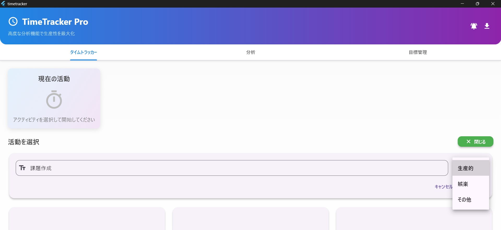
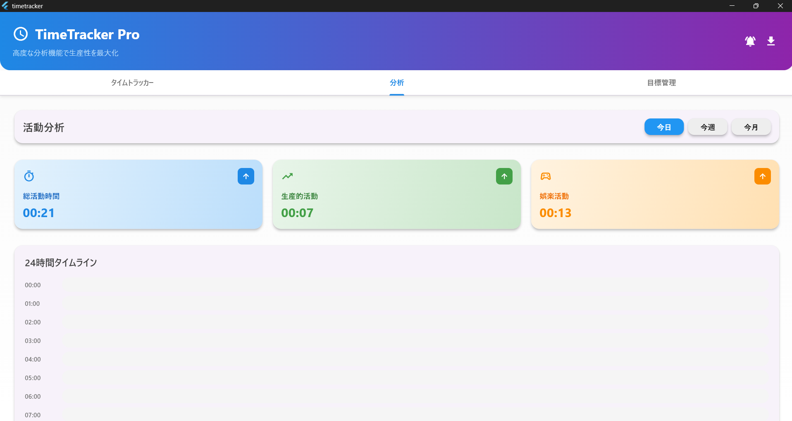

# application_create: timetracker

2025年7月9日
### 今日のキーワード： 「カレー」➡カレーの起源はインドにありますが、イギリスを経由して世界中に広まり、各国で独自の進化を遂げています。例えば、日本のカレーは19世紀末、明治時代にイギリスを通じて伝わりましたが、最初は洋食として扱われていました。その後、日本独自の「ルウ」を使ったスタイルが発展し、家庭料理の定番になりました。一方、インドのカレーは地域ごとに異なり、南インドではココナッツミルクを使ったマイルドな味、北インドではクリーミーなバターチキンなどが人気です。また、スパイスを直接炒めて香りを引き出す「テンパリング」という技法が使われています。さらに、日本では「カレーの日」が1月22日に定められていて、これは、1960年代に学校給食でカレーが初めて提供された日に由来しているんです。

---
 
`main.dartのソースコード(あったら嬉しいアプリケーションを作成)`
```dart
import 'dart:async';      // 非同期処理（タイマーなど）のためのライブラリ
import 'dart:convert';    // JSON形式のデータ変換のためのライブラリ
import 'dart:io';         // ファイル操作のためのライブラリ
import 'package:flutter/foundation.dart';  // Flutter開発時の基本機能
import 'package:flutter/material.dart';    // FlutterのUIコンポーネント（ボタン、テキストなど）
import 'package:flutter/services.dart';    // ハプティック（振動）フィードバック機能
import 'package:path_provider/path_provider.dart';  // ファイル保存場所の取得
import 'package:shared_preferences/shared_preferences.dart';  // データの永続化（アプリ終了後も保持）
import 'package:intl/intl.dart';  // 日付フォーマットのためのライブラリ

// ====== データモデルクラス ======
// Activity（活動）を表すクラス
// 例：「勉強」「SNS」「仕事」など
class Activity {
  final int id;           // 活動を識別する番号
  final String name;      // 活動名（例：「勉強」）
  final String category;  // カテゴリー（例：「生産的」）
  final Color color;      // 活動を表示する色

  // コンストラクタ（このクラスのインスタンスを作る時に呼ばれる）
  Activity({
    required this.id,
    required this.name,
    required this.category,
    required this.color,
  });

  // JSON形式に変換する関数（データを保存する時に使用）
  Map<String, dynamic> toJson() => {
    'id': id,
    'name': name,
    'category': category,
    'color': color.value,  // Colorオブジェクトを数値に変換
  };

  // JSON形式からActivityオブジェクトを復元する関数（データを読み込む時に使用）
  factory Activity.fromJson(Map<String, dynamic> json) => Activity(
    id: json['id'],
    name: json['name'],
    category: json['category'],
    color: Color(json['color']),  // 数値からColorオブジェクトに変換
  );

  // 部分的に内容を変更した新しいActivityを作成する関数
  Activity copyWith({
    int? id,
    String? name,
    String? category,
    Color? color,
  }) {
    return Activity(
      id: id ?? this.id,  // 新しい値がなければ現在の値を使用
      name: name ?? this.name,
      category: category ?? this.category,
      color: color ?? this.color,
    );
  }
}

// TimeRecord（時間記録）を表すクラス
// 例：「勉強を1時間30分行った」という記録
class TimeRecord {
  final int id;           // 記録を識別する番号
  final String activity;  // 活動名
  final String category;  // カテゴリー
  final Color color;      // 表示色
  final Duration duration; // 活動時間
  final DateTime startTime; // 開始時刻
  final DateTime endTime;   // 終了時刻
  final String date;        // 日付（文字列形式）

  // コンストラクタ
  TimeRecord({
    required this.id,
    required this.activity,
    required this.category,
    required this.color,
    required this.duration,
    required this.startTime,
    required this.endTime,
    required this.date,
  });

  // JSON形式に変換
  Map<String, dynamic> toJson() => {
    'id': id,
    'activity': activity,
    'category': category,
    'color': color.value,
    'duration': duration.inMilliseconds,  // 時間をミリ秒に変換
    'startTime': startTime.toIso8601String(),  // 日時を文字列に変換
    'endTime': endTime.toIso8601String(),
    'date': date,
  };

  // JSON形式から復元
  factory TimeRecord.fromJson(Map<String, dynamic> json) => TimeRecord(
    id: json['id'],
    activity: json['activity'],
    category: json['category'],
    color: Color(json['color']),
    duration: Duration(milliseconds: json['duration']),  // ミリ秒から時間に変換
    startTime: DateTime.parse(json['startTime']),  // 文字列から日時に変換
    endTime: DateTime.parse(json['endTime']),
    date: json['date'],
  );
}

// Goal（目標）を表すクラス
// 例：「勉強を毎日2時間」という目標
class Goal {
  final int id;           // 目標を識別する番号
  final String activity;  // 対象の活動名
  final int targetHours;  // 目標時間
  final String type;      // 目標の種類（daily/weekly/monthly）

  // コンストラクタ
  Goal({
    required this.id,
    required this.activity,
    required this.targetHours,
    required this.type,
  });

  // JSON形式に変換
  Map<String, dynamic> toJson() => {
    'id': id,
    'activity': activity,
    'targetHours': targetHours,
    'type': type,
  };

  // JSON形式から復元
  factory Goal.fromJson(Map<String, dynamic> json) => Goal(
    id: json['id'],
    activity: json['activity'],
    targetHours: json['targetHours'],
    type: json['type'],
  );
}

// タイムライン表示用の活動データ
class TimelineActivity {
  final TimeRecord record;     // 元の記録データ
  final double startPercent;   // 開始位置（％）
  final double widthPercent;   // 幅（％）

  TimelineActivity({
    required this.record,
    required this.startPercent,
    required this.widthPercent,
  });
}

// 1時間分のタイムラインデータ
class TimelineData {
  final int hour;                       // 時間（0-23）
  final List<TimelineActivity> activities; // その時間の活動一覧

  TimelineData({
    required this.hour,
    required this.activities,
  });
}

// 統計データをまとめるクラス
class StatsData {
  final Duration totalTime;                        // 合計時間
  final Map<String, Duration> categoryStats;      // カテゴリ別統計
  final Map<String, Duration> activityStats;      // 活動別統計
  final List<TimeRecord> records;                 // 記録一覧

  StatsData({
    required this.totalTime,
    required this.categoryStats,
    required this.activityStats,
    required this.records,
  });
}

// 目標の進捗状況を表すクラス
class GoalProgress {
  final double actualHours;  // 実際の時間
  final double progress;     // 進捗率（％）

  GoalProgress({
    required this.actualHours,
    required this.progress,
  });
}

// ====== カスタムUIコンポーネント ======

// アニメーション付きプログレスバー
class AnimatedProgressBar extends StatefulWidget {
  final double progress;  // 進捗率（0-100）
  final Color color;      // バーの色
  final double height;    // バーの高さ

  const AnimatedProgressBar({
    Key? key,
    required this.progress,
    required this.color,
    this.height = 8.0,
  }) : super(key: key);

  @override
  _AnimatedProgressBarState createState() => _AnimatedProgressBarState();
}

class _AnimatedProgressBarState extends State<AnimatedProgressBar>
    with SingleTickerProviderStateMixin {
  late AnimationController _controller;  // アニメーションの制御
  late Animation<double> _animation;     // アニメーションの値

  @override
  void initState() {
    super.initState();
    // アニメーションコントローラーの初期化
    _controller = AnimationController(
      duration: const Duration(milliseconds: 800),  // 0.8秒でアニメーション完了
      vsync: this,
    );
    
    // アニメーションの設定（0から指定の進捗率まで）
    _animation = Tween<double>(
      begin: 0.0,
      end: widget.progress,
    ).animate(CurvedAnimation(
      parent: _controller,
      curve: Curves.easeInOut,  // なめらかな動き
    ));
    
    // アニメーション開始
    _controller.forward();
  }

  @override
  void didUpdateWidget(AnimatedProgressBar oldWidget) {
    super.didUpdateWidget(oldWidget);
    // 進捗率が変更された時の処理
    if (oldWidget.progress != widget.progress) {
      _animation = Tween<double>(
        begin: _animation.value,  // 現在の値から
        end: widget.progress,     // 新しい値へ
      ).animate(CurvedAnimation(
        parent: _controller,
        curve: Curves.easeInOut,
      ));
      _controller.forward(from: 0.0);  // アニメーション再開
    }
  }

  @override
  void dispose() {
    _controller.dispose();  // メモリリークを防ぐためのクリーンアップ
    super.dispose();
  }

  @override
  Widget build(BuildContext context) {
    // アニメーションの値が変わるたびに再描画
    return AnimatedBuilder(
      animation: _animation,
      builder: (context, child) {
        return Container(
          height: widget.height,
          decoration: BoxDecoration(
            color: Colors.grey[200],  // 背景色
            borderRadius: BorderRadius.circular(widget.height / 2),  // 角丸
          ),
          child: FractionallySizedBox(
            alignment: Alignment.centerLeft,
            widthFactor: _animation.value / 100,  // 進捗率に応じた幅
            child: Container(
              decoration: BoxDecoration(
                color: widget.color,
                borderRadius: BorderRadius.circular(widget.height / 2),
              ),
            ),
          ),
        );
      },
    );
  }
}

// グラデーション付きカードウィジェット
class GradientCard extends StatelessWidget {
  final Widget child;           // カードの中身
  final List<Color> colors;     // グラデーションの色
  final double borderRadius;    // 角丸の半径
  final EdgeInsets padding;     // 内側の余白

  const GradientCard({
    Key? key,
    required this.child,
    required this.colors,
    this.borderRadius = 12.0,
    this.padding = const EdgeInsets.all(16.0),
  }) : super(key: key);

  @override
  Widget build(BuildContext context) {
    return Container(
      decoration: BoxDecoration(
        gradient: LinearGradient(
          colors: colors,
          begin: Alignment.topLeft,     // 左上から
          end: Alignment.bottomRight,   // 右下へのグラデーション
        ),
        borderRadius: BorderRadius.circular(borderRadius),
        boxShadow: [
          BoxShadow(
            color: Colors.black.withOpacity(0.1),  // 薄い影
            blurRadius: 10,
            offset: const Offset(0, 4),
          ),
        ],
      ),
      child: Padding(
        padding: padding,
        child: child,
      ),
    );
  }
}

// ====== メインアプリケーション ======

// TimeTrackerの本体
class TimeTracker extends StatefulWidget {
  @override
  _TimeTrackerState createState() => _TimeTrackerState();
}

class _TimeTrackerState extends State<TimeTracker> 
    with TickerProviderStateMixin, WidgetsBindingObserver {
  
  // ====== データ保存用の変数 ======
  List<Activity> activities = [];    // 活動リスト
  List<TimeRecord> timeRecords = []; // 時間記録リスト
  List<Goal> goals = [];            // 目標リスト
  
  // ====== 現在の活動状態 ======
  Activity? currentActivity;  // 現在実行中の活動（nullの場合は何も実行していない）
  DateTime? startTime;        // 開始時刻
  Duration elapsedTime = Duration.zero;  // 経過時間
  Timer? timer;               // 1秒ごとに時間を更新するタイマー
  
  // ====== UI関連の状態 ======
  late TabController tabController;  // タブの制御
  String analysisView = 'today';     // 分析画面の表示期間
  bool notifications = true;         // 通知のオン/オフ
  bool isLoading = true;            // データ読み込み中かどうか
  
  // ====== フォーム関連 ======
  bool showAddForm = false;         // 活動追加フォームの表示/非表示
  bool showGoalForm = false;        // 目標追加フォームの表示/非表示
  final TextEditingController _activityNameController = TextEditingController();  // 活動名入力
  final TextEditingController _goalHoursController = TextEditingController();     // 目標時間入力
  String newActivityCategory = '生産的';  // 新しい活動のカテゴリー
  String newGoalActivity = '';           // 新しい目標の活動名
  String newGoalType = 'daily';          // 新しい目標の種類
  
  // ====== アニメーション ======
  late AnimationController _pulseController;  // パルス（脈打つ）アニメーション
  late Animation<double> _pulseAnimation;

  @override
  void initState() {
    super.initState();
    // タブコントローラーの初期化（3つのタブ）
    tabController = TabController(length: 3, vsync: this);
    
    // アプリのライフサイクルを監視
    WidgetsBinding.instance.addObserver(this);
    
    // パルスアニメーションの初期化
    _pulseController = AnimationController(
      duration: const Duration(seconds: 1),
      vsync: this,
    );
    _pulseAnimation = Tween<double>(
      begin: 0.8,  // 80%のサイズから
      end: 1.0,    // 100%のサイズまで
    ).animate(CurvedAnimation(
      parent: _pulseController,
      curve: Curves.easeInOut,
    ));
    
    // データの初期化
    _initializeData();
  }

  @override
  void dispose() {
    // アプリ終了時のクリーンアップ
    timer?.cancel();                            // タイマーを停止
    tabController.dispose();                    // タブコントローラーを削除
    _activityNameController.dispose();          // テキストコントローラーを削除
    _goalHoursController.dispose();
    _pulseController.dispose();                 // アニメーションコントローラーを削除
    WidgetsBinding.instance.removeObserver(this); // ライフサイクル監視を停止
    super.dispose();
  }

  @override
  void didChangeAppLifecycleState(AppLifecycleState state) {
    // アプリがバックグラウンドに移行する時にデータを保存
    if (state == AppLifecycleState.paused) {
      _saveData();
    }
  }

  // ====== データ初期化 ======
  Future<void> _initializeData() async {
    try {
      // 保存されたデータを読み込み
      await _loadData();
      
      // データがない場合はデフォルトデータを設定
      if (activities.isEmpty) {
        _setDefaultData();
      }
    } catch (e) {
      print('データ初期化エラー: $e');
      _setDefaultData();
    } finally {
      // 読み込み完了
      setState(() {
        isLoading = false;
      });
    }
  }

  // デフォルトデータの設定
  void _setDefaultData() {
    activities = [
      Activity(id: 1, name: '勉強', category: '生産的', color: const Color(0xFF10B981)),
      Activity(id: 2, name: 'SNS', category: '娯楽', color: const Color(0xFFEF4444)),
      Activity(id: 3, name: '仕事', category: '生産的', color: const Color(0xFF3B82F6)),
      Activity(id: 4, name: '動画視聴', category: '娯楽', color: const Color(0xFFF59E0B)),
    ];
    
    goals = [
      Goal(id: 1, activity: '勉強', targetHours: 2, type: 'daily'),
      Goal(id: 2, activity: '仕事', targetHours: 8, type: 'daily'),
    ];
  }

  // ====== データ保存・読み込み ======
  Future<void> _saveData() async {
    try {
      // SharedPreferencesを使用してデータを保存
      final prefs = await SharedPreferences.getInstance();
      
      // 活動リストをJSON形式で保存
      await prefs.setString('activities', jsonEncode(
        activities.map((a) => a.toJson()).toList(),
      ));
      
      // 時間記録をJSON形式で保存
      await prefs.setString('timeRecords', jsonEncode(
        timeRecords.map((r) => r.toJson()).toList(),
      ));
      
      // 目標をJSON形式で保存
      await prefs.setString('goals', jsonEncode(
        goals.map((g) => g.toJson()).toList(),
      ));
      
      // 設定を保存
      await prefs.setBool('notifications', notifications);
      await prefs.setString('analysisView', analysisView);
      
      // 現在の活動状態も保存（アプリを再開した時に復元するため）
      if (currentActivity != null && startTime != null) {
        await prefs.setString('currentActivity', jsonEncode(currentActivity!.toJson()));
        await prefs.setString('startTime', startTime!.toIso8601String());
      }
    } catch (e) {
      print('データ保存エラー: $e');
    }
  }

  // データの読み込み
  Future<void> _loadData() async {
    try {
      final prefs = await SharedPreferences.getInstance();
      
      // 活動リストを読み込み
      final activitiesJson = prefs.getString('activities');
      if (activitiesJson != null) {
        final List<dynamic> activitiesList = jsonDecode(activitiesJson);
        activities = activitiesList.map((a) => Activity.fromJson(a)).toList();
      }
      
      // 時間記録を読み込み
      final recordsJson = prefs.getString('timeRecords');
      if (recordsJson != null) {
        final List<dynamic> recordsList = jsonDecode(recordsJson);
        timeRecords = recordsList.map((r) => TimeRecord.fromJson(r)).toList();
      }
      
      // 目標を読み込み
      final goalsJson = prefs.getString('goals');
      if (goalsJson != null) {
        final List<dynamic> goalsList = jsonDecode(goalsJson);
        goals = goalsList.map((g) => Goal.fromJson(g)).toList();
      }
      
      // 設定を読み込み
      notifications = prefs.getBool('notifications') ?? true;
      analysisView = prefs.getString('analysisView') ?? 'today';
      
      // 現在の活動状態を復元
      final currentActivityJson = prefs.getString('currentActivity');
      final startTimeJson = prefs.getString('startTime');
      
      if (currentActivityJson != null && startTimeJson != null) {
        try {
          currentActivity = Activity.fromJson(jsonDecode(currentActivityJson));
          startTime = DateTime.parse(startTimeJson);
          _startTimer();  // タイマーを再開
        } catch (e) {
          print('活動状態復元エラー: $e');
        }
      }
    } catch (e) {
      print('データ読み込みエラー: $e');
    }
  }

  // ====== ユーティリティ関数 ======
  
  // 時間を「時:分:秒」形式で表示する関数
  String formatTime(Duration duration) {
    int hours = duration.inHours;            // 時間
    int minutes = duration.inMinutes.remainder(60);  // 分（60で割った余り）
    int seconds = duration.inSeconds.remainder(60);  // 秒（60で割った余り）
    
    if (hours > 0) {
      // 1時間以上の場合：「1:30:45」
      return '${hours.toString().padLeft(2, '0')}:${minutes.toString().padLeft(2, '0')}:${seconds.toString().padLeft(2, '0')}';
    }
    // 1時間未満の場合：「30:45」
    return '${minutes.toString().padLeft(2, '0')}:${seconds.toString().padLeft(2, '0')}';
  }

  // タイマーを開始する関数
  void _startTimer() {
    timer?.cancel();  // 既存のタイマーがあれば停止
    
    // 1秒ごとに経過時間を更新
    timer = Timer.periodic(const Duration(seconds: 1), (timer) {
      if (mounted && startTime != null) {  // ウィジェットがまだ存在していて、開始時刻が設定されている場合
        setState(() {
          elapsedTime = DateTime.now().difference(startTime!);  // 現在時刻 - 開始時刻
        });
        
        // 1時間ごとの通知チェック
        if (notifications && elapsedTime.inHours > 0 && elapsedTime.inSeconds % 3600 == 0) {
          _showNotification('${currentActivity?.name ?? ''}を${elapsedTime.inHours}時間継続中です！');
        }
      }
    });
    
    // 活動中の場合はパルスアニメーションを開始
    if (currentActivity != null) {
      _pulseController.repeat(reverse: true);  // 繰り返し（往復）
    }
  }

  // 通知を表示する関数
  void _showNotification(String message) {
    if (mounted) {  // ウィジェットがまだ存在している場合
      ScaffoldMessenger.of(context).showSnackBar(
        SnackBar(
          content: Text(message),
          duration: const Duration(seconds: 3),  // 3秒間表示
          behavior: SnackBarBehavior.floating,   // 浮かせて表示
        ),
      );
    }
  }

  // ====== 活動の開始・停止 ======
  
  // 活動を開始する関数
  void startActivity(Activity activity) {
    // 既に他の活動が実行中の場合は停止
    if (currentActivity != null) {
      stopActivity();
    }
    
    // 振動フィードバック
    HapticFeedback.mediumImpact();
    
    // 状態を更新
    setState(() {
      currentActivity = activity;
      startTime = DateTime.now();
      elapsedTime = Duration.zero;
    });
    
    // タイマーを開始
    _startTimer();
    
    // データを保存
    _saveData();
  }

  // 活動を停止する関数
  void stopActivity() {
    if (currentActivity != null && startTime != null) {
      // 振動フィードバック
      HapticFeedback.mediumImpact();
      
      final endTime = DateTime.now();
      final duration = endTime.difference(startTime!);
      
      // 1秒以上の記録のみ保存（誤操作を防ぐため）
      if (duration.inSeconds >= 1) {
        final newRecord = TimeRecord(
          id: endTime.millisecondsSinceEpoch,  // 現在時刻をIDとして使用
          activity: currentActivity!.name,
          category: currentActivity!.category,
          color: currentActivity!.color,
          duration: duration,
          startTime: startTime!,
          endTime: endTime,
          date: DateFormat('yyyy-MM-dd').format(endTime),  // 日付を文字列に変換
        );
        
        // 記録を追加
        setState(() {
          timeRecords.add(newRecord);
        });
        
        // 完了通知を表示
        _showNotification('${currentActivity!.name}を${formatTime(duration)}記録しました');
      }
    }
    
    // タイマーとアニメーションを停止
    timer?.cancel();
    _pulseController.stop();
    
    // 状態をクリア
    setState(() {
      currentActivity = null;
      startTime = null;
      elapsedTime = Duration.zero;
    });
    
    // データを保存
    _saveData();
  }

  // ====== 活動・目標の追加・削除 ======
  
  // 新しい活動を追加する関数
  void addActivity() {
    final name = _activityNameController.text.trim();  // 入力された名前（前後の空白を除去）
    
    if (name.isNotEmpty) {
      // 使用可能な色のリスト
      final colors = [
        const Color(0xFF10B981),  // 緑
        const Color(0xFF3B82F6),  // 青
        const Color(0xFFF59E0B),  // オレンジ
        const Color(0xFFEF4444),  // 赤
        const Color(0xFF8B5CF6),  // 紫
        const Color(0xFF06B6D4),  // 水色
        const Color(0xFFEC4899),  // ピンク
      ];
      
      // 新しい活動を作成
      final newActivity = Activity(
        id: DateTime.now().millisecondsSinceEpoch,  // 現在時刻をIDとして使用
        name: name,
        category: newActivityCategory,
        color: colors[activities.length % colors.length],  // 順番に色を選択
      );
      
      // 活動を追加してUIを更新
      setState(() {
        activities.add(newActivity);
        _activityNameController.clear();  // 入力フィールドをクリア
        newActivityCategory = '生産的';     // デフォルトに戻す
        showAddForm = false;              // フォームを閉じる
      });
      
      // データを保存
      _saveData();
      
      // 追加完了通知
      _showNotification('新しい活動「$name」を追加しました');
    }
  }

  // 活動を削除する関数
  void deleteActivity(Activity activity) {
    // 削除確認ダイアログを表示
    showDialog(
      context: context,
      builder: (context) => AlertDialog(
        title: const Text('活動を削除'),
        content: Text('「${activity.name}」を削除しますか？\n関連する記録も削除されます。'),
        actions: [
          TextButton(
            onPressed: () => Navigator.pop(context),  // ダイアログを閉じる
            child: const Text('キャンセル'),
          ),
          TextButton(
            onPressed: () {
              // 削除実行
              setState(() {
                activities.removeWhere((a) => a.id == activity.id);          // 活動を削除
                timeRecords.removeWhere((r) => r.activity == activity.name); // 関連記録を削除
                goals.removeWhere((g) => g.activity == activity.name);       // 関連目標を削除
                
                // 削除された活動が現在実行中の場合は停止
                if (currentActivity?.id == activity.id) {
                  stopActivity();
                }
              });
              
              _saveData();
              Navigator.pop(context);  // ダイアログを閉じる
              _showNotification('活動を削除しました');
            },
            child: const Text('削除', style: TextStyle(color: Colors.red)),
          ),
        ],
      ),
    );
  }

  // 新しい目標を追加する関数
  void addGoal() {
    final hours = int.tryParse(_goalHoursController.text) ?? 0;  // 入力された時間を数値に変換
    
    if (newGoalActivity.isNotEmpty && hours > 0) {
      final goal = Goal(
        id: DateTime.now().millisecondsSinceEpoch,
        activity: newGoalActivity,
        targetHours: hours,
        type: newGoalType,
      );
      
      // 目標を追加
      setState(() {
        goals.add(goal);
        _goalHoursController.clear();
        newGoalActivity = '';
        newGoalType = 'daily';
        showGoalForm = false;
      });
      
      _saveData();
      _showNotification('新しい目標を追加しました');
    }
  }

  // ====== 統計・分析関数 ======
  
  // 指定期間の統計データを取得する関数
  StatsData getStatsForPeriod(String period) {
    List<TimeRecord> records = [];
    final now = DateTime.now();
    
    switch (period) {
      case 'today':
        // 今日の記録のみ
        final today = DateFormat('yyyy-MM-dd').format(now);
        records = timeRecords.where((record) => record.date == today).toList();
        break;
      case 'week':
        // 今週の記録（月曜日から）
        final weekStart = now.subtract(Duration(days: now.weekday - 1));
        final weekStartStr = DateFormat('yyyy-MM-dd').format(weekStart);
        records = timeRecords.where((record) => record.date.compareTo(weekStartStr) >= 0).toList();
        break;
      case 'month':
        // 今月の記録
        final monthStart = DateTime(now.year, now.month, 1);
        final monthStartStr = DateFormat('yyyy-MM-dd').format(monthStart);
        records = timeRecords.where((record) => record.date.compareTo(monthStartStr) >= 0).toList();
        break;
    }
    
    // 合計時間を計算
    final totalTime = records.fold<Duration>(Duration.zero, (sum, record) => sum + record.duration);
    
    // カテゴリ別・活動別の統計を計算
    final Map<String, Duration> categoryStats = {};
    final Map<String, Duration> activityStats = {};
    
    for (final record in records) {
      // カテゴリ別統計
      categoryStats[record.category] = (categoryStats[record.category] ?? Duration.zero) + record.duration;
      
      // 活動別統計
      activityStats[record.activity] = (activityStats[record.activity] ?? Duration.zero) + record.duration;
    }
    
    return StatsData(
      totalTime: totalTime,
      categoryStats: categoryStats,
      activityStats: activityStats,
      records: records,
    );
  }

  // 24時間タイムラインのデータを生成する関数
  List<TimelineData> generateTimelineData(List<TimeRecord> records) {
    // 0時から23時までの24時間分の配列を作成
    final timeline = List.generate(24, (hour) => TimelineData(hour: hour, activities: []));
    
    for (final record in records) {
      final startHour = record.startTime.hour;
      final endHour = record.endTime.hour;
      final startMinute = record.startTime.minute;
      final endMinute = record.endTime.minute;
      
      if (startHour == endHour) {
        // 同じ時間内で完了した場合
        timeline[startHour].activities.add(TimelineActivity(
          record: record,
          startPercent: (startMinute / 60) * 100,          // 開始位置（％）
          widthPercent: ((endMinute - startMinute) / 60) * 100,  // 幅（％）
        ));
      } else {
        // 複数時間にまたがる場合
        
        // 開始時間の処理
        timeline[startHour].activities.add(TimelineActivity(
          record: record,
          startPercent: (startMinute / 60) * 100,
          widthPercent: ((60 - startMinute) / 60) * 100,  // その時間の残り時間
        ));
        
        // 中間時間の処理（丸々1時間）
        for (int h = startHour + 1; h < endHour; h++) {
          timeline[h].activities.add(TimelineActivity(
            record: record,
            startPercent: 0,     // 0分から
            widthPercent: 100,   // 100%（60分）
          ));
        }
        
        // 終了時間の処理
        if (endMinute > 0) {
          timeline[endHour].activities.add(TimelineActivity(
            record: record,
            startPercent: 0,
            widthPercent: (endMinute / 60) * 100,
          ));
        }
      }
    }
    
    return timeline;
  }

  // 目標の達成状況を計算する関数
  GoalProgress getGoalProgress(Goal goal) {
    // 目標の期間に応じた統計データを取得
    final stats = getStatsForPeriod(goal.type == 'daily' ? 'today' : 
                                  goal.type == 'weekly' ? 'week' : 'month');
    
    // 実際の時間を計算（分を時間に変換）
    final actualHours = (stats.activityStats[goal.activity]?.inMinutes ?? 0) / 60.0;
    
    // 進捗率を計算（0-100%の範囲に制限）
    final progress = (actualHours / goal.targetHours * 100).clamp(0.0, 100.0);
    
    return GoalProgress(
      actualHours: actualHours,
      progress: progress,
    );
  }

  // ====== データエクスポート ======
  Future<void> exportData() async {
    try {
      // エクスポート用のデータを作成
      final data = {
        'activities': activities.map((a) => a.toJson()).toList(),
        'timeRecords': timeRecords.map((r) => r.toJson()).toList(),
        'goals': goals.map((g) => g.toJson()).toList(),
        'exportDate': DateTime.now().toIso8601String(),
      };
      
      // JSON形式に変換
      final jsonString = jsonEncode(data);
      final dateStr = DateFormat('yyyy-MM-dd').format(DateTime.now());
      
      if (kIsWeb) {
        // Web環境の場合（ブラウザ上で実行）
        _showNotification('Web環境ではファイルダウンロードが制限されています');
      } else {
        // モバイル環境の場合
        final directory = await getApplicationDocumentsDirectory();
        final file = File('${directory.path}/timetracker_data_$dateStr.json');
        await file.writeAsString(jsonString);
        
        _showNotification('データを ${file.path} にエクスポートしました');
      }
    } catch (e) {
      _showNotification('エクスポートに失敗しました: $e');
    }
  }

  // ====== UI構築 ======
  @override
  Widget build(BuildContext context) {
    // データ読み込み中の場合は読み込み画面を表示
    if (isLoading) {
      return const Scaffold(
        body: Center(
          child: CircularProgressIndicator(),  // くるくる回る読み込みアイコン
        ),
      );
    }

    // 現在の期間の統計データを取得
    final currentStats = getStatsForPeriod(analysisView);
    final timelineData = generateTimelineData(currentStats.records);
    
    return Scaffold(
      body: Container(
        // 背景のグラデーション
        decoration: BoxDecoration(
          gradient: LinearGradient(
            begin: Alignment.topCenter,
            end: Alignment.bottomCenter,
            colors: [Colors.grey[50]!, Colors.white],
          ),
        ),
        child: Column(
          children: [
            // アプリのヘッダー部分
            _buildHeader(),
            
            // タブバー（タイムトラッカー、分析、目標管理）
            _buildTabBar(),
            
            // タブの内容
            Expanded(
              child: TabBarView(
                controller: tabController,
                children: [
                  _buildTrackerTab(),                        // タイムトラッカータブ
                  _buildAnalyticsTab(currentStats, timelineData),  // 分析タブ
                  _buildGoalsTab(),                         // 目標管理タブ
                ],
              ),
            ),
          ],
        ),
      ),
    );
  }

  // ヘッダー部分のUI
  Widget _buildHeader() {
    return Container(
      decoration: BoxDecoration(
        gradient: LinearGradient(
          colors: [Colors.blue[600]!, Colors.purple[600]!],
        ),
        borderRadius: const BorderRadius.only(
          bottomLeft: Radius.circular(20),
          bottomRight: Radius.circular(20),
        ),
      ),
      child: SafeArea(  // 画面上部の安全領域を考慮
        child: Padding(
          padding: const EdgeInsets.all(24),
          child: Row(
            mainAxisAlignment: MainAxisAlignment.spaceBetween,
            children: [
              // 左側：タイトルとサブタイトル
              Column(
                crossAxisAlignment: CrossAxisAlignment.start,
                children: [
                  Row(
                    children: [
                      Icon(Icons.access_time_rounded, color: Colors.white, size: 32),
                      const SizedBox(width: 12),
                      const Text(
                        'TimeTracker Pro',
                        style: TextStyle(
                          color: Colors.white,
                          fontSize: 26,
                          fontWeight: FontWeight.bold,
                        ),
                      ),
                    ],
                  ),
                  const SizedBox(height: 8),
                  Text(
                    '高度な分析機能で生産性を最大化',
                    style: TextStyle(
                      color: Colors.blue[100],
                      fontSize: 14,
                    ),
                  ),
                ],
              ),
              // 右側：操作ボタン
              Row(
                children: [
                  // 通知のオン/オフボタン
                  IconButton(
                    onPressed: () {
                      setState(() {
                        notifications = !notifications;
                      });
                      _saveData();
                    },
                    icon: Icon(
                      notifications ? Icons.notifications_active : Icons.notifications_off,
                      color: Colors.white,
                    ),
                    tooltip: notifications ? '通知をオフ' : '通知をオン',
                  ),
                  // データエクスポートボタン
                  IconButton(
                    onPressed: exportData,
                    icon: const Icon(Icons.download, color: Colors.white),
                    tooltip: 'データをエクスポート',
                  ),
                ],
              ),
            ],
          ),
        ),
      ),
    );
  }

  // タブバーのUI
  Widget _buildTabBar() {
    return Container(
      decoration: BoxDecoration(
        color: Colors.white,
        boxShadow: [
          BoxShadow(
            color: Colors.black.withOpacity(0.1),
            blurRadius: 4,
            offset: const Offset(0, 2),
          ),
        ],
      ),
      child: TabBar(
        controller: tabController,
        labelColor: Colors.blue[600],      // 選択されたタブの色
        unselectedLabelColor: Colors.grey[600],  // 未選択タブの色
        indicatorColor: Colors.blue[600],  // インジケーター（下線）の色
        indicatorWeight: 3,                // インジケーターの太さ
        tabs: const [
          Tab(text: 'タイムトラッカー'),
          Tab(text: '分析'),
          Tab(text: '目標管理'),
        ],
      ),
    );
  }

  // タイムトラッカータブのUI
  Widget _buildTrackerTab() {
    return SingleChildScrollView(  // スクロール可能にする
      padding: const EdgeInsets.all(24),
      child: Column(
        crossAxisAlignment: CrossAxisAlignment.start,
        children: [
          // 現在の活動状況を表示するカード
          _buildCurrentActivityCard(),
          
          const SizedBox(height: 24),
          
          // 活動選択セクション
          _buildActivitySection(),
        ],
      ),
    );
  }

  // 現在の活動状況を表示するカード
  Widget _buildCurrentActivityCard() {
    return GradientCard(
      colors: [Colors.blue[50]!, Colors.purple[50]!],
      child: Column(
        children: [
          Text(
            '現在の活動',
            style: TextStyle(
              fontSize: 20,
              fontWeight: FontWeight.w600,
              color: Colors.grey[800],
            ),
          ),
          const SizedBox(height: 20),
          
          // 活動中の場合の表示
          if (currentActivity != null) ...[
            // 経過時間（パルスアニメーション付き）
            AnimatedBuilder(
              animation: _pulseAnimation,
              builder: (context, child) {
                return Transform.scale(
                  scale: _pulseAnimation.value,  // サイズを変更してパルス効果
                  child: Text(
                    formatTime(elapsedTime),
                    style: TextStyle(
                      fontSize: 56,
                      fontWeight: FontWeight.bold,
                      color: Colors.blue[600],
                    ),
                  ),
                );
              },
            ),
            const SizedBox(height: 12),
            
            // 活動名とカテゴリー
            Row(
              mainAxisAlignment: MainAxisAlignment.center,
              children: [
                // 活動の色を表示する円
                Container(
                  width: 20,
                  height: 20,
                  decoration: BoxDecoration(
                    color: currentActivity!.color,
                    shape: BoxShape.circle,
                  ),
                ),
                const SizedBox(width: 12),
                Text(
                  currentActivity!.name,
                  style: const TextStyle(
                    fontSize: 22,
                    fontWeight: FontWeight.w600,
                  ),
                ),
                const SizedBox(width: 8),
                Text(
                  '(${currentActivity!.category})',
                  style: TextStyle(
                    fontSize: 16,
                    color: Colors.grey[600],
                  ),
                ),
              ],
            ),
            const SizedBox(height: 20),
            
            // 停止ボタン
            ElevatedButton.icon(
              onPressed: stopActivity,
              icon: const Icon(Icons.pause_rounded),
              label: const Text('停止'),
              style: ElevatedButton.styleFrom(
                backgroundColor: Colors.red[500],
                foregroundColor: Colors.white,
                padding: const EdgeInsets.symmetric(horizontal: 40, vertical: 16),
                textStyle: const TextStyle(fontSize: 18),
                shape: RoundedRectangleBorder(
                  borderRadius: BorderRadius.circular(12),
                ),
              ),
            ),
          ] else ...[
            // 活動していない場合の表示
            Icon(
              Icons.timer_outlined,
              size: 64,
              color: Colors.grey[400],
            ),
            const SizedBox(height: 16),
            Text(
              'アクティビティを選択して開始してください',
              style: TextStyle(
                fontSize: 16,
                color: Colors.grey[600],
              ),
            ),
          ],
        ],
      ),
    );
  }

  // 活動選択セクション
  Widget _buildActivitySection() {
    return Column(
      crossAxisAlignment: CrossAxisAlignment.start,
      children: [
        // セクションヘッダー
        Row(
          mainAxisAlignment: MainAxisAlignment.spaceBetween,
          children: [
            Text(
              '活動を選択',
              style: TextStyle(
                fontSize: 20,
                fontWeight: FontWeight.w600,
                color: Colors.grey[800],
              ),
            ),
            // 新規追加ボタン
            ElevatedButton.icon(
              onPressed: () {
                setState(() {
                  showAddForm = !showAddForm;
                });
              },
              icon: Icon(showAddForm ? Icons.close : Icons.add),
              label: Text(showAddForm ? '閉じる' : '新規追加'),
              style: ElevatedButton.styleFrom(
                backgroundColor: Colors.green[500],
                foregroundColor: Colors.white,
                shape: RoundedRectangleBorder(
                  borderRadius: BorderRadius.circular(12),
                ),
              ),
            ),
          ],
        ),
        const SizedBox(height: 16),
        
        // 新規活動追加フォーム
        if (showAddForm) ...[
          _buildAddActivityForm(),
          const SizedBox(height: 20),
        ],
        
        // 活動一覧をグリッド表示
        _buildActivityGrid(),
      ],
    );
  }

  // 活動追加フォーム
  Widget _buildAddActivityForm() {
    return Card(
      elevation: 4,
      shape: RoundedRectangleBorder(borderRadius: BorderRadius.circular(16)),
      child: Padding(
        padding: const EdgeInsets.all(20),
        child: Column(
          children: [
            Row(
              children: [
                // 活動名入力フィールド
                Expanded(
                  child: TextField(
                    controller: _activityNameController,
                    decoration: InputDecoration(
                      hintText: '活動名を入力',
                      border: OutlineInputBorder(
                        borderRadius: BorderRadius.circular(12),
                      ),
                      prefixIcon: const Icon(Icons.text_fields),
                    ),
                  ),
                ),
                const SizedBox(width: 16),
                
                // カテゴリー選択ドロップダウン
                Container(
                  padding: const EdgeInsets.symmetric(horizontal: 12),
                  decoration: BoxDecoration(
                    border: Border.all(color: Colors.grey[300]!),
                    borderRadius: BorderRadius.circular(12),
                  ),
                  child: DropdownButton<String>(
                    value: newActivityCategory,
                    onChanged: (value) {
                      setState(() {
                        newActivityCategory = value!;
                      });
                    },
                    underline: Container(),  // 下線を消す
                    items: ['生産的', '娯楽', 'その他'].map((category) {
                      return DropdownMenuItem(
                        value: category,
                        child: Text(category),
                      );
                    }).toList(),
                  ),
                ),
              ],
            ),
            const SizedBox(height: 16),
            
            // ボタン行
            Row(
              mainAxisAlignment: MainAxisAlignment.end,
              children: [
                TextButton(
                  onPressed: () {
                    setState(() {
                      showAddForm = false;
                      _activityNameController.clear();
                    });
                  },
                  child: const Text('キャンセル'),
                ),
                const SizedBox(width: 12),
                ElevatedButton(
                  onPressed: addActivity,
                  child: const Text('追加'),
                ),
              ],
            ),
          ],
        ),
      ),
    );
  }

  // 活動一覧をグリッド表示
  Widget _buildActivityGrid() {
    return GridView.builder(
      shrinkWrap: true,  // 内容に合わせてサイズ調整
      physics: const NeverScrollableScrollPhysics(),  // スクロールを無効化
      gridDelegate: SliverGridDelegateWithFixedCrossAxisCount(
        crossAxisCount: MediaQuery.of(context).size.width > 600 ? 3 : 2,  // 画面幅に応じて列数を調整
        crossAxisSpacing: 16,    // 列間の間隔
        mainAxisSpacing: 16,     // 行間の間隔
        childAspectRatio: 1.0,   // 正方形に近い形
      ),
      itemCount: activities.length,
      itemBuilder: (context, index) {
        final activity = activities[index];
        final isActive = currentActivity?.id == activity.id;  // 現在実行中かどうか
        
        return Card(
          elevation: isActive ? 8 : 4,  // 実行中の場合は影を濃くする
          shape: RoundedRectangleBorder(
            borderRadius: BorderRadius.circular(16),
            side: isActive ? BorderSide(color: activity.color, width: 2) : BorderSide.none,
          ),
          child: InkWell(
            onTap: isActive ? null : () => startActivity(activity),  // 実行中の場合は無効化
            onLongPress: () => deleteActivity(activity),  // 長押しで削除
            borderRadius: BorderRadius.circular(16),
            child: Padding(
              padding: const EdgeInsets.all(16),
              child: Column(
                mainAxisAlignment: MainAxisAlignment.center,
                children: [
                  // 活動の色を表示する円
                  Container(
                    width: 24,
                    height: 24,
                    decoration: BoxDecoration(
                      color: activity.color,
                      shape: BoxShape.circle,
                    ),
                  ),
                  const SizedBox(height: 12),
                  
                  // 活動名
                  Text(
                    activity.name,
                    style: const TextStyle(
                      fontSize: 16,
                      fontWeight: FontWeight.w600,
                    ),
                    textAlign: TextAlign.center,
                  ),
                  const SizedBox(height: 4),
                  
                  // カテゴリー
                  Text(
                    activity.category,
                    style: TextStyle(
                      fontSize: 12,
                      color: Colors.grey[600],
                    ),
                  ),
                  const SizedBox(height: 12),
                  
                  // 開始/停止アイコン
                  Icon(
                    isActive ? Icons.pause_circle_filled : Icons.play_circle_filled,
                    color: isActive ? Colors.grey[400] : activity.color,
                    size: 32,
                  ),
                ],
              ),
            ),
          ),
        );
      },
    );
  }

  // 分析タブのUI
  Widget _buildAnalyticsTab(StatsData currentStats, List<TimelineData> timelineData) {
    return SingleChildScrollView(
      padding: const EdgeInsets.all(24),
      child: Column(
        children: [
          // 期間選択セクション
          _buildPeriodSelector(),
          
          const SizedBox(height: 24),
          
          // 統計サマリーカード
          _buildStatsCards(currentStats),
          
          const SizedBox(height: 24),
          
          // 24時間タイムライン（今日のみ表示）
          if (analysisView == 'today') ...[
            _buildTimelineSection(timelineData),
            const SizedBox(height: 24),
          ],
          
          // 活動別統計
          _buildActivityStats(currentStats),
        ],
      ),
    );
  }

  // 期間選択セクション
  Widget _buildPeriodSelector() {
    return Card(
      elevation: 4,
      shape: RoundedRectangleBorder(borderRadius: BorderRadius.circular(16)),
      child: Padding(
        padding: const EdgeInsets.all(16),
        child: Row(
          mainAxisAlignment: MainAxisAlignment.spaceBetween,
          children: [
            Text(
              '活動分析',
              style: TextStyle(
                fontSize: 20,
                fontWeight: FontWeight.w600,
                color: Colors.grey[800],
              ),
            ),
            Row(
              children: [
                _buildPeriodButton('today', '今日'),
                const SizedBox(width: 8),
                _buildPeriodButton('week', '今週'),
                const SizedBox(width: 8),
                _buildPeriodButton('month', '今月'),
              ],
            ),
          ],
        ),
      ),
    );
  }

  // 期間選択ボタン
  Widget _buildPeriodButton(String period, String label) {
    final isSelected = analysisView == period;
    return ElevatedButton(
      onPressed: () {
        setState(() {
          analysisView = period;
        });
      },
      style: ElevatedButton.styleFrom(
        backgroundColor: isSelected ? Colors.blue[500] : Colors.grey[200],
        foregroundColor: isSelected ? Colors.white : Colors.black,
        shape: RoundedRectangleBorder(borderRadius: BorderRadius.circular(12)),
      ),
      child: Text(label),
    );
  }

  // 統計サマリーカード
  Widget _buildStatsCards(StatsData stats) {
    return Row(
      children: [
        // 総活動時間
        Expanded(
          child: _buildStatCard(
            '総活動時間',
            formatTime(stats.totalTime),
            Colors.blue,
            Icons.timer_outlined,
          ),
        ),
        const SizedBox(width: 12),
        
        // 生産的活動時間
        Expanded(
          child: _buildStatCard(
            '生産的活動',
            formatTime(stats.categoryStats['生産的'] ?? Duration.zero),
            Colors.green,
            Icons.trending_up_outlined,
          ),
        ),
        const SizedBox(width: 12),
        
        // 娯楽活動時間
        Expanded(
          child: _buildStatCard(
            '娯楽活動',
            formatTime(stats.categoryStats['娯楽'] ?? Duration.zero),
            Colors.orange,
            Icons.sports_esports_outlined,
          ),
        ),
      ],
    );
  }

  // 統計カード（単体）
  Widget _buildStatCard(String title, String value, MaterialColor color, IconData icon) {
    return Card(
      elevation: 4,
      shape: RoundedRectangleBorder(borderRadius: BorderRadius.circular(16)),
      child: Container(
        padding: const EdgeInsets.all(16),
        decoration: BoxDecoration(
          gradient: LinearGradient(
            colors: [color[50]!, color[100]!],
            begin: Alignment.topLeft,
            end: Alignment.bottomRight,
          ),
          borderRadius: BorderRadius.circular(16),
        ),
        child: Column(
          crossAxisAlignment: CrossAxisAlignment.start,
          children: [
            // アイコンと矢印
            Row(
              mainAxisAlignment: MainAxisAlignment.spaceBetween,
              children: [
                Icon(icon, color: color[600], size: 24),
                Container(
                  padding: const EdgeInsets.all(8),
                  decoration: BoxDecoration(
                    color: color[600],
                    borderRadius: BorderRadius.circular(8),
                  ),
                  child: Icon(Icons.arrow_upward, color: Colors.white, size: 16),
                ),
              ],
            ),
            const SizedBox(height: 12),
            
            // タイトル
            Text(
              title,
              style: TextStyle(
                fontSize: 14,
                fontWeight: FontWeight.w500,
                color: color[800],
              ),
            ),
            const SizedBox(height: 4),
            
            // 値
            Text(
              value,
              style: TextStyle(
                fontSize: 24,
                fontWeight: FontWeight.bold,
                color: color[600],
              ),
            ),
          ],
        ),
      ),
    );
  }

  // 24時間タイムラインセクション
  Widget _buildTimelineSection(List<TimelineData> timelineData) {
    return Card(
      elevation: 4,
      shape: RoundedRectangleBorder(borderRadius: BorderRadius.circular(16)),
      child: Padding(
        padding: const EdgeInsets.all(20),
        child: Column(
          crossAxisAlignment: CrossAxisAlignment.start,
          children: [
            Text(
              '24時間タイムライン',
              style: TextStyle(
                fontSize: 18,
                fontWeight: FontWeight.w600,
                color: Colors.grey[800],
              ),
            ),
            const SizedBox(height: 16),
            
            // 各時間のタイムライン
            ...timelineData.map((hourData) => _buildTimelineRow(hourData)),
          ],
        ),
      ),
    );
  }

  // タイムライン行
  Widget _buildTimelineRow(TimelineData hourData) {
    return Container(
      margin: const EdgeInsets.only(bottom: 8),
      child: Row(
        children: [
          // 時刻表示
          SizedBox(
            width: 60,
            child: Text(
              '${hourData.hour.toString().padLeft(2, '0')}:00',
              style: TextStyle(
                fontSize: 12,
                color: Colors.grey[600],
                fontWeight: FontWeight.w500,
              ),
            ),
          ),
          const SizedBox(width: 12),
          
          // 活動バー
          Expanded(
            child: Container(
              height: 28,
              decoration: BoxDecoration(
                color: Colors.grey[100],
                borderRadius: BorderRadius.circular(14),
              ),
              child: Stack(
                children: hourData.activities.map((activity) {
                  // 各活動を重ねて表示
                  return Positioned(
                    left: (activity.startPercent / 100) * 
                          (MediaQuery.of(context).size.width - 180),
                    top: 2,
                    bottom: 2,
                    width: (activity.widthPercent / 100) * 
                           (MediaQuery.of(context).size.width - 180),
                    child: Container(
                      decoration: BoxDecoration(
                        color: activity.record.color,
                        borderRadius: BorderRadius.circular(12),
                      ),
                      child: Center(
                        child: Text(
                          activity.record.activity,
                          style: const TextStyle(
                            color: Colors.white,
                            fontSize: 10,
                            fontWeight: FontWeight.w500,
                          ),
                          overflow: TextOverflow.ellipsis,  // 長い場合は省略
                        ),
                      ),
                    ),
                  );
                }).toList(),
              ),
            ),
          ),
        ],
      ),
    );
  }

  // 活動別統計セクション
  Widget _buildActivityStats(StatsData stats) {
    return Card(
      elevation: 4,
      shape: RoundedRectangleBorder(borderRadius: BorderRadius.circular(16)),
      child: Padding(
        padding: const EdgeInsets.all(20),
        child: Column(
          crossAxisAlignment: CrossAxisAlignment.start,
          children: [
            Text(
              '活動別統計',
              style: TextStyle(
                fontSize: 18,
                fontWeight: FontWeight.w600,
                color: Colors.grey[800],
              ),
            ),
            const SizedBox(height: 16),
            
            // データがない場合
            if (stats.activityStats.isEmpty) ...[
              Center(
                child: Text(
                  'データがありません',
                  style: TextStyle(
                    color: Colors.grey[600],
                    fontSize: 16,
                  ),
                ),
              ),
            ] else ...[
              // 各活動の統計
              ...stats.activityStats.entries.map((entry) {
                final activity = activities.firstWhere(
                  (a) => a.name == entry.key,
                  orElse: () => Activity(
                    id: 0,
                    name: entry.key,
                    category: 'その他',
                    color: Colors.grey,
                  ),
                );
                
                // 割合を計算
                final percentage = stats.totalTime.inMilliseconds > 0
                    ? (entry.value.inMilliseconds / stats.totalTime.inMilliseconds * 100)
                    : 0.0;
                
                return Container(
                  margin: const EdgeInsets.only(bottom: 12),
                  padding: const EdgeInsets.all(16),
                  decoration: BoxDecoration(
                    color: Colors.grey[50],
                    borderRadius: BorderRadius.circular(12),
                  ),
                  child: Row(
                    children: [
                      // 活動の色
                      Container(
                        width: 16,
                        height: 16,
                        decoration: BoxDecoration(
                          color: activity.color,
                          shape: BoxShape.circle,
                        ),
                      ),
                      const SizedBox(width: 12),
                      
                      // 活動名とプログレスバー
                      Expanded(
                        child: Column(
                          crossAxisAlignment: CrossAxisAlignment.start,
                          children: [
                            Text(
                              entry.key,
                              style: const TextStyle(
                                fontWeight: FontWeight.w600,
                                fontSize: 16,
                              ),
                            ),
                            const SizedBox(height: 4),
                            
                            // アニメーション付きプログレスバー
                            AnimatedProgressBar(
                              progress: percentage,
                              color: activity.color,
                              height: 6,
                            ),
                          ],
                        ),
                      ),
                      const SizedBox(width: 12),
                      
                      // 時間と割合
                      Column(
                        crossAxisAlignment: CrossAxisAlignment.end,
                        children: [
                          Text(
                            formatTime(entry.value),
                            style: const TextStyle(
                              fontWeight: FontWeight.w600,
                              fontSize: 16,
                            ),
                          ),
                          Text(
                            '${percentage.toStringAsFixed(1)}%',
                            style: TextStyle(
                              fontSize: 12,
                              color: Colors.grey[600],
                            ),
                          ),
                        ],
                      ),
                    ],
                  ),
                );
              }).toList(),
            ],
          ],
        ),
      ),
    );
  }

  // 目標管理タブのUI
  Widget _buildGoalsTab() {
    return SingleChildScrollView(
      padding: const EdgeInsets.all(24),
      child: Column(
        children: [
          // ヘッダー
          _buildGoalsHeader(),
          
          const SizedBox(height: 24),
          
          // 新規目標フォーム
          if (showGoalForm) ...[
            _buildAddGoalForm(),
            const SizedBox(height: 24),
          ],
          
          // 目標一覧
          _buildGoalsList(),
        ],
      ),
    );
  }

  // 目標管理のヘッダー
  Widget _buildGoalsHeader() {
    return Card(
      elevation: 4,
      shape: RoundedRectangleBorder(borderRadius: BorderRadius.circular(16)),
      child: Padding(
        padding: const EdgeInsets.all(16),
        child: Row(
          mainAxisAlignment: MainAxisAlignment.spaceBetween,
          children: [
            Text(
              '目標管理',
              style: TextStyle(
                fontSize: 20,
                fontWeight: FontWeight.w600,
                color: Colors.grey[800],
              ),
            ),
            ElevatedButton.icon(
              onPressed: () {
                setState(() {
                  showGoalForm = !showGoalForm;
                });
              },
              icon: Icon(showGoalForm ? Icons.close : Icons.flag),
              label: Text(showGoalForm ? '閉じる' : '新規目標'),
              style: ElevatedButton.styleFrom(
                backgroundColor: Colors.green[500],
                foregroundColor: Colors.white,
                shape: RoundedRectangleBorder(
                  borderRadius: BorderRadius.circular(12),
                ),
              ),
            ),
          ],
        ),
      ),
    );
  }

  // 目標追加フォーム
  Widget _buildAddGoalForm() {
    return Card(
      elevation: 4,
      shape: RoundedRectangleBorder(borderRadius: BorderRadius.circular(16)),
      child: Padding(
        padding: const EdgeInsets.all(20),
        child: Column(
          children: [
            Row(
              children: [
                // 活動選択
                Expanded(
                  child: Container(
                    padding: const EdgeInsets.symmetric(horizontal: 12),
                    decoration: BoxDecoration(
                      border: Border.all(color: Colors.grey[300]!),
                      borderRadius: BorderRadius.circular(12),
                    ),
                    child: DropdownButtonFormField<String>(
                      value: newGoalActivity.isEmpty ? null : newGoalActivity,
                      onChanged: (value) {
                        setState(() {
                          newGoalActivity = value ?? '';
                        });
                      },
                      decoration: const InputDecoration(
                        labelText: '活動を選択',
                        border: InputBorder.none,
                      ),
                      items: activities.map((activity) {
                        return DropdownMenuItem(
                          value: activity.name,
                          child: Text(activity.name),
                        );
                      }).toList(),
                    ),
                  ),
                ),
                const SizedBox(width: 12),
                
                // 目標時間入力
                Expanded(
                  child: TextField(
                    controller: _goalHoursController,
                    decoration: InputDecoration(
                      labelText: '目標時間',
                      border: OutlineInputBorder(
                        borderRadius: BorderRadius.circular(12),
                      ),
                      suffixText: '時間',
                    ),
                    keyboardType: TextInputType.number,
                  ),
                ),
                const SizedBox(width: 12),
                
                // 目標の種類選択
                Expanded(
                  child: Container(
                    padding: const EdgeInsets.symmetric(horizontal: 12),
                    decoration: BoxDecoration(
                      border: Border.all(color: Colors.grey[300]!),
                      borderRadius: BorderRadius.circular(12),
                    ),
                    child: DropdownButtonFormField<String>(
                      value: newGoalType,
                      onChanged: (value) {
                        setState(() {
                          newGoalType = value!;
                        });
                      },
                      decoration: const InputDecoration(
                        border: InputBorder.none,
                      ),
                      items: const [
                        DropdownMenuItem(value: 'daily', child: Text('日次')),
                        DropdownMenuItem(value: 'weekly', child: Text('週次')),
                        DropdownMenuItem(value: 'monthly', child: Text('月次')),
                      ],
                    ),
                  ),
                ),
              ],
            ),
            const SizedBox(height: 16),
            
            // ボタン行
            Row(
              mainAxisAlignment: MainAxisAlignment.end,
              children: [
                TextButton(
                  onPressed: () {
                    setState(() {
                      showGoalForm = false;
                      _goalHoursController.clear();
                      newGoalActivity = '';
                    });
                  },
                  child: const Text('キャンセル'),
                ),
                const SizedBox(width: 12),
                ElevatedButton(
                  onPressed: addGoal,
                  child: const Text('追加'),
                ),
              ],
            ),
          ],
        ),
      ),
    );
  }

  // 目標一覧
  Widget _buildGoalsList() {
    // 目標がない場合
    if (goals.isEmpty) {
      return Card(
        elevation: 4,
        shape: RoundedRectangleBorder(borderRadius: BorderRadius.circular(16)),
        child: Padding(
          padding: const EdgeInsets.all(40),
          child: Column(
            children: [
              Icon(
                Icons.flag_outlined,
                size: 64,
                color: Colors.grey[400],
              ),
              const SizedBox(height: 16),
              Text(
                '目標がありません',
                style: TextStyle(
                  fontSize: 18,
                  color: Colors.grey[600],
                ),
              ),
              const SizedBox(height: 8),
              Text(
                '新規目標を追加して進捗を管理しましょう',
                style: TextStyle(
                  fontSize: 14,
                  color: Colors.grey[500],
                ),
              ),
            ],
          ),
        ),
      );
    }

    // 目標をグリッド表示
    return GridView.builder(
      shrinkWrap: true,
      physics: const NeverScrollableScrollPhysics(),
      gridDelegate: SliverGridDelegateWithFixedCrossAxisCount(
        crossAxisCount: MediaQuery.of(context).size.width > 600 ? 2 : 1,
        crossAxisSpacing: 16,
        mainAxisSpacing: 16,
        childAspectRatio: MediaQuery.of(context).size.width > 600 ? 1.5 : 2.5,
      ),
      itemCount: goals.length,
      itemBuilder: (context, index) {
        final goal = goals[index];
        final progress = getGoalProgress(goal);
        final isAchieved = progress.progress >= 100;  // 100%以上で達成
        
        return Card(
          elevation: 4,
          shape: RoundedRectangleBorder(borderRadius: BorderRadius.circular(16)),
          child: Padding(
            padding: const EdgeInsets.all(20),
            child: Column(
              crossAxisAlignment: CrossAxisAlignment.start,
              children: [
                // 目標名と達成アイコン
                Row(
                  mainAxisAlignment: MainAxisAlignment.spaceBetween,
                  children: [
                    Expanded(
                      child: Column(
                        crossAxisAlignment: CrossAxisAlignment.start,
                        children: [
                          Text(
                            goal.activity,
                            style: const TextStyle(
                              fontSize: 18,
                              fontWeight: FontWeight.w600,
                            ),
                          ),
                          const SizedBox(height: 4),
                          Text(
                            '${goal.type == 'daily' ? '日次' : goal.type == 'weekly' ? '週次' : '月次'}目標',
                            style: TextStyle(
                              fontSize: 14,
                              color: Colors.grey[600],
                            ),
                          ),
                        ],
                      ),
                    ),
                    
                    // 達成時のトロフィーアイコン
                    if (isAchieved) ...[
                      Container(
                        padding: const EdgeInsets.all(8),
                        decoration: BoxDecoration(
                          color: Colors.yellow[100],
                          borderRadius: BorderRadius.circular(8),
                        ),
                        child: Icon(
                          Icons.emoji_events,
                          color: Colors.yellow[700],
                          size: 24,
                        ),
                      ),
                    ],
                  ],
                ),
                const SizedBox(height: 16),
                
                // 進捗情報
                Row(
                  mainAxisAlignment: MainAxisAlignment.spaceBetween,
                  children: [
                    const Text('進捗', style: TextStyle(fontSize: 14)),
                    Text(
                      '${progress.actualHours.toStringAsFixed(1)}h / ${goal.targetHours}h',
                      style: const TextStyle(fontSize: 14, fontWeight: FontWeight.w500),
                    ),
                  ],
                ),
                const SizedBox(height: 8),
                
                // アニメーション付きプログレスバー
                AnimatedProgressBar(
                  progress: progress.progress,
                  color: isAchieved ? Colors.green[500]! : Colors.blue[500]!,
                  height: 8,
                ),
                const SizedBox(height: 8),
                
                // 進捗率と達成メッセージ
                Row(
                  mainAxisAlignment: MainAxisAlignment.spaceBetween,
                  children: [
                    Text(
                      '${progress.progress.toStringAsFixed(1)}%',
                      style: TextStyle(
                        fontSize: 14,
                        color: Colors.grey[600],
                      ),
                    ),
                    if (isAchieved) ...[
                      Container(
                        padding: const EdgeInsets.symmetric(horizontal: 8, vertical: 4),
                        decoration: BoxDecoration(
                          color: Colors.green[50],
                          borderRadius: BorderRadius.circular(8),
                        ),
                        child: Text(
                          '🎉 達成！',
                          style: TextStyle(
                            fontSize: 12,
                            color: Colors.green[700],
                            fontWeight: FontWeight.w600,
                          ),
                        ),
                      ),
                    ],
                  ],
                ),
              ],
            ),
          ),
        );
      },
    );
  }
}

// アプリケーションエントリーポイント
class TimeTrackerApp extends StatelessWidget {
  @override
  Widget build(BuildContext context) {
    return MaterialApp(
      title: 'TimeTracker Pro',
      theme: ThemeData(
        primarySwatch: Colors.blue,
        visualDensity: VisualDensity.adaptivePlatformDensity,
        fontFamily: 'Roboto',
        // カードのデフォルトスタイル
        cardTheme: CardTheme(
          elevation: 4,
          shape: RoundedRectangleBorder(
            borderRadius: BorderRadius.circular(16),
          ),
        ),
        // ボタンのデフォルトスタイル
        elevatedButtonTheme: ElevatedButtonThemeData(
          style: ElevatedButton.styleFrom(
            elevation: 4,
            padding: const EdgeInsets.symmetric(horizontal: 24, vertical: 12),
            shape: RoundedRectangleBorder(
              borderRadius: BorderRadius.circular(12),
            ),
          ),
        ),
      ),
      home: TimeTracker(),                    // メイン画面
      debugShowCheckedModeBanner: false,     // デバッグバナーを非表示
    );
  }
}

// アプリケーションの起動地点
void main() {
  runApp(TimeTrackerApp());
}
```

`pubspec.yamlのソースコード(あったら嬉しいアプリケーション)`
```yaml

# プロジェクトの名前と説明を定義しています。
# このアプリは、プロフェッショナルなタイムトラッキング機能と分析・目標管理を含みます。
name: timetracker_pro
description: A professional time tracking application with analytics and goal management.

# アプリのバージョンを指定しています。
# メジャー版、小数版、修正（+1）の形式で記述します。
version: 1.0.0+1

# Flutter SDKのバージョン範囲を指定しています。
# Dart言語の互換性を定義することで、適切なSDKバージョンで動作するようにしています。
environment:
  sdk: '>=2.19.0 <4.0.0'

# アプリケーションで使用する依存関係を列挙します。
dependencies:
  flutter:
    sdk: flutter  # Flutter SDKを依存関係として指定。
  shared_preferences: ^2.2.2  # データをローカルに保存するためのライブラリ。
  path_provider: ^2.1.1       # デバイスのファイルシステムへのアクセスを提供。
  intl: ^0.18.1              # 日付や数値をローカライズするためのライブラリ。
  cupertino_icons: ^1.0.6    # iOSスタイルのアイコンセット。

# 開発中に使用する依存関係を定義します。
dev_dependencies:
  flutter_test:
    sdk: flutter  # テストを作成・実行するためのFlutterのライブラリ。
  flutter_lints: ^3.0.1  # コードの品質を向上させるためのLintツール。

# Flutterが使用する特定の設定を記述。
flutter:
  uses-material-design: true  # Material Designを使用することを宣言。
```

【 実行画面 】








> プログラムの概要

このプログラムは、「タイムトラッカーアプリ」です。PCやスマホの利用状況を記録し、時間の使い方を可視化。目標達成に向けた習慣化やフォーカスタイムの設定に役立つように工夫しました。

1. 24時間タイムライン表示
1日の活動を時間軸で視覚的に表示
各時間帯での活動を色分けで表現
ホバーで詳細情報を表示
1. 週次・月次レポート
今日/今週/今月の切り替え表示
期間別の統計データ表示
活動別の時間配分と割合表示
1. 目標設定機能
日次/週次/月次の目標設定
リアルタイムの進捗表示
目標達成時の通知とバッジ表示
1. 通知機能
長時間活動継続時の通知
通知のオン/オフ切り替え
目標達成時の祝福メッセージ
1. エクスポート機能
全データのJSON形式エクスポート
活動履歴、目標、設定の一括バックアップ
日付付きファイル名での保存

> 基本概念の説明
- Dart言語の基本的な構文やキーワードの説明
- Flutterの基本的なウィジェット（Container、Row、Columnなど）の役割
- 非同期処理（async/await）の概念
> データ管理の説明
- SharedPreferencesを使用したデータの永続化
- JSON形式でのデータの保存・読み込み
- 状態管理（setState）の動作原理
> UI構築の説明
- ウィジェットの階層構造
- レイアウトの組み方（Row、Column、Expanded等）
- アニメーションの仕組み
> 処理の流れの説明
- タイマー機能の実装方法
- 活動の開始・停止処理
- 統計データの計算ロジック
> 実践的なテクニック
- エラーハンドリングの方法
- パフォーマンス最適化のポイント
- ユーザビリティ向上のための工夫

---