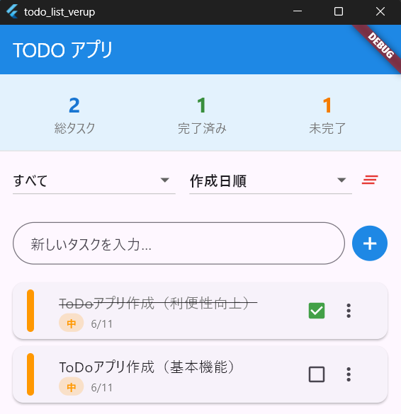

# application_create: TodoList

2025年7月2日
### 今日のキーワード： 「おちゃ」➡新茶は初夏に摘まれたお茶で、とても鮮やかな味わいと香りが特徴。温かいお茶は心を落ち着けて、冷たいお茶は体を爽やかにします。また、抹茶は禅宗の修行の一環として広まったと言われている。
---
 
`main.dartのソースコード(今までの学んだことを基にTodoList（タスク追加＋タスクチェック）を作成)`
```dart
// FlutterのUIを作るために必要な部品（ウィジェット）が詰まったファイルを読み込みます。
import 'package:flutter/material.dart';

// アプリケーションの一番最初の処理がここから始まります。
// runApp()関数は、指定されたウィジェットを画面に表示します。
void main() => runApp(const TodoApp());

// TodoAppクラスは、アプリ全体の基本的な設定を行うウィジェットです。
// ここでは、アプリのタイトルやテーマ（見た目の色など）を設定します。
// StatelessWidgetは、表示内容が一度決まったら変わらないウィジェットを作る時に使います。
class TodoApp extends StatelessWidget {
  // コンストラクタ（このクラスが新しく作られるときに呼ばれる部分）です。
  // 'super.key'は、Flutterのウィジェットで内部的に使われる特別な識別子です。
  const TodoApp({super.key});

  // このウィジェットがどのように画面に表示されるかを定義します。
  @override
  Widget build(BuildContext context) {
    // MaterialAppは、GoogleのMaterial Designに基づいたアプリを作るための基本的なウィジェットです。
    return MaterialApp(
      // アプリのタイトルを設定します。これはデバイスのタスクスイッチャーなどに表示されます。
      title: 'TODOアプリ',
      // アプリ全体のテーマ（色など）を設定します。ここでは青色を基調としています。
      theme: ThemeData(primarySwatch: Colors.blue),
      // アプリの最初に表示される画面（ホームページ）を指定します。
      home: const TodoHomePage(),
    );
  }
}

// TodoHomePageクラスは、TODOリストのメイン画面を作るウィジェットです。
// StatefulWidgetは、表示内容が時間とともに変化する（ユーザー操作などで変わる）ウィジェットを作る時に使います。
class TodoHomePage extends StatefulWidget {
  // コンストラクタです。
  const TodoHomePage({super.key});

  // このウィジェットの状態（データ）を管理するStateクラスを作成します。
  @override
  State<TodoHomePage> createState() => _TodoHomePageState();
}

// _TodoHomePageStateクラスは、TodoHomePageの状態（データと画面表示）を管理します。
// クラス名の先頭にアンダースコア'_'がついているのは、このクラスがこのファイルの中だけで使われることを意味します。
class _TodoHomePageState extends State<TodoHomePage> {
  // TODOアイテムのリストです。ここに追加されるタスクが画面に表示されます。
  // 'final'は、一度代入されたら変更できないことを意味します（リストの中身は変更できます）。
  final List<TodoItem> _todoList = [];
  // テキスト入力フィールドのコントローラーです。
  // これを使うことで、入力フィールドに入力されたテキストを取得したり、クリアしたりできます。
  final TextEditingController _controller = TextEditingController();

  // 新しいタスクをTODOリストに追加する関数です。
  void _addTask() {
    // 入力フィールドが空（またはスペースのみ）の場合は、何もしないで処理を終了します。
    if (_controller.text.trim().isEmpty) return;

    // setState()関数は、ウィジェットの状態が変更されたことをFlutterに伝え、
    // 画面を再描画するように指示します。
    setState(() {
      // 入力されたテキストを使って新しいTodoItemを作成し、リストに追加します。
      _todoList.add(TodoItem(title: _controller.text));
      // タスクを追加したら、入力フィールドのテキストをクリアします。
      _controller.clear();
    });
  }

  // タスクの完了状態（チェックボックスのオン/オフ）を切り替える関数です。
  // 'index'は、リストの中のどのタスクが操作されたかを示します。
  void _toggleTask(int index) {
    // setState()を使って画面の更新を促します。
    setState(() {
      // 指定されたインデックスのタスクの'isDone'（完了状態）を反転させます。
      // trueならfalseに、falseならtrueになります。
      _todoList[index].isDone = !_todoList[index].isDone;
    });
  }

  // このウィジェットがどのように画面に表示されるかを定義します。
  @override
  Widget build(BuildContext context) {
    // Scaffoldは、Material Designの基本的なレイアウト構造を提供するウィジェットです。
    // アプリバー（上部のバー）や本体（ボディ）、フローティングアクションボタンなどを持てます。
    return Scaffold(
      // アプリの上部に表示されるバー（タイトルバー）です。
      appBar: AppBar(title: const Text('TODOアプリ')),
      // 画面の主要な内容が表示される部分です。
      body: Padding(
        // 全体のコンテンツに上下左右に16ピクセルの余白を設定します。
        padding: const EdgeInsets.all(16.0),
        // 複数のウィジェットを縦方向に並べるためのウィジェットです。
        child: Column(
          children: [
            // タスクの入力欄と追加ボタンを横方向に並べるためのウィジェットです。
            Row(
              children: [
                // Expandedは、RowやColumnの中で残りのスペースを全て使うように子ウィジェットを広げます。
                Expanded(
                  // テキストを入力するためのフィールドです。
                  child: TextField(
                    // このTextFieldのテキストを管理するコントローラーを指定します。
                    controller: _controller,
                    // 入力フィールドの装飾（ヒントテキストなど）を設定します。
                    decoration: const InputDecoration(labelText: 'タスクを入力'),
                  ),
                ),
                // タスクを追加するためのアイコンボタンです。
                IconButton(
                  // ボタンに表示されるアイコンを指定します。
                  icon: const Icon(Icons.add),
                  // ボタンが押されたときに実行される関数を指定します。
                  // ここでは_addTask関数が呼ばれます。
                  onPressed: _addTask,
                ),
              ],
            ),
            // ウィジェット間に縦方向のスペースを作るためのウィジェットです。
            const SizedBox(height: 16),
            // TODOタスクのリストを表示する部分です。
            Expanded(
              // ListView.builderは、大量のアイテムを効率的に表示するためのリストウィジェットです。
              // 画面に表示される範囲のアイテムだけが作られるので、メモリを節約できます。
              child: ListView.builder(
                // リストに表示するアイテムの数を指定します。TODOリストの数と同じです。
                itemCount: _todoList.length,
                // 各リストアイテム（タスク）がどのように表示されるかを定義します。
                // 'context'はウィジェットツリーの情報、'index'は現在のアイテムの順番です。
                itemBuilder: (context, index) {
                  // 現在表示するタスクの情報を取得します。
                  final task = _todoList[index];
                  // リストの1つの行を表すウィジェットです。
                  return ListTile(
                    // 行の左側に表示されるウィジェットです。ここではチェックボックスを表示します。
                    leading: Checkbox(
                      // チェックボックスのオン/オフ状態をタスクの完了状態と連動させます。
                      value: task.isDone,
                      // チェックボックスの状態が変更されたときに実行される関数です。
                      // ここでは_toggleTask関数が呼ばれ、タスクの完了状態が切り替わります。
                      onChanged: (value) => _toggleTask(index),
                    ),
                    // 行のメインのコンテンツ（タスクのタイトル）を表示します。
                    title: Text(
                      task.title,
                      // テキストのスタイルを設定します。
                      style: TextStyle(
                        // タスクが完了している場合は、取り消し線を引きます。
                        decoration:
                            task.isDone ? TextDecoration.lineThrough : null,
                      ),
                    ),
                  );
                },
              ),
            ),
          ],
        ),
      ),
    );
  }
}

// TodoItemクラスは、個々のTODOタスクのデータ（タイトルと完了状態）を保持するための設計図です。
class TodoItem {
  // タスクのタイトル（例: "牛乳を買う"）を保存する変数です。
  String title;
  // タスクが完了しているかどうかを示す真偽値（trueなら完了、falseなら未完了）です。
  bool isDone;

  // コンストラクタです。TodoItemを新しく作る時に、タイトルを必ず指定するようにし、
  // isDoneは指定がなければ初期値としてfalse（未完了）を設定します。
  TodoItem({required this.title, this.isDone = false});
}
```

【 実行画面 】


> このプログラムの概要

このプログラムは、「シンプルなTODOリストアプリ」です。

1. タスクの追加: 画面上部の入力欄にタスク名を入力し、「＋」ボタンを押すと、新しいタスクがリストに追加されます。
2. タスクの完了: リストに表示されたタスクの左側にあるチェックボックスをタップすると、タスクの完了状態が切り替わります。完了したタスクには取り消し線が引かれます。

> 各部分の役割
- main関数: アプリが起動したときに最初に呼ばれる場所で、TodoAppという一番上のウィジェットを画面に表示する役割を持っています。
- TodoAppクラス: アプリ全体の基本的な設定（アプリのタイトルや、アプリの色などのテーマ）を決めます。ここは一度設定したら変わらない部分なので、StatelessWidgetという種類を使います。
- TodoHomePageクラス: 実際にTODOリストの画面を作っている部分です。タスクの追加や完了など、ユーザーの操作によって画面が変わるため、StatefulWidgetという種類を使います。
  - _TodoHomePageStateクラス: TodoHomePageの「状態」（つまり、TODOリストに何が追加されているか、どのタスクが完了しているかなどのデータ）を管理しています。画面が変わるたびに、ここにあるデータを使って画面が再描画されます。
    - _todoList: 今あるTODOタスクをすべて保存しておくリスト（一覧表）です。
    - _controller: ユーザーがタスクを入力する場所（テキストフィールド）に入力された内容を読み取るための道具です。
    - _addTask(): 「＋」ボタンを押したときに、新しいタスクをリストに追加する処理を行います。
    - _toggleTask(): チェックボックスをタップしたときに、そのタスクの完了状態をオン/オフ切り替える処理を行います。
    - build(): 実際に画面に何を表示するか（入力欄、追加ボタン、タスクのリストなど）を組み立てています。
- TodoItemクラス: １つ１つのTODOタスクが「どんな情報を持っているか」を定義したものです。具体的には、「タスクのタイトル（文字列）」と「完了しているかどうか（はい/いいえ）」という情報を持っています。


---
 
`main.dartのソースコード(今までの学んだことを基にTodoList（タスク追加＋タスクチェック＋利便性向上）を作成)`
```dart
// FlutterのUIを作るために必要な部品（ウィジェット）が詰まったファイルを読み込みます。
import 'package:flutter/material.dart';

// アプリケーションの一番最初の処理がここから始まります。
// runApp()関数は、指定されたウィジェットを画面に表示します。
void main() {
  runApp(MyApp());
}

// MyAppクラスは、アプリ全体の基本的な設定を行うウィジェットです。
// ここでは、アプリのタイトルやテーマ（見た目の色、フォントなど）を設定します。
// StatelessWidgetは、表示内容が一度決まったら変わらないウィジェットを作る時に使います。
class MyApp extends StatelessWidget {
  // コンストラクタ（このクラスが新しく作られるときに呼ばれる部分）です。
  // 'super.key'は、Flutterのウィジェットで内部的に使われる特別な識別子です。
  const MyApp({super.key});

  // このウィジェットがどのように画面に表示されるかを定義します。
  @override
  Widget build(BuildContext context) {
    // MaterialAppは、GoogleのMaterial Designに基づいたアプリを作るための基本的なウィジェットです。
    return MaterialApp(
      // アプリのタイトルを設定します。これはデバイスのタスクスイッチャーなどに表示されます。
      title: 'TODO アプリ',
      // アプリ全体のテーマ（色、フォントなど）を設定します。
      theme: ThemeData(primarySwatch: Colors.blue, fontFamily: 'Roboto'),
      // アプリの最初に表示される画面（ホームページ）を指定します。
      home: TodoScreen(),
    );
  }
}

// Todoクラスは、個々のTODOタスクのデータ構造を定義します。
// タスクが持つべき情報（ID、タイトル、完了状態、作成日時、優先度）をここに定義します。
class Todo {
  String id; // タスクを一意に識別するためのID
  String title; // タスクのタイトル（例: "牛乳を買う"）
  bool isCompleted; // タスクが完了しているかどうか (true: 完了, false: 未完了)
  DateTime createdAt; // タスクが作成された日時
  int priority; // タスクの優先度 (1: 高, 2: 中, 3: 低)

  // コンストラクタです。Todoオブジェクトを新しく作る時に、必要な情報を設定します。
  Todo({
    required this.id, // IDは必須
    required this.title, // タイトルは必須
    this.isCompleted = false, // 完了状態は指定がなければfalse（未完了）
    required this.createdAt, // 作成日時は必須
    this.priority = 2, // 優先度は指定がなければ2（中）
  });
}

// TodoScreenクラスは、TODOリストのメイン画面を作るウィジェットです。
// StatefulWidgetは、表示内容が時間とともに変化する（ユーザー操作などで変わる）ウィジェットを作る時に使います。
class TodoScreen extends StatefulWidget {
  // コンストラクタです。
  const TodoScreen({super.key});

  // このウィジェットの状態（データ）を管理するStateクラスを作成します。
  // ignore: library_private_types_in_public_api は、プライベートな型がパブリックなAPIで使用されているという警告を無視するためのものです。
  @override
  _TodoScreenState createState() => _TodoScreenState();
}

// _TodoScreenStateクラスは、TodoScreenの状態（データと画面表示）を管理します。
// クラス名の先頭にアンダースコア'_'がついているのは、このクラスがこのファイルの中だけで使われることを意味します。
class _TodoScreenState extends State<TodoScreen> {
  // TODOタスクのリストです。ここに追加されるタスクが画面に表示されます。
  List<Todo> todos = [];
  // テキスト入力フィールドのコントローラーです。
  // これを使うことで、入力フィールドに入力されたテキストを取得したり、クリアしたりできます。
  final TextEditingController _textController = TextEditingController();
  // 現在のフィルタリング状態を保持する変数 ('all', 'completed', 'incomplete')
  String _filter = 'all';
  // 現在のソート（並び替え）状態を保持する変数 ('created', 'priority', 'alphabetical')
  String _sortBy = 'created';

  // このウィジェットが破棄されるときに呼ばれる関数です。
  // ここでTextEditingControllerのようなリソースを解放することで、メモリリークを防ぎます。
  @override
  void dispose() {
    _textController.dispose(); // コントローラーを解放
    super.dispose();
  }

  // 新しいタスクをTODOリストに追加する関数です。
  void _addTodo() {
    // 入力フィールドが空（またはスペースのみ）の場合は、何もしないで処理を終了します。
    if (_textController.text.trim().isEmpty) return;

    // setState()関数は、ウィジェットの状態が変更されたことをFlutterに伝え、
    // 画面を再描画するように指示します。
    setState(() {
      // 新しいTodoオブジェクトを作成し、リストに追加します。
      // IDは現在時刻のミリ秒を使って一意にします。
      // 作成日時は現在時刻を設定します。
      // 優先度は初期値として「中」(2)を設定します。
      todos.add(
        Todo(
          id: DateTime.now().millisecondsSinceEpoch.toString(),
          title: _textController.text.trim(),
          createdAt: DateTime.now(),
          priority: 2,
        ),
      );
      // タスクを追加したら、入力フィールドのテキストをクリアします。
      _textController.clear();
    });
  }

  // 指定されたIDのタスクの完了状態（チェックボックスのオン/オフ）を切り替える関数です。
  void _toggleTodo(String id) {
    // setState()を使って画面の更新を促します。
    setState(() {
      // IDを使って、リスト内の該当するタスクのインデックスを探します。
      final index = todos.indexWhere((todo) => todo.id == id);
      // タスクが見つかった場合（インデックスが-1でない場合）のみ処理します。
      if (index != -1) {
        // 該当タスクの'isCompleted'（完了状態）を反転させます。
        // trueならfalseに、falseならtrueになります。
        todos[index].isCompleted = !todos[index].isCompleted;
      }
    });
  }

  // 指定されたIDのタスクをTODOリストから削除する関数です。
  void _deleteTodo(String id) {
    // setState()を使って画面の更新を促します。
    setState(() {
      // IDが一致するタスクをリストから削除します。
      todos.removeWhere((todo) => todo.id == id);
    });
  }

  // 指定されたIDのタスクのタイトルと優先度を編集する関数です。
  void _editTodo(String id, String newTitle, int newPriority) {
    // setState()を使って画面の更新を促します。
    setState(() {
      // IDを使って、リスト内の該当するタスクのインデックスを探します。
      final index = todos.indexWhere((todo) => todo.id == id);
      // タスクが見つかった場合のみ処理します。
      if (index != -1) {
        // 該当タスクのタイトルと優先度を新しい値に更新します。
        todos[index].title = newTitle;
        todos[index].priority = newPriority;
      }
    });
  }

  // 完了済みのタスクをすべて削除する関数です。
  void _clearCompleted() {
    // setState()を使って画面の更新を促します。
    setState(() {
      // 'isCompleted'がtrue（完了済み）のタスクをすべてリストから削除します。
      todos.removeWhere((todo) => todo.isCompleted);
    });
  }

  // 現在のフィルターとソートの条件に基づいて、表示するタスクのリストを返す関数です。
  List<Todo> _getFilteredTodos() {
    // まずはすべてのタスクをコピーします。
    List<Todo> filtered = todos;

    // フィルタリングのロジック
    switch (_filter) {
      case 'completed': // 完了済みのみ表示
        filtered = filtered.where((todo) => todo.isCompleted).toList();
        break;
      case 'incomplete': // 未完了のみ表示
        filtered = filtered.where((todo) => !todo.isCompleted).toList();
        break;
      // 'all'の場合はフィルタリングしないので、何もしません。
    }

    // ソート（並び替え）のロジック
    switch (_sortBy) {
      case 'priority': // 優先度順にソート (1: 高 -> 3: 低)
        filtered.sort((a, b) => a.priority.compareTo(b.priority));
        break;
      case 'alphabetical': // アルファベット順にソート (大文字小文字を区別しない)
        filtered.sort(
          (a, b) => a.title.toLowerCase().compareTo(b.title.toLowerCase()),
        );
        break;
      case 'created': // 作成日順にソート (新しいものが上)
      default: // デフォルトも作成日順
        filtered.sort((a, b) => b.createdAt.compareTo(a.createdAt));
        break;
    }

    // フィルタリングとソートが適用されたリストを返します。
    return filtered;
  }

  // 優先度に応じて色を返す関数です。
  Color _getPriorityColor(int priority) {
    switch (priority) {
      case 1: // 優先度: 高
        return Colors.red;
      case 2: // 優先度: 中
        return Colors.orange;
      case 3: // 優先度: 低
        return Colors.green;
      default: // それ以外の優先度（予期せぬ場合）
        return Colors.grey;
    }
  }

  // 優先度に応じて表示するテキストを返す関数です。
  String _getPriorityText(int priority) {
    switch (priority) {
      case 1: // 優先度: 高
        return '高';
      case 2: // 優先度: 中
        return '中';
      case 3: // 優先度: 低
        return '低';
      default: // それ以外の優先度（予期せぬ場合）
        return '中';
    }
  }

  // タスク編集ダイアログを表示する関数です。
  void _showEditDialog(Todo todo) {
    // 編集ダイアログ内で使用するテキストコントローラーを作成し、現在のタスクタイトルを初期値として設定します。
    TextEditingController editController = TextEditingController(
      text: todo.title,
    );
    // 選択された優先度を保持する変数に、現在のタスクの優先度を初期値として設定します。
    int selectedPriority = todo.priority;

    // showDialog()関数は、ポップアップダイアログを表示します。
    showDialog(
      context: context,
      // builderは、ダイアログの内容を構築する関数です。
      // StatefulBuilderを使うことで、ダイアログ内のDropdownButtonの選択によって、
      // ダイアログの一部だけを再描画することができます。
      builder: (context) => StatefulBuilder(
        builder: (context, setDialogState) => AlertDialog(
          title: Text('タスクを編集'), // ダイアログのタイトル
          content: Column(
            mainAxisSize: MainAxisSize.min, // カラムのサイズを内容に合わせて最小限にする
            children: [
              // タスク名を編集するためのテキストフィールド
              TextField(
                controller: editController, // コントローラーを指定
                decoration: InputDecoration(
                  labelText: 'タスク名', // ヒントテキスト
                  border: OutlineInputBorder(), // 枠線を表示
                ),
                maxLines: 2, // 最大2行まで表示可能
              ),
              SizedBox(height: 16), // 縦方向の余白
              Row(
                children: [
                  Text('優先度: '), // 優先度のラベル
                  Expanded(
                    // ドロップダウンボタンを横いっぱいに広げる
                    child: DropdownButton<int>(
                      value: selectedPriority, // 現在選択されている優先度
                      isExpanded: true, // 横いっぱいに広げる
                      // ドロップダウンの各アイテム（選択肢）を定義します。
                      items: [
                        DropdownMenuItem(
                          value: 1,
                          child: Text(
                            '高 (重要)',
                            style: TextStyle(color: Colors.red), // 高優先度は赤色
                          ),
                        ),
                        DropdownMenuItem(
                          value: 2,
                          child: Text(
                            '中 (普通)',
                            style: TextStyle(color: Colors.orange), // 中優先度は橙色
                          ),
                        ),
                        DropdownMenuItem(
                          value: 3,
                          child: Text(
                            '低 (軽微)',
                            style: TextStyle(color: Colors.green), // 低優先度は緑色
                          ),
                        ),
                      ],
                      // ドロップダウンの選択が変わったときに呼ばれる関数です。
                      onChanged: (value) {
                        // setDialogStateを使って、ダイアログ内の状態を更新します。
                        // これにより、ドロップダウンの表示がすぐに更新されます。
                        setDialogState(() {
                          selectedPriority = value!; // 新しい優先度を保存
                        });
                      },
                    ),
                  ),
                ],
              ),
            ],
          ),
          actions: [
            // キャンセルボタン
            TextButton(
              onPressed: () => Navigator.pop(context), // ダイアログを閉じる
              child: Text('キャンセル'),
            ),
            // 保存ボタン
            ElevatedButton(
              onPressed: () {
                // タスク名が空でなければ保存処理を実行
                if (editController.text.trim().isNotEmpty) {
                  _editTodo(
                    todo.id, // 編集対象のタスクID
                    editController.text.trim(), // 新しいタスク名
                    selectedPriority, // 新しい優先度
                  );
                  Navigator.pop(context); // ダイアログを閉じる
                }
              },
              child: Text('保存'),
            ),
          ],
        ),
      ),
    );
  }

  // このウィジェットがどのように画面に表示されるかを定義します。
  @override
  Widget build(BuildContext context) {
    // 現在のフィルターとソート条件に基づいて、表示するタスクリストを取得します。
    final filteredTodos = _getFilteredTodos();
    // 完了済みタスクの数を計算します。
    final completedCount = todos.where((todo) => todo.isCompleted).length;
    // 全タスクの数を計算します。
    final totalCount = todos.length;

    // Scaffoldは、Material Designの基本的なレイアウト構造を提供するウィジェットです。
    return Scaffold(
      // アプリの上部に表示されるバー（タイトルバー）です。
      appBar: AppBar(
        title: Text('TODO アプリ'), // アプリバーのタイトル
        backgroundColor: Colors.blue[600], // アプリバーの背景色
        foregroundColor: Colors.white, // アプリバーの文字色
        elevation: 0, // アプリバーの影をなくす
      ),
      // 画面の主要な内容が表示される部分です。
      body: Column(
        children: [
          // 統計情報（総タスク数、完了済み、未完了）を表示するコンテナ
          Container(
            width: double.infinity, // 横幅を最大に広げる
            padding: EdgeInsets.all(16), // 内側の余白
            decoration: BoxDecoration(
              color: Colors.blue[50], // 背景色
              border: Border(bottom: BorderSide(color: Colors.grey[300]!)), // 下線
            ),
            child: Row(
              mainAxisAlignment: MainAxisAlignment.spaceAround, // 子ウィジェットを均等に配置
              children: [
                // 総タスク数の表示
                Column(
                  children: [
                    Text(
                      '$totalCount', // 総タスク数
                      style: TextStyle(
                        fontSize: 24,
                        fontWeight: FontWeight.bold,
                        color: Colors.blue[700],
                      ),
                    ),
                    Text('総タスク', style: TextStyle(color: Colors.grey[600])),
                  ],
                ),
                // 完了済みタスク数の表示
                Column(
                  children: [
                    Text(
                      '$completedCount', // 完了済みタスク数
                      style: TextStyle(
                        fontSize: 24,
                        fontWeight: FontWeight.bold,
                        color: Colors.green[700],
                      ),
                    ),
                    Text('完了済み', style: TextStyle(color: Colors.grey[600])),
                  ],
                ),
                // 未完了タスク数の表示
                Column(
                  children: [
                    Text(
                      '${totalCount - completedCount}', // 未完了タスク数
                      style: TextStyle(
                        fontSize: 24,
                        fontWeight: FontWeight.bold,
                        color: Colors.orange[700],
                      ),
                    ),
                    Text('未完了', style: TextStyle(color: Colors.grey[600])),
                  ],
                ),
              ],
            ),
          ),

          // フィルター・ソートのコントロール部分
          Container(
            padding: EdgeInsets.symmetric(horizontal: 16, vertical: 8), // 左右と上下の余白
            child: Row(
              children: [
                Expanded(
                  // フィルターのドロップダウンボタン
                  child: DropdownButton<String>(
                    value: _filter, // 現在選択されているフィルター
                    isExpanded: true, // 横いっぱいに広げる
                    items: [
                      DropdownMenuItem(value: 'all', child: Text('すべて')),
                      DropdownMenuItem(value: 'incomplete', child: Text('未完了のみ')),
                      DropdownMenuItem(value: 'completed', child: Text('完了済みのみ')),
                    ],
                    onChanged: (value) {
                      setState(() {
                        _filter = value!; // 選択されたフィルターを更新
                      });
                    },
                  ),
                ),
                SizedBox(width: 16), // 横方向の余白
                Expanded(
                  // ソートのドロップダウンボタン
                  child: DropdownButton<String>(
                    value: _sortBy, // 現在選択されているソート
                    isExpanded: true, // 横いっぱいに広げる
                    items: [
                      DropdownMenuItem(value: 'created', child: Text('作成日順')),
                      DropdownMenuItem(value: 'priority', child: Text('優先度順')),
                      DropdownMenuItem(value: 'alphabetical', child: Text('名前順')),
                    ],
                    onChanged: (value) {
                      setState(() {
                        _sortBy = value!; // 選択されたソートを更新
                      });
                    },
                  ),
                ),
                // 完了済みタスクが1つでもある場合のみ、「完了済みを削除」ボタンを表示
                if (completedCount > 0)
                  IconButton(
                    onPressed: _clearCompleted, // ボタンが押されたら完了済みタスクを削除
                    icon: Icon(Icons.clear_all), // アイコン
                    tooltip: '完了済みを削除', // 長押ししたときに表示されるヒント
                    color: Colors.red[600], // アイコンの色
                  ),
              ],
            ),
          ),

          // タスク追加フィールド
          Container(
            padding: EdgeInsets.all(16), // 全方向の余白
            child: Row(
              children: [
                Expanded(
                  // タスクを入力するためのテキストフィールド
                  child: TextField(
                    controller: _textController, // コントローラーを指定
                    decoration: InputDecoration(
                      hintText: '新しいタスクを入力...', // 入力前のヒントテキスト
                      border: OutlineInputBorder(
                        borderRadius: BorderRadius.circular(25), // 角を丸くする
                      ),
                      contentPadding: EdgeInsets.symmetric(
                        horizontal: 20,
                        vertical: 15,
                      ),
                    ),
                    onSubmitted: (_) => _addTodo(), // Enterキーを押したときにもタスクを追加
                  ),
                ),
                SizedBox(width: 8), // 横方向の余白
                // タスク追加ボタン
                Container(
                  decoration: BoxDecoration(
                    color: Colors.blue[600], // 背景色
                    shape: BoxShape.circle, // 丸い形にする
                  ),
                  child: IconButton(
                    onPressed: _addTodo, // ボタンが押されたらタスクを追加
                    icon: Icon(Icons.add, color: Colors.white), // アイコン
                  ),
                ),
              ],
            ),
          ),

          // タスクリストを表示する部分
          Expanded(
            // filteredTodosが空の場合（タスクが1つもない場合）、中央にメッセージを表示
            child: filteredTodos.isEmpty
                ? Center(
                    child: Column(
                      mainAxisAlignment: MainAxisAlignment.center, // 垂直方向の中央揃え
                      children: [
                        Icon(
                          Icons.task_alt, // タスクのアイコン
                          size: 64, // アイコンサイズ
                          color: Colors.grey[400], // アイコンの色
                        ),
                        SizedBox(height: 16), // 縦方向の余白
                        Text(
                          // フィルターの状態によって表示するメッセージを切り替える
                          _filter == 'all'
                              ? 'タスクがありません'
                              : _filter == 'completed'
                                  ? '完了済みタスクがありません'
                                  : '未完了タスクがありません',
                          style: TextStyle(
                            fontSize: 18,
                            color: Colors.grey[600],
                          ),
                        ),
                      ],
                    ),
                  )
                // filteredTodosが空でない場合、リストを表示
                : ListView.builder(
                    itemCount: filteredTodos.length, // リストのアイテム数
                    itemBuilder: (context, index) {
                      final todo = filteredTodos[index]; // 現在のタスクを取得
                      return Card(
                        margin: EdgeInsets.symmetric(
                          horizontal: 16,
                          vertical: 4,
                        ), // カードの余白
                        elevation: 2, // カードの影の深さ
                        child: ListTile(
                          // タスクの左側に表示される優先度を示す色付きのバー
                          leading: Container(
                            width: 8, // 幅
                            height: double.infinity, // 高さを最大に広げる
                            decoration: BoxDecoration(
                              color: _getPriorityColor(todo.priority), // 優先度に応じた色
                              borderRadius: BorderRadius.circular(4), // 角を丸くする
                            ),
                          ),
                          // タスクのタイトル
                          title: Text(
                            todo.title,
                            style: TextStyle(
                              decoration:
                                  // タスクが完了していたら取り消し線を引く
                                  todo.isCompleted ? TextDecoration.lineThrough : null,
                              color:
                                  // タスクが完了していたら文字色をグレーにする
                                  todo.isCompleted ? Colors.grey[600] : null,
                            ),
                          ),
                          // サブタイトル（優先度と作成日を表示）
                          subtitle: Row(
                            children: [
                              // 優先度タグ
                              Container(
                                padding: EdgeInsets.symmetric(
                                  horizontal: 8,
                                  vertical: 2,
                                ), // 内側の余白
                                decoration: BoxDecoration(
                                  // 優先度に応じた色を薄くした背景色
                                  color: _getPriorityColor(todo.priority).withOpacity(0.2),
                                  borderRadius: BorderRadius.circular(12), // 角を丸くする
                                ),
                                child: Text(
                                  _getPriorityText(todo.priority), // 優先度テキスト
                                  style: TextStyle(
                                    fontSize: 12,
                                    color: _getPriorityColor(todo.priority), // 優先度に応じた文字色
                                    fontWeight: FontWeight.bold,
                                  ),
                                ),
                              ),
                              SizedBox(width: 8), // 横方向の余白
                              // 作成日
                              Text(
                                '${todo.createdAt.month}/${todo.createdAt.day}', // 月/日形式で表示
                                style: TextStyle(
                                  fontSize: 12,
                                  color: Colors.grey[600],
                                ),
                              ),
                            ],
                          ),
                          // 行の右側に表示されるウィジェット（チェックボックスとメニューボタン）
                          trailing: Row(
                            mainAxisSize: MainAxisSize.min, // 横幅を内容に合わせて最小限にする
                            children: [
                              // タスク完了用のチェックボックス
                              Checkbox(
                                value: todo.isCompleted, // チェックボックスの状態
                                onChanged: (_) => _toggleTodo(todo.id), // 状態が変更されたら完了状態を切り替える
                                activeColor: Colors.green[600], // チェックされた時の色
                              ),
                              // タスク編集・削除用のポップアップメニューボタン
                              PopupMenuButton<String>(
                                onSelected: (value) {
                                  // 選択されたメニュー項目によって処理を分岐
                                  switch (value) {
                                    case 'edit': // 編集が選択されたら編集ダイアログを表示
                                      _showEditDialog(todo);
                                      break;
                                    case 'delete': // 削除が選択されたらタスクを削除
                                      _deleteTodo(todo.id);
                                      break;
                                  }
                                },
                                itemBuilder: (context) => [
                                  // 編集メニュー項目
                                  PopupMenuItem(
                                    value: 'edit',
                                    child: Row(
                                      children: [
                                        Icon(Icons.edit, size: 18), // 編集アイコン
                                        SizedBox(width: 8),
                                        Text('編集'),
                                      ],
                                    ),
                                  ),
                                  // 削除メニュー項目
                                  PopupMenuItem(
                                    value: 'delete',
                                    child: Row(
                                      children: [
                                        Icon(
                                          Icons.delete,
                                          size: 18,
                                          color: Colors.red, // 削除アイコンは赤色
                                        ),
                                        SizedBox(width: 8),
                                        Text(
                                          '削除',
                                          style: TextStyle(
                                            color: Colors.red, // 削除テキストも赤色
                                          ),
                                        ),
                                      ],
                                    ),
                                  ),
                                ],
                              ),
                            ],
                          ),
                        ),
                      );
                    },
                  ),
          ),
        ],
      ),
    );
  }
}
```

【 実行画面 】





> このプログラムの概要

このプログラムは、「高機能なTODOリストアプリ」です。

1. タスクの追加: 画面上部の入力欄にタスク名を入力し、「＋」ボタンを押すと、新しいタスクがリストに追加されます。
2. タスクの完了/未完了: 各タスクの右側にあるチェックボックスをタップすると、タスクの完了状態が切り替わります。完了したタスクには取り消し線が引かれ、文字色が薄くなります。

＜ここまでは基本機能＞

---

＜ここからが利便性向上＞

3. タスクの編集: 各タスクの右側にある3点リーダー（メニューアイコン）をタップし、「編集」を選択すると、タスクのタイトルと優先度を変更できるダイアログが表示されます。
4. タスクの削除: 各タスクの右側にある3点リーダー（メニューアイコン）をタップし、「削除」を選択すると、そのタスクがリストから削除されます。
5. 完了済みタスクの一括削除: 完了済みのタスクが1つでもある場合、フィルター・ソートコントロールの右側に「完了済みを削除」アイコンが表示され、これをタップすると、すべての完了済みタスクを一括で削除できます。
6. タスクのフィルタリング: 画面上部のドロップダウンメニューから「すべて」「未完了のみ」「完了済みのみ」を選択することで、表示するタスクを絞り込めます。
7. タスクのソート（並び替え）: 画面上部のドロップダウンメニューから「作成日順」「優先度順」「名前順」を選択することで、タスクの表示順を変更できます。
8. タスクの優先度: 各タスクには「高」「中」「低」の優先度を設定でき、リストの左側には優先度に応じた色のバーと、優先度を示すタグが表示されます。
9. 統計情報: アプリバーの下には、現在の「総タスク数」「完了済みタスク数」「未完了タスク数」が表示されます。

> 各部分の役割（基本機能を除いた利便性を向上させた部分）
- Todoクラス:
  - id: 各タスクを識別するためのユニークなIDが追加されました。
  - createdAt: タスクがいつ作成されたかを記録するための日時情報が追加されました。
  - priority: タスクの重要度を表すための優先度（1:高, 2:中, 3:低）が追加されました。
- _TodoScreenStateクラス:
  - todosリストに、Todoオブジェクト（id, createdAt, priorityを含む）が追加されるようになりました。
  - _textController.dispose(): TextEditingControllerは使い終わったらdispose()メソッドを呼び出してリソースを解放するべき、というルールが追加されました。これはメモリを効率的に使うためです。
  - _filter, _sortBy: フィルタリングとソートの状態を管理するための変数が追加されました。
  - _addTodo(): 新しいタスクを追加する際に、idとcreatedAtが自動的に設定されるようになりました。
  - _toggleTodo(String id): タスクの完了状態を切り替える際に、タスクのidを使って対象タスクを探すようになりました。
  - _deleteTodo(String id): タスクを削除する際に、タスクのidを使って対象タスクを探すようになりました。
  - _editTodo(String id, String newTitle, int newPriority): タスクの編集機能が追加され、タイトルだけでなく優先度も変更できるようになりました。
  - _clearCompleted(): 完了済みのタスクを一括で削除する機能が追加されました。
  - _getFilteredTodos(): 現在の_filterと_sortByの値に基づいて、タスクを絞り込んだり、並び替えたりするためのロジックが追加されました。
  - _getPriorityColor(int priority): 優先度（1, 2, 3）に応じて、表示する色を返すヘルパー関数が追加されました。
  - _getPriorityText(int priority): 優先度（1, 2, 3）に応じて、表示するテキスト（高、中、低）を返すヘルパー関数が追加されました。
  - _showEditDialog(Todo todo): タスクを編集するためのポップアップダイアログを表示する関数が追加されました。このダイアログ内でタスク名と優先度を変更できます。
  - build()メソッド内:
    - アプリバーの下に統計情報（総タスク数、完了済み、未完了）が表示されるようになりました。
    - フィルターとソートのドロップダウンメニューが追加されました。
    - タスク追加の入力フィールドのデザインが少し変わりました。
    - タスクリストが空の場合に、「タスクがありません」というメッセージが表示されるようになりました。
    - 各タスクの表示にCardウィジェットが使われ、より見た目がリッチになりました。
    - タスクの左側に優先度を示す色付きのバーが表示されるようになりました。
    - 各タスクのサブタイトルに優先度タグと作成日が表示されるようになりました。
    - 各タスクの右側に、チェックボックスと、「編集」と「削除」のメニューを持つポップアップボタンが追加されました。